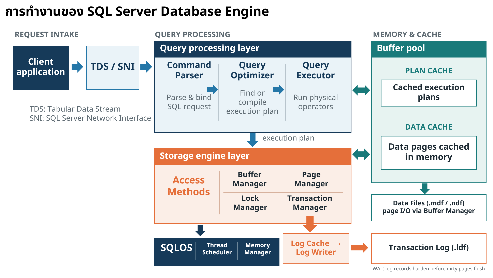

[⬅ Module 01](../../README.md) | Section 1/5 | ➡ ถัดไป: [02 Scheduling](../02_Scheduling_Windows_vs_SQL/README.md)

# 1.1 Engine Architecture & SQLOS — ทำความเข้าใจเครื่องยนต์ก่อนจูนเครื่องยนต์

> *"คนที่จูน SQL Server ได้ดี ไม่ใช่คนที่จำสูตรได้เยอะ แต่คือคนที่รู้ว่า Query หนึ่งคำถาม เดินทางผ่านอะไรบ้างก่อนกลับไปเป็นคำตอบ"*

## ทำไม Section นี้จึงต้องมาก่อน

เวลาผู้ใช้บอกว่า "ระบบช้า" สิ่งที่เกิดขึ้นจริงคือ Query หนึ่งตัวกำลังเดินทางผ่านชั้นต่าง ๆ ของ SQL Server — จาก network card, เข้า Protocol layer, ผ่าน Query execution layer (พร้อมจุดตัดสินใจ Plan Cache), ลงสู่ Storage engine layer และถูก SQLOS จัดคิวบน CPU คอขวดอาจเกิดที่ชั้นใดก็ได้ ถ้าไม่รู้แผนที่ เราจะเดาถูกได้อย่างไร?

Section นี้วางแผนที่นั้นให้ — เมื่อจบแล้วคุณจะตอบได้ว่า **"คำสั่งหนึ่งคำสั่ง เดินทางอย่างไร และแต่ละชั้นวัดอะไรได้บ้าง"**

---

## แผนภาพการทำงานของ SQL Server Database Engine



แผนภาพนี้คือ **แผนที่หลักของทั้งหลักสูตร** — ทุก Module จะซูมเข้าไปดูทีละส่วน:

| ส่วนในแผนภาพ | สาระสำคัญ | Module ที่เจาะลึก |
|:-------------|:----------|:------------------|
| Protocol layer (TDS/SNI) | ประตูทางเข้าของคำสั่ง | Section นี้ |
| Query execution layer (Parser → Optimizer → Executor + Plan Cache) | จุดเกิด Execution Plan | Module 7 |
| Buffer Pool (Plan Cache + Data Cache) | ที่พักของ Plan และ Data Pages | Module 4, 8 |
| Storage engine layer (Access Methods + 4 Managers) | การเข้าถึง Data Files / Transaction Log | Module 2, 3 |
| SQLOS layer (Thread Scheduling + Memory Management) | ผู้จัดคิว CPU และ Memory | Module 1 (Sections ถัดไป), Module 4 |

---

## 1. Protocol Layer — ประตูทางเข้าของทุกคำสั่ง

Client เชื่อมต่อผ่าน **TDS (Tabular Data Stream Protocol)** ซึ่งเดินทางบน **SNI (SQL Server Network Interface)** ที่รองรับ 3 ช่องทาง:

| ช่องทาง | ใช้เมื่อไร | ข้อสังเกตด้าน Performance |
|:--------|:----------|:--------------------------|
| **Shared Memory** | เชื่อมต่อภายในเครื่องเดียวกัน (เช่น SSMS บน server) | เร็วที่สุด — ไม่มี network stack |
| **Named Pipes** | ระบบ LAN แบบดั้งเดิม | พบน้อยลงในระบบใหม่ |
| **TCP/IP** | มาตรฐานหลักของทุก application | ตัวแปรสำคัญคือ network latency |

**ยุคใหม่ (SQL Server 2022+):** TDS 8.0 บังคับให้ TLS 1.3 เริ่มก่อน TDS session — ปลอดภัยขึ้นและ handshake ชัดเจนขึ้น

> **จุดเชื่อมโยง:** wait `ASYNC_NETWORK_IO` ที่เจอบ่อย ปัญหามักไม่ใช่ชั้นนี้ แต่เป็น client ที่ "รับข้อมูลไม่ทัน" — จะกลับมาที่ตัวนี้ในหัวข้อ Wait Statistics

---

## 2. Query Execution Layer — Command Parser → Optimizer → Executor

### 2.1 Command Parser
ตรวจ syntax ของ T-SQL แปลงเป็น internal format ก่อนส่งต่อ

### 2.2 Query Optimizer + จุดตัดสินใจสำคัญที่สุดของ diagram นี้

```
Query เข้ามา → มี Plan อยู่ใน Plan Cache หรือไม่?
├── ใช่  → หา Plan จาก Plan Cache มาใช้เลย (ข้ามการ compile — เร็ว)
└── ไม่ใช่ → วิเคราะห์ (ดู Statistics) สร้าง Plan ใหม่ → เก็บลง Plan Cache
```

- **Optimizer** ใช้กลไก **Cost-based**: ดู Statistics ประเมินจำนวนแถว เลือก plan ที่ต้นทุนต่ำสุดในเวลาอันสมควร
- Plan ที่ถูก cache จะถูกใช้ซ้ำ — นี่คือเหตุผลที่ Parameter สำคัญ (ดู Module 8: Parameter Sniffing, Plan Cache Pollution)

### 2.3 Query Executor
รับ Execution Plan มารัน — สั่งงาน Storage Engine ทีละ operator (Scan, Seek, Join, Sort...)

---

## 3. Buffer Pool — Plan Cache + Data Cache

กล่องขวามือของ diagram คือ **Buffer Pool** — memory ก้อนใหญ่ที่สุดของ SQL Server ซึ่งมี "ที่พัก" สองชนิด:

| ส่วน | เก็บอะไร | ใครใช้ |
|:-----|:---------|:-------|
| **Plan Cache** (ส่วนเหลือง) | Compiled execution plans | Query execution layer — จุดตัดสินใจ "มี Plan อยู่หรือไม่?" |
| **Data Cache** (ส่วนน้ำเงิน) | Data pages ที่ถูกอ่านจาก disk | Buffer Manager — ถ้า page อยู่ในนี้ = Logical Read (ไม่ต้องแตะ disk) |

> **จุดเชื่อมโยง:** Page ที่ถูกอ่านมาแล้วจะพำนักใน Data Cache — อายุเฉลี่ยของมันคือ PLE (Module 4) และ Plan Cache ที่บวมผิดปกติคือปัญหายอดฮิตของ ad-hoc workload (Module 8)

---

## 4. Storage Engine Layer — Access Methods และ 4 Managers

เมื่อ Executor ต้องการข้อมูล งานจะไหลผ่าน **Access Methods** ซึ่งเป็นด่างหน้าที่คุยกับผู้จัดการ 4 คน:

| Manager | หน้าที่ | จัดการกับ |
|:--------|:--------|:----------|
| **Buffer Manager** | ตัดสินใจว่า page อยู่ใน Buffer Pool หรือต้องอ่านจาก disk | Data Cache |
| **Page Manager** | อ่าน/เขียน page (8 KB) จริง ๆ กับ Data Files | Data Files |
| **Transaction Manager** | ควบคุม Atomicity + เขียน Log ตามหลัก Write-Ahead Logging | Transaction Log File |
| **Log Cache → Log Writer** | พัก log records ใน memory ก่อนเขียนลง disk | Transaction Log (.ldf) |
| **Lock Manager** | บริหาร Locks ให้ transaction ไม่เหยียบกัน | Lock structures |

- **Logical Read** = อ่านจาก Data Cache | **Physical Read** = ต้องอ่านจาก Data Files จริง
- ทุกการแก้ไขข้อมูล **ต้องเขียน Transaction Log ก่อนเสมอ** (WAL) — ต้นตอของ wait `WRITELOG`
- **Access Methods** ยังตัดสินใจ Scan vs Seek — ตัวชี้วัดสำคัญของ Module 6, 7

---

## 5. SQLOS Layer — ฐานที่รองรับทุกอย่างไว้

ชั้นล่างสุดของ diagram คือ **SQLOS** ที่มีสองหน้าที่หลัก:

| หน้าที่ | ทำอะไร | อาการเมื่อมีปัญหา |
|:--------|:-------|:-----------------|
| **Thread Scheduling** | จัดคิว CPU ให้ทุก task (cooperative scheduling, quantum ~4 ms) | `SOS_SCHEDULER_YIELD`, runnable queue ยาว |
| **Memory Management** | แบ่ง memory ให้ทุก component ผ่าน Memory Clerks | Memory pressure, `RESOURCE_SEMAPHORE` |

> **หัวใจของ Section นี้:** เพราะ SQL Server จัดการ CPU และ Memory เอง ตัวชี้วัดของ Windows (Task Manager) จึง **ไม่เพียงพอ** — เราต้องอ่านข้อมูลจาก SQLOS ผ่าน DMVs (`sys.dm_os_schedulers`, `sys.dm_os_memory_clerks`) ซึ่งเป็นเครื่องมือหลักของหลักสูตรทั้งเล่ม

---

## 6. ตัวอย่าง: เดินตาม diagram ทีละลูกศร

ลองตาม query นี้ โดยมีเลขกำกับตรงกับจุดในแผนภาพ:

```sql
SELECT TOP (10) CustomerID, SUM(TotalDue) AS Total
FROM Sales.SalesOrderHeader
GROUP BY CustomerID
ORDER BY Total DESC;
```

1. **Protocol layer** — SSMS ส่ง TDS packet ผ่าน SNI (TCP/IP) เข้ามา
2. **Command Parser** — ตรวจ syntax แล้วส่งต่อ
3. **Query Optimizer** — ตั้งคำถามตาม diagram: **"มี Plan อยู่หรือไม่?"**
   - ครั้งแรก → ไม่มี → ดู Statistics → สร้าง Plan → **เก็บลง Plan Cache**
   - ครั้งถัดไป → ใช่ → **หา Plan จาก Plan Cache** มาใช้เลย
4. **Query Executor** — รับ plan สั่งงาน **Access Methods**
5. **Buffer Manager / Page Manager** — ขอ data pages: ถ้าอยู่ใน **Data Cache** → Logical Read; ไม่มี → อ่านจาก **Data Files**
6. **Transaction Manager / Lock Manager** — คุมความถูกต้องและกันเหยียบกันระหว่างรัน · log records เข้า **Log Cache** ก่อนที่ **Log Writer** จะเขียนลง Transaction Log (.ldf) — ตามหลัก WAL: log ต้อง harden ก่อน dirty pages ถูก flush
7. **SQLOS layer** — ตลอดเวลาที่ทำงาน Thread Scheduling แบ่ง CPU, Memory Management ดูแล memory ให้
8. **Results** — ส่งกลับ client; ถ้า client รับช้า → `ASYNC_NETWORK_IO`

> **แบบฝึกหัดคิด:** query เดียวกันนี้ "ช้า" ได้จากกี่จุดในแผนภาพ? — plan แย่ (Optimizer), plan cache พัง (Plan Cache), disk ช้า (Page Manager → Data Files), memory ไม่พอ (Buffer Manager), CPU แน่น (SQLOS), client รับไม่ทัน (Protocol layer) — นี่คือเหตุผลที่เราต้องมีระบบวินิจฉัย ไม่เดา

---

## สรุป Section 1

1. SQL Server = **Protocol layer → Query execution layer → Storage engine layer** โดยมี **SQLOS** รองรับอยู่ล่างสุด
2. **Buffer Pool** มีทั้ง **Plan Cache** (พัก execution plans) และ **Data Cache** (พัก data pages)
3. จุดตัดสินใจ "มี Plan อยู่หรือไม่?" คือหัวใจของ performance — hit = เร็ว, miss = เสียค่า compile
4. เครื่องมือวัดของเราคือ DMVs ที่ SQLOS เปิดเผย (`sys.dm_os_*`, `sys.dm_exec_*`)

**ตรวจความเข้าใจ:**
1. Algebrizer/Command Parser ทำอะไรก่อนส่งงานให้ Optimizer?
2. "มี Plan อยู่หรือไม่?" ตั้งคำถามกับใคร และตอบจากอะไร?
3. เพราะอะไร Transaction Manager ถึงต้องเขียน Transaction Log ก่อนแก้ Data Files?

**➡ ถัดไป:** [Section 1.2 — Scheduling: Windows vs SQL Server](../02_Scheduling_Windows_vs_SQL/README.md)

---

[⬅ Module 01](../../README.md) | [🧪 Labs](../../Labs/README.md) | ➡ [02 Scheduling](../02_Scheduling_Windows_vs_SQL/README.md)
