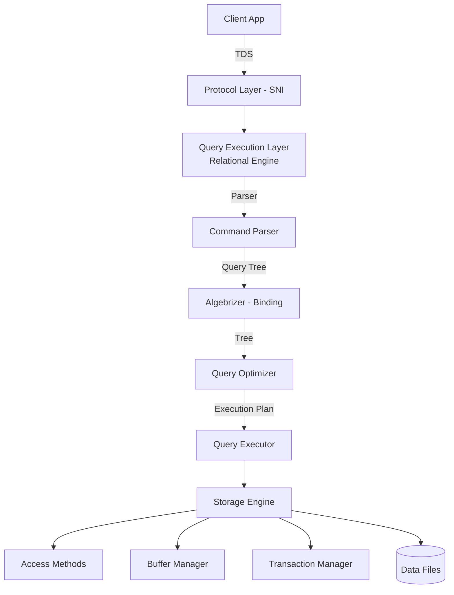

[⬅ Module 01](../../README.md) | Section 1/5 | ➡ ถัดไป: [02 Scheduling](../02_Scheduling_Windows_vs_SQL/README.md)

# 1.1 Engine Architecture & SQLOS — ทำความเข้าใจเครื่องยนต์ก่อนจูนเครื่องยนต์

> *"คนที่จูน SQL Server ได้ดี ไม่ใช่คนที่จำสูตรได้เยอะ แต่คือคนที่รู้ว่า Query หนึ่งคำถาม เดินทางผ่านอะไรบ้างก่อนกลับไปเป็นคำตอบ"*

## ทำไม Section นี้จึงต้องมาก่อน

เวลาผู้ใช้บอกว่า "ระบบช้า" สิ่งที่เกิดขึ้นจริงคือ Query หนึ่งตัวกำลังเดินทางผ่านชั้นต่าง ๆ ของ SQL Server — จาก network card, เข้าสู่ protocol layer, ผ่านการแปลงคำสั่ง, การตัดสินใจของ Optimizer, การเข้าถึงข้อมูลผ่าน Storage Engine และการจัดคิวบน CPU ผ่าน SQLOS คอขวดอาจเกิดที่ชั้นใดก็ได้ ถ้าไม่รู้แผนที่ เราจะเดาถูกได้อย่างไร?

Section นี้วางแผนที่นั้นให้ — เมื่อจบแล้วคุณจะตอบได้ว่า **"คำสั่งหนึ่งคำสั่ง เดินทางอย่างไร และแต่ละชั้นวัดอะไรได้บ้าง"**

---

## 1. Connection Protocols — ประตูทางเข้าของทุกคำสั่ง

Client เชื่อมต่อเข้าสู่ Database Engine ผ่าน Endpoints ที่รองรับ 3 โปรโตคอล:

| Protocol | ใช้เมื่อไร | ข้อสังเกตด้าน Performance |
|:---------|:----------|:--------------------------|
| **Shared Memory** | เชื่อมต่อภายในเครื่องเดียวกัน (เช่น SSMS บน server) | เร็วที่สุด — ไม่มี network stack |
| **Named Pipes** | ระบบ LAN แบบดั้งเดิม | ปัจจุบันพบน้อยลง |
| **TCP/IP** | มาตรฐานหลักของทุก application | ตัวแปรสำคัญคือ network latency |

**ยุคใหม่ (SQL Server 2022+):** TDS 8.0 บังคับให้การเข้ารหัส TLS 1.3 เกิดขึ้น **ก่อน** ที่ TDS session จะเริ่ม (strict encryption) — ปลอดภัยขึ้น และ handshake ชัดเจนขึ้น ซึ่งสำคัญเวลาวิเคราะห์ network trace

> **จุดเชื่อมโยง:** เวลาเจอ wait type `ASYNC_NETWORK_IO` ปัญหามักไม่ใช่โปรโตคอล แต่เป็นฝั่ง client ที่ "รับข้อมูลไม่ทัน" — เราจะกลับมาที่ตัวนี้ในหัวข้อ Wait Statistics

---

## 2. Database Engine Layers — ชั้นการทำงานสามชั้น



### 2.1 Query Execution Layer (Relational Engine)

| องค์ประกอบ | หน้าที่ | อาการเมื่อมีปัญหา |
|:-----------|:--------|:-----------------|
| **Command Parser** | ตรวจ syntax แปลงเป็น internal format | — |
| **Algebrizer** | Binding: resolve object names, ตรวจ data types สร้าง Query Tree | ความผิดพลาดชื่อ object/type mismatch |
| **Query Optimizer** | เลือก Execution Plan ที่ต้นทุนต่ำสุด (Cost-based) | Plan แย่ = query ช้าแม้ hardware ดี |
| **Query Executor** | รัน plan ผ่าน Storage Engine | รอ resource ระหว่างรัน |

### 2.2 Storage Engine

| องค์ประกอบ | หน้าที่ |
|:-----------|:--------|
| **Access Methods** | ตัดสินใจ Table Scan vs Index Seek, จัดการ pages และ extents |
| **Buffer Manager** | จัดการ Buffer Pool — cache data pages ใน memory |
| **Transaction Manager** | ควบคุม Atomicity, Write-Ahead Logging และ Locking |

### 2.3 SQLOS — "OS จิ๋ว" ใน SQL Server

**SQLOS (SQL Server Operating System)** คือชั้น user-mode ที่ SQL Server สร้างขึ้นเพื่อจัดการทรัพยากรเอง แทนการพึ่ง Windows ทั้งหมด:

- จัดการ **Schedulers / Workers / Tasks** (การแบ่ง CPU)
- จัดการ **Memory** ของ engine ทั้งหมด
- จัดการ **Exception handling, CLR hosting, deadlock detection**

> **หัวใจของ Section นี้:** เพราะ SQL Server จัดการ CPU และ Memory เอง ตัวชี้วัดของ Windows (Task Manager) จึง **ไม่เพียงพอ** — เราต้องอ่านข้อมูลจาก SQLOS ผ่าน DMVs เช่น `sys.dm_os_schedulers`, `sys.dm_os_memory_clerks` ซึ่งเป็นเครื่องมือหลักของหลักสูตรทั้งเล่ม

---

## 3. ตัวอย่าง: เดินทางของ Query หนึ่งตัว

ลองตาม query นี้ทีละขั้น:

```sql
SELECT TOP (10) CustomerID, SUM(TotalDue) AS Total
FROM Sales.SalesOrderHeader
GROUP BY CustomerID
ORDER BY Total DESC;
```

1. **Protocol Layer** — SSMS ส่ง TDS packet ผ่าน TCP/IP → SNI รับและตรวจ session
2. **Parser/Algebrizer** — ตรวจ syntax, resolve ว่า `Sales.SalesOrderHeader` คือตารางอะไร, ตรวจว่าคอลัมน์มีจริง
3. **Optimizer** — ดู Statistics ของตาราง ประเมินจำนวนแถว เลือกว่าจะ Scan หรือ Seek, Hash หรือ Stream Aggregate → ได้ Execution Plan
4. **Plan Cache** — plan ถูกเก็บไว้ใช้ซ้ำ (ดูต่อ Module 8)
5. **Query Executor** — ขอ pages จาก Access Methods → Buffer Manager
   - ถ้า page อยู่ใน Buffer Pool → **Logical Read** (เร็ว)
   - ถ้าไม่มี → **Physical Read** จาก disk → เกิด wait `PAGEIOLATCH_SH`
6. **SQLOS** — task ของ query รอ scheduler ให้เวลา CPU → ถ้า CPU แน่น เกิด `SOS_SCHEDULER_YIELD`
7. **Results** — ส่งกลับ client; ถ้า client รับช้า → `ASYNC_NETWORK_IO`

> **แบบฝึกหัดคิด:** query เดียวกันนี้ "ช้า" ได้จากกี่จุด? — plan แย่ (ชั้น 3), disk ช้า (ชั้น 5), CPU แน่น (ชั้น 6), client ช้า (ชั้น 7) นี่คือเหตุผลที่เราต้องมีระบบวินิจฉัย ไม่เดา

---

## 4. เชื่อมโยงกับเวอร์ชันใหม่ (ถึง SQL Server 2025)

- **TDS 8.0 + TLS 1.3** — การเชื่อมต่อเข้มงวดขึ้น วัดผล network ได้ตรงขึ้น
- **`sys.dm_exec_query_plan_stats`** (2019+) — ดึง Last Actual Plan ได้จาก cache โดยไม่ต้องพึ่ง Query Store
- **SQL Server 2025 บน Linux** — สถาปัตยกรรมชั้นในเหมือนกันทุกประการ แนวคิดทั้งหมดในหลักสูตรนี้ใช้ข้าม platform ได้

---

## สรุป Section 1

- SQL Server แบ่งเป็น 3 ชั้นหลัก: **Protocol → Relational Engine → Storage Engine** และมี **SQLOS** เป็น OS ภายในจัดการ CPU/Memory
- คอขวดเกิดได้ทุกชั้น — การรู้แผนที่คือรากฐานของการวินิจฉัยแบบมืออาชีพ
- เครื่องมือวัดของเราคือ DMVs ที่ SQLOS เปิดเผย (`sys.dm_os_*`, `sys.dm_exec_*`)

**ตรวจความเข้าใจ:** Algebrizer ทำอะไรก่อนส่งงานให้ Optimizer? และเพราะอะไร Task Manager จึงไม่ใช่เครื่องมือหลักในการวิเคราะห์ memory ของ SQL Server?

**➡ ถัดไป:** [Section 1.2 — Scheduling: Windows vs SQL Server](../02_Scheduling_Windows_vs_SQL/README.md)

---

[⬅ Module 01](../../README.md) | [🧪 Labs](../../Labs/README.md) | ➡ [02 Scheduling](../02_Scheduling_Windows_vs_SQL/README.md)
