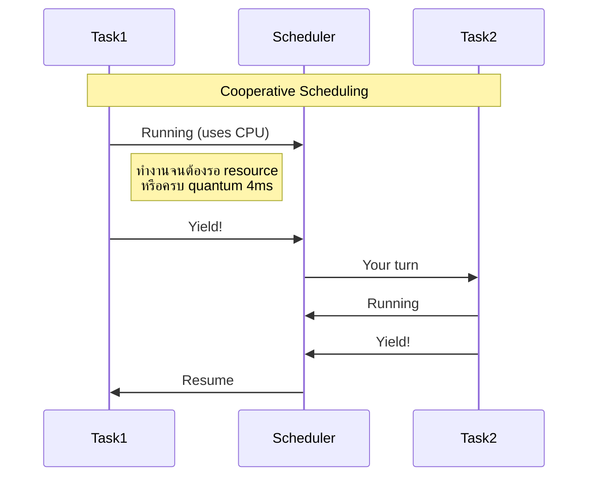
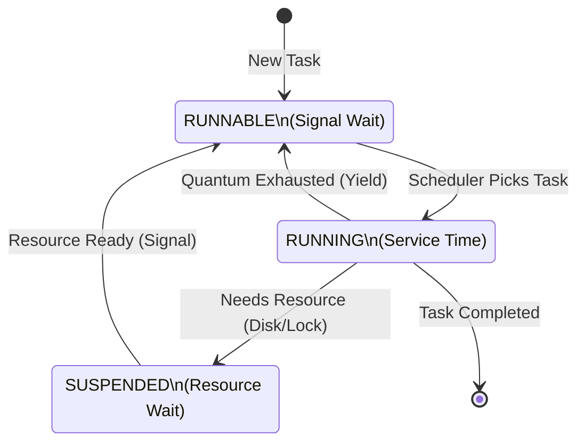

[⬅ Module 01](../../README.md) | [1.1 Engine Architecture](../01_Engine_Architecture_SQLOS/README.md) | Section 2/5 | ➡ ถัดไป: [03 NUMA](../03_NUMA_Architecture/README.md)

# 1.2 Scheduling — Windows จัดคิวแบบไหน, SQL Server จัดคิวแบบไหน

> *"CPU หนึ่ง core รันได้ครั้งละหนึ่ง task เท่านั้น ทุกอย่างที่เหลือคือเรื่องของการจองคิว"*

## เปิดเรื่อง: ทำไม DBA ต้องเข้าใจ Scheduler

เวลา query ช้า หลายคนคิดถึง disk หรือ index ก่อน แต่คอขวดที่พบบ่อยอันดับต้น ๆ คือ **CPU scheduling** — และ SQL Server ไม่ได้ปล่อยให้ Windows จัดคิวให้ แต่สร้างระบบจัดคิวของตัวเองชื่อ **SQLOS Scheduler** คนที่เข้าใจกลไกนี้จะอ่านสัญญาณ CPU pressure ได้ก่อนคนอื่นหลายก้าว

---

## 1. Preemptive vs Non-Preemptive (Cooperative) Scheduling

| Aspect | Windows (Preemptive) | SQL Server (Non-Preemptive / Cooperative) |
|:-------|:---------------------|:------------------------------------------|
| **การหยุด Thread** | OS สั่งหยุด (Force) เมื่อหมด Time Slice | Thread หยุดเอง (Yield) เมื่อทำงานเสร็จหรือต้องรอ |
| **Quantum** | ~15.6 ms | ~4 ms |
| **Context Switch** | OS-managed (overhead สูงกว่า) | Application-managed (เบากว่ามาก) |
| **ผู้ควบคุม** | Windows Kernel | SQLOS |



**เหตุผลที่ SQL Server เลือก Cooperative:**
- ลด context switch overhead — ตัดการประกาศจาก kernel ออก
- SQL Server รู้บริบทของงานดีกว่า OS (เช่น ตอนรอ I/O หรือ Lock ควรยอมแพ้ CPU ทันที)
- ผู้เขียน engine ควบคุม fairness ของคิวได้เองผ่านอัลกอริทึม

> [!WARNING]
> **lightweight pooling (fiber mode)** เทคนิคยุค 90s ที่พยายามลด context switch ด้วย user-mode fibers — **ถูกประกาศ deprecated ใน SQL Server 2025** และทำให้ CLR/XML/Linked Server ทำงานผิดปกติ อย่าตั้งค่านี้อีกต่อไป

---

## 2. SOS Scheduler — ห้าคิวที่ควบคุมทุก Task

แต่ละ scheduler (1 ต่อ logical CPU) บริหาร task ผ่านคิวเหล่านี้:

```
Worker List ──► Runnable List ──► CPU ──► Waiter List
  (workers          (รอ CPU,             │         (รอ resource:
   ที่ว่าง)          state=RUNNABLE)      │          state=SUSPENDED)
                                            ▼
                                   I/O List / Timer List
                                   (รอ I/O หรือ sleep ตามเวลา)
```

| คิว | สถานะของ task | ตีความ |
|:----|:--------------|:-------|
| Worker List | ว่าง รอรับงาน | ปกติ |
| Runnable List | RUNNABLE — พร้อมทำงาน รอ CPU | คิวยาว = **CPU pressure** |
| Waiter List | SUSPENDED — รอ resource | ดู wait type เพื่อระบุ resource |
| I/O List | รอ I/O completion | disk ทำงานอยู่ |
| Timer List | รอตามเวลา (เช่น WAITFOR DELAY) | ไม่ใช่ปัญหา performance |

**ค่าที่ต้องจับตา:** `sys.dm_os_schedulers.runnable_tasks_count` — ถ้า > 0 ค้างต่อเนื่อง คือคิว CPU กำลังต่อคิว

---

## 3. Quantum 4 ms และ Yield

Task ที่รันบน CPU มีเวลาสูงสุดประมาณ **4 ms** (quantum) จากนั้นต้อง yield ให้ task อื่น:

- yield ปกติ → wait type `SOS_SCHEDULER_YIELD` — เกิดได้กับระบบปกติ แต่ถ้า **สูงต่อเนื่อง** = งานล้น CPU
- Signal Wait = task ที่พร้อมทำงานแล้วแต่ยังรอคิว — เวลาส่วนนี้ "หายไปฟรี" โดยไม่ได้รอ resource ใด

```sql
-- Signal Wait Ratio: ตัวชี้วัด CPU pressure ระดับ instance
SELECT SUM(signal_wait_time_ms) * 1.0 / SUM(wait_time_ms) * 100 AS signal_wait_pct
FROM sys.dm_os_wait_stats
WHERE wait_time_ms > 0;
-- > 10-15% ต่อเนื่อง = เริ่มมี CPU pressure
```

---

## 4. User Request Life Cycle — แต่ละขั้นดู DMV ไหน

| # | ขั้น | DMV |
|:-:|:-----|:----|
| 1 | Connection established | `sys.dm_exec_connections` |
| 2 | Session ID assigned | `sys.dm_exec_sessions` |
| 3 | Request created | `sys.dm_exec_requests` |
| 4 | Task(s) created | `sys.dm_os_tasks` |
| 5 | Task → Worker | `sys.dm_os_workers` |
| 6 | Worker บน OS Thread | `sys.dm_os_threads` |
| 7 | Scheduler จัดคิว | `sys.dm_os_schedulers` |

- 1 connection อาจมีหลาย session; 1 request อาจแตกเป็นหลาย task เมื่อ parallel plan
- `max_worker_threads` (default 0 = auto) คือเพดาน worker — ถ้าหมด เกิด wait `THREADPOOL` ซึ่งเป็นภาวะวิกฤต

---

## 5. Thread Life Cycle (State Machine)



**อ่านสถานะให้เป็นเรื่อง:**
- Response Time = **Service Time** (RUNNING) + **Resource Wait** (SUSPENDED) + **Signal Wait** (RUNNABLE)
- แก้ผิดจุด = เสียเวลาเปล่า: งานรอ disk ไปเพิ่ม CPU ก็ไม่ช่วย

---

## 6. หัวข้อขั้นสูงที่ควรรู้

- **Large Deficit First (LDF)** — อัลกอริทึมจัดคิว (2016+) ป้องกัน task ใหญ่ (เช่น read-ahead) แย่ง CPU จน task เล็กอดรัน
- **Hidden Schedulers** — scheduler สำหรับงานระบบ: Ghost Cleanup, Query Store async, Checkpoint และ **DAC** (Dedicated Admin Connection ไว้กู้ชีพเมื่อ server ค้าง)
- **PREEMPTIVE_\* waits** — เมื่อ SQL Server ต้องเรียก Windows API นอก SQLOS (เช่น `PREEMPTIVE_OS_FILEOPS`) สูงผิดปกติมักมาจาก Linked Server / xp_cmdshell / CLR
- **SQL Server 2025:** `lightweight pooling` ถูกประกาศ deprecated — cooperative scheduling คือโมเดลเดียวที่เหลืออยู่

---

## สรุป Section 2

1. SQL Server จัดคิว CPU เองแบบ **Cooperative** (quantum ~4 ms, thread yield เอง)
2. อาการ CPU pressure อ่านได้จาก **runnable queue** และ **Signal Wait Ratio** ไม่ใช่แค่ % CPU
3. Life cycle 3 สถานะ **RUNNABLE → RUNNING → SUSPENDED** คือภาษากลางของการวินิจฉัย

**ตรวจความเข้าใจ:**
1. task อยู่ใน Runnable List แปลว่ากำลังรออะไร? ต่างจาก Waiter List อย่างไร?
2. CPU utilization 60% แต่ query ช้า — กลไกไหนอธิบายสถานการณ์นี้ได้?

**➡ ถัดไป:** [Section 1.3 — NUMA Architecture](../03_NUMA_Architecture/README.md)

---

[⬅ Module 01](../../README.md) | [🧪 Labs](../../Labs/README.md) | ➡ [03 NUMA](../03_NUMA_Architecture/README.md)
