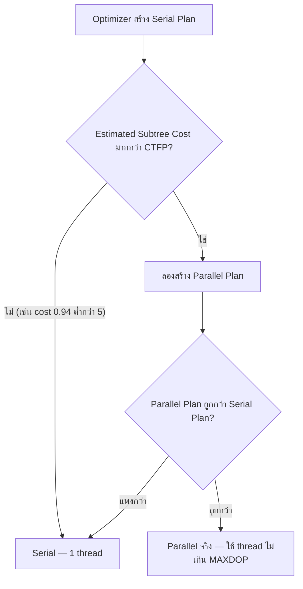

[⬅ Module 01](../../README.md) | [1.3 NUMA](../03_NUMA_Architecture/README.md) | Section 4/5 | ➡ ถัดไป: [05 Modern Features](../05_Modern_Features_2025/README.md)

# 1.4 Wait Statistics — ภาษาที่ SQL Server ใช้บอกว่ากำลังรออะไร

> *"SQL Server ไม่เคยเงียบ — มันบันทึกทุกวินาทีที่ต้องรอ ไว้ให้เราอ่าน"*

> **ต้องรู้มาก่อน**: [Section 1.2 — Scheduling](../02_Scheduling_Windows_vs_SQL/README.md) (สถานะ RUNNABLE / RUNNING / SUSPENDED และ Signal Wait) พร้อมสิทธิ์ `VIEW SERVER STATE` สำหรับอ่าน `sys.dm_os_wait_stats`
> ศัพท์ใหม่ดู [Glossary](../../../Glossary.md)

## เปิดเรื่อง: Waits & Queues Methodology

ทุกครั้งที่ task ต้องหยุดรอ (SUSPENDED) SQL Server บันทึกว่า "รออะไร นานแค่ไหน กี่ครั้ง" ไว้ใน `sys.dm_os_wait_stats` ปรัชญา **Waits & Queues** คือ: แทนที่จะเดาว่าระบบช้าเพราะอะไร ให้อ่านบัญชีการรอที่ engine จดไว้ให้เอง — คอขวดจริงจะจัดอันดับให้อยู่แล้ว

สมการที่ต้องจำ:

```
Response Time = Service Time (CPU) + Wait Time (รอ resource)
```

และ Wait Time แบ่งเป็น:
- **Resource Wait** — รอของจริง: disk, lock, network
- **Signal Wait** — ของมาแล้ว แต่ CPU ยังไม่ว่าง (= สัญญาณ CPU pressure)

---

## 1. อ่าน Wait Statistics อย่างมืออาชีพ

### ค่าที่ DMV เก็บเป็น "ค่าสะสมตั้งแต่ restart" — จึงต้องทำ Delta

```sql
-- Top waits แบบกรอง benign waits (สไตล์ Glenn Berry)
WITH Waits AS
(
    SELECT wait_type, wait_time_ms / 1000.0 AS wait_s,
           (wait_time_ms - signal_wait_time_ms) / 1000.0 AS resource_s,
           signal_wait_time_ms / 1000.0 AS signal_s,
           waiting_tasks_count
    FROM sys.dm_os_wait_stats
    WHERE wait_type NOT IN ( /* benign waits: SLEEP_*, XE_TIMER, ... */
          ) AND waiting_tasks_count > 0
)
SELECT TOP (25) wait_type, wait_s,
       CAST(100.0 * wait_s / SUM(wait_s) OVER () AS DECIMAL(10,1)) AS pct_total,
       resource_s, signal_s
FROM Waits ORDER BY wait_s DESC;
```

### Signal Wait Ratio — ตัวชี้วัด CPU pressure

```sql
SELECT SUM(signal_wait_time_ms) * 1.0 / SUM(wait_time_ms) * 100 AS signal_wait_pct
FROM sys.dm_os_wait_stats WHERE wait_time_ms > 0;
-- > 10-15% ต่อเนื่อง = CPU pressure
```

> [!IMPORTANT]
> ค่าใน DMV เป็นค่าสะสม — เปรียบเทียบต้องใช้ **delta ระหว่าง snapshot** (เก็บ baseline ทุก 15 นาที ดูต่อ Module 10)

---

## 2. Wait Types ที่ต้องรู้จัก — จัดกลุ่มตามคอขวด

### CPU
| Wait | ความหมาย | ทิศทางแก้ |
|:-----|:---------|:----------|
| `SOS_SCHEDULER_YIELD` | ครบ quantum 4ms แล้วยังทำไม่จบ | ลดงาน CPU / จูน MAXDOP+CTFP / เพิ่ม core |
| `CXPACKET` / `CXCONSUMER` | รอ thread อื่นใน parallel plan | ดู statistics, MAXDOP, Cost Threshold — **ลงลึกที่หัวข้อ 4 ด้านล่าง** |
| `THREADPOOL` | worker หมด | **วิกฤต** — ลด concurrency / ตรวจ blocking ยาว |

### I/O
| Wait | ความหมาย | ทิศทางแก้ |
|:-----|:---------|:----------|
| `PAGEIOLATCH_SH/EX` | รออ่าน data page จาก disk | ลด logical reads (index) / storage / memory |
| `WRITELOG` | รอเขียน transaction log | log ลง storage เร็วสุด / รวม micro-transactions |
| `ASYNC_IO_COMPLETION`, `IO_COMPLETION` | รอ I/O อื่น (backup, sort) | ตรวจ storage ของงานนั้น |

### Memory
| Wait | ความหมาย | ทิศทางแก้ |
|:-----|:---------|:----------|
| `RESOURCE_SEMAPHORE` | รอ memory grant | ลด sort/hash ใหญ่, ตรวจ statistics |
| `CMEMTHREAD` | memory object contention | พบน้อยลงในรุ่นใหม่ — อัปเดต CU |

### Lock / Blocking
| Wait | ความหมาย | ทิศทางแก้ |
|:-----|:---------|:----------|
| `LCK_M_S/X/...` | รอ Lock ขัดกัน | หา head blocker / RCSI / transaction สั้น |
| `PAGELATCH_*` | รอ Latch ใน memory (hot page) | แก้ design — เช่น tempdb files, last-page insert |

### Network / อื่น ๆ
| Wait | ความหมาย |
|:-----|:---------|
| `ASYNC_NETWORK_IO` | client รับข้อมูลไม่ทัน (แก้ฝั่ง app) |
| `PREEMPTIVE_OS_*` | รอ Windows API (Linked Server, CLR) |
| `LOGBUFFER`, `BACKUPTHREAD` | log buffer เต็ม / backup กำลังทำงาน |

> รายการเต็มอ่านได้ที่ [SQLskills wait type library](https://www.sqlskills.com/help/waits/)

---

## 3. ขั้นตอนการวินิจฉัยด้วย Waits

1. **เก็บ delta** — snapshot `sys.dm_os_wait_stats` สองจุดเวลา ลบกัน
2. **จัดอันดับ top waits** หลังกรอง benign waits
3. **แปล wait → resource** ด้วยตารางด้านบน
4. **ยืนยันด้วยข้อมูลชั้นที่สอง** — เช่น PAGEIOLATCH → ดู file stats; LCK_M → ดู blocking chain
5. **แก้ → วัดซ้ำ** — อย่าแก้หลายอย่างพร้อมกัน

---

## 4. Parallel Execution — Cost Threshold for Parallelism (CTFP) & MAXDOP

`CXPACKET` / `CXCONSUMER` ในตารางด้านบนคือ "เสียงของ parallel plan" — หัวข้อนี้อธิบายว่า Optimizer ตัดสินใจว่าจะขนานหรือไม่อย่างไร และค่า instance สองตัวที่คุมมัน (ตรงกับสไลด์บทที่ 1: การประมวลผล Query และสไลด์ CXPACKET/CXCONSUMER)

### กลไกการตัดสินใจของ Optimizer

Optimizer คอมไพล์ **Serial Plan ก่อนเสมอ** แล้วจึงผ่านด่านสองขั้น:



> [!IMPORTANT]
> CTFP เป็นเพียง "ประตู" — ผ่านประตูแล้ว Optimizer ยังเทียบราคาอีกขั้น ถ้า parallel plan แพงกว่า serial ก็ยังเลือก serial (ทดสอบจริง: query เดิมมี serial cost 0.94 แต่ parallel cost 1.62 — แม้ลด CTFP เหลือ 0 มันก็ยังวิ่ง serial)

### CTFP vs MAXDOP — คนละหน้าที่

| | Cost Threshold for Parallelism | MAXDOP |
|:--|:--|:--|
| ตอบคำถาม | Query นี้ *มีสิทธิ์* ขนานไหม? | ถ้าขนาน ใช้ได้ *กี่ thread*? |
| Default | **5** (advanced option) | **0** = ไม่จำกัด — ใช้ logical CPU ที่มี (ถ้า physical core ต่อ NUMA node เกิน 8 จะถูก cap ที่ 8 อัตโนมัติ; ติดตั้งใหม่ setup จะตั้งตาม guideline ให้แล้ว) |
| ตำแหน่งตั้ง | Instance เท่านั้น (`sp_configure`) | Instance (`sp_configure`) · Database (`ALTER DATABASE SCOPED CONFIGURATION SET MAXDOP = n`) · Query (`OPTION (MAXDOP n)`) |
| ตั้งสูงเกินไป | Query กลาง ๆ ถูกบังคับ Serial | หลาย query แย่ง worker พร้อมกัน → เสี่ยง `THREADPOOL` |
| ตั้งต่ำเกินไป | Query เล็กจิ๋วก็ขนาน — overhead ฟุ่มเฟือย | ขนานได้แต่เร็วไม่เต็มที่เพราะ thread ไม่พอ |
| แนวปฏิบัติ | ยกขึ้นเป็น **25–50** เป็นจุดเริ่มบนฮาร์ดแวร์ยุคใหม่ (แนวทาง Microsoft) | ≤ จำนวน core ต่อ NUMA node และไม่เกิน 8 · `MAXDOP 1` = บังคับ Serial |

ลำดับความสำคัญของ MAXDOP: **hint ระดับ query > database scoped configuration > instance** (ทดสอบจริงด้านล่าง: instance = 2 แต่ `OPTION (MAXDOP 4)` ได้ DOP 4 จริง)

### อ่าน Plan ให้เห็น Parallelism

เปิด **Include Actual Execution Plan** (Ctrl+M) แล้วดู 3 จุด:

- **Parallelism operators (Exchange)** — `Gather Streams` (รวมผลกลับเป็น 1 stream), `Repartition Streams` (กระจายงานต่อข้าม thread), `Distribute Streams`
- **Degree of Parallelism** ที่ root node — จำนวน thread ที่ใช้จริง (parallel plan ที่ถูกจำกัดจะเห็น DOP ต่ำกว่าจำนวน core)
- **NonParallelPlanReason** — ทำ parallel ไม่ได้เพราะอะไร: `MaxDOPSetToOne` (ถูกตั้ง MAXDOP 1), `EstimatedDOPIsOne`, `CouldNotGenerateValidParallelPlan` (เช่น INSERT ลง table variable)

### อ่าน CXPACKET คู่กับ CXCONSUMER — เรียงจากต้นเหตุถึงปลายเหตุ

| มุม | รายละเอียด |
|:--|:--|
| สาเหตุที่เป็นไปได้ | Optimizer เลือก plan ไม่เหมาะสม · การแบ่งงานระหว่าง threads ไม่สมดุล |
| ลำดับการแก้ที่เหมาะสม | ปรับปรุง Statistics → แก้ต้นตอของ Query/Plan ก่อน → พิจารณา**ลด** MAXDOP เมื่อมีหลักฐานรองรับ → พิจารณา**เพิ่ม** Cost Threshold for Parallelism |
| CXCONSUMER สูงอย่างเดียว | มักเป็นพฤติกรรมปกติ — consumer รอรับแถวจาก parallel workers; ถ้า query จบตาม SLA และ CXPACKET ไม่เด่น ไม่ใช่ bottleneck |
| สัญญาณที่ควรตรวจต่อ | CXPACKET สูงต่อเนื่อง + Elapsed Time แย่ลง · Row Distribution / Completion Time ไม่สมดุล · มี Spill, Skew, Cardinality Error หรือ Plan เปลี่ยน → ใช้ Query Store และ Actual Plan หา query ตัวการ |

> **Takeaway (จากสไลด์):** เริ่มจาก Plan และ Data Distribution — การลด MAXDOP เป็นการแก้ปลายเหตุหากยังไม่รู้ต้นตอ · อ่าน CXPACKET/CXCONSUMER เป็นคู่เสมอ: CXCONSUMER สูงอย่างเดียวมักปกติ, CXPACKET + งานช้า + Worker Skew จึงค่อยชี้ว่ามีปัญหา

### Demo บน AdventureWorks2025 (รันจริงบน SQL Server 2025 RTM 17.0.1000.7, 8 vCPU / 1 NUMA node, MAXDOP = 2, CTFP = 5)

สคริปต์เต็ม: [`Scripts/09_Parallelism_CTFP_MAXDOP.sql`](Scripts/09_Parallelism_CTFP_MAXDOP.sql)

**Step 1 — ดูค่าตั้งต้นของ instance**

```sql
EXEC sp_configure 'show advanced options', 1; RECONFIGURE;
SELECT name, value_in_use FROM sys.configurations
WHERE name IN ('cost threshold for parallelism', 'max degree of parallelism');
```

**Step 2 — query จริงบน AW2025 ยังไม่ข้ามเกณฑ์**

```sql
SELECT soh.TerritoryID, COUNT_BIG(*) AS OrderLines, SUM(sod.LineTotal) AS LineTotal
FROM Sales.SalesOrderHeader AS soh
JOIN Sales.SalesOrderDetail AS sod ON sod.SalesOrderID = soh.SalesOrderID
GROUP BY soh.TerritoryID;
```

✅ **รันจริง**: Estimated Subtree Cost = **0.94** < CTFP 5 → **Serial** (ไม่มี Parallelism operator) — AdventureWorks มาตรฐานเล็กมาก ส่วนใหญ่จึงไม่ข้ามเกณฑ์

**Step 3 — ขยายข้อมูลใน tempdb (×8 ≈ 970k แถว ใน `#temp` ของ session ตัวเอง ปิด window แล้วหาย) แล้วรัน aggregate เดิม**

✅ **รันจริง**: cost = **7.74** > CTFP 5 → **Parallel plan ได้เองโดยไม่ต้องใส่ hint** — เห็น `Gather Streams`, **Degree of Parallelism = 2** (โดน instance MAXDOP = 2 จำกัด ทั้งที่เครื่องมี 8 cores), CPU 109 ms / elapsed **63 ms** (elapsed < CPU = ขนานจริง)

**Step 4 — พลิก CTFP เป็น 100 แล้วรัน query เดิม แล้วคืนค่า**

```sql
EXEC sp_configure 'cost threshold for parallelism', 100; RECONFIGURE;
-- รัน query เดิม ...
EXEC sp_configure 'cost threshold for parallelism', 5; RECONFIGURE;  -- คืนค่าเดิม
```

✅ **รันจริง**: serial cost 10.29 < CTFP 100 → **Serial** ทั้งที่ query เดิม, elapsed **113 ms** เทียบกับ parallel 63 ms — query เดียวกัน เครื่องเดียวกัน ช้าขึ้นเกือบ 2 เท่าเพราะถูกปิดประตู parallelism

> [!WARNING]
> `sp_configure` กระทบ **ทั้ง instance** — ทำบน VM/lab ของตัวเองเท่านั้น และ **ห้ามใช้ `DBCC FREEPROCCACHE`** บน instance ที่ใช้ร่วมกัน (ใช้วิธีรันซ้ำให้ plan เต็มถูกแคชแทน — ดูหมายเหตุ optimize for ad hoc workloads ในสคริปต์)

**Step 5 — ทดสอบ MAXDOP ระดับ query**

```sql
... OPTION (USE HINT('ENABLE_PARALLEL_PLAN_PREFERENCE'), MAXDOP 1);  -- Degree of Parallelism = 0, NonParallelPlanReason = MaxDOPSetToOne
... OPTION (USE HINT('ENABLE_PARALLEL_PLAN_PREFERENCE'), MAXDOP 4);  -- Degree of Parallelism = 4 — hint ชนะค่า instance ที่ = 2
```

(เครื่องมือช่วยดู parallel ของ query เล็ก: hint `ENABLE_PARALLEL_PLAN_PREFERENCE` บังคับให้ Optimizer "หา" parallel plan โดยไม่สน CTFP — ใช้เพื่อการสอน/วินิจฉัย ไม่ใช่ทางแก้ production)

**Step 6 — เห็น CXPACKET/CXCONSUMER จากงาน parallel จริง**

รัน parallel query ซ้ำ 50 ครั้งแล้ววัด delta ของ `sys.dm_os_wait_stats`:

```text
CXCONSUMER   +1,246 ครั้ง (662 ms)
CXPACKET     +971 ครั้ง (257 ms)
```

CXCONSUMER มากกว่า CXPACKET เล็กน้อยคือหน้าตาของ parallel plan ที่แข็งแรง — ตามที่หัวข้อ "อ่านเป็นคู่" ด้านบน

> อ้างอิง: [SQLShack — The basics of parallel execution plans in SQL Server](https://www.sqlshack.com/the-basics-of-parallel-execution-plans-in-sql-server/) · [Microsoft Learn — Configure the cost threshold for parallelism](https://learn.microsoft.com/sql/database-engine/configure-windows/configure-the-cost-threshold-for-parallelism-server-configuration-option) · [Microsoft Learn — Max degree of parallelism (รวมแนวทางการตั้งค่า)](https://learn.microsoft.com/sql/database-engine/configure-windows/max-degree-of-parallelism-server-configuration-option) · [Thread and Task Architecture Guide](https://learn.microsoft.com/sql/relational-databases/thread-and-task-architecture-guide)

---

## สรุป Section 4

1. `sys.dm_os_wait_stats` = บัญชีการรอสะสมของทั้ง server — อ่านแบบ **delta**
2. แยก Resource Wait (รอของ) กับ Signal Wait (รอ CPU) ตั้งแต่มองแรก
3. แต่ละ wait type ชี้ไปคนละทิศ — ตารางใน section นี้คือแผนที่ประจำตัว
4. Parallel Execution: ขนานได้เมื่อ cost ข้าม **CTFP** (ประตู) และใช้ thread ไม่เกิน **MAXDOP** (เพดาน) — CXPACKET/CXCONSUMER ต้องอ่านเป็นคู่เสมอ

**ตรวจความเข้าใจ:**
1. `PAGEIOLATCH_SH` กับ `PAGELATCH_EX` ต่างกันอย่างไร — ใครเกี่ยวกับ disk ใครเกี่ยวกับ memory?
2. เจอ top wait เป็น `SOS_SCHEDULER_YIELD` — สิ่งแรกที่จะดูคืออะไร?
3. Query A มี Estimated Subtree Cost = 3, Query B = 40 — รันบน instance ที่ CTFP = 25, MAXDOP = 8 (8 cores): ตัวไหนได้ parallel plan และใช้ thread ได้สูงสุดกี่ตัว? ถ้ายก CTFP เป็น 50 ผลเปลี่ยนไหม?

**➡ ถัดไป:** [Section 1.5 — Modern Features & 2025 Checklist](../05_Modern_Features_2025/README.md)

---

[⬅ Module 01](../../README.md) | [🧪 Labs](../../Labs/README.md) | ➡ [05 Modern Features](../05_Modern_Features_2025/README.md)
