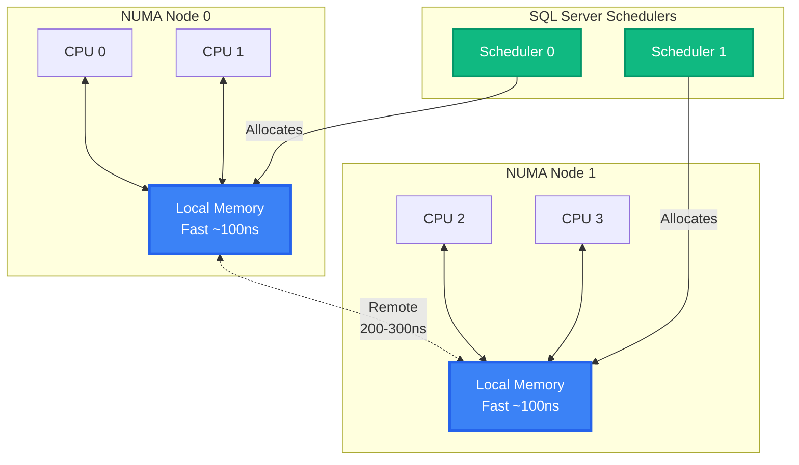

[⬅ Module 4_](../../README.md) | Section 1/4 | ➡ ถัดไป: [SQL Server Memory](../02_SQL_Server_Memory/README.md)

## Windows Memory (Lesson 1)

### 2.1 Virtual Address Space (VAS)
พื้นที่ Address ที่ Process สามารถมองเห็นและใช้งานได้ ซึ่งแยกอิสระจาก Physical RAM
*   **32-bit Systems**: มีข้อจำกัดสูง (max 4GB) ปัจจุบันไม่แนะนำให้ใช้งาน
*   **64-bit Systems**: รองรับ VAS ขนาดมหาศาล (8TB - 128TB) ทำให้ข้อจำกัดเรื่อง Address Space หมดไป

### 2.2 Physical vs Virtual Memory
*   **Physical Memory**: หน่วยความจำหลัก (RAM)
*   **Virtual Memory**: กลไกของ OS ที่ใช้ Disk (Page File) มาขยายพื้นที่หน่วยความจำ
    *   *Paging*: กระบวนการย้าย Data Pages ระหว่าง RAM และ Disk
    *   *Impact*: หาก Windows ทำการ Paging Process ของ SQL Server จะส่งผลกระทบต่อประสิทธิภาพอย่างรุนแรง (Performance Degradation)

### 2.3 NUMA (Non-Uniform Memory Access)

สถาปัตยกรรมที่ออกแบบมาเพื่อลดคอขวดของ Memory Bus ในระบบที่มี CPU จำนวนมาก
*   **Local Memory**: หน่วยความจำที่เชื่อมต่อกับ CPU Node นั้นๆ โดยตรง (Access เร็วที่สุด)
*   **Remote Memory**: หน่วยความจำที่อยู่ต่าง Node (Access ช้ากว่า)
*   *SQL Server Awareness*: Engine จะพยายามจัดสรร Memory ใน Node เดียวกับที่ Thread ทำงานเสมอ

---

---

[⬅ ก่อนหน้า](../../README.md) | [Module 4_ README](../../README.md) | ➡ ถัดไป: [SQL Server Memory](../02_SQL_Server_Memory/README.md) | [🧪 Labs](../../Labs/README.md)
