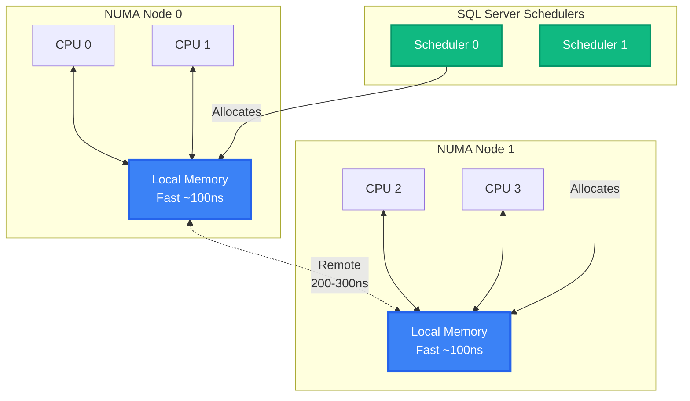

[⬅ Module 04](../../README.md) | Section 1/4 | ➡ ถัดไป: [02 SQL Server Memory](../02_SQL_Server_Memory/README.md)

# 4.1 Windows Memory — รากฐาน: RAM, Address Space และ Paging ที่ SQL Server ยืนอยู่

> *"เครื่องจักรเร็วแค่ไหนก็ไร้ความหมาย ถ้าข้อมูลยังอยู่ห่างจาก CPU — หน้าที่ของ memory คือพาข้อมูลมาไว้ใกล้ตัวประมวลผลให้มากที่สุด"*

> **ต้องรู้มาก่อน**: ความเข้าใจพื้นฐานสถาปัตยกรรม SQL Server (Module 1.1 — Buffer Pool และ SQLOS) พร้อมสิทธิ์ `VIEW SERVER STATE` สำหรับรัน DMV ที่ปรากฏใน section นี้
> ศัพท์ใหม่ดู [Glossary](../../../Glossary.md) — Physical/Virtual Memory, NUMA, PLE (Page Life Expectancy)

## ทำไม Section นี้จึงต้องมาก่อน

SQL Server ทำงานบน Windows และ memory ทุกไบต์ที่มันใช้ มาจากการ "ขอ" Windows ก่อนเสมอ เมื่อผู้ใช้บอกว่า "ระบบช้า" หนึ่งในสมมติฐานแรกที่ต้องพิสูจน์คือ **memory อยู่ที่ไหน ใครใช้อยู่ และมีการย้ายข้อมูลระหว่าง RAM กับดิสก์หรือไม่** — คำถามเหล่านี้ตอบไม่ได้ด้วยความรู้ SQL Server อย่างเดียว ต้องเข้าใจโมเดล memory ของ Windows ก่อน

ปัญหาคือศัพท์ด้านนี้ถูกใช้ปนกันจนสับสน: "virtual memory", "address space", "page", "paging" คนละความหมายกันในแต่ละบริบท และที่สับสนที่สุดคือ **page ของ Windows (4 KB) กับ page ของ SQL Server (8 KB) เป็นของคนละเรื่อง** Section นี้จึงนิยามศัพท์ทั้งหมดให้เรียบร้อยก่อนเข้าไปดู "ในบ้าน" SQL Server ใน Section 4.2

เมื่อจบ section นี้คุณจะตอบได้ว่า:

1. **Physical memory กับ Virtual memory ต่างกันอย่างไร** และ SQL Server มองเห็นอะไร
2. **VAS ของ 32-bit กับ 64-bit ต่างกันจนเปลี่ยนวิธีจูนอย่างไร** — และคำแนะนำยุคเก่าที่ยังลอยอยู่บนอินเทอร์เน็ตใช้ได้หรือไม่
3. **Paging คืออะไร ทำไม SQL Server ถึง "กลัว" มากกว่า application ทั่วไป**
4. **NUMA เปลี่ยนวิธีที่ SQL Server ยืม-คืน memory อย่างไร** และต้องอ่านค่าแยกต่อ node ไม่ใช่รวมทั้งเครื่อง

---

## 1. Physical Memory vs Virtual Memory — ของจริงกับภาพลวงตา

ศัพท์สี่คำนี้ต้องแยกให้ออกก่อนอ่านต่อ:

| ศัพท์ | นิยาม | อยู่ที่ไหน |
|:------|:------|:-----------|
| **Physical Memory (RAM)** | หน่วยความจำฮาร์ดแวร์จริงของเครื่อง | Memory module บน mainboard |
| **Virtual Memory** | กลไกของ OS ที่ให้ทุก process เห็น "memory ก้อนใหญ่ของตัวเอง" โดยหลังบ้านแผนที่ (map) แต่ละหน้าไปยัง RAM หรือดิสก์ | กลไกของ Windows + MMU |
| **Address Space** | ช่วงเลข address ที่ process สามารถอ้างถึงได้ (เช่น 0 – 128 TB) | มโนทัศน์ — ไม่ใช่ฮาร์ดแวร์ |
| **Page File (pagefile.sys)** | ไฟล์บนดิสก์ที่เก็บ page ของ process ที่ถูกเท้าออกจาก RAM ชั่วคราว | ดิสก์ที่ Windows กำหนด |

หัวใจของกลไกนี้คือ **MMU (Memory Management Unit)** บน CPU — มันแปลง address เสมือนของ process ให้เป็น address จริงใน RAM ทีละหน้า ขนาดหน้าของ Windows บน x64 คือ **4 KB** (อย่าสับสนกับ page 8 KB ของ SQL Server):

```
                 กระบวนการ SQL Server
   ┌──────────────────────────────────────────────┐
   │   Virtual Address Space (สิ่งที่ process      │
   │   มองเห็น — บน x64 กว้างถึง 128 TB)          │
   └───────────────────────┬──────────────────────┘
                           │  MMU แปลง address ทีละหน้า (4 KB)
              ┌────────────┴─────────────┐
              ▼                          ▼
   ┌────────────────────┐     ┌──────────────────────┐
   │   Physical RAM     │     │   Page File (ดิสก์)   │
   │   ~100 นาโนวินาที   │     │   ~100 ไมโครวินาทีขึ้น │
   └────────────────────┘     └──────────────────────┘
        ของจริง ถูกและเร็ว          ทางออกฉุกเฉิน ช้าหลายพันเท่า
```

ตัวเลขช่วยให้เห็นภาพว่าทำไม "หลุดจาก RAM" คือโศกนาฏกรรม:

| ชั้นข้อมูล | เวลาเข้าถึงโดยประมาณ | เทียบกับ RAM |
|:----------|:---------------------|:-------------|
| CPU Cache (L1) | ~1–4 ns | เร็วกว่า RAM ~50 เท่า |
| **Physical RAM** | **~100 ns** | 1x |
| NVMe SSD | ~10–100 µs | ช้ากว่า RAM ~100–1,000 เท่า |
| HDD | ~5–10 ms | ช้ากว่า RAM ~100,000 เท่า |

> [!IMPORTANT]
> เป้าหมายของการจูน memory ทั้งหลักสูตรนี้คือประโยคเดียว: **ทำให้ข้อมูลที่ใช้บ่อยอยู่ใน RAM ให้นานที่สุด และไม่มีอะไรบังคับให้มันตกลงไปอยู่บนดิสก์** — ทุกหัวข้อถัดไป (max server memory, LPIM, PLE) ล้วนรับใช้เป้าหมายนี้

**วัดของจริงด้วย DMV** — `sys.dm_os_sys_memory` คือมุมมองของ SQL Server ต่อสุขภาพ memory ฝั่ง Windows:

```sql
SELECT total_physical_memory_kb  / 1048576.0 AS total_ram_gb,
       available_physical_memory_kb / 1048576.0 AS available_ram_gb,
       total_page_file_kb  / 1048576.0 AS pagefile_total_gb,
       available_page_file_kb / 1048576.0 AS pagefile_available_gb,
       system_memory_state_desc,          -- AVAILABLE = Windows ยังโอเค
       system_high_memory_signal_state,   -- 1 = memory เหลือเฟือ (HIGH)
       system_low_memory_signal_state     -- 1 = Windows ขาด memory (LOW) → สัญญาณอันตราย
FROM sys.dm_os_sys_memory;
```

**Expected (รันจริงบนเซิร์ฟเวอร์หลักสูตร — SQL Server 2025 RTM-GDR 17.0.1135.8, RAM 16 GB):** ได้ `total_ram_gb ≈ 16`, `available_ram_gb ≈ 12.5`, `system_memory_state_desc = 'Available physical memory is high'`, `system_low_memory_signal_state = 0` — เครื่องว่างจึงไม่มีสัญญาณ pressure ฝั่ง OS (ค่า `system_low_memory_signal_state = 1` ที่เกิดขึ้นต่อเนื่องคือสัญญาณแรกของ external memory pressure — อ่านต่อ Section 4.3)

---

## 2. Virtual Address Space (VAS) — ประวัติศาสตร์ที่อธิบายคำแนะนำยุคเก่า

**VAS (Virtual Address Space)** คือพื้นที่ address ทั้งหมดที่ process สามารถมองเห็นและใช้งานได้ ซึ่งแยกอิสระจาก Physical RAM — process อาจ "จอง" (reserve) address ไว้โดยยังไม่ใช้ RAM เลยก็ได้

### ยุค 32-bit: คอขวดอยู่ที่ VAS

| หัวข้อ | รายละเอียด |
|:-------|:-----------|
| VAS รวม | 4 GB (เลข 32 บิต = 2³²) |
| แบ่งให้ kernel | 2 GB (user ได้ 2 GB) |
| ทางแก้ `/3GB` | ยก user VAS เป็น 3 GB — แลกกับ kernel เหลือ 1 GB จนระบบไม่เสถียร |
| ทางแก้ **AWE** (Address Windowing Extensions) | API พิเศษให้ SQL Server จอง RAM เกิน 4 GB ได้ แต่ต้องเขียนจัดการเอง และ **บังคับใช้ LPIM** เพราะ AWE page ไม่สามารถ paging ได้ |
| **MTL (Memory-To-Leave / MemToLeave)** | พื้นที่ที่ SQL Server 2000–2005 เว้น VAS ไว้ให้ allocation ขนาดใหญ่และ DLL ภายนอก — มักกลายเป็นคอขวดที่วินิจฉัยยาก |

นี่คือที่มาของคำแนะนำเก่า ๆ ที่ยังหลงเหลือในฟอรัม: ปรับ `/3GB`, ปรับ `-g` (MTL), "LPIM จำเป็นเพราะ AWE" — บน **64-bit ทั้งหมดนี้หมดความจำเป็นเพราะ VAS ไม่ใช่คอขวดอีกต่อไป** (ยกเว้น LPIM ที่ยังมีเหตุผลอื่น — หัวข้อใน Section 4.2)

### ยุค 64-bit: คอขวดย้ายไปอยู่ที่ RAM กับ Commit

| หัวข้อ | รายละเอียด |
|:-------|:-----------|
| VAS ฝั่ง user | ~128 TB — มากพอจนไม่ต้องคิดเรื่อง address space อีกเลย |
| ข้อจำกัดจริง | Physical RAM + Page File (= **System Commit Limit**) |
| ผลต่อการจูน | โฟกัสย้ายไปที่ **จัดสรร RAM ให้ถูกก้อน** (max server memory) และ **กัน paging** (LPIM) ไม่ใช่ปรับ VAS |

> [!NOTE]
> **VAS ใหญ่ ≠ RAM ใหญ่** — process บน x64 reserve address ทีละก้อนใหญ่ได้ฟรี โดยไม่ใช้ RAM จริงเลย (แค่ "กันพื้นที่ในแผนที่") เวลาวัดต้องแยก **reserved** (จองไว้) กับ **committed** (ใช้จริง/รับประกันว่ามี RAM หรือ page file รอง) เสมอ

**เพดานที่แท้จริงบน 64-bit คือ System Commit Limit** = Physical RAM + ขนาดรวม page files — นี่คือเพดานของ "ยอด commit รวมทุก process ในเครื่อง" เมื่อ commit แตะเพดานนี้ การร้องขอ memory ใหม่จะล้ม (application ได้ "out of memory" ทั้งที่ VAS ยังว่างเต็มบาน) ดังนั้นการปรับ page file ขนาดเล็กจนเกินไปบนเครื่อง SQL ที่มี memory grant ใหญ่ ๆ คือระเบิดเวลาที่จุดชนวนด้วย workload เดียว — ค่า `available_commit_limit_kb` ที่เห็นในหัวข้อ 3 คือ "เงินที่เหลือให้ยืม" จากเพดานนี้

ดูเลขจริงของ process SQL Server ได้จาก `sys.dm_os_process_memory` (ใช้ในหัวข้อ 3) และเลข VAS ต่อ memory node จาก `sys.dm_os_memory_nodes`:

```sql
SELECT memory_node_id,
       virtual_address_space_reserved_kb  / 1048576.0 AS vas_reserved_gb,
       virtual_address_space_committed_kb / 1048576.0 AS vas_committed_gb,
       locked_page_allocations_kb / 1024.0 AS locked_pages_mb,
       pages_kb / 1024.0 AS sqlos_pages_mb,
       target_kb / 1024.0 AS target_memory_mb
FROM sys.dm_os_memory_nodes;
```

**Expected (รันจริงบนเซิร์ฟเวอร์หลักสูตร):** ได้ 2 แถว — node 0: `vas_reserved_gb ≈ 35.6` (จองแผนที่ไว้มาก แต่...) `vas_committed_gb ≈ 0.85` (ใช้จริงน้อยกว่าแทบไม่มีความหมายเชิงเปรียบเทียบ) `target_memory_mb ≈ 12,854` และ node 64: ค่าเกือบศูนย์ — **node 64 คือ memory node พิเศษสำหรับ DAC (Dedicated Admin Connection)** ที่แยกไว้ให้ admin ใช้ยามเครื่องล่ม

---

## 3. Paging, Working Set — ทำไม SQL Server ถึงกลัวกว่าใคร

ศัพท์ก่อนใช้:

- **Working Set** — ชุดของ page ที่ process "จับอยู่" ใน physical RAM ณ ขณะนั้น (สิ่งที่ Task Manager เรียกว่า memory ที่ใช้อยู่)
- **Page Fault** — เหตุการณ์ที่ CPU อ้างถึง page ที่ไม่อยู่ใน working set แบ่งเป็น:
  - **Soft fault** — page ยังอยู่ใน RAM (แค่อยู่ list อื่น) — แพงไม่มาก
  - **Hard fault** — ต้องอ่านกลับจาก **page file บนดิสก์** — แพงหลายพันเท่า นี่คือ "paging"
- **Paging / Trimming** — กระบวนการที่ Windows เลือก page ของ process ไปเขียนลง page file เพื่อคืน RAM ให้ใครบางคน

ทุก application โดน paging แล้วช้า แต่ SQL Server โดยแล้ว **เจ็บกว่าคู่เท่า** เพราะ:

1. SQL Server มี **buffer pool** — ระบบ cache ของตัวเองที่มีนโยบายเลือก page ฉลาด (อ้างอิงความถี่การใช้ — LRU) Windows กลับ **ตัดออกแบบมองไม่เห็นความสำคัญของ page** (มันไม่รู้ว่า page ไหนคือ hot data)
2. Page ที่ Windows เท้าออกไปคือ page 8 KB ของ buffer pool — เมื่อ query กลับมาขอ จะกลายเป็น **physical read จากดิสก์** โดยไม่มี warning ใด ๆ
3. อาการจะเห็นเป็น **PLE (Page Life Expectancy) ตกฮวบ** + `Page Reads/sec` พุ่ง ทั้งที่ workload เดิม

> [!TIP]
> ถ้าเจอ log เก่า ๆ ใน SQL Server error log: *"A significant part of sql server process memory has been paged out"* — นั่นคือหลักฐานเหตุการณ์ Windows trim working set ของ SQL Server ขนาดใหญ่ (พบบนรุ่นเก่า; บนรุ่นใหม่พบน้อยลงแต่กลไกยังเป็นแบบเดียวกัน)

**มาตรการกัน paging มี 2 ข้อ** ที่จะลงรายละเอียดใน Section 4.2:

1. **ตั้ง `max server memory`** — ไม่ปล่อยให้ SQL Server แย่ง RAM จน OS ต้อง trim กลับ
2. **LPIM (Lock Pages in Memory)** — สิทธิ์ Windows ที่ทำให้ page ของ SQL Server ห้ามถูกเท้าลง page file

วัดด้วย SQL ได้จาก `sys.dm_os_process_memory` — มุมมอง process ต่อสุขภาพ memory:

```sql
SELECT physical_memory_in_use_kb / 1048576.0 AS sql_working_set_gb,  -- สิ่งที่ Task Manager เห็น
       large_page_allocations_kb / 1024.0 AS large_pages_mb,
       locked_page_allocations_kb / 1024.0 AS locked_pages_mb,       -- > 0 เมื่อเปิด LPIM
       page_fault_count,                    -- สะสมตั้งแต่ restart (hard + soft)
       memory_utilization_percentage AS mem_util_pct,  -- 100 = SQL ใช้เต็มเป้าที่ตัวเองตั้ง
       available_commit_limit_kb / 1048576.0 AS commit_limit_gb,
       process_physical_memory_low AS phys_pressure,   -- 1 = Windows บอกว่าขาด memory
       process_virtual_memory_low  AS vmem_pressure    -- 1 = commit limit ใกล้เต็ม
FROM sys.dm_os_process_memory;
```

**Expected (รันจริงบนเซิร์ฟเวอร์หลักสูตร):** `sql_working_set_gb ≈ 0.94` (เพิ่ง restart — buffer pool ยัง warm ไม่เต็ม), `mem_util_pct = 100`, `phys_pressure = 0`, `vmem_pressure = 0`, `locked_pages_mb = 0` (ยังไม่เปิด LPIM — ปกติสำหรับ lab), `page_fault_count` เป็นแสน (ค่าสะสมรวม soft fault — ไม่ใช่สัญญาณเสียหาย ให้ดู trend และ hard faults ฝั่ง PerfMon คู่กัน)

> [!IMPORTANT]
> `page_fault_count` จาก DMV นี้ **ไม่แยก soft/hard** — ตัดสิน "SQL โดน paging" ต้องใช้ PerfMon counter `Memory: Page Reads/sec` (hard fault จริง) คู่กับ PLE trend อย่างดูตัวเดียวเด็ดขาด

---

## 4. เครื่องมือฝั่ง Windows — ใครรายงานอะไร และเลขไหนหลอกเรา

ก่อนขึ้นเครื่องจริง ต้องรู้ว่าเครื่องมือแต่ละตัว "เห็น" อะไร เพราะตัวเลขที่ต่างกันจนน่าตกใจระหว่างเครื่องมือ มักไม่ใช่บั๊ก แต่เป็นมุมมองคนละชั้น:

| เครื่องมือ | มุมมอง | จุดอ่อนเมื่อใช้กับ SQL Server |
|:-----------|:-------|:------------------------------|
| **Task Manager** | working set ของ process | บนเซิร์ฟเวอร์ที่เปิด LPIM: memory ที่ถูกล็อก **ไม่ถูกนับ** ในช่อง Memory ของ process — SQL อาจใช้ RAM 100 GB แต่ Task Manager โชว์แค่ 1 GB ทำให้เข้าใจผิดว่า "SQL กินน้อย" |
| **PerfMon (Performance Monitor)** | counter ระดับ OS: `Process: Working Set`, `Memory: Available MBytes`, `Memory: Page Reads/sec` | ต้องเลือก counter ให้ถูก — และยังไม่เห็น "ใคร" ใน SQL Server ใช้ memory |
| **DMVs ของ SQL Server** | มุมมองจากข้างใน: process memory, memory node, clerks (Section 4.2) | ต้องมีสิทธิ์ `VIEW SERVER STATE` — และมองไม่เห็น process อื่นบนเครื่อง |

หลักปฏิบัติที่ใช้ทั้งหลักสูตร: **เริ่มจาก DMVs** (เร็ว, มี context ของ SQL Server) → ถ้าสงสัยฝั่ง OS ให้ข้ามไป PerfMon → Task Manager ใช้แค่ยืนยัน working set ในกรณีที่ไม่ได้เปิด LPIM

ตรวจ "ภาพรวมเครื่อง" จากมุม SQL Server ด้วย `sys.dm_os_sys_info` — หนึ่งแถวอ่านได้ทั้ง RAM ที่เห็น, เป้า memory ที่ตั้งไว้ และโครงสร้าง CPU/NUMA:

```sql
SELECT physical_memory_kb  / 1048576 AS physical_ram_gb,   -- RAM ที่ SQL Server มองเห็น
       committed_target_kb / 1048576 AS target_gb,         -- เป้า buffer pool ที่ engine ตั้งจาก OS
       numa_node_count, socket_count, cores_per_socket,    -- โครงสร้าง NUMA
       cpu_count, hyperthread_ratio,
       max_workers_count,
       sqlserver_start_time                                -- อ้างอิง baseline "ตั้งแต่ restart"
FROM sys.dm_os_sys_info;
```

**Expected (รันจริงบนเซิร์ฟเวอร์หลักสูตร):** `physical_ram_gb = 15`, `target_gb = 12` (engine ตั้งเป้าใช้ ~75–80% ของ RAM เพราะ `max server memory` ยังเป็นค่า default — กลไกใน Section 4.2), `numa_node_count = 1`, `socket_count = 1`, `cores_per_socket = 2`, `cpu_count = 4`, `max_workers_count = 512`

> [!NOTE]
> ให้จด `sqlserver_start_time` ทุกครั้งที่เก็บข้อมูล — DMV memory ของ SQL Server เป็นค่าสะสมหรือค่า ณ ปัจจุบันนับจาก restart ล่าสุด เทียบ baseline ข้ามวันโดยไม่รู้เวลา restart คือกับดักสำหรับมือใหม่

---

## 5. NUMA — เมื่อ "memory ของ node ไหน" กลายเป็นคำถามสำคัญ

**NUMA (Non-Uniform Memory Access)** คือสถาปัตยกรรมที่แบ่ง CPU กับ RAM ออกเป็นก้อน ๆ เรียกว่า **NUMA node** — แต่ละ node มี memory ของตัวเองที่ CPU ภายใน node เข้าถึงได้เร็วที่สุด (**local memory**) การเข้าถึง memory ของ node อื่น (**remote memory**) ต้องข้าม interconnect ทำให้ช้ากว่าและแย่งแบนด์วิดท์กับคนอื่น



ศัพท์ที่ต้องแยกออกจากกัน:

| ศัพท์ | นิยาม | ดูได้จาก |
|:------|:------|:---------|
| **NUMA node (ฝั่ง CPU)** | กลุ่ม processor + memory controller หนึ่งชุด — มาจากฮาร์ดแวร์ (hardware NUMA) หรือถูก Windows แบ่งจำลอง (software NUMA) | `sys.dm_os_nodes` |
| **Memory node** | มุมมอง SQLOS ต่อ memory ของแต่ละ node — ที่ที่ SQL Server "ขอ" memory จริง ๆ | `sys.dm_os_memory_nodes` |
| **Local / Remote memory** | memory ของ node ตัวเอง (เร็ว) / node อื่น (ช้ากว่า ~1.5–3 เท่า) | — |
| **Foreign pages** | page ที่ thread ได้มาจาก node อื่นเพราะ local หมด — สัญญาณว่า workload กระจายไม่สมดุล | `foreign_committed_kb` |

มาจากไหนได้อีกสองแบบ:

- **Hardware NUMA** — เกิดจากฟิสิคัลของเครื่อง (2+ socket, หรือ CPU รุ่นใหม่ที่แบ่ง core เป็นกลุ่ม memory ของตัวเอง) — ห้ามสับสนกับ socket เดียวที่แบ่งเป็น "node ซอฟต์"
- **Software NUMA** — Windows หรือ SQL Server แบ่ง CPU จำนวนมากเป็น node ย่อยจำลอง (เช่นเครื่องที่มี core มากเกิน 8 ต่อ socket หรือกำหนดเองด้วย affinity) — ช่วยเรื่อง I/O thread / memory partition แต่ **ไม่ทำให้ memory เร็วขึ้น** เพราะ RAM ยังแชร์กันทั้ง socket

SQL Server "รู้เรื่อง NUMA" ตั้งแต่โครงสร้างพื้นฐาน: **memory node ถูกจับคู่กับ CPU node และ engine จะพยายามจัดสรร memory ใน node เดียวกับที่ thread ทำงานเสมอ** — เพื่อให้ได้ local memory มากที่สุด นี่คือเหตุผลที่การอ่านค่า buffer pool และ PLE ต้องแยก **ต่อ node** (จะทำใน Section 4.3) เพราะค่ารวมทั้ง instance ปิดบัง node ที่กดดันเฉพาะจุด

ในทางปฏิบัติ NUMA จะ "เจ็บตัว" กับคุณตอนไหน:

- **Memory ของ node ใด node หนึ่งเต็มก่อนเพื่อน** — buffer pool บาง node อ้วน บาง node ผอม ค่ารวมสวยหรูแต่ query ที่วิ่งอยู่ node อ้วนกลับเจอ pressure จริง
- **Remote memory ล้น** — workload ที่ scheduler กระจายข้าม node ต้องยืม memory ข้าม node เรื่อย ๆ (`foreign_committed_kb` โต) — latency รวมพุ่งทั้งที่ไม่มีใคร "หมด memory" รวม ๆ
- **`MAXDOP` ข้าม node** — parallel plan ที่ให้ thread วิ่งข้าม node ทำให้ข้อมูลเดินทางไกล (ลึกกว่านี้อยู่ในเรื่อง MAXDOP — Module 7)

รู้ไว้ก่อนวางแผน: เครื่อง 1 socket / 2-4 core อย่างเครื่องหลักสูตร **ไม่ได้รับผลกระทบอะไรเลย** — NUMA เป็นเรื่องของเครื่องใหญ่ แต่ความเข้าใจต้องสร้างตั้งแต่ตอนนี้เพราะ DMV ที่ใช้มีทั้งคู่ตั้งแต่เครื่องเล็ก

```sql
-- ฝั่ง CPU: hardware NUMA node ของเครื่อง
SELECT node_id, node_state_desc, online_scheduler_count,
       active_worker_count, cpu_affinity_mask
FROM sys.dm_os_nodes
WHERE node_state_desc <> 'ONLINE DAC';

-- ฝั่ง Memory: memory node ที่ SQLOS ใช้ยืม-คืน
SELECT memory_node_id,
       pages_kb / 1024.0 AS sqlos_pages_mb,
       foreign_committed_kb / 1024.0 AS foreign_pages_mb,
       locked_page_allocations_kb / 1024.0 AS locked_pages_mb
FROM sys.dm_os_memory_nodes;
```

**Expected (รันจริงบนเซิร์ฟเวอร์หลักสูตร — VM 1 socket / 4 vCPU):** `sys.dm_os_nodes` ได้ node 0 เดียว `ONLINE`, 4 schedulers, `cpu_affinity_mask = 15` (บิต 0–3 = 4 ตัว) — เครื่องนี้จึง **ไม่เห็นปรากฏการณ์ NUMA** ตัว memory node ได้ 0 กับ 64 (DAC) ตามที่อธิบายในหัวข้อ 2 — บนเซิร์ฟเวอร์จริงที่มี 2+ socket คุณจะเห็น node 0, 1, 2, … และ `foreign_pages_mb` ที่โตต่อเนื่องบน node ใด node หนึ่งคือประเด็นให้สืบต่อ

> [!NOTE]
> เช็คจำนวน NUMA node รวม ๆ ได้จาก `sys.dm_os_sys_info` (คอลัมน์ `numa_node_count`, `socket_count`, `cores_per_socket`) — รันจริงบนเครื่องหลักสูตรได้ `numa_node_count = 1`, `socket_count = 1`, `cores_per_socket = 2`, `cpu_count = 4`, `max_workers_count = 512`

---

## 6. สัญญาณจาก Windows ที่ SQL Server มองเห็น — จุดเชื่อมไป Resource Monitor

ความสัมพันธ์ระหว่าง Windows กับ SQL Server ไม่ใช่แค่ "ขอ–ให้" แต่มี **การสื่อสารสองทาง**: Windows แจ้งสถานะ memory ให้ SQL Server ทราบผ่านสัญญาณ (signal) และ SQL Server ตอบกลับด้วยการปรับ target memory / ปล่อย cache — ผู้รับสัญญาณจริงคือ background thread ชื่อ **Resource Monitor** ที่จะเจาะลึกใน Section 4.3

สัญญาณที่เห็นได้จาก `sys.dm_os_sys_memory` (query ในหัวข้อ 1):

| คอลัมน์ | ค่า | ความหมาย |
|:--------|:----|:---------|
| `system_high_memory_signal_state` | 1 | RAM เหลือเฟือ — SQL Server ขยาย buffer pool ได้เต็มที่ |
| `system_low_memory_signal_state` | **1** | Windows ขาด RAM — SQL Server จะถูกกดให้ **trim caches และคืน memory** |
| `system_memory_state_desc` | `Available physical memory is high` / `low` / `steady` | สรุปสถานะเป็นข้อความอ่านง่าย |

ลำดับเหตุการณ์เมื่อเครื่องเริ่มขาด RAM มักเป็นแบบนี้:

```
Process อื่นกิน RAM เพิ่ม (backup / antivirus / app รั่ว)
        │
        ▼
Windows ยิง low-memory signal ──► Resource Monitor ของ SQL รับรู้
        │
        ▼
SQL Server ลด committed target + trim caches (Plan cache, Ad-hoc, ...)
        │
        ▼
PLE ตก, plan ถูก evict เยอะ, query เพิ่งรันถูก compile ซ้ำ
```

ถ้าพบ `system_low_memory_signal_state = 1` เป็นระยะ — คำถามแรกไม่ใช่ "จูน SQL ยังไง" แต่คือ **"ใครอยู่บนเครื่องนี้ด้วย และกินไปเท่าไร"** (ตรวจการแชร์เครื่อง, ตรวจ max server memory ใน Section 4.2) แล้วจึงยืนยันด้วย ring buffer `RESOURCE_MONITOR` ใน Section 4.3

> [!TIP]
> **รูปแบบเหตุการณ์ที่เจอบ่อยในหน้างาน:** ตอนกลางคืน agent backup / antivirus scan กิน RAM ชั่วคราว → Windows ยิง low-memory signal → SQL trim caches → รุ่งเช้าพนักงานเจอระบบ "อืดช่วงเปิดวาร์ป" เพราะ buffer pool ต้องทยอยอ่าน page กลับเข้า RAM — อาการปรากฏตอนเช้า แต่ต้นเหตุเกิดตอนดึก นี่คือเหตุผลที่การวินิจฉัย memory ต้องพึ่งข้อมูลย้อนหลัง (baseline — Module 10) ไม่ใช่แค่เปิดดู ณ ตอนนั้น

---

## 6.1 สรุปเครื่องมือ: จะเช็คอะไร เปิดที่ไหน

รวม query ทั้งหมดของ section นี้เป็นบัตรโกงฉบับย่อ:

| อยากรู้ | DMV | คอลัมน์หลัก |
|:---------|:----|:-------------|
| สุขภาพ RAM ฝั่ง Windows + สัญญาณ | `sys.dm_os_sys_memory` | `available_physical_memory_kb`, `system_memory_state_desc`, `system_low_memory_signal_state` |
| โครงเครื่อง (RAM/CPU/NUMA) + เวลา restart | `sys.dm_os_sys_info` | `physical_memory_kb`, `committed_target_kb`, `numa_node_count`, `sqlserver_start_time` |
| มุม process: working set / commit / fault | `sys.dm_os_process_memory` | `physical_memory_in_use_kb`, `available_commit_limit_kb`, `page_fault_count`, `process_*_memory_low` |
| Node ฝั่ง CPU | `sys.dm_os_nodes` | `node_id`, `online_scheduler_count`, `cpu_affinity_mask` |
| Node ฝั่ง memory | `sys.dm_os_memory_nodes` | `pages_kb`, `foreign_committed_kb`, `target_kb`, `locked_page_allocations_kb` |

---

## สรุป Section 1

1. **Virtual memory = ภาพที่ OS ให้ process เห็น; Physical RAM = ของจริง** — สิ่งที่แพงคือการตกจาก RAM ไป page file (ช้ากว่า ~1,000 เท่าขึ้นไป)
2. **VAS บน 64-bit (~128 TB) ไม่ใช่คอขวดอีกต่อไป** — คำแนะนำยุค `/3GB`, AWE, MemToLeave ใช้กับ 32-bit เท่านั้น แยก **reserved** กับ **committed** ให้ออกเสมอ
3. **Paging ของ Windows เจ็บกับ SQL Server เป็นพิเศษ** เพราะ OS trim page โดยไม่รู้ว่า page ไหนสำคัญ — ทางแก้คือ max server memory + LPIM (Section 4.2)
4. **NUMA ทำให้ "memory ต่อ node" มีความหมาย** — SQL Server จัดสรรต่อ memory node และค่าวินิจฉัยทุกตัว (PLE, buffer pool) ต้องอ่านแยก node
5. **สัญญาณ low memory จาก Windows** คือประตูสู่การวินิจฉัย external pressure — เครื่องมือยืนยันคือ ring buffer RESOURCE_MONITOR (Section 4.3)

### ตรวจความเข้าใจ

1. Page ของ Windows กับ Page ของ SQL Server ขนาดต่างกันเท่าไร — และเหตุใดจึง "คนละเรื่อง" แม้ชื่อเหมือนกัน?
2. Process A รายงาน VAS reserved 100 GB แต่ committed แค่ 2 GB — ใช้ RAM จริงประมาณเท่าไร และข้อความนี้สอนอะไรเรื่องการอ่านตัวเลข memory?
3. เพราะเหตุใด SQL Server จึงเจ็บกว่า application ทั่วไปเมื่อ Windows ทำ paging working set ของมัน?
4. บนเครื่อง 2-socket ถ้า `foreign_committed_kb` ของ node 1 โตต่อเนื่อง — ปรากฏการณ์นี้เรียกว่าอะไร และบ่งชี้ปัญหาเชิงระบบแบบใด?
5. `system_low_memory_signal_state = 1` แปลว่า SQL Server "หมด memory" หรือไม่ — ใครบอกใคร และ SQL Server จะตอบสนองอย่างไร?
6. ทำไมคำแนะนำ "LPIM จำเป็นเพราะ AWE page ต้องไม่ถูก paging" ถึงล้าสมัยบน 64-bit แต่ LPIM เองยังมีเหตุผลอยู่?

**➡ ถัดไป:** [Section 4.2 — SQL Server Memory: Buffer Pool, Clerks และการตั้งค่า](../02_SQL_Server_Memory/README.md)

---

[⬅ Module 04](../../README.md) | [🧪 Labs](../../Labs/README.md) | ➡ [02 SQL Server Memory](../02_SQL_Server_Memory/README.md)
