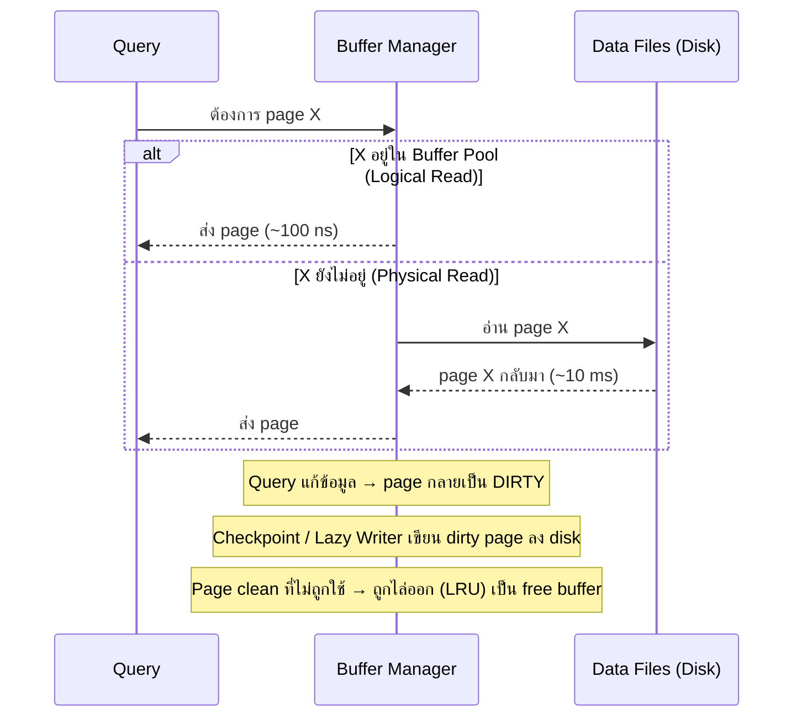
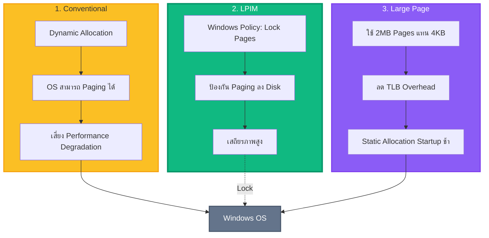
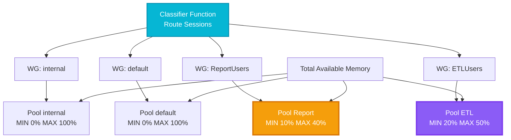

[⬅ Module 04](../../README.md) | Section 2/4 | ➡ ถัดไป: [03 Memory Pressure Diagnostics](../03_Memory_Pressure_Diagnostics/README.md)

# 4.2 SQL Server Memory — Buffer Pool, Memory Clerks และการตั้งค่าที่ต้องถูกตั้งแต่วันแรก

> *"SQL Server เป็น application ที่กิน RAM เก่งที่สุดในโลก — และมันจะกินทั้งที่มี ถ้าคุณไม่บอกขอบเขตให้มัน"*

> **ต้องรู้มาก่อน**: [Section 4.1 — Windows Memory](../01_Windows_Memory/README.md) (Physical/Virtual memory, Paging, NUMA) และภาพรวม Buffer Pool จาก [Module 1.1](../../Module_01_Architecture_Scheduling_Waits/Sections/01_Engine_Architecture_SQLOS/README.md)
> ศัพท์ใหม่ดู [Glossary](../../../Glossary.md) — Buffer Pool, Memory Clerk, PLE

## ทำไม Section นี้จึงสำคัญ

Memory คือ "สกุลเงิน" ที่ SQL Server ใช้ซื้อประสิทธิภาพ: ทุก page ที่อยู่ใน RAM คือ logical read ที่เร็ว ~1,000 เท่ากว่าการอ่านดิสก์ Section นี้เปิดฝาเครื่องให้ดูว่า SQL Server **บริหารสกุลเงินนี้อย่างไร** — ใครเป็นนายธนาคาร, ใครเป็นลูกค้ารายใหญ่, กฎระเบียบควบคุมอะไรบ้าง — เพราะ Section 4.3 (วินิจฉัย pressure) ทั้งหมดคือการอ่านบัญชีจากโครงนี้

และมีเหตุผลเชิงปฏิบัติอีกข้อ: **ตัวเลข memory จากเครื่องมือทั่วไปหลอกเราเรื่อง SQL Server เสมอ** — Task Manager ไม่นับ memory ที่ถูกล็อกด้วย LPIM, ค่า default ของ `max server memory` คือ "ไม่จำกัด" เกือบจริง และ buffer pool ที่ใช้เต็ม 100% กลับเป็นเรื่อง **ปกติและดี** ใช้ตัดสินแบบ application ทั่วไปไม่ได้

---

## 1. แผนที่ Memory ภายใน SQL Server — จาก OS ลงมาถึง Query

ศัพท์ก่อนใช้ (นิยามตามสถาปัตยกรรม 2012+):

| ศัพท์ | นิยาม |
|:------|:------|
| **Memory Manager** | ส่วนกลางของ SQLOS ที่เป็น "นายธนาคาร" — รับ memory จาก Windows แล้วแบ่งให้ component ทั้งหมดตามธรรมนูญ (พ.ร.บ. ชื่อ `max server memory`) |
| **Memory Node** | ตู้เซฟระดับ NUMA node (จาก Section 4.1) — memory ถูกจัดสรรเป็น node ไม่ใช่รวมก้อนเดียว |
| **Memory Clerk** | ตัวบัญชีประจำ component — ทุก component ที่ต้องการ memory ต้องเปิด clerk ของตัวเองแล้ว "จดบัญชี" กับ Memory Manager ทำให้เราตรวจได้ว่าใครใช้เท่าไร |
| **Memory Object** | หน่วยย่อยใน clerk เช่น cache store รายตัว, โครงสร้างภายใน |
| **Any-size Page Allocator (2012+)** | จุดเปลี่ยนสถาปัตยกรรมสำคัญ: ยุคก่อน 2012 แบ่ง allocator เป็น single-page (≤8 KB อยู่ใน buffer pool) กับ multi-page (>8 KB อยู่นอก) ทำให้ `max server memory` คุมไม่ครบ — **2012+ รวมเป็นอันเดียว ทำให้ `max server memory` คุม memory ของ SQL Server "เกือบทั้งหมด"** |

```
Windows OS
    │  VirtualAlloc / AWE-Large pages (จาก Section 4.1)
    ▼
┌─────────────────────────────────────────────────────┐
│  SQLOS Memory Manager  (ควบคุมโดย max server memory) │
│                                                     │
│  Memory Node 0 (NUMA node 0)   … Memory Node N      │
│      │                                              │
│      ├── MEMORYCLERK_SQLBUFFERPOOL  ◄── ขาใหญ่สุด   │
│      ├── CACHESTORE_SQLCP / OBJCP (Plan Cache)      │
│      ├── MEMORYCLERK_SQLQUERYEXEC (Grants/Workspace)│
│      ├── OBJECTSTORE_LOCK_MANAGER                   │
│      ├── MEMORYCLERK_SQLCONNECTIONPOOL  … ฯลฯ       │
└─────────────────────────────────────────────────────┘
```

หลักการอ่านที่ใช้ตลอด section นี้: **"ทุกไบต์ที่ SQL Server ใช้มี clerk จดบัญชีไว้"** — เครื่องมือหลักคือ `sys.dm_os_memory_clerks`

---

## 2. Target vs Committed — ธรรมชาติ "Dynamic" ของ Memory SQL Server

SQL Server **ไม่กิน RAM เท่าที่ตั้งไว้ตั้งแต่บูต** มันค่อย ๆ โต (ramp-up) และพร้อมคืนเมื่อถูกกด กลไกควบคุมคือสองค่านี้:

| ค่า | ความหมาย | อ่านจาก |
|:----|:---------|:--------|
| **Target Memory** | เป้าหมายที่ engine "ตั้งใจ" ใช้ — คำนวณจาก RAM ของเครื่อง, `max server memory`, และสัญญาณจาก OS | PerfMon `Target Server Memory (KB)` |
| **Committed (Total) Memory** | ที่ "ขอ OS มาได้จริง" ณ ขณะนั้น | PerfMon `Total Server Memory (KB)` |

พฤติกรรม:

- **Committed < Target** = ช่วง ramp-up (หรือ OS กำลังกด) — SQL จะทยอยขอเพิ่มเมื่อมี workload
- **Committed = Target** = สมดุล — **สภาวะปกติของ production** ไม่ใช่สัญญาณ pressure
- Windows ยิงสัญญาณ low memory → Resource Monitor ลด target และ trim caches (กลไกเต็มรูปแบบใน Section 4.3)

```sql
-- เป้าหมาย vs ใช้จริง + พื้นที่จัดสรรให้ sort/hash (Workspace)
SELECT CAST(cntr_value / 1024.0 / 1024.0 AS DECIMAL(8,2)) AS value_gb,
       counter_name
FROM sys.dm_os_performance_counters
WHERE counter_name IN ('Target Server Memory (KB)', 'Total Server Memory (KB)')
UNION ALL
SELECT CAST(cntr_value / 1024.0 AS DECIMAL(8,2)) AS value_mb,
       counter_name
FROM sys.dm_os_performance_counters
WHERE counter_name IN ('Granted Workspace Memory (KB)',
                       'Maximum Workspace Memory (KB)',
                       'Memory Grants Pending',
                       'Memory Grants Outstanding',
                       'Free list stalls/sec')
ORDER BY counter_name;
```

**Expected (รันจริงบนเซิร์ฟเวอร์หลักสูตร เพิ่ง restart):** `Target Server Memory ≈ 12.85 GB` (เป้าเต็มตาม RAM 16 GB), `Total Server Memory ≈ 0.87 GB` — ต่างกันมากเพราะยังไม่มี workload มาแตะ buffer pool (ramp-up ยังไม่เกิด); `Maximum Workspace Memory ≈ 9.66 GB` (พื้นที่เตรียมไว้ให้ memory grant), `Memory Grants Pending = 0` (ไม่มีใครรอ grant — ค่านี้ต่อเนื่อง > 0 คือสัญญาณ `RESOURCE_SEMAPHORE`), `Free list stalls/sec = 0` (ไม่มี query รอ free page)

> [!IMPORTANT]
> **"Buffer pool ใช้เต็ม" ≠ ปัญหา** — SQL Server ออกแบบให้กิน memory ที่ได้มาทั้งหมดเพื่อแคชให้มากที่สุด ตัวชี้วัดปัญหาคืออาการข้างเคียง (PLE ตก, grants pending, free list stalls) ไม่ใช่การใช้จนเต็มเป้า

---

## 3. Buffer Pool — Data Cache ก้อนใหญ่ที่สุดและวงจรชีวิตของ Page

**Buffer** คือหน่วยจำของ buffer pool — โครงสร้างใน memory ขนาด **8 KB เท่ากับ page ของ SQL Server เป๊ะ** และ **Buffer Pool** คือคอลเลกชันของ buffer ทั้งหมดที่ทำหน้าที่เป็น cache กลางของ data/index pages

ศัพท์ก่อนใช้:

- **Clean page** — page ที่ตรงกับข้อมูลบนดิสก์ (อ่านมาแล้วไม่ถูกแก้) — ทิ้งได้ปลอดภัยทุกเมื่อ
- **Dirty page** — page ที่ถูกแก้ใน memory แล้วแต่ **ยังไม่ได้เขียนลงดิสก์** — ทิ้งไม่ได้จนกว่าจะเขียน (เดี๋ยวข้อมูลหาย!)
- **Free buffer** — buffer เปล่ารอรับ page ใหม่ — ถ้าหมด ต้องมีคนไล่ page เก่าออกก่อน
- **LRU (Least Recently Used)** — นโยบาย "ไล่ตัวที่ไม่ค่อยถูกใช้" ของ buffer pool

### วงจรชีวิตของหนึ่ง page



ตัวขับเคลื่อนวงจรมีสอง background ที่คนสับสนบ่อยที่สุด:

| | **Checkpoint** | **Lazy Writer** |
|:--|:---------------|:----------------|
| ทำงานเมื่อไร | เป็นระยะ ๆ / เมื่อ log เต็มตาม recovery interval (หรือ indirect checkpoint ที่ตั้งต่อ DB) | เมื่อ **free buffer ใกล้หมด** (SQL กดดัน memory ตัวเอง) |
| เขียนอะไร | dirty pages ลง disk | dirty pages ลง disk |
| ได้อะไรกลับ | **ไม่ปล่อย page** — page ยังค้างใน cache ให้ใช้ต่อ (แค่เปลี่ยนเป็น clean) | **ปล่อย page ออก** (LRU) เพื่อสร้าง free buffer |
| เป้าหมาย | ลด recovery time ตอน restart (ไม่ต้อง redo log เยอะ) | รักษา supply ของ free pages |
| สัญญาณเมื่อเห็นบ่อย | ปกติ | **โดนกลั่นแฝงว่า memory ไม่พอ** — คู่กับ PLE ตก |

**ทดลองเห็นตัวจริง** — เขียนข้อมูลให้เกิด dirty page แล้วสั่ง CHECKPOINT:

```sql
USE tempdb;
GO
DROP TABLE IF EXISTS #DirtyDemo;
CREATE TABLE #DirtyDemo (id INT IDENTITY PRIMARY KEY CLUSTERED, filler CHAR(700) NOT NULL DEFAULT 'page-lifecycle');
INSERT #DirtyDemo (filler) SELECT TOP (5000) 'page-lifecycle' FROM sys.all_objects AS a CROSS JOIN sys.all_objects AS b;
GO
DECLARE @au TABLE (au_id BIGINT);
INSERT @au SELECT allocation_unit_id FROM tempdb.sys.allocation_units
WHERE container_id IN (SELECT partition_id FROM tempdb.sys.partitions WHERE object_id = OBJECT_ID('tempdb..#DirtyDemo'));
SELECT 'before_checkpoint' AS phase, COUNT_BIG(*) AS dirty_pages
FROM sys.dm_os_buffer_descriptors
WHERE database_id = 2 AND is_modified = 1 AND allocation_unit_id IN (SELECT au_id FROM @au);
CHECKPOINT;
SELECT 'after_checkpoint' AS phase, COUNT_BIG(*) AS dirty_pages
FROM sys.dm_os_buffer_descriptors
WHERE database_id = 2 AND is_modified = 1 AND allocation_unit_id IN (SELECT au_id FROM @au);
GO
DROP TABLE IF EXISTS #DirtyDemo;
GO
```

**Expected (รันจริงบนเซิร์ฟเวอร์หลักสูตร):** `before_checkpoint = 460` dirty pages → `after_checkpoint = 0` — CHECKPOINT เขียน dirty page ลง disk ครบ แต่ page เหล่านั้น **ยังอยู่ใน buffer pool** (เปลี่ยนจาก dirty เป็น clean เท่านั้น) สังเกตว่า query นับใช้ `sys.dm_os_buffer_descriptors` (หนึ่งแถวต่อหนึ่ง buffer) — เครื่องมือหลักดูว่า "ใครกิน cache" ใน Section 4.3

> [!NOTE]
> อัตราส่วน cache hit ที่ใช้กัน (`Buffer cache hit ratio` จาก `sys.dm_os_performance_counters` — ต้องหารด้วย `...base` ก่อนเสมอ) บน OLTP ปกติจะติด 99%+ — รันจริงบนเครื่องหลักสูตรได้ 100% เพราะ workload วนอยู่กับข้อมูลชุดเล็ก ค่านี้จึงใช้จับ "การทรุดครั้งใหญ่" เท่านั้น ไม่ใช่ตัววัดละเอียด

---

## 4. Other Memory Clerks — บัญชีฉบับเต็มว่าใครใช้อะไร

Buffer pool เป็นขาใหญ่ แต่ไม่ใช่คนเดียวในบ้าน — query นี้จัดอันดับบัญชีทั้งหมด:

```sql
SELECT TOP (10) type,
       pages_kb / 1024.0 AS pages_mb,
       virtual_memory_committed_kb / 1048576.0 AS vm_committed_gb,
       awe_allocated_kb / 1024.0 AS awe_mb
FROM sys.dm_os_memory_clerks
ORDER BY pages_kb DESC;
```

**Expected (รันจริงบนเซิร์ฟเวอร์หลักสูตร):** อันดับ 1 = `MEMORYCLERK_SQLBUFFERPOOL` ~333 MB, อันดับ 2 = `CACHESTORE_SQLCP` ~103 MB, ตามด้วย `MEMORYCLERK_SOSNODE` ~61 MB, `CACHESTORE_PHDR` ~48 MB, `MEMORYCLERK_SQLCLR` ~12 MB, `MEMORYCLERK_XTP` ~11 MB — เครื่องว่าง ค่าสัมบูรณ์น้อย ให้อ่าน **สัดส่วน "ใครใหญ่ที่สุด"** มากกว่าตัวเลขเด็ดขาด

ศัพท์ clerk ที่เจอบ่อยควรจำ:

| Clerk | ดูแลอะไร | เมื่อไรที่โตผิดปกติ |
|:------|:---------|:-------------------|
| `MEMORYCLERK_SQLBUFFERPOOL` | data/index cache | ปกติต้องเป็นอันดับ 1 เสมอ |
| `CACHESTORE_SQLCP` | plan ของ ad-hoc / parameterized statements | **plan cache bloat** จาก workload ที่ส่ง SQL ต่างกันล้าน ๆ แบบ (Module 8 — Optimize for Ad hoc Workloads) |
| `CACHESTORE_OBJCP` | plan ของ proc/function/trigger | schema แก้บ่อย / proc จำนวนมาก |
| `CACHESTORE_PHDR` | parse tree ของ views/constraints | ระบบที่ใช้ view หนัก |
| `MEMORYCLERK_SQLQUERYEXEC` | runtime ของ query เช่น sort/hash ระดับ low | sort ใหญ่ ๆ จำนวนมาก |
| `OBJECTSTORE_LOCK_MANAGER` | โครงสร้าง lock | transaction ยาว + lock มหาศาล (Module 5) |
| `MEMORYCLERK_SQLCONNECTIONPOOL` | context ของ connection | connection leak จาก application |
| `MEMORYCLERK_XTP` | In-Memory OLTP (Section 4.4) | มี memory-optimized table ใช้งานจริง |
| `MEMORYCLERK_SQLVERSIONSTORE` / PVS | row versions | RCSI เปิด + transaction ยาว (Section 4.3 หัวข้อ PVS) |

> [!TIP]
> เห็น `CACHESTORE_SQLCP` แย่งอันดับ 1 จาก buffer pool = ตำหนิที่ต้องไปต่อที่ Module 8 (Plan Cache) ทันที — และจำไว้ว่า **ผลรวม pages_kb ของ clerks ไม่ควรยาวเกิน `max server memory`** ถ้ายาว แสดงว่ามี allocation ที่หลุดจากกฎ (เช่น DLL ภายนอก) ให้สืบต่อ

---

## 5. Memory Grants — Workspace Memory สำหรับ Sort/Hash

**Memory Grant** คือ memory ที่ engine "ยืม" ให้ query หนึ่งใช้ระหว่างรัน สำหรับ operator ที่ต้องการพื้นที่ทำงาน (**workspace**): Sort, Hash Match, bulk insert บางประเภท จุดสำคัญ:

- Grant ถูก "จองก่อนรัน" ตามการประเมินของ optimizer (คู่กับ Statistics — Module 6) → ประเมินพลาด = grant เกิน (overgrant) หรือขาด (→ **spill** ลง tempdb)
- Memory สำหรับ grants ถูกกันไว้ใน **Workspace Memory** (counter `Maximum Workspace Memory` ในหัวข้อ 2) — เป็นส่วนแบ่งของ buffer pool ไม่ใช่ก้อนแยก
- มี **resource semaphore** สองตัวคุยกันที่ประตู: ตัวคุม grant เล็ก (`is_small` = 1) กับตัวคุม grant ใหญ่ — query เข้าคิวรอเมื่อของไม่พอ อาการคือ wait `RESOURCE_SEMAPHORE` (วินิจฉัยเต็มรูปแบบใน Section 4.3)

ดู grant "สด ๆ" ขณะรันได้จาก `sys.dm_exec_query_memory_grants` — query ด้านล่างรอจับ grant ที่กำลังเกิดขึ้น (จับคู่กับ workload หนักในอีก session หรือรันคู่กับ Lab 4 Exercise 3):

```sql
-- รันไว้ระหว่างมี query sort/hash ขนาดใหญ่กำลังทำงานอยู่
-- (ถ้า instance ว่าง จะได้ผลลัพธ์ว่าง = ปกติ)
DECLARE @i INT = 0, @found BIT = 0;
WHILE @i < 40 AND @found = 0
BEGIN
    IF EXISTS (SELECT 1 FROM sys.dm_exec_query_memory_grants)
    BEGIN
        SELECT g.session_id, g.requested_memory_kb, g.granted_memory_kb,
               g.required_memory_kb, g.used_memory_kb, g.max_used_memory_kb,
               g.ideal_memory_kb, g.wait_time_ms, g.dop
        FROM sys.dm_exec_query_memory_grants AS g;
        SET @found = 1;
    END
    ELSE
    BEGIN
        WAITFOR DELAY '00:00:00.25';
        SET @i += 1;
    END
END
IF @found = 0 PRINT 'NO ACTIVE GRANT (empty result = ไม่มี query ที่ได้ grant อยู่ ณ ขณะนี้)';
```

**Expected (จับได้จริงบนเซิร์ฟเวอร์หลักสูตรขณะรัน sort 332 MB):** `requested_memory_kb = 117,456`, `granted_memory_kb = 117,456` (ของว่างจึงจ่ายเต็มตามขอ), `required_memory_kb = 512` (ขั้นต่ำที่ต้องมีก่อนรันได้), `used_memory_kb / max_used_memory_kb = 65,392` (**ใช้จริง ~57% ของที่ขอ — ภาพ overgrant แบบเห็นตัว**), `ideal_memory_kb = 269,232` (ที่ optimizer อยากได้แบบไม่เจอ spill), `dop = 1`

> [!IMPORTANT]
> ทั้งหมดนี้คือเหตุผลที่ Memory Grant Feedback (IQP, 2017+) มีค่า: มันจดว่า "ใช้จริงเท่าไร" แล้วปรับ grant ของรอบถัดไปให้เข้าใกล้ความจริงทั้งสองทิศ — พิสูจน์ด้วยตัวเลขจริง 667 MB → 18 MB ใน [Lab 4 Exercise 3](../../Labs/README.md) และวิธีอ่านบน SQL Server 2025 ใน Section 4.3

---

## 6. Configuration Best Practices — min / max server memory

สองการตั้งค่านี้คือ "ธรรมนูญ" ที่ Memory Manager ใช้:

- **`max server memory (MB)`** — เพดานของ memory ที่ SQL Server จัดสรรได้ (นับรวม buffer pool, plan cache, grants, CLR ฯลฯ เพราะ 2012+) **ค่า default คือ 2,147,483,647 MB** = ในทางปฏิบัติคือ "ไม่จำกัด" — อันตรายเพราะ SQL จะกิน RAM จน OS อดแล้ว paging ถล่มทั้งเครื่อง
- **`min server memory (MB)`** — ขั้นต่ำที่ SQL Server "จะพยายามรักษาไว้" เมื่อถูกกดให้คืน memory ใช้บนเครื่องที่แชร์กับ process อื่น เพื่อไม่ให้ SQL ถูก trim จนแทบไม่มี cache เหลืออยู่

**สิ่งที่ `max server memory` ไม่ครอบคลุม** (ต้องเผื่อจากสูตร):

| รายการ | ขนาดโดยประมาณ |
|:--------|:---------------|
| Thread stacks ของ workers | ~0.5–2 MB × `max_workers_count` (เช่น 512 × 2 MB ≈ 1 GB) |
| DLL / COM ภายนอกที่จองโดยตรง | แปรผัน — สืบด้วย `virtual_memory_committed_kb` ของ clerks |
| ตัว SQL Server เอง (exe, โครงสร้างคงที่) | หลักร้อย MB |

**แนวทางตั้งต้นบนเครื่อง dedicated** (ต้อง monitor ต่อ — ไม่ใช่ตั้งแล้วลืม):

| Total RAM | `max server memory` เริ่มต้นแนะนำ |
|:----------|:-----------------------------------|
| 8 GB | 5–6 GB |
| 16 GB | 11–12 GB |
| 32 GB | 25–26 GB |
| 64 GB | 56–58 GB |
| 128 GB+ | Total − 8–12 GB (ยิ่ง RAM ใหญ่ สัดส่วนที่เหลือให้ OS ยิ่งน้อยแต่ค่าสัมบูรณ์ยังใหญ่) |

ทั้งสองค่าเป็น **dynamic** (แก้แล้วมีผลทันที ไม่ต้อง restart) — ตรวจค่าปัจจุบัน:

```sql
SELECT name, value_in_use, minimum, maximum, is_dynamic
FROM sys.configurations
WHERE name IN ('min server memory (MB)', 'max server memory (MB)',
               'min memory per query (KB)', 'index create memory (KB)');
```

**Expected (รันจริงบนเซิร์ฟเวอร์หลักสูตร):** `max server memory (MB) = 2,147,483,647` (**ยังเป็น default บนเครื่อง lab — ชี้ให้เห็นว่า target 12 GB ที่เห็นในหัวข้อ 2 คือ engine คำนวณเองจาก RAM ตามกลไก dynamic**), `min server memory (MB) = 16`, `min memory per query (KB) = 1024`, `index create memory (KB) = 0` (auto) ทุกแถว `is_dynamic = 1`

> [!WARNING]
> บนเซิร์ฟเวอร์ production **ห้ามปล่อย default** — สัญญาณอาการคลาสสิกของเครื่องที่ลืมตั้ง: PLE ราวสิบวินาที, ตัว server ช้าหนักทั้งเครื่อง, RDP เข้าไม่ไหว, และ `Memory: Available MBytes` ต่ำเกิน ~200 MB — พร้อมกับ SQL กิน RAM แทบทั้งเครื่อง

---

## 7. Memory Models — Conventional / LPIM / Large Pages

สาม "โหมด" ที่ memory ของ SQL Server มีต่อ Windows (สืบจากเรื่อง paging ใน Section 4.1):



| โหมด | คืออะไร | ข้อดี | ข้อควรระวัง |
|:-----|:--------|:------|:------------|
| **Conventional** | มาตรฐาน — page ของ SQL อยู่ใน working set ปกติของ Windows | จัดการง่าย ยืดหยุ่น | OS trim ได้ (Section 4.1) |
| **LPIM (Lock Pages in Memory)** | สิทธิ์ Windows ("Lock pages in memory") ที่มอบให้ service account ของ SQL — page ที่ล็อกแล้ว **ห้าม OS นำไป page file** | กัน external trim จึงเสถียร (สำคัญกับเครื่องแชร์/RAM ใหญ่) | ไม่กัน pressure ภายในของ SQL เอง — **`max server memory` ยังจำเป็น**; ถ้าลืมตั้ง อาจล็อก RAM จน OS อด |
| **Large Pages** | buffer pool จอง page 2 MB ของ CPU (แทน 4 KB) | ลดจำนวน entry ใน **TLB** (translation cache ของ CPU) — เห็นผลกับ buffer pool ขนาดมหาศาล | จองแบบ **static ตอน startup** → เปิด service ช้า; ต้องมีสิทธิ์ LPIM ด้วย; SQL เปิดใช้เองอัตโนมัติเมื่อเงื่อนไขครบ (บัญชีเป็นส่วนหนึ่งของ locked pages) |

ตรวจว่าเครื่องเราใช้โหมดไหน — `sys.dm_os_process_memory` รายงานตรง:

```sql
SELECT physical_memory_in_use_kb / 1048576.0 AS sql_in_use_gb,
       locked_page_allocations_kb / 1048576.0 AS locked_pages_gb,  -- LPIM
       large_page_allocations_kb  / 1048576.0 AS large_pages_gb,   -- ส่วนย่อยของ locked
       memory_utilization_percentage AS mem_util_pct
FROM sys.dm_os_process_memory;
```

**Expected (รันจริงบนเซิร์ฟเวอร์หลักสูตร):** `locked_pages_gb = 0` และ `large_pages_gb = 0` — โหมด Conventional (ยังไม่มอบสิทธิ์ LPIM ให้ service account) เมื่อเปิด LPIM สำเร็จ ค่า `locked_pages_gb` จะขึ้นและครอบคลุมเกือบทั้ง `sql_in_use_gb` (ยืนยันอีกชั้นด้วย `DBCC MEMORYSTATUS` — หัวข้อ Memory Manager: AWEAllocated)

> [!NOTE]
> หลังเปิด LPIM อย่าใช้ Task Manager ตัดสิน memory ของ SQL อีกต่อไป (locked pages ไม่ถูกนับ — ตารางใน Section 4.1) ให้ใช้ `sys.dm_os_process_memory` หรือ PerfMon `SQL Server: Memory Manager: Total Server Memory (KB)` แทน

---

## 8. Resource Governor — ตอนที่ "ธรรมนูญเดียว" ไม่พอ

`max server memory` คุม **รวม** ทั้ง instance แต่ไม่บังคับว่า "ใครใช้เท่าไร" — เมื่อ workload หลายประเภทแย่งกัน (OLTP ต้องตอบไว vs report หนักกิน sort ใหญ่) เครื่องมือที่มาแก้คือ **Resource Governor** (Enterprise เท่านั้น):

- **Classifier Function** — ฟังก์ชันที่คุณเขียน จัด session ใหม่เข้า **Workload Group** ตามเงื่อนไข (login, application, role)
- **Workload Group → Resource Pool** — แต่ละ pool กำหนดโควต้า `MIN_MEMORY_PERCENT` / `MAX_MEMORY_PERCENT` (และ CPU/I/O) — MIN กันค่าส่วนแบ่งขั้นต่ำ MAX กันเพดาน เทียบกับ "memory ทั้งหมดที่ instance มี"
- Use case คลาสสิก: ป้องกัน report/ETL ขนาดใหญ่แย่ง grant จน OLTP ติด `RESOURCE_SEMAPHORE`



> [!TIP]
> ทุก session ใน `sys.dm_exec_query_memory_grants` (หัวข้อ 5) รายงาน `pool_id` — บนเครื่องที่เปิด Resource Governor แล้วคุณจะแยก grant ของแต่ละ pool ได้ทันที (query `sys.dm_resource_governor_resource_pools` คู่กัน) — บนเครื่องหลักสูตรยังไม่เปิดใช้ จึงเห็นแต่ pool default

---

## สรุป Section 2

1. **Memory Manager + Memory Clerks** คือโครงบัญชีของ SQL Server — อ่านด้วย `sys.dm_os_memory_clerks` และใช้หลัก "สัดส่วน > ค่าสัมบูรณ์"
2. **Target vs Committed** อธิบายพฤติกรรม dynamic: ramp-up เมื่อมีงาน, trim เมื่อ OS กด — ใช้เต็มเป้าไม่ใช่ปัญหา
3. **Buffer Pool = cache 8 KB** — dirty page ต้องเขียนก่อนทิ้ง: **Checkpoint** (เขียนเพื่อลด recovery, ไม่ปล่อย page) ต่างจาก **Lazy Writer** (เขียนแล้ว evict เมื่อ memory ตึง)
4. **Memory Grants** จองล่วงหน้าตามการประมาณ — เกิน = สิ้นเปลือง, ขาด = spill — ดูสดได้จาก `sys.dm_exec_query_memory_grants`
5. **`max server memory` คือการตั้งค่าบังคับบน production** — default = ไม่จำกัด; คุมเกือบทุกอย่าง (2012+) ยกเว้น thread stacks ฯลฯ
6. **LPIM กัน external paging / Large Pages ลด TLB overhead** — ตรวจด้วย `locked_page_allocations_kb`; Resource Governor คือชั้นถัดไปเมื่อต้องแบ่งตาม workload

### ตรวจความเข้าใจ

1. ค่า `Total Server Memory (KB)` เท่ากับ `Target Server Memory (KB)` แล้ว — แปลว่าเกิด memory pressure หรือยัง? อะไรคือตัวชี้วัดที่ควรดูต่อ?
2. Checkpoint กับ Lazy Writer ต่างกันที่ "สิ่งที่ได้กลับมา" อย่างไร และเหตุใด page หลัง CHECKPOINT จึงยังค้างใน cache?
3. เหตุใด `CACHESTORE_SQLCP` ที่โตแซง `MEMORYCLERK_SQLBUFFERPOOL` จึงเป็นสัญญาณไปที่ Module 8 มากกว่าไปที่ memory config?
4. Query หนึ่ง `requested_memory_kb = 117,456` แต่ `used_memory_kb = 65,392` — เรียกปรากฏการณ์นี้ว่าอะไร ใครเป็นตัวแก้ในรอบถัดไป และด้วยกลไกใด?
5. สูตรตั้ง `max server memory` บนเครื่อง 64 GB ที่รัน SQL เดี่ยวคืออะไร และมีรายการใดบ้างที่ "ไม่ถูกคุม" โดยค่านี้?
6. เปิด LPIM แล้ว Task Manager โชว์ SQL Server ใช้ 2 GB ทั้งที่ DMV บอก 100 GB — เกิดอะไรขึ้น และควรใช้เครื่องมือใดแทน?

**➡ ถัดไป:** [Section 4.3 — Memory Pressure Diagnostics](../03_Memory_Pressure_Diagnostics/README.md)

---

[⬅ Module 04](../../README.md) | [🧪 Labs](../../Labs/README.md) | ➡ [03 Memory Pressure Diagnostics](../03_Memory_Pressure_Diagnostics/README.md)
