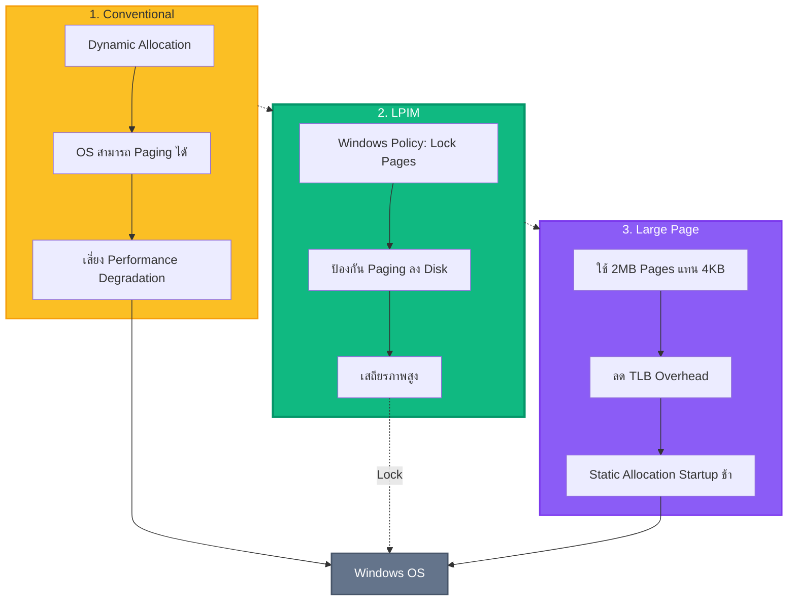
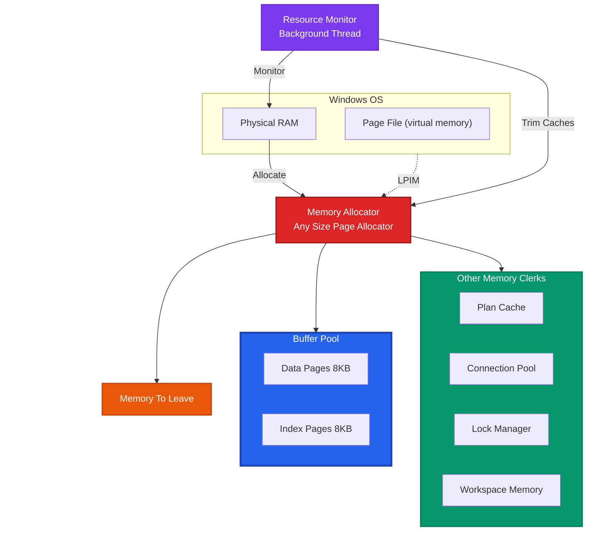
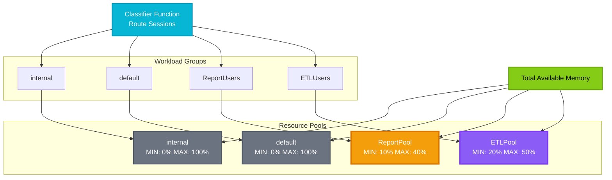
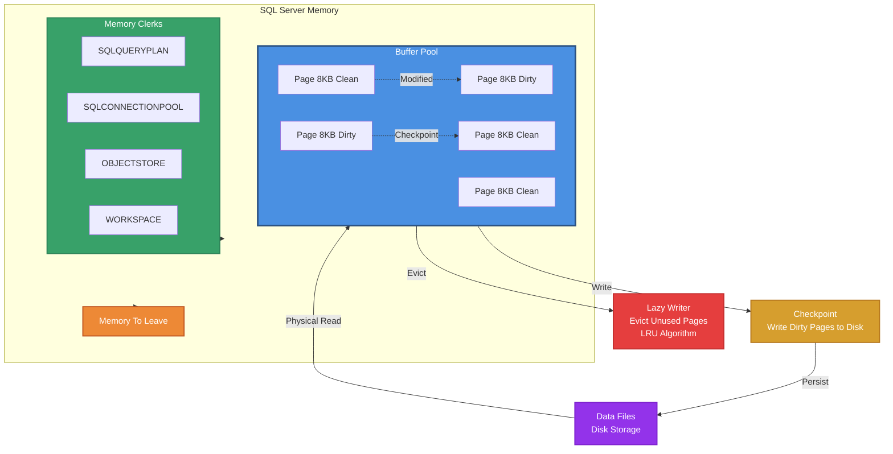
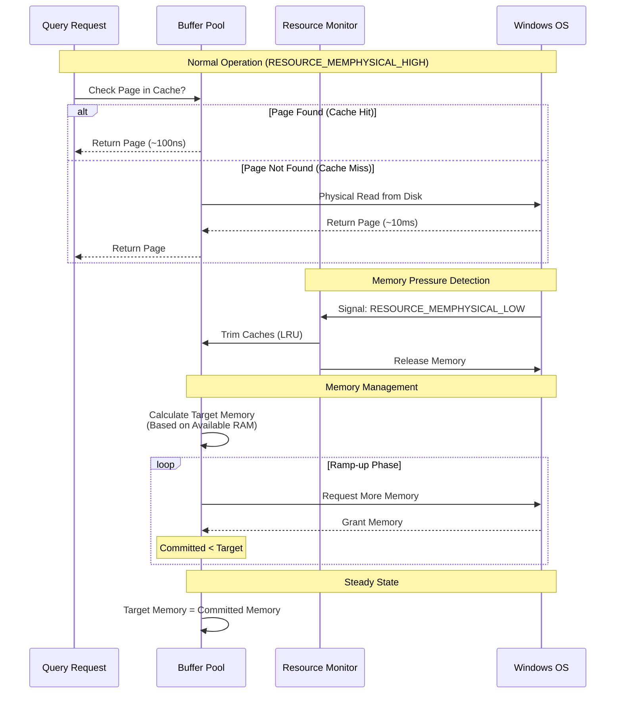

[⬅ Module 4_](../../README.md) | Section 2/4 | ➡ ถัดไป: [Memory Pressure Diagnostics](../03_Memory_Pressure_Diagnostics/README.md)

## SQL Server Memory (Lesson 2)

### 3.1 Memory Models

**รายละเอียด:**
1.  **Conventional Memory Model**: รูปแบบมาตรฐาน (Dynamic Allocation) OS สามารถทำ Paging ได้
2.  **Locked Memory Model (LPIM)**: การกำหนดสิทธิ์ **Lock Pages in Memory**
    *   ป้องกันไม่ให้ Windows นำ SQL Server Memory ไปทำ Paging ลง Disk
    *   *Recommendation*: ควรเปิดใช้งานเสมอสำหรับ Production Server เพื่อเสถียรภาพ
3.  **Large Page Memory Model**: การใช้ Memory Page ขนาดใหญ่ (2MB) แทนขนาดปกติ (4KB)
    *   *Benefit*: ลด Overhead ของ Translation Look-aside Buffer (TLB)
    *   *Drawback*: ต้องจองพื้นที่ทั้งหมดตั้งแต่ Startup (Static Allocation) อาจทำให้เปิด Service ช้า

### 3.2 SQL Server Memory Architecture

**โครงสร้างหลัก:**
*   **Memory Allocator**: ตัวจัดการการของหน่วยความจำจาก OS
*   **Memory Clerks**: ส่วนประกอบที่ทำหน้าที่ดูแลหน่วยความจำแต่ละประเภท
    *   *SQLBUFFERPOOL*: จัดการ Data Pages (Cache หลัก)
    *   *SQLQUERYPLAN*: จัดการ Plan Cache
    *   *SQLCONNECTIONPOOL*: จัดการ Connection Context
*   **Memory To Leave (MTL)**: พื้นที่หน่วยความจำที่ SQL Server เว้นไว้สำหรับ Process ภายนอก Loop (Non-BPool)

### 3.3 Configuration Best Practices
*   **Min Server Memory**: ค่าต่ำสุดที่ SQL Server จะรักษาไว้ (Reserve) -> จะไม่คืน memory ให้ OS ถ้าต่ำกว่าค่านี้
*   **Max Server Memory**: ค่าสูงสุดที่ SQL Server สามารถใช้งานได้ (Buffer Pool & Caches) -> **Critical Setting**
    *   *Calculation*: Total RAM - (OS Reserved + Other Applications)
    *   *Note*: ไม่ครอบคลุม Thread Stacks และ CLR allocations บางส่วน

---

### 3.4 Resource Governor

เครื่องมือสำหรับจำกัดและจัดสรรทรัพยากร (CPU, Memory, I/O) ให้กับ Workload แต่ละประเภท
*   **Workload Group**: กลุ่มของผู้ใช้งาน (เช่น Report Users, Data Load Users)
*   **Resource Pool**: การกำหนดโควต้าทรัพยากร (MIN/MAX Usage)
    *   *Use Case*: ป้องกันไม่ให้ Report ขนาดใหญ่แย่ง Memory จนกระทบต่อระบบ Transaction หลัก

### 3.5 Buffer Pool (The Cache)

**Buffer Pool** คือพื้นที่ใน Memory ที่ SQL Server ใช้เก็บ **Data Pages** (หน่วยข้อมูลขนาด 8KB) ที่อ่านมาจาก Disk เพื่อลดการเข้าถึง Disk ซ้ำๆ

> **ทำไมสำคัญ?** การอ่านจาก Memory (~100 ns) เร็วกว่า Disk (~10 ms) ประมาณ **100,000 เท่า** ดังนั้น "ยิ่งข้อมูลอยู่ใน Buffer Pool มากเท่าไร ยิ่งเร็ว"

**สถาปัตยกรรม Buffer Pool:**

**กระบวนการทำงาน:**
*   **Page Request**: เมื่อ Query ต้องการข้อมูล → ตรวจสอบ Buffer Pool ก่อน → ถ้าไม่มี → อ่านจาก Disk (Physical Read)
*   **Lazy Writer**: เมื่อ Memory เริ่มเต็ม จะลบ Page ที่ไม่ได้ใช้นานออก (LRU Algorithm)
*   **Checkpoint**: บันทึก Dirty Pages (หน้าที่ถูกแก้ไขแล้ว) ลง Disk เป็นระยะ

### 3.6 Other Memory Clerks
นอกจาก Buffer Pool แล้ว ยังมีการใช้ Memory ในส่วนอื่นๆ:
*   **CACHESTORE_SQLCP**: Plan Cache (เก็บ Execution Plans)
*   **OBJECTSTORE_LOCK_MANAGER**: เก็บโครงสร้าง Lock (Lock Structures)
*   **MEMORYCLERK_SQLCONNECTIONPOOL**: เก็บ Connection objects
*   **WORKSPACE_MEMORY_GRANT**: พื้นที่สำหรับ Query Operation (Sort/Hash)

### 3.7 Deep Dive: Memory Management Internals (from Architecture Guide)
ข้อมูลเชิงลึกสำหรับการจัดการหน่วยความจำของ SQL Server ยุคใหม่ (SQL 2012+):

1.  **"Any Size" Page Allocator**:
    *   *Legacy (Pre-2012)*: แยกจัดการระหว่าง Single-Page (<=8KB) และ Multi-Page (>8KB) โดย Max Server Memory คุมแค่ Single-Page
    *   *Modern*: รวมทุก Allocator เข้าด้วยกัน ดังนั้น **Max Server Memory** จึงควบคุมการใช้ Memory เกือบทั้งหมดของ SQL Server (รวม CLR, Multi-Page)
    
2.  **Memory Pressure Detection (Resource Monitor)**:
    *   SQL Server มี Background Thread ชื่อ **Resource Monitor** คอยตรวจสอบสัญญาณหน่วยความจำจาก Windows:
        *   `RESOURCE_MEMPHYSICAL_HIGH`: สภาวะปกติ -> ขยาย Memory ได้เต็มที่
        *   `RESOURCE_MEMPHYSICAL_LOW`: ระบบขาดแคลน Memory -> SQL Server จะเริ่ม **Trim Caches** และคืน Memory ให้ OS
        *   `RESOURCE_MEMPHYSICAL_STEADY`: ทรงตัว
        
        > [!TIP]
        > ดูประวัติการทำงานของ Resource Monitor ได้ด้วย Script:
        > `../03_Memory_Pressure_Diagnostics/Scripts/04_Resource_Monitor_Ring_Buffer.sql`

3.  **Dynamic Memory Management**:

**หลักการทำงาน:**
    *   SQL Server ปรับขนาด Memory อัตโนมัติ โดยดูจาก **Target Memory** (เป้าหมายที่อยากได้) vs **Committed Memory** (ที่ขอ OS มาได้จริง)
    *   *Ramp-up*: ช่วงเริ่มต้น Service ที่จะทยอยขอ Memory จนถึง Target

---

---

[⬅ ก่อนหน้า](../../README.md) | [Module 4_ README](../../README.md) | ➡ ถัดไป: [Memory Pressure Diagnostics](../03_Memory_Pressure_Diagnostics/README.md) | [🧪 Labs](../../Labs/README.md)
