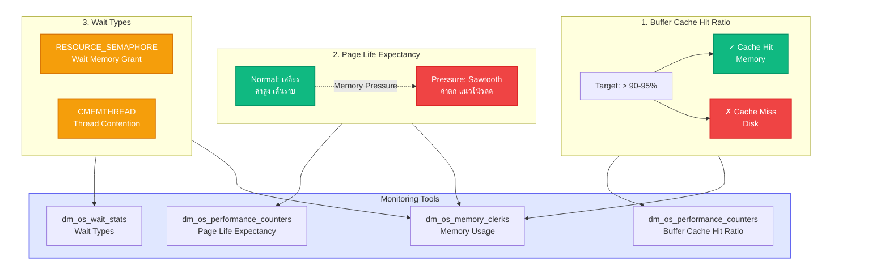

[⬅ Module 4_](../../README.md) | Section 3/4 | ➡ ถัดไป: [In Memory OLTP](../04_In_Memory_OLTP/README.md)

## Investigating Memory Pressure

### 4.1 Key Indicators

**รายละเอียด:**
1.  **Buffer Cache Hit Ratio**: อัตราการอ่านข้อมูลได้จาก Cache (ควร > 90-95% สำหรับ OLTP)
2.  **Page Life Expectancy (PLE)**: ค่าเฉลี่ยเวลาที่ Page อยู่ใน Memory (Unit: วินาที)
    *   *Trend*: หากค่าลดลงอย่างรวดเร็ว (Sawtooth pattern) บ่งชี้ถึงแรงกดดันด้าน Memory (Memory Pressure)
3.  **Wait Types**:
    *   `RESOURCE_SEMAPHORE`: Query ต้องรอ Memory Grant (Sort/Hash Workload มีมากเกินไป)
    *   `CMEMTHREAD`: การแย่งชิงเข้าถึง Memory Object (Thread Safety contention)

### 4.2 Modern Memory Feedback (SQL 2019/2022)
*   **Memory Grant Feedback**: SQL Server สามารถจดจำปริมาณ Memory ที่ Query เคยใช้จริง และปรับขนาด Grant ในครั้งถัดไปให้เหมาะสม (ลด Spill / ลด Wasted Memory)
*   **Persistence (SQL 2022)**: ข้อมูล Feedback ถูกบันทึกลง Query Store ทำให้จำค่าได้แม้ Restart Server

---

---

[⬅ ก่อนหน้า](../../README.md) | [Module 4_ README](../../README.md) | ➡ ถัดไป: [In Memory OLTP](../04_In_Memory_OLTP/README.md) | [🧪 Labs](../../Labs/README.md)
