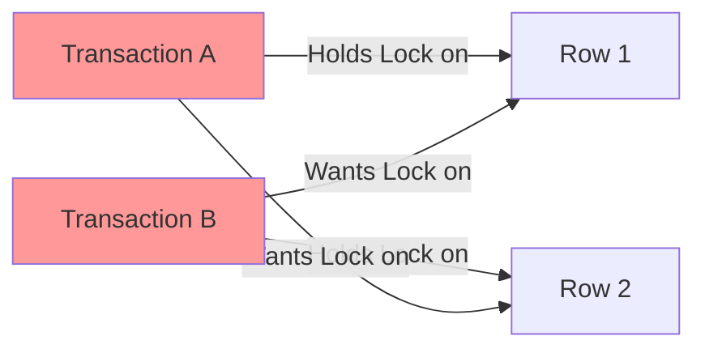

[⬅ Module 5_](../../README.md) | Section 2/3 | ➡ ถัดไป: [ADR Optimized Locking 2025](../03_ADR_Optimized_Locking_2025/README.md)

## Locking Internals (Lesson 2)

### 3.1 Locking Architecture
*   **Lock Manager**: กลไกภายใน (Internal Mechanism) ทำหน้าที่จัดการสถานะของ Lock ทั้งหมดในระบบ
*   **Lock Granularity**: ระดับความละเอียดของการ Lock (Hierarchy)
    *   *RID*: Row Identifier (สำหรับ Heap)
    *   *KEY*: Lock ที่ระดับ Index Key (สำหรับ B-Tree)
    *   *PAGE*: Lock ที่ระดับ Page (8KB)
    *   *EXTENT*: Lock ที่ระดับ Extent (64KB)
    *   *HoBT* (Heap or B-Tree): Lock ทั้ง Partition
    *   *TABLE*: Lock ทั้งตาราง
    *   *DATABASE*: Lock ทั้งฐานข้อมูล

### 3.2 Lock Modes
*   **S (Shared)**: สำหรับการอ่าน (Read) อนุญาตให้ผู้อื่นอ่านร่วมได้ แต่ห้ามแก้ไข
*   **X (Exclusive)**: สำหรับการแก้ไข (Write) ไม่อนุญาตให้ผู้อื่นอ่านหรือแก้ไขซ้อน
*   **U (Update)**: ใช้ป้องกัน Deadlock ในช่วงเริ่มต้นของการ Update (เปลี่ยนจาก S -> U -> X)
*   **IS/IX (Intent)**: "Intent Lock" ใช้เพื่อระบุเจตนาในระดับโครงสร้างแม่ (Hierarchy) ว่าจะมีการ Lock ในระดับลูก
*   **Sch-S/Sch-M (Schema)**: Lock โครงสร้างตาราง (ป้องกันการ DDL ระหว่างที่มี Active Transaction)

#### Lock Compatibility Matrix

#### Lock Compatibility Matrix

| Request \ Granted | **IS** | **S** | **U** | **IX** | **X** |
|:------------------|:------:|:-----:|:-----:|:------:|:-----:|
| **IS** (Intent Shared) | ✅ | ✅ | ✅ | ✅ | ❌ |
| **S** (Shared) | ✅ | ✅ | ✅ | ❌ | ❌ |
| **U** (Update) | ✅ | ✅ | ❌ | ❌ | ❌ |
| **IX** (Intent Exclusive) | ✅ | ❌ | ❌ | ✅ | ❌ |
| **X** (Exclusive) | ❌ | ❌ | ❌ | ❌ | ❌ |

> **Legend:** ✅ = Compatible (สามารถทำงานร่วมกันได้) | ❌ = Incompatible (เกิด Blocking)

> [!NOTE]
> **ตัวอย่างการใช้งาน:**
> - **S + S = ✅** → อ่านพร้อมกันได้หลายคน
> - **S + X = ❌** → ไม่สามารถอ่านขณะที่มีคนกำลังแก้ไข
> - **X + X = ❌** → ไม่สามารถแก้ไขพร้อมกัน (Blocking เกิดขึ้น)

### 3.3 Lock Escalation
*   **Concept**: การเปลี่ยนระดับ Lock จากละเอียด (Row/Page) เป็นหยาบ (Table) เพื่อลด Memory Overhead
*   **Trigger Conditions** (เกิดเมื่อตรงข้อใดข้อหนึ่ง):
    1.  **Lock Count**: มีการใช้ Lock เกิน **5,000 Locks** ในหนึ่งคำสั่ง (ต่อหนึ่ง Table)
    2.  **Memory Threshold**: การใช้ Memory สำหรับ Lock เกิน **24%** ของ Memory ที่ Database Engine ใช้ (หรือ 40% หากมีการตั้งค่า `locks` option)
    *   *Retry*: หาก Escalate ไม่สำเร็จ (เช่นติด Conflict) จะพยายามใหม่ทุกๆ **1,250 Locks** ที่เพิ่มขึ้น
*   **Trade-off**: ประหยัดหน่วยความจำ แต่ลด Concurrency อย่างรุนแรง (Table Lock)
*   **Control**: สามารถปรับแต่งได้ด้วย `ALTER TABLE SET LOCK_ESCALATION = AUTO` (เพื่อให้ Escalate ที่ระดับ Partition แทน Table)

### 3.4 Optimized Locking (SQL Server 2022+)

> [!IMPORTANT]
> **Optimized Locking** เป็นฟีเจอร์ใหม่ใน SQL Server 2022 ที่ปรับปรุงระบบ Locking ครั้งใหญ่

**แนวคิดหลัก: Transaction ID (TID) Locking**
แทนที่จะถือ Row/Page Locks ตลอด Transaction, SQL Server 2022 ใช้:
1. **Lock After Qualification (LAQ)**: รอจนหา Row ที่ต้องการแก้ไขเจอก่อนแล้วค่อย Lock
2. **TID Lock**: ถือแค่ Lock บน Transaction ID แทน Row Lock

| Aspect | Traditional Locking | Optimized Locking |
|:-------|:---------------------|:------------------|
| **Row Locks** | ถือตลอด Transaction | ปล่อยทันทีหลัง Modify |
| **Memory Usage** | ⚠️ สูง (หลาย Locks) | ✅ ต่ำ (แค่ TID Lock) |
| **Lock Escalation** | ⚠️ เกิดบ่อย | ✅ แทบไม่เกิด |
| **Blocking** | ⚠️ มากกว่า | ✅ น้อยกว่า |

```sql
-- ตรวจสอบว่า Optimized Locking เปิดใช้งานหรือไม่
SELECT name, is_optimized_locking_on
FROM sys.databases
WHERE name = DB_NAME();
```

> [!NOTE]
> Optimized Locking ทำงานร่วมกับ **ADR (Accelerated Database Recovery)** โดยอัตโนมัติ

### 3.5 Key-Range Locking

ใช้สำหรับป้องกัน **Phantom Reads** ใน SERIALIZABLE Isolation Level:

*   **Mechanism**: Lock ช่วงของ Key Values ใน Index แทนที่จะ Lock แค่ Row ที่มีอยู่
*   **Use Case**: `WHERE Price BETWEEN 10 AND 20` จะ Lock ทั้งช่วง 10-20 ไม่อนุญาตให้ INSERT ค่าใหม่ในช่วงนี้

#### Key-Range Lock Modes

| Mode | Description |
|------|-------------|
| **RangeS-S** | Shared range, Shared resource (SELECT) |
| **RangeS-U** | Shared range, Update resource |
| **RangeI-N** | Insert range, Null resource (Prevent inserts) |
| **RangeX-X** | Exclusive range, Exclusive resource |

> [!WARNING]
> **SERIALIZABLE + Key-Range Locking** = Blocking มาก! ควรใช้เฉพาะกรณีที่ต้องการ Consistency แบบ 100%

### 3.6 Parallelism Configuration (Microsoft Best Practices)
การตั้งค่า Parallelism ที่ไม่เหมาะสมเป็นสาเหตุหลักของปัญหา `CXPACKET` wait type และ CPU Overhead:

1.  **Max Degree of Parallelism (MAXDOP)**: จำกัดจำนวน CPU Cores ที่ใช้ต่อ 1 Query
    *   *Default*: 0 (ใช้ทุก Cores) -> **ไม่แนะนำ** สำหรับ Server ปัจจุบันที่มี Core เยอะ
    *   *Recommendation*:
        *   NUMA Node > 8 cores: ตั้งค่า = 8
        *   NUMA Node < 8 cores: ตั้งค่า = จำนวน Cores ใน Node
    *   *Goal*: ป้องกันไม่ให้ Query เดียวแย่ง CPU ไปจนหมดเครื่อง

2.  **Cost Threshold for Parallelism**: เกณฑ์ Cost ต่ำสุดที่จะให้ทำ Parallel
    *   *Default*: 5 (ค่าโบราณจากยุค 90s) -> ต่ำเกินไป ทำให้ Query เล็กๆ พยายามทำ Parallel จนเกิด Overhead ในการจัดการ Thread มากกว่าประโยชน์ที่ได้รับ
    *   *Recommendation*: ปรับเพิ่มเป็น **25 - 50**

> [!TIP]
> การตั้งค่าสองตัวนี้ช่วยลดปัญหา **Excessive Parallelism** ได้ทันทีโดยไม่ต้องแก้ Code

### 3.7 Locking Hints
การใช้ Query Hint เพื่อบังคับพฤติกรรมของ Lock Manager (ควรใช้ด้วยความระมัดระวัง):
*   `NOLOCK`: อ่านแบบ Read Uncommitted (Ignore Locks) -> อาจได้ข้อมูลที่ไม่ถูกต้อง (Dirty Read)
*   `XLOCK`: บังคับขอ Exclusive Lock ทันที
*   `TABLOCK`: บังคับใช้ Table Lock เพื่อลด Overhead ของ Row Lock (เหมาะสำหรับ Bulk Load)
*   `READPAST`: ข้ามแถวที่ติด Lock ไปเลย (เหมาะสำหรับระบบ Queue Processing)

### 3.8 Deep Dive: Locking & Versioning Mechanics (from Architecture Guide)

1.  **Dynamic Locking Strategy**:
    *   *Example*: Index Scan อาจเลือกใช้ **Page Lock** เพื่อลด Overhead ในการจัดการ Row locks จำนวนมหาศาล

    > [!NOTE]
    > **ความต่างคือช่วงเวลา (Timing)**:
    > - **Dynamic Locking** เป็นการตัดสินใจแบบ **Proactive** (คิดก่อนทำ) โดย Query Optimizer เลือก Granularity ที่ดีที่สุดตั้งแต่เริ่ม Plan
    > - **Lock Escalation** เป็นการทำงานแบบ **Reactive** (แก้ปัญหาหน้างาน) เกิดขึ้นเมื่อใช้ Memory เกินโควตา จึงต้องเปลี่ยนจาก Row -> Table กลางคัน

2.  **Lock Partitioning (Advanced)**:
    *   สำหรับเครื่องที่มี CPU >= 16 Cores SQL Server จะเปิดใช้ **Lock Partitioning** อัตโนมัติ
    *   *Concept*: แยก Lock Resource ออกเป็นหลายส่วนตาม NUMA Node เพื่อลด Contention ในการขอ Lock (แย่งกันจอง)

3.  **Special Lock Types**:
    *   **Sch-S (Schema Stability)**: เกิดขึ้นตอน Validate Schema ระหว่าง Compile Query (ไม่ Block ใคร ยกเว้น DDL)
    *   **Sch-M (Schema Modification)**: เกิดขึ้นตอนทำ DDL (Alter Table, Rebuild Index) -> **Block ทุกอย่าง** แม้แต่ NOLOCK
    *   **BU (Bulk Update)**: เกิดขึ้นเมื่อใช้ `BULK INSERT` หรือ `bcp` คู่กับ hint `TABLOCK` เพื่อให้หลาย Thread โหลดข้อมูลเข้า Table เดียวกันได้พร้อมกัน

3.  **Snapshot Update Conflicts (Error 3960)**:
    *   ใน Isolation Level **SNAPSHOT** (ไม่ใช่ RCSI) หาก Transaction A อ่านข้อมูล แล้วพยายามแก้ไข แต่ระหว่างนั้น Transaction B ชิงแก้ไขและ Commit ตัดหน้าไปแล้ว
    *   *Result*: Transaction A จะล้มเหลวทันทีด้วย **Error 3960** (Snapshot Isolation Transaction Aborted due to Update Conflict)
    *   *Fix*: Application ต้องมี Logic ในการ **Retry** Transaction นี้ใหม่

### 3.9 Latches & Spinlocks (Internal Synchronization)

นอกจาก Lock ที่ใช้ปกป้องข้อมูลของผู้ใช้แล้ว SQL Server ยังมีกลไกอื่นๆ ที่ใช้ประสานงานภายใน Engine เพื่อป้องกันไม่ให้หลาย Thread เข้าถึงโครงสร้างข้อมูลเดียวกันพร้อมกัน

**🏠 เปรียบเทียบกับบ้าน:**
- **Lock** = กุญแจห้องนอน (ปกป้องข้าวของ = Data) - ถือ Lock ค้างไว้จน COMMIT/ROLLBACK
- **Latch** = กุญแจตู้เย็น (ปกป้องอาหารชั่วคราว = Buffer Pages) - ถือสั้น ปล่อยเร็ว
- **Spinlock** = กุญแจเครื่องชงกาแฟ (ใช้แป๊บเดียว = Internal Structures) - ยืนรอหมุนตัวตรงนั้น

**ทำไมต้องมีหลายระดับ?**
เพราะการ "รอ" มีต้นทุน (Context Switch) ถ้าของที่ต้องการใช้แค่แป๊บเดียว การวนรอ CPU ดีกว่าการนอนรอแล้วปลุกใหม่

#### Lock Hierarchy: Lock → Latch → Spinlock

| Type | ใช้ปกป้องอะไร | เมื่อต้องรอ | ถือนานแค่ไหน | Wait Type |
|:-----|:--------------|:------------|:-------------|:----------|
| 🔒 **Lock** | ข้อมูลผู้ใช้ (Row, Page, Table) | Thread นอนรอ (Blocking) | นาน (ตลอด Transaction) | `LCK_M_*` |
| 🔐 **Latch** | Data Page ใน Memory (Buffer Pool) | Thread นอนรอ (Blocking) | สั้น | `PAGELATCH_*` |
| ⚙️ **Spinlock** | โครงสร้างภายใน Engine | Thread วนลูป (Spinning) | สั้นมาก | ไม่มี (ใช้ CPU วนลูป) |

#### Latch Types
*   `PAGELATCH_SH/EX`: Latch บน Data Page ใน Buffer Pool
*   `PAGEIOLATCH_SH/EX`: รอ I/O ของ Page (Disk → Memory)
*   `LATCH_SH/EX`: Latch อื่นๆ (เช่น บน Hash Tables)

#### Spinlock Contention (Advanced)

Spinlocks มักเป็นปัญหากับ Server ที่มี **24+ CPU Cores**

**อาการ:**
*   **High CPU** โดยไม่มี Wait Type ที่ชัดเจน
*   `SOS_SCHEDULER_YIELD` Wait สูง
*   CPU Utilization สูงแต่ Throughput ไม่เพิ่ม

```sql
-- ตรวจสอบ Spinlock Statistics
SELECT 
    name AS [Spinlock Name],
    spins AS [Spins],
    spins_per_collision AS [Spins/Collision],
    backoffs AS [Backoffs],
    sleep_time AS [Sleep Time]
FROM sys.dm_os_spinlock_stats
ORDER BY spins DESC;
```

#### Common Spinlock Issues

| Spinlock | Cause | Solution |
|:---------|:-----|:---------|
| `LOCK_HASH` | High lock volume | Reduce lock duration, use RCSI |
| `SOS_OBJECT_STORE` | Heavy object allocation | Reduce temp table creation |
| `LOGCACHE_ACCESS` | High transaction rate | Batch transactions |
| `OPT_IDX_STATS` | Statistics contention | Update stats off-peak |

> [!NOTE]
> **SQL Server 2022** ปรับปรุง Spinlock Algorithm ให้มีประสิทธิภาพมากขึ้น

### 3.10 Deadlocks (รายละเอียด)

Deadlock เกิดเมื่อ Transaction สองตัว (หรือมากกว่า) ต่างรอทรัพยากรซึ่งกันและกัน (Cyclic Dependency)



#### Deadlock Detection & Resolution
*   **Lock Monitor Thread**: ตรวจสอบทุก 5 วินาที (ลดลงเหลือทุก 100ms หากตรวจพบ Deadlock ครั้งแรก)
*   **Victim Selection**: เลือก Transaction ที่มี Log Records น้อยกว่า (Cost to Rollback ต่ำกว่า)
*   **Error 1205**: Transaction ที่เป็น Victim จะได้รับ Error นี้ และถูก Rollback

#### วิธีลด Deadlocks

| Strategy | Description |
|:---------|:------------|
| 🔄 **Access Order** | เข้าถึง Objects ในลำดับเดียวกันเสมอ |
| ⚡ **Short Transactions** | ทำ Transaction ให้สั้น, Commit เร็ว |
| 🚫 **Avoid User Interaction** | ห้าม Wait user input ใน Transaction |
| 📸 **Use RCSI** | ใช้ Row Versioning แทน Shared Locks |
| 📊 **Indexes** | Query ที่ใช้ Index ถือ Lock น้อยกว่า Table Scan |

#### Deadlock Tools

| Tool | Description |
|:-----|:------------|
| `system_health` XEvent | 🔍 จับ Deadlock Graph อัตโนมัติ |
| `xml_deadlock_report` XEvent | 📝 สร้าง XEvent session เฉพาะสำหรับ Deadlocks |
| Error Log | 📋 Trace Flag 1222 บันทึก Detailed Deadlock info |

```sql
-- ดู Deadlock จาก system_health XEvent
SELECT XEvent.query('(event/data/value/deadlock)[1]') AS deadlock_graph
FROM (
    SELECT CAST(target_data AS XML) AS TargetData
    FROM sys.dm_xe_session_targets st
    INNER JOIN sys.dm_xe_sessions s ON s.address = st.event_session_address
    WHERE s.name = 'system_health' AND st.target_name = 'ring_buffer'
) AS Data
CROSS APPLY TargetData.nodes('RingBufferTarget/event[@name="xml_deadlock_report"]') AS XEventData(XEvent);
```

---

---

[⬅ ก่อนหน้า](../../README.md) | [Module 5_ README](../../README.md) | ➡ ถัดไป: [ADR Optimized Locking 2025](../03_ADR_Optimized_Locking_2025/README.md) | [🧪 Labs](../../Labs/README.md)
