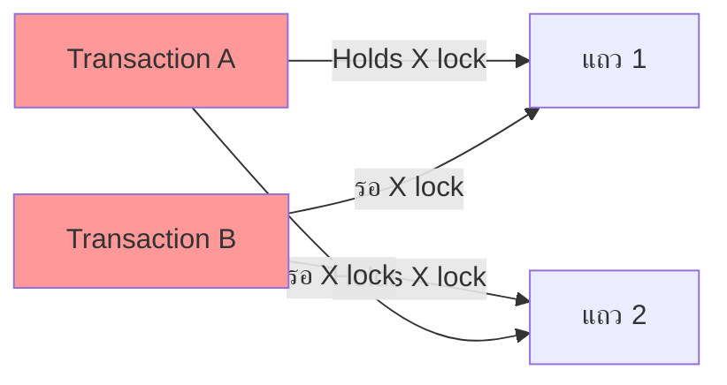

[⬅ Module 05](../../README.md) | [5.1 Concurrency & Transactions](../01_Concurrency_Transactions/README.md) | Section 2/3 | ➡ ถัดไป: [03 ADR & Optimized Locking 2025](../03_ADR_Optimized_Locking_2025/README.md)

# 5.2 Locking Internals — เปิดฝาห้องเครื่องของ Lock Manager

> *"Blocking เป็นเพียงอาการ ส่วนโรคจริงอยู่ที่ 'ใครถือ lock อะไร ที่ระดับไหน นานแค่ไหน' — ถอดรหัสได้ แก้ได้ทุกจุด"*

> **ต้องรู้มาก่อน**: [Lock](../../../Glossary.md), [Blocking](../../../Glossary.md), [Deadlock](../../../Glossary.md), [Latch](../../../Glossary.md), [Wait Type](../../../Glossary.md), Transaction & Isolation Levels (Section [5.1](../01_Concurrency_Transactions/README.md)), หน้า Page 8 KB และ B-Tree (Module 3, 6)
> **Permission ที่ต้องมี**: `VIEW SERVER STATE` (เช่น `sys.dm_os_latch_stats`, `sys.dm_os_spinlock_stats`, `sys.dm_exec_requests`) และ `VIEW DATABASE STATE` (เช่น `sys.dm_tran_locks`) — เดโมที่จำลอง deadlock ต้องมีสิทธิ์สร้าง/ลบตารางใน DB ของตัวเอง

---

## ทำไมต้องลงถึง "ข้างใน" ของ Lock

Section 5.1 เราเลือก "กติกา" (isolation level) — แต่ผู้บังคับใช้กติกาจริงคือ **Lock Manager** เมื่อ wait `LCK_M_*` โผล่เป็นอันดับต้นใน Wait Statistics (Module 1) คำถามที่ต้องตอบให้ได้คือ: lock นั้น **ล็อกอะไรอยู่** (แถว? หน้า? ทั้งตาราง?), **โหมดอะไร** (อ่าน เขียน เปลี่ยนโครงสร้าง?) และ **ทำไม engine ถึงเลือกล็อกในระดับนั้น** — คำตอบทั้งหมดอยู่ในหัวข้อนี้

เส้นทางของ Section:

1. **สถาปัตยกรรม Lock Manager** — lock เป็น object ใน memory, มีต้นทุน, และดูได้จาก `sys.dm_tran_locks`
2. **Granularity Hierarchy** — RID/KEY/PAGE/OBJECT และ Intent Lock ที่เชื่อม hierarchy
3. **Lock Modes + Compatibility Matrix** — S/U/X/IS/IX/Sch-S/Sch-M/BU กับตารางเข้ากันได้
4. **Lock Escalation** — กลไก "ยกเลิกตัวเล็กเปลี่ยนเป็นตัวใหญ่" เมื่อ lock เยอะเกิน
5. **Key-Range Locking** — อาวุธของ SERIALIZABLE
6. **Deadlock** — วงจรการรอ, กลไกตรวจจับ, และวิธีอ่าน Deadlock Graph จริงจาก `system_health`
7. **Latch & Spinlock** — ระบบกันแย่งชิงชั้นต่ำกว่า lock ที่มองไม่เห็นจาก T-SQL
8. **Hints + Parallelism** — เครื่องมือชั้นในที่ใช้เมื่อกติกาปกติไม่พอ

> เดโมของ Section นี้ทดสอบแล้วบน SQL Server 2025 (17.0.1135.8), DB `AdventureWorks` (เปิด RCSI) — เดโม blocking เพื่อจะเห็น lock ต้อง force พฤติกรรม pessimistic ด้วย `READCOMMITTEDLOCK` ตามที่อธิบายใน 5.1 (แล็บคู่ section: [Labs — Exercise 1 & 2](../../Labs/README.md), สคริปต์: `Scripts/03_Deadlock_SessionA.sql`, `04_Deadlock_SessionB.sql`, `05_Analyze_Blocking.sql`, `08_Latch_Spinlock_Analysis.sql`)

---

## 1. Lock Manager — ผู้บังคับใช้กติกาอยู่ใน Buffer Pool

**Lock** คือโครงสร้างข้อมูลขนาดเล็กใน memory (ประมาณ 96 bytes ต่อหนึ่ง lock) ที่ Lock Manager ของ engine จัดการให้ทุก transaction — เมื่อ session ต้องการเข้าถึงทรัพยากร มันจะ "ขอ lock" จาก Lock Manager:

```
Session A (T-SQL)                 Lock Manager (hash table)              Session B (T-SQL)
      │                                   │                                    │
      │── ขอ X lock บน KEY ──────────────▶│                                    │
      │◀── GRANT (จดทะเบียน) ─────────────│◀── ขอ S lock บน KEY ตัวเดียวกัน ────┤
      │                                   │── ไม่ compatible → WAIT ──────────▶│
      │                                   │   (wait type LCK_M_S)              │
      │── COMMIT ────────────────────────▶│── ปลด lock + ปลุก B ──────────────▶│
```

ข้อเท็จจริงภายในที่ควรรู้:

- **Lock เกิดและดับตาม transaction** — ยังไม่ commit = ยังถือ นี่คือเหตุผลที่ "tran ค้าง" (5.1) สร้าง blocking ยาว
- **แต่ละ lock มีต้นทุน memory** — UPDATE ที่กระทบหลายล้านแถวถ้าล็อกทีละแถวจะกิน memory มหาศาล → เกิดกลไก **escalation** (หัวข้อ 4)
- **Lock resources ถูกกระจายตาม hash bucket** — เซิร์ฟเวอร์ที่มี CPU ≥ 16 จะแบ่ง lock hash เป็น partition เพื่อลดการแย่งกัน (ดูหัวข้อ 7)
- **เห็นได้ตลอดเวลาผ่าน DMV** `sys.dm_tran_locks` — เครื่องมือหลักของ section นี้

```sql
-- เห็น lock ที่ transaction ของเราเองถืออยู่ ณ ขณะนั้น (ทดสอบรันจริง)
USE AdventureWorks;
BEGIN TRANSACTION;
    UPDATE Production.Product SET StandardCost = StandardCost WHERE ProductID = 720;
    SELECT request_session_id, resource_type, resource_subtype, resource_description,
           request_mode, request_status
    FROM sys.dm_tran_locks
    WHERE request_session_id = @@SPID
    ORDER BY CASE resource_type WHEN 'DATABASE' THEN 1 WHEN 'OBJECT' THEN 2
                                WHEN 'PAGE' THEN 3 WHEN 'KEY' THEN 4 ELSE 5 END;
ROLLBACK TRANSACTION;
```

**ผลที่ได้ (รันจริง):** สี่แถว — `DATABASE (S)`, `OBJECT (IX)`, `PAGE 1:17579 (IX)`, `KEY (a83f3276fc11) (X)` นี่คือ **ทั้ง hierarchy อยู่ในผลเดียว**: เอนจินล็อกแถวตรง ๆ (KEY X) แล้ว "ประกาศเจตนา" บนระดับแม่ทั้งหมด (PAGE IX, OBJECT IX) — อธิบายต่อในหัวข้อถัดไป

---

## 2. Lock Granularity — เลือกล็อกหยาบหรือละเอียด

**Granularity** = ขนาดของทรัพยากรที่ถูกล็อก SQL Server ล็อกได้หลายระดับ (จากละเอียดสุดไปหยาบสุด):

| ระดับ | ล็อกอะไร | ใช้กับ | ประโยชน์ Concurrency | ต้นทุน Memory |
|:------|:---------|:-------|:---------------------|:---------------|
| `RID` | หนึ่งแถวใน **Heap** | ตารางไม่มี clustered index | ดีที่สุด (คนอื่นยังใช้แถวอื่นได้) | สูงสุด (หลาย lock) |
| `KEY` | หนึ่งแถวใน **Index (B-Tree)** | ตารางมี clustered index / index ปกติ | ดี | สูง |
| `PAGE` | หน้าข้อมูล 8 KB ทั้งหน้า | อ่าน/แก้ของเกาะกลุ่มหลายแถว | ปานกลาง | ปานกลาง |
| `EXTENT` | กลุ่ม 8 pages (64 KB) | กรณีพิเศษ เช่น bulk load | ค่อนข้างหยาบ | ต่ำ |
| `HoBT` | ทั้ง Heap หรือ B-Tree หนึ่งต้น | partition-level escalation | หยาบ | ต่ำ |
| `TABLE` (`OBJECT`) | ทั้งตาราง | ผลจาก escalation / hint `TABLOCK` | แย่สุด (คนอื่นใช้ไม่ได้) | ต่ำสุด |
| `DATABASE` | ทั้งฐานข้อมูล | ทุก query ถืออย่างน้อย 1 (โหมด S) | — | ขั้นต่ำเสมอ |

**กลยุทธ์ Dynamic Locking**: เอนจิน "คิดก่อนทำ" — optimizer/executor เลือก granularity ที่คุ้มตั้งแต่ต้น (เช่น scan แถวเยอะมากจนปวดหัว อาจเริ่มที่ PAGE lock เลย) อย่าลงท้ายที่ **Lock Escalation** ซึ่งเป็นการ "แก้ข้างหน้างาน" เมื่อ lock ถูกใช้เกินโควตา (ดูหัวข้อ 4)

### Intent Lock — ประกาศเจตนาบนระดับแม่

ทำไม UPDATE แถวเดียวถึงไปมี `IX` ค้างบนทั้งตารางด้วย? เพราะ **Intent Lock (IS/IX)** ช่วยให้เอนจินตัดสินใจระดับหยาบได้เร็วโดยไม่ต้องไล่เช็กล็อกทุกแถว:

> เมื่อ Session A ต้องการล็อก **ทั้งตาราง** (เช่น DDL) เอนจินไม่ต้องตรวจว่า "มี lock ระดับแถวค้างอยู่ไหม ทุกแถว" — มาดูที่ `OBJECT` ตัวเดียว: เจอ `IX` ติดอยู่ = มีใครกำลังล็อกแถว/หน้าอยู่ = ปฏิเสธได้ทันที

- `IS` (Intent Shared) = "จะล็อกแถว/หน้าด้วย S ข้างล่าง"
- `IX` (Intent Exclusive) = "จะล็อกแถว/หน้าด้วย X ข้างล่าง"

---

## 3. Lock Modes + Compatibility Matrix

| Mode | ชื่อเต็ม | ใช้เมื่อไร | ค้างจนเมื่อไร |
|:-----|:---------|:-----------|:--------------|
| `S` (Shared) | ล็อกอ่าน | SELECT ภายใต้ pessimistic READ COMMITTED (บน DB ที่ไม่ได้เปิด RCSI) | จบ statement |
| `U` (Update) | ล็อกอัปเดต | ขั้นสแกนของ UPDATE — ขอ S ขึ้นมาแต่ "ไม่ยอมแชร์กับ U/X" กัน deadlock ตั้งแต่คิวต้น; แปลงเป็น X เมื่อต้องแก้จริง | จบ statement (หรือถึงจุดแปลงเป็น X) |
| `X` (Exclusive) | ล็อกเขียน | INSERT/UPDATE/DELETE | จบ transaction |
| `IS`/`IX` | Intent | ประกาศเจตนาบนระดับแม่ | ตามลูกที่ยังถืออยู่ |
| `Sch-S` (Schema Stability) | กันโครงสร้างเปลี่ยน | ทุก query ระหว่าง compile/execute — ให้ query อื่นร่วมได้ แต่กัน DDL | จบ statement |
| `Sch-M` (Schema Modification) | แก้โครงสร้าง | `ALTER TABLE`, rebuild index ฯลฯ | จบ transaction — **บล็อกแม้แต่ NOLOCK** |
| `BU` (Bulk Update) | โหลดหมู่ | `BULK INSERT`/`bcp` คู่ `TABLOCK` ยอมให้หลาย client โหลดพร้อมกันได้ | จบ bulk operation |
| `RangeS-S`, `RangeI-N`, `RangeX-X` ฯลฯ | Key-Range | ใช้กับ SERIALIZABLE (หัวข้อ 5) | จบ transaction |

### Compatibility Matrix — ใครเข้ากันได้กับใคร

| Request \ Granted | **IS** | **S** | **U** | **IX** | **X** |
|:------------------|:------:|:-----:|:-----:|:------:|:-----:|
| **IS** (Intent Shared) | ✅ | ✅ | ✅ | ✅ | ❌ |
| **S** (Shared) | ✅ | ✅ | ✅ | ❌ | ❌ |
| **U** (Update) | ✅ | ✅ | ❌ | ❌ | ❌ |
| **IX** (Intent Exclusive) | ✅ | ❌ | ❌ | ✅ | ❌ |
| **X** (Exclusive) | ❌ | ❌ | ❌ | ❌ | ❌ |

> **Legend:** ✅ = Compatible (ทำงานร่วมกันได้) | ❌ = Incompatible (มีรอเกิด = `LCK_M_*`)

อ่านเมทริกซ์เป็นเครื่องมือ: **S + S = ✅** อ่านพร้อมกันได้ → ระบบรายงานที่อ่านล้วนไม่ควร block กันเอง; **S + X = ❌** อ่าน/เขียนต้องต่อคิว; **X + X = ❌** เขียนพร้อมกันไม่ได้เด็ดขาด — แถว `U` คือของแปลกที่ "เข้ากับ S ได้ แต่เข้ากับ U ไม่ได้" ซึ่งเป็นหัวใจที่ทำให้ UPDATE สองตัวไม่ตายล็อกกันตั้งแต่ขั้นสแกน

### ทดลอง U lock ด้วยมือ (hint `UPDLOCK`)

ปกติ U lock มีชีวิตสั้น (สแกนจบก็แปลง/ปล่อย) — hint `UPDLOCK` ทำให้ถือจนจบ transaction จึงเห็นชัด:

```sql
USE AdventureWorks;
BEGIN TRANSACTION;
    SELECT ProductID, ListPrice FROM Production.Product WITH (UPDLOCK) WHERE ProductID = 514;
    SELECT resource_type, request_mode
    FROM sys.dm_tran_locks
    WHERE request_session_id = @@SPID AND resource_type = 'KEY';
ROLLBACK TRANSACTION;
```

**ผลที่ได้ (รันจริง):** `KEY (U)` — ใช้เป็นแบบแผนใน app แบบ "อ่านเพื่อจะแก้" (เช่น check stock แล้วออก order) ให้คู่แข่งไม่อ่านทับระหว่างเรากำลังคิด

### Sch-M — lock ที่บล็อกแม้แต่ NOLOCK

เดโมจำลอง "DDL ติดคิว" ที่เจอกันจริงเวลา deploy สคริปต์ ALTER TABLE:

```sql
-- Setup (รันครั้งเดียว แล้วลบทิ้งตอนจบ)
USE AdventureWorks;
DROP TABLE IF EXISTS dbo.DemoSchM;
CREATE TABLE dbo.DemoSchM (ID INT PRIMARY KEY, Val INT);
INSERT dbo.DemoSchM VALUES (1, 10);
```

```sql
-- Session A — เปิด tran เขียนแล้วค้างไว้ 8 วินาที
USE AdventureWorks;
BEGIN TRANSACTION;
    UPDATE dbo.DemoSchM SET Val = Val + 1 WHERE ID = 1;   -- ถือ X lock (เปิด tran ค้างไว้)
    WAITFOR DELAY '00:00:08';
ROLLBACK TRANSACTION;
```

```sql
-- Session B — รันหลัง A ~2 วินาที: DDL ต้องการ Sch-M จะรอ X lock ปล่อยก่อน
USE AdventureWorks;
SET LOCK_TIMEOUT 3000;
ALTER TABLE dbo.DemoSchM ADD Note NVARCHAR(20) NULL;      -- ต้องการ Sch-M → รอและติด 1222
```

```sql
-- Cleanup
USE AdventureWorks;
DROP TABLE IF EXISTS dbo.DemoSchM;
```

**ผลที่ได้ (รันจริง):** Session B ได้ `Msg 1222: Lock request time out period exceeded` ภายใน 3 วิ และ A ปิด tran แล้วโครงสร้างตารางไม่เปลี่ยน (ALTER ไม่สำเร็จ) บทเรียน: **ทุก open transaction คือศัตรูของ DDL** — นี่คือเหตุผลที่ index rebuild ตอนกลางวันมักทำให้ระบบดูเหมือน "หยุดกลางคัน" และเหตุผลที่ SQL Server 2022+ เพิ่ม `WAIT_AT_LOW_PRIORITY` สำหรับ online index operation ให้ DDL ยอมจอคิวหลังจนใจได้

---

## 4. Lock Escalation — เมื่อตัวเล็กเยอะเกิน รวมเป็นตัวใหญ่ตัวเดียว

**Concept**: ล็อกทีละแถวประหยัด "ความวุ่นวาย" แต่แพงเรื่อง memory (แถวหลายล้าน = lock หลายล้านก้อน) — เอนจินจึงรวม lock เล็ก ๆ ของ statement เดียวเป็น lock หยาบ (TABLE) ตัวเดียว

**เงื่อนไขทริกเกอร์ (ต่อ 1 statement บน 1 object):**

1. จำนวน lock ของ statement พ้นเกณฑ์ (ตำราบอก "ประมาณ 5,000")
2. หรือ memory ที่ใช้ทำ lock เกินโควตาของ engine (~24% ของ buffer pool; ถ้าตั้ง `locks` option ไว้ จะเป็น 40% ของค่าที่ตั้ง)
- ถ้า escalate ไม่สำเร็จ (มีคนถือ conflicting lock อยู่) จะลองซ้ำทุก ๆ ~1,250 locks ที่เพิ่มขึ้น

**Trade-off ตรง ๆ**: memory ลดฮวบ แต่ **ทั้งตารางกลายเป็นของคนใดคนหนึ่ง** — blocking เดือด เกิดกับ SELECT/UPDATE แบบ "ล้างทั้งตาราง" มักไม่เกิดกับ OLTP ที่กระทบทีละไม่กี่แถว

### ทดลองเห็นตา (รันจริงแล้ว)

```sql
USE AdventureWorks;

-- สร้างตารางทดสอบ 10,000 แถว (จะลบทิ้งตอนจบ)
DROP TABLE IF EXISTS dbo.DemoEscalation;
CREATE TABLE dbo.DemoEscalation (ID INT PRIMARY KEY, Payload NVARCHAR(60));
INSERT dbo.DemoEscalation (ID, Payload)
SELECT TOP (10000)
    ROW_NUMBER() OVER (ORDER BY (SELECT NULL)),
    'p' + CAST(ROW_NUMBER() OVER (ORDER BY (SELECT NULL)) AS NVARCHAR(10))
FROM sys.all_objects AS a CROSS JOIN sys.schemas AS s;

BEGIN TRANSACTION;
    UPDATE dbo.DemoEscalation SET Payload = Payload WHERE ID <= 10000;
    SELECT resource_type, request_mode, COUNT(*) AS lock_count
    FROM sys.dm_tran_locks
    WHERE request_session_id = @@SPID AND resource_database_id = DB_ID()
    GROUP BY resource_type, request_mode
    ORDER BY lock_count DESC;
ROLLBACK TRANSACTION;

DROP TABLE dbo.DemoEscalation;
```

**ผลที่ได้ (รันจริง):** ครั้งนี้เหลือแค่ `OBJECT (X)` + `OBJECT (IX)` + `DATABASE (S)` = **3 locks** — KEY ทั้ง 10,000 หายไป (รวมเป็น table X แล้ว) ทดลองซ้ำที่ **6,000 แถว** บน build นี้พบว่า **ยังไม่ escalate** (ยังถือ 6,000 KEY X) — สอนลูกศิษย์ว่าเกณฑ์ "5,000" ในตำราเป็นค่าประมาณ ไม่ใช่สัญญาในกระดาษ; ตัวเลขจริงขึ้นกับ memory และ build

> [!NOTE]
> อย่าลืมว่าบน DB ที่เปิด **Optimized Locking** (SQL Server 2025 — Section 5.3) กลไกนี้แทบไม่มีทางถูกเรียก เพราะ statement ไม่ถือ row/page lock ค้างไว้จนจบ transaction อีกต่อไป

**ควบคุม Escalation ได้:**

```sql
-- ควบคุมที่ระดับตารางได้จริง (ทดลองกับตารางทดสอบ แล้วคืนค่า default = TABLE)
USE AdventureWorks;
DROP TABLE IF EXISTS dbo.DemoEscMode;
CREATE TABLE dbo.DemoEscMode (ID INT PRIMARY KEY, Payload INT);
ALTER TABLE dbo.DemoEscMode SET (LOCK_ESCALATION = DISABLE);  -- ห้าม escalate ทั้งตาราง
ALTER TABLE dbo.DemoEscMode SET (LOCK_ESCALATION = AUTO);     -- escalate ที่ระดับ partition แทน (ถ้ามี partition)
ALTER TABLE dbo.DemoEscMode SET (LOCK_ESCALATION = TABLE);    -- คืนค่า default
DROP TABLE dbo.DemoEscMode;
```

---

## 5. Key-Range Locking — อาวุธของ SERIALIZABLE

ปัญหา Phantom Read (5.1) คือ "แถวใหม่ถูกแทรกเข้าช่วงที่อ่านอยู่" — ล็อกแถวที่**มีอยู่**แค่ไหนก็กันไม่ได้ เพราะแถวใหม่ยังไม่มีตัวตนให้ล็อก ทางแก้คือล็อก **"ช่อง" ระหว่างค่าใน index** (บวก boundary ปลายทั้งสอง) ด้วย Key-Range Lock

```sql
USE AdventureWorks;
-- SERIALIZABLE อ่านช่วง → ได้ Key-Range Lock ป้องกัน phantom
BEGIN TRANSACTION;
    SET TRANSACTION ISOLATION LEVEL SERIALIZABLE;
    SELECT SalesOrderID, SalesOrderDetailID, OrderQty
    FROM Sales.SalesOrderDetail
    WHERE SalesOrderID = 43659;

    -- ดู Key-Range Lock ที่เพิ่งถืออยู่ (resource_type = KEY, mode = RangeS-S)
    SELECT resource_type, request_mode, resource_description
    FROM sys.dm_tran_locks
    WHERE request_session_id = @@SPID
      AND resource_type = 'KEY';
ROLLBACK TRANSACTION;
```

**ผลที่ได้ (รันจริง):** 13 แถว `KEY ... RangeS-S` สำหรับ 12 แถวข้อมูล + **1 แถวพิเศษท้ายช่วง** (next-key boundary) — แถวพิเศษนี้คือ "ล็อกช่องว่างหลังแถวสุดท้าย" ที่ไม่มีใคร INSERT เข้ามาได้

โหมด Key-Range หลัก ๆ:

| Mode | แปลว่า |
|:-----|:--------|
| `RangeS-S` | ล็อกช่วงแบบอ่าน (SELECT ภายใต้ SERIALIZABLE) |
| `RangeS-U` | ล็อกช่วงแบบอ่านเพื่อจะแก้ |
| `RangeI-N` | แทรกแถวใหม่เข้าช่วงที่ถูกล็อกไว้ (ตรวจว่า "ช่อง" ยังว่าง) |
| `RangeX-X` | ล็อกช่วงแบบเขียนเต็ม (SERIALIZABLE + UPDATE) |

> [!WARNING]
> SERIALIZABLE + Key-Range คือสูตร blocking และ deadlock ที่ดุดันที่สุด — ล็อก "ช่อง" แปลว่าคนอื่นแตะข้อมูลใกล้เคียงก็รอ ใช้เฉพาะกระบวนการที่ต้องการความถูกต้อง 100% (เช่น สำรองที่นั่ง/ตัดสต็อกในลักษณะ queue) และทำ tran ให้สั้นที่สุด

---

## 6. Deadlock — วงจรการรอที่เอนจินต้อง "ตัดพระ" เพื่อช่วยนักบวช

**Deadlock** เกิดเมื่อ transaction สองตัว (ขึ้นไป) ถือของกันคนละชิ้นแล้วแย่งของอีกฝ่าย จนเกิดวงจรที่รอต่อกันตลอดกาล:



สังเกตว่า deadlock ≠ blocking ธรรมดา — blocking เป็นธรรมชาติของ pessimistic lock (รอแล้วจบ) แต่ deadlock คือรอแบบไร้ทางออก เอนจินจึงต้อง **ยิงคนใดคนหนึ่ง**:

- **Lock Monitor** (thread พื้นหลัง) สำรวจวงจรทุก ~5 วินาที; เมื่อเจอ deadlock แล้วจะเร่งสำรวจถี่ขึ้นเป็นระดับ 0.1 วินาที
- **Victim selection**: เลือก transaction ที่ "ตัดเลือดน้อยที่สุด" — ถูก rollback คืนเร็วที่สุด (โดยประมาณจากจำนวน log record ฯลฯ); app สามารถอาสาสมัครด้วย `SET DEADLOCK_PRIORITY LOW/HIGH`
- Victim ได้ **Error 1205** และ transaction ถูก rollback โดยอัตโนมัติ — application ควรมี retry logic เสมอ

### เดโมตายล็อกที่ควบคุมได้ (ตารางทดสอบของเราเอง — ไม่แตะข้อมูลจริง)

```sql
-- Setup (รันครั้งเดียว แล้วลบทิ้งตอนจบ)
USE AdventureWorks;
DROP TABLE IF EXISTS dbo.DemoDeadlock;
CREATE TABLE dbo.DemoDeadlock (ID INT PRIMARY KEY, Val INT);
INSERT dbo.DemoDeadlock VALUES (1, 100), (2, 200);
```

```sql
-- Session A — ล็อกแถว 1 ก่อน แล้วไปแย่งแถว 2
USE AdventureWorks;
BEGIN TRANSACTION;
    UPDATE dbo.DemoDeadlock SET Val = Val + 1 WHERE ID = 1;   -- A ถือ lock แถว 1
    WAITFOR DELAY '00:00:05';                                  -- เว้นให้ B เข้าถึงแถว 2 ก่อน
    UPDATE dbo.DemoDeadlock SET Val = Val + 1 WHERE ID = 2;   -- A ไปแย่งแถว 2 ของ B → วงจรครบ!
COMMIT TRANSACTION;
```

```sql
-- Session B — เริ่มพร้อม Session A (ช้ากว่า ~1 วินาที): ล็อกแถว 2 ก่อน แล้วไปแย่งแถว 1
USE AdventureWorks;
BEGIN TRANSACTION;
    UPDATE dbo.DemoDeadlock SET Val = Val + 1 WHERE ID = 2;   -- B ถือ lock แถว 2
    WAITFOR DELAY '00:00:05';
    UPDATE dbo.DemoDeadlock SET Val = Val + 1 WHERE ID = 1;   -- B ไปแย่งแถว 1 ของ A → วงจรครบ!
COMMIT TRANSACTION;
```

```sql
-- Cleanup (รันหลังเดโมจบ)
USE AdventureWorks;
DROP TABLE IF EXISTS dbo.DemoDeadlock;
```

**ผลที่ได้ (รันจริง):** หนึ่ง session กลายเป็น victim ได้ `Msg 1205, Level 13: Transaction (Process ID 53) was deadlocked on lock resources with another process and has been chosen as the deadlock victim` — อีก session รอดและ commit (ตารางเหลือ `1 → 101, 2 → 201` จากงานของผู้รอด — ตัวเลขเดียวกันทั้งสองทาง) จากการรันซ้ำพบว่าใครเป็น victim ขึ้นกับ timing/จำนวน log (รอบแรก B เป็น victim, รอบที่สอง A เป็น victim) — เตือนลูกเรียนว่า **อย่าพึ่งพา "ใครโดนยิง" ให้มันแน่นอน** ให้มี retry logic ทุกฝั่ง ทุก session จบสะอาด `@@TRANCOUNT = 0` ใช้ Cleanup ลบตารางได้ทันที

### อ่าน Deadlock Graph จาก `system_health` (วิธีมาตรฐานปี 2025)

`system_health` XEvent session ที่ติดตั้งมาเองจับ `xml_deadlock_report` ไว้ทุกครั้ง — ดึงออกมาอ่านได้โดยไม่ต้องติดตั้งอะไรเพิ่ม (ห้ามใช้ SQL Profiler — ถูกถอดออกแล้วในยุคนี้):

```sql
-- Deadlock ล่าสุดทั้งหมดในเซิร์ฟเวอร์ พร้อมกราฟ XML (คลิกลิงก์ใน SSMS เพื่อดูภาพ graph)
SELECT TOP (10)
    x.value('(@timestamp)[1]', 'DATETIME2') AS deadlock_at,
    CAST(x.query('(event/data[@name="xml_report"]/value)[1]').value('.','nvarchar(max)') AS XML) AS deadlock_graph
FROM (
    SELECT CAST(event_data AS XML) AS event_data
    FROM sys.fn_xe_file_target_read_file('system_health*.xel', NULL, NULL, NULL)
    WHERE object_name = 'xml_deadlock_report'
) AS ed
CROSS APPLY ed.event_data.nodes('event') AS n(x)
ORDER BY deadlock_at DESC;
```

**ผลที่ได้ (รันจริง):** ได้แถว timestamp ตรงช่วงเดโม (03:28:52 UTC) พร้อม XML ที่ SSMS เปิดเป็น **Deadlock Graph แบบภาพ** — วงรี/วงกลมประจำ process สองตัว ตัวที่มีเครื่องหมาย ✗ คือ victim; ตรวจสอบใน XML ได้ว่าใครถือ/รอ resource อะไร (`KEY: ...`) และ statement ไหน

> [!NOTE]
> จากการรันจริงบน build นี้: `ring_buffer` ของ `system_health` **ไม่เก็บ** `xml_deadlock_report` — ต้องอ่านจาก event_file (`sys.fn_xe_file_target_read_file('system_health*.xel', ...)`) ตาม query ข้างบนเท่านั้น

### วิธีลด Deadlock — จัดอันดับความคุ้มค่า

| ลำดับ | Strategy | ทำงานอย่างไร |
|:------|:---------|:--------------|
| 1 | **เข้าถึง object ตามลำดับเดียวกัน** | ทุก app ล็อกแถว 1 ก่อนแถว 2 เสมอ → วงจรเกิดไม่ได้เลย |
| 2 | **transaction สั้น + commit เร็ว** | กรอบเวลาให้วงจรรวมกันน้อยลง |
| 3 | **ห้ามรอ user interaction ใน tran** | เปิด tran ทิ้งไว้ให้คนคิด = โรงงานสร้าง deadlock/blocking |
| 4 | **ใช้ RCSI กับ SELECT** | ตัด S lock ออกจากสมการ — วงจรฝั่ง reader หายไปครึ่งหนึ่ง |
| 5 | **index ที่ดีต่อ predicate** | สแกนแถวน้อยลง = ถือ lock น้อยลง |
| 6 | **เพิ่ม U lock ให้แผน "อ่านเพื่อแก้"** | กันสอง reader ชิงแปลงเป็น X พร้อมกัน |

และเครื่องมือตามสถานการณ์: `sys.dm_exec_requests` (มอง blocking pair สด ๆ), `05_Analyze_Blocking.sql` (หา head blocker + SQL ที่ทำ) — query แบบเดียวกับใน 5.1:

```sql
-- ใครบล็อกใครอยู่ตอนนี้ พร้อม SQL ของทั้งสองฝั่ง (0 แถว = ไม่มี blocking ขณะนี้)
SELECT
    Blocker.session_id AS [Blocker SID],
    BlockerText.text AS [Blocker Query],
    Victim.session_id AS [Victim SID],
    Victim.wait_type AS [Wait Type],
    Victim.wait_time AS [Wait Time (ms)],
    VictimText.text AS [Victim Query]
FROM sys.dm_exec_requests AS Victim
JOIN sys.dm_exec_connections AS Blocker
    ON Victim.blocking_session_id = Blocker.session_id
CROSS APPLY sys.dm_exec_sql_text(Blocker.most_recent_sql_handle) AS BlockerText
CROSS APPLY sys.dm_exec_sql_text(Victim.sql_handle) AS VictimText
WHERE Victim.blocking_session_id > 0
ORDER BY Victim.wait_time DESC;
```

> **มุมมองขณะเกิดจริง (รันจริงแล้ว):** ระหว่าง Session A ถือ X ค้าง และ Session B อ่านด้วย `READCOMMITTEDLOCK` — Session C รัน query แบบสั้น `SELECT session_id, blocking_session_id, wait_type, wait_time, wait_resource FROM sys.dm_exec_requests WHERE blocking_session_id <> 0` เห็น `LCK_M_S`, `wait_time ≈ 2,000 ms` และ `wait_resource = KEY: 5:72057594054049792 (5f4fe48cee69)` — รู้จัก format นี้ไว้เพราะ wait_resource ระบุ **DB : Hobt (hash)** ใช้เชื่อมกลับไปหา object ผ่าน `sys.partitions` ได้

---

## 7. Latch & Spinlock — ระบบกันแย่งชิงชั้นต่ำกว่า Lock

**🏠 หอการค้าของ engine มีกุญแจสามชั้น:**

- **Lock** = กุญแจห้องเก็บข้าวของ (data ของผู้ใช้) — ถือนานตลอด transaction, มองเห็นจาก T-SQL
- **Latch** = กุญแจตู้เย็น (data page ใน buffer pool ตอนกำลังอ่าน/เขียน) — ถือแค่ "ระหว่างจัดการหน้า" เป็นมิลลิวินาทีหรือสั้นกว่า, ผูกกับ thread ไม่ใช่ transaction
- **Spinlock** = กุญแจห้องน้ำบนรถไฟ (โครงสร้าง internal เช่น lock hash, memory clerk list) — ได้กุญแจไม่ได้ก็ **ยืนหมุนตัวรอ (spin) ด้วย CPU** ไม่นอน

ทำไมต้องมีสามชั้น? เพราะการ "นอนรอแล้วปลุก" (context switch) แพง — ของที่ถือแค่เสี้ยววินาที วนรอ CPU ดีกว่านอน เอนจินจึงเลือกกลไกตามความยาวของงาน:

| ชั้น | ปกป้องอะไร | ถือนานแค่ไหน | วิธีรอ | Wait Type ที่เห็น |
|:-----|:------------|:--------------|:--------|:------------------|
| 🔒 **Lock** | ข้อมูลผู้ใช้ (row/page/table) | ตลอด transaction | นอนรอ (blocking) | `LCK_M_*` |
| 🔐 **Latch** | Page ใน buffer pool ระหว่างทำงานกับมัน | สั้น (ไม่ถึงจบ statement) | นอนรอ | `PAGELATCH_*`, `PAGEIOLATCH_*`, `LATCH_*` |
| ⚙️ **Spinlock** | โครงสร้าง internal ของ engine | สั้นมาก (นาโน-ไมโครวินาที) | วนลูปกิน CPU | ไม่มี (แอบซ่อนใน CPU usage) |

> **สับสนยอดฮิต:** `PAGEIOLATCH_EX` = รอหน้าจาก disk (เกี่ยวกับ storage — Module 2); `PAGELATCH_EX` = รอหน้าที่อยู่ใน memory แล้ว (แข่งกันที่ตัวหน้า — ปัญหา design เช่น last-page insert, tempdb allocation ยุคเก่า)

### อ่านสถิติ Latch / Spinlock

```sql
-- Latch: ค่าสะสมตั้งแต่ restart (เทียบ delta สองจุดเวลาเสมอ — สไตล์เดียวกับ Wait Stats)
SELECT TOP (8) latch_class, waiting_requests_count, wait_time_ms, max_wait_time_ms
FROM sys.dm_os_latch_stats
ORDER BY wait_time_ms DESC;

-- Spinlock: ตัวชี้วัด "การแย่งกัน" ของโครงสร้าง internal
SELECT TOP (8) name, spins, spins_per_collision AS spc, backoffs
FROM sys.dm_os_spinlock_stats
ORDER BY spins DESC;
```

**ผลที่ได้ (รันจริงบนเซิร์ฟเวอร์หลักสูตร — idle):** ฝั่ง latch นำโดย `BUFFER` (wait_time_ms ≈ 882) ซึ่งปกติที่สุด; ฝั่ง spinlock นำโดย `SOS_RESOURCE_CLERK_LIST` และ **`LOCK_HASH` (spins ≈ 6,071, backoffs = 312)** — ค่าเล็กมากเพราะเซิร์ฟเวอร์นิ่ง แต่โครงเดียวกับเซิร์ฟเวอร์จริงที่จ่ายหนัก: สคริปต์ `08_Latch_Spinlock_Analysis.sql` จะ snapshot สองจุดเว้น 5 วินาทีแล้วหา delta ให้เอง

Spinlock ที่ต้องรู้จักเมื่อเจอบนเครื่องจริง (มักเครื่องที่มี 24+ cores):

| Spinlock | สัญญาณ | ทางแก้ |
|:---------|:--------|:-------|
| `LOCK_HASH` | lock volume สูงมาก | ลดเวลาถือ lock, ใช้ RCSI, ลด escalation-reversal |
| `SOS_OBJECT_STORE` | สร้าง/ทิ้ง object ถี่ (temp table) | ลด churn ของ tempdb, รวม batch |
| `LOGCACHE_ACCESS` | commit ถี่มาก (micro-transactions) | รวม transaction เล็ก ๆ |
| `OPT_IDX_STATS` | แย่ง statistics ของ index | อัปเดต stats นอกชั่วโมงเร่งด่วน |

> [!TIP]
> อาการป่วยของ spinlock คือ **CPU สูงแต่ throughput ไม่ขยับ** และ `SOS_SCHEDULER_YIELD` สูงโดยไม่เจอสาเหตุอื่น — เริ่มจาก `sys.dm_os_spinlock_stats` จัดอันดับ delta spins ก่อนขุด XEvents (`spinlock_backoff`)

**Lock Partitioning:** บนเครื่องที่มี **CPU ≥ 16** เอนจินแบ่ง lock hash ออกเป็นหลาย partition ลดการแย่ง spinlock เดียวกัน — ตรวจสภาพแวดล้อมของเรา:

```sql
-- เซิร์ฟเวอร์หลักสูตร: 4 CPU / 1 NUMA node → partitioning ยังไม่ทำงาน (ต้อง ≥ 16 cores)
SELECT cpu_count, socket_count, scheduler_count, numa_node_count FROM sys.dm_os_sys_info;
```

**ผลที่ได้ (รันจริง):** `cpu_count = 4, scheduler_count = 4, numa_node_count = 1` — บนเครื่องสาธิต การแย่ง lock hash จึงเล็กมาก สมเหตุผลที่ spinlock ในสถิติข้างบนต่ำ

---

## 8. Locking Hints — เข็มทิศฉุกเฉิน (ใช้เมื่อรู้ว่าทำไม)

Table hint ช่วย override พฤติกรรมเริ่มต้นเฉพาะ query — พลังสูง ความเสี่ยงสูง ใช้เมื่อ "เข้าใจกลไกข้างบนแล้ว" ไม่ใช่ปิดอาการ:

| Hint | ทำอะไร | เคสที่ควร / ไม่ควร |
|:-----|:--------|:--------------------|
| `NOLOCK` / `READ UNCOMMITTED` | อ่านโดยไม่ขอ S lock + เห็นข้อมูล uncommitted | ✅ ตัวเลขประมาณที่ tolerate ได้ (dashboard หยาบ) ❌ รายงานการเงิน — เสี่ยง dirty read + **allocation scan anomaly** (อ่านซ้ำ/ข้ามแถวระหว่าง page split) |
| `READCOMMITTEDLOCK` | บังคับ READ COMMITTED แบบ pessimistic (ข้าม RCSI) | ✅ สอน/จำลองอาการ, เคสต้องการค่า "commit ล่าสุดแบบล็อก" ❌ ใช้ทิ้ง ๆ ทั่ว app — blocking กลับมา |
| `UPDLOCK` | ขอ U lock ทันทีและถือจนจบ tran | ✅ รูปแบบ "อ่านเพื่อแก้" กัน lost update |
| `XLOCK` | ขอ X lock ทันที | เคสบล็อกสูงสุด (ใช้น้อยจริง) |
| `TABLOCK` / `TABLOCKX` | บังคับล็อกระดับตาราง | ✅ bulk load (`TABLOCK` + BU) ❌ OLTP |
| `READPAST` | ข้ามแถวที่ถูกล็อกไปเลย | ✅ queue worker หลายตัวดึงงานแข่งกัน ❌ รายงานที่ต้องครบทุกแถว |

### เดโม READPAST — หัวใจของระบบ queue

```sql
-- Setup (รันครั้งเดียว แล้วลบทิ้งตอนจบ)
USE AdventureWorks;
DROP TABLE IF EXISTS dbo.DemoQueue;
CREATE TABLE dbo.DemoQueue (ID INT PRIMARY KEY, Val INT);
INSERT dbo.DemoQueue VALUES (1, 10), (2, 20), (3, 30);
```

```sql
-- Session A — worker ตัวแรกกำลังจัดการงานแถว 1 (ถือ X ค้าง 8 วิ)
USE AdventureWorks;
BEGIN TRANSACTION;
    UPDATE dbo.DemoQueue SET Val = Val + 1 WHERE ID = 1;   -- X lock แถว 1 ค้าง
    WAITFOR DELAY '00:00:08';
ROLLBACK TRANSACTION;
```

```sql
-- Session B — worker ตัวที่สองมาถามงาน (รันหลัง A ~2 วิ)
USE AdventureWorks;
SELECT ID, Val FROM dbo.DemoQueue;                                        -- RCSI: เห็นครบ (แถว 1 = ค่าเก่า 10)
SELECT ID, Val FROM dbo.DemoQueue WITH (READPAST, READCOMMITTEDLOCK);     -- pessimistic + READPAST: ข้ามแถวที่ถูก lock
```

```sql
-- Cleanup
USE AdventureWorks;
DROP TABLE IF EXISTS dbo.DemoQueue;
```

**ผลที่ได้ (รันจริง):** SELECT แรกเห็น 3 แถว (แถว 1 คือค่าเก่า — RCSI) แต่ SELECT ที่สองเห็นแค่แถว 2, 3 — **ข้ามแถวที่กำลังถูกประมวลผลไปเลย** นี่คือแบบแผนมาตรฐานของ job queue ที่มี worker หลายตัวแย่งงานโดยไม่ต้องรอกัน

---

## 9. Concurrency ที่ระดับ CPU: MAXDOP & Cost Threshold

Lock คือความร่วมมือระดับ **ข้อมูล** — อีกด้านของ concurrency คือระดับ **CPU** ที่ query หลายตัว + parallel plan แย่ง worker กัน (wait `CXPACKET`/`SOS_SCHEDULER_YIELD` จาก Module 1) การตั้งค่าสองตัวนี้เป็นส่วนหนึ่งของ "กติกา concurrency" ที่ DBA ควรตรวจ:

```sql
-- ค่าจริงปัจจุบันของเซิร์ฟเวอร์ (รันจริง: MAXDOP = 4, CTFP = 5 — CTFP ต่ำไปสำหรับเครื่องยุคนี้)
SELECT name, value_in_use FROM sys.configurations
WHERE name IN ('max degree of parallelism', 'cost threshold for parallelism');
```

| การตั้งค่า | Default | คำแนะนำ | เหตุผล |
|:-----------|:--------|:--------|:--------|
| `max degree of parallelism` | 0 (ใช้ทุก core) | 8 ต่อ NUMA node หรือจำนวน core ต่อ node ที่ < 8 | query เดียวไม่ควรกิน CPU ทั้งเครื่อง เหลือเพียงพอให้ OLTP ตัวเล็กตอบเร็ว |
| `cost threshold for parallelism` | 5 (ค่าจากยุค 90s) | 25–50 | ประตูต่ำเกิน ทำให้ query จิ๋วยอมเสีย overhead ไปทำ parallel โดยไม่คุ้ม |

> ลงลึกการตั้งค่า instance: กลับไปที่ Module 1 (SQLOS/Scheduling) และ Module 11 (Top-down Troubleshooting — กลุ่ม wait ของ CPU) — Section นี้เก็บไว้เป็น "พันธกิจ" ให้เชื่อมโลก lock กับโลก CPU ว่า Concurrency มีทั้งสองชั้น

---

## สรุป Section 5.2

1. **Lock ถือตลอด transaction และมี hierarchy** — KEY/PAGE/OBJECT + Intent (IS/IX) ทำให้ตัดสินใจระดับหยาบได้เร็ว; ดูของจริงได้ที่ `sys.dm_tran_locks` ขณะ tran เปิด
2. **Compatibility Matrix คือแผนที่ blocking** — S เข้ากับ S ได้, X เข้ากับไม่มีใครได้, U เข้ากับ S ได้แต่ไม่เข้ากับ U กัน deadlock ตั้งแต่คิวสแกน
3. **Escalation แลก memory กับ concurrency** — เกณฑ์ "5,000" เป็นค่าประมาณ (พิสูจน์แล้ว 6,000 แถวยังไม่ escalate บน build นี้ 10,000 escalate) ปิด/เลี่ยงได้ที่ระดับตาราง
4. **SERIALIZABLE ใช้ Key-Range** ล็อก "ช่อง" ไม่ใช่แถว; **Deadlock** ต้องมีวงจร — lock monitor ยิง victim (1205) และเราอ่านกราฟจาก `system_health` event_file ได้ทันที
5. **Latch/Spinlock คือชั้นที่ต่ำกว่า** — รอสั้น ๆ ไม่เกี่ยวกับ transaction ป่วยแล้วเห็นเป็น CPU สูงไร้ throughput
6. **Hints** (`NOLOCK`, `READPAST`, `UPDLOCK`) คือเครื่องมือฉุกเฉินที่ต้องเข้าใจกลไกก่อนใช้

### ตรวจความเข้าใจ

1. UPDATE หนึ่งแถวทำไมถึงเกิด lock อย่างน้อย 4 ระดับ (DATABASE/OBJECT/PAGE/KEY) — ตัวไหนคือ "ของจริง" และตัวไหนคือ "ประกาศเจตนา"?
2. จาก Compatibility Matrix ทำไม `U` จึงเข้ากันได้กับ `S` แต่ไม่เข้ากันกับ `U` — อธิบายด้วยสถานการณ์ UPDATE สองตัวพร้อมกัน?
3. อะไรต่างกันระหว่าง **Dynamic Locking** กับ **Lock Escalation** (จังหวะเวลาและผู้ตัดสินใจ)?
4. เดโมเราพบว่าอัปเดต 6,000 แถว "ยังไม่" escalate แต่ 10,000 แถว escalate — สรุปเรื่องเกณฑ์ 5,000 ได้อย่างไร และจะควบคุมพฤติกรรมนี้ที่ระดับตารางด้วยคำสั่งใด?
5. เพราะอะไร Key-Range Lock จึงจำเป็นใน SERIALIZABLE แม้ว่าจะล็อกแถวที่มีอยู่ทุกแถวแล้ว?
6. Session A ถือ X ค้างแล้ว Session B ส่ง `ALTER TABLE` — B จะได้ wait type อะไร และจะเกิดอะไรขึ้นกับ B ถ้า A ยังไม่ commit อีกนาน (สองทาง: มี/ไม่มี `SET LOCK_TIMEOUT`)?
7. Deadlock victim ถูกเลือกอย่างไร และ app ฝั่ง victim ต้องมีระบบอะไรเสมอ?
8. `PAGEIOLATCH_SH` กับ `PAGELATCH_EX` ต่างกันตรงไหน และป่วยแบบไหนถึงแก้ด้วย storage แบบไหนถึงแก้ด้วย design?

**➡ ถัดไป:** [5.3 ADR & Optimized Locking (SQL Server 2025)](../03_ADR_Optimized_Locking_2025/README.md)

---

[⬅ ก่อนหน้า: 5.1 Concurrency & Transactions](../01_Concurrency_Transactions/README.md) | [🧪 Labs](../../Labs/README.md) | ➡ [5.3 ADR & Optimized Locking 2025](../03_ADR_Optimized_Locking_2025/README.md)
