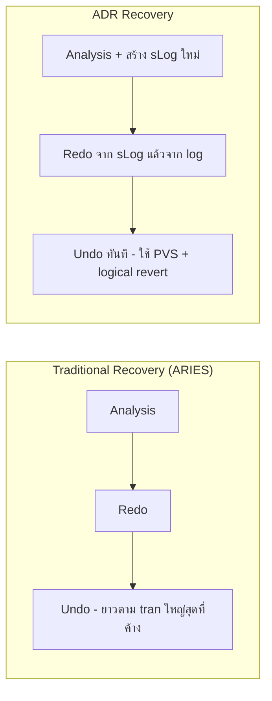

[⬅ Module 05](../../README.md) | [5.2 Locking Internals](../02_Locking_Internals/README.md) | Section 3/3 | ➡ ถัดไป: [Module 06 — Statistics & Index Internals](../../../Module_06_Statistics_Index_Internals/README.md)

# 5.3 ADR & Optimized Locking (SQL Server 2025) — โลก Optimistic ฉบับเต็ม

> *"ยุคเก่าเรากันข้อมูลด้วยการขัง (lock) — ยุคใหม่เรากันด้วยการเก็บรอยเท้าเดิมไว้ให้คนอื่นอ่าน (versioning) และปี 2025 ขั้ว lock เองก็ถูกออกแบบใหม่หมด"*

> **ต้องรู้มาก่อน**: [TID Lock](../../../Glossary.md), [Lock](../../../Glossary.md), [TempDB](../../../Glossary.md), RCSI และ SNAPSHOT Isolation (Section [5.1](../01_Concurrency_Transactions/README.md)), Lock Modes / Escalation (Section [5.2](../02_Locking_Internals/README.md)), Transaction Log & VLF (Module 2–3)
> **Permission ที่ต้องมี**: `VIEW SERVER STATE` + `VIEW DATABASE STATE` (DMV วิเคราะห์ทั้งหมด) — การสลับ database options (RCSI / ADR / OPTIMIZED_LOCKING) ต้อง `ALTER DATABASE` และ**สิทธิ์เฉพาะผู้ดูแล**; ในเดโมของหลักสูตรเรา**ไม่รัน** `ALTER DATABASE` บนเซิร์ฟเวอร์สาธิต — จะแสดง code พร้อม guard เพื่อไปรันบน VM ของผู้สอนเท่านั้น

---

## ทำไม Section ปิดโมดูลถึงเป็น "ของใหม่"

Section 5.1 วางกติกา (isolation level), 5.2 เปิดฝาห้องเครื่องฝั่ง pessimistic (lock) — Section นี้ปิดสามเหลี่ยมด้วยฝั่ง **optimistic** ที่ทำงานด้วย **Row Versioning** และฟีเจอร์ที่อาศัยมัน:

```
        Row Versioning (เก็บเวอร์ชันแถวเก่า)
           │                    │
   ┌───────┴────────┐    ┌──────┴─────────────────────┐
   │ RCSI / SNAPSHOT │    │ ADR → PVS (version store   │
   │ (5.1 และหัวข้อ 1)│    │  อยู่ใน user DB)           │
   └───────┬────────┘    └──────┬─────────────────────┘
           │                    │
           │             Optimized Locking (2025)
           │             ├── TID Locking
           │             └── LAQ (ต้องมี RCSI)
           ▼
   Reader ไม่ block, Writer ฉลาดขึ้น
```

ตัวเลขที่ต้องจับตาจากห้องเรียนนี้: บนเซิร์ฟเวอร์หลักสูตร (SQL Server 2025, 17.0.1135.8) DB `AdventureWorks` **เปิด RCSI อยู่แล้ว** แต่ ADR กับ Optimized Locking **ยังปิด** — สถานะพอดีสำหรับสอนทีละชั้น:

```sql
-- สถานะจริงของทุก database ใน instance (รันจริง: เฉพาะ AdventureWorks rcsi = 1, adr/ol = 0 ทุกตัว)
SELECT name, is_read_committed_snapshot_on AS rcsi,
       is_accelerated_database_recovery_on AS adr,
       is_optimized_locking_on AS ol
FROM sys.databases
ORDER BY name;
```

**ผลที่ได้ (รันจริง):** `AdventureWorks: rcsi=1, adr=0, ol=0`; ฐานอื่น (master/model/msdb/tempdb) ทุกค่าเป็น 0 — อ่านเพิ่มเติมได้จาก `DATABASEPROPERTYEX(DB_NAME(), 'IsOptimizedLockingOn')` ซึ่งบนเซิร์ฟเวอร์นี้คืน `0`

> **ทางเลือกสำหรับรุ่นเก่า:** หัวข้อ 3 (Optimized Locking) ต้องใช้ SQL Server 2025 (17.x) เท่านั้น — บน 2019/2022 ให้โฟกัสหัวข้อ 1–2 (RCSI/Snapshot + ADR) ซึ่งใช้ได้ครบ และใช้ RCSI ล้วนเป็นแนวทางปกป้อง reader ของระบบ

---

## 1. Row Versioning — RCSI กับ SNAPSHOT ทำงานอย่างไร

เมื่อ **Row Versioning** ทำงาน (RCSI/SNAPSHOT หรือ ADR) ทุกแถวที่ถูกแก้ไขจะถูก "ประทับ" ด้วย transaction ID ผู้แก้ และ **เวอร์ชันเก่าของแถวถูกเก็บไว้** ผู้อ่านเดินตาม chain ไปอ่านเวอร์ชันที่เก่ากว่าแทนการรอ lock:

```
Writer: UPDATE แถว X            Reader (RCSI)
   │                               │
   │ สร้างเวอร์ชันเก่าเก็บไว้          │ ตาม chain เจอเวอร์ชัน "commit ล่าสุด"
   │ แก้แถวจริง + ถือ X lock         │ ณ ต้น statement (หรือต้น tran ใน SNAPSHOT)
   │ (writer ยัง block writer!)     │ ไม่ต้องขอ S lock เลย → ไม่รอ
```

### RCSI vs SNAPSHOT — เลือกใช้อย่างไร

| ประเด็น | RCSI (`READ_COMMITTED_SNAPSHOT ON`) | SNAPSHOT (`ALLOW_SNAPSHOT_ISOLATION ON`) |
|:--------|:-------------------------------------|:------------------------------------------|
| วิธีใช้ | Database option อย่างเดียว — app ไม่ต้องแก้ | Database option **+** สั่ง `SET TRANSACTION ISOLATION LEVEL SNAPSHOT` ต่อ session |
| ข้อมูลที่อ่าน | ตั้งแต่ commit ล่าสุด **ณ ต้น statement** | commit ล่าสุด **ณ ต้น transaction** (ทั้ง tran เห็นภาพเดิม) |
| Consistency | ระดับ statement | ระดับ transaction (non-repeatable read หาย) |
| Update conflict | ไม่มี — ฝั่งเขียนใช้ lock ปกติ | ⚠️ **Error 3960** ถ้าแก้แถวที่ถูกคนอื่นแก้และ commit ตัดหน้า → app ต้องมี retry |
| Version store ที่ใช้ | tempdb (ไม่มี ADR) / PVS (เปิด ADR) | เดียวกัน |
| Use case | ✅ OLTP ทั่วไป — Azure SQL DB เปิดเป็น default | ✅ รายงานที่ต้องการภาพนิ่งทั้ง tran, งานประเมินราคา |

> [!IMPORTANT]
> **ประเด็นสอนจากเซิร์ฟเวอร์หลักสูตร:** DB นี้เปิด RCSI แล้ว จึงไม่มีเหตุผล "เปิดซ้ำ" — แต่ `ALLOW_SNAPSHOT_ISOLATION` ยังเป็น `OFF` ตาม output ของ query แรก ใครอยากสาธิต SNAPSHOT จึงต้องเปิดใน VM ของตัวเองก่อน (code ด้านล่าง — แสดงเพื่ออธิบาย ไม่รันบนเซิร์ฟเวอร์สาธิต)

```sql
-- ⚠️ แสดงเพื่ออธิบายเท่านั้น — ห้ามรันบนเซิร์ฟเวอร์หลักสูตร (จำกัดสิทธิ์/กันกระทบสาธิตอื่น)
-- ใช้ใน VM ของผู้สอน: เปิด SI แล้วจึงสาธิต transaction-level snapshot และ error 3960 ได้
IF CAST(SERVERPROPERTY('ProductMajorVersion') AS INT) < 9
    THROW 51000, 'Row versioning isolation levels ต้องการ SQL Server 2005 (9.x) ขึ้นไป', 1;
ALTER DATABASE [AdventureWorks] SET ALLOW_SNAPSHOT_ISOLATION ON;
```

> **ตอนสอนบน VM ที่เปิด SI แล้ว** ให้เล่นสอง session: Session A เปิด `SET TRANSACTION ISOLATION LEVEL SNAPSHOT` + `BEGIN TRAN` แล้วอ่านราคา; Session B แก้ราคาและ commit; Session A อ่านซ้ำ — **ได้ค่าเดิมตลอด tran** (ต่างจาก RCSI ที่ statement ใหม่เห็นค่าใหม่ — พิสูจน์ใน 5.1 เดโม 2); จากนั้นให้ Session A พยายาม UPDATE แถวเดิม → เจอ **Error 3960** แล้วถามลูกเรียนว่า "app ต้องมีอะไร" (คำตอบ: retry logic)

### เห็น version store ทำงานจริง (tempdb — เดโมรันจริงแล้ว)

เมื่อยังไม่เปิด ADR เวอร์ชันอยู่ใน **tempdb** — จับมันกลางคันได้ด้วยการเปิด tran เขียนทิ้งไว้ แล้วอ่าน DMV ภายใน session เดียวกัน:

```sql
USE AdventureWorks;
BEGIN TRANSACTION;
    UPDATE Production.Product SET StandardCost = StandardCost WHERE ProductID = 720;
    -- แถวเวอร์ชันของแถวที่เพิ่งแก้ ยังค้างอยู่เพราะ tran ยังเปิด (reader อาจต้องอ่านเวอร์ชันเก่า)
    SELECT COUNT(*) AS version_rows FROM sys.dm_tran_version_store WHERE database_id = DB_ID();
    -- ดูข้อมูล snapshot transaction ของ session เราเอง
    SELECT transaction_sequence_num, elapsed_time_seconds
    FROM sys.dm_tran_active_snapshot_database_transactions
    WHERE session_id = @@SPID;
ROLLBACK TRANSACTION;
```

**ผลที่ได้ (รันจริง):** `version_rows = 2` (เวอร์ชันของแถวใน clustered index + nonclustered index ที่เกี่ยว) และเห็น `transaction_sequence_num` ของ tran ตัวเอง — หลัง ROLLBACK เวอร์ชันถูกตัวเก็บขยะ (version cleaner) ของ tempdb กวาดตามหลัง

```sql
-- ขนาด version store ใน tempdb (MB) — มอนิเตอร์รายวันบนระบบที่ใช้ RCSI/SI หนัก
SELECT SUM(version_store_reserved_page_count) * 8 / 1024.0 AS version_store_mb
FROM tempdb.sys.dm_db_file_space_usage;
```

**ผลที่ได้ (รันจริง):** `0.06 MB` (นิ่ง เพราะไม่มี reader ค้างขณะทดสอบ) — บนระบบจริงตัวเลขนี้กระโดดตามจำนวน writer คูณระยะเวลาที่ reader ยังอ้างเวอร์ชันเก่าอยู่ ถ้า tempdb เต็ม การอ่านอาจ fail (ไม่พบเวอร์ชัน) นี่คือ "ต้นทุนฝั่ง optimistic" ที่ต้องเฝ้า (Module 2/3: การดูแล tempdb)

---

## 2. Accelerated Database Recovery (ADR) — version store ย้ายเข้าบ้าน + undo ทันที

ADR (SQL Server 2019+) ออกแบบ recovery ใหม่ทั้งระบบ โดยอาศัย versioning แบบ "ถาวร" ใน database ผู้ใช้เอง:



| ประเด็น | Traditional | ADR |
|:---------|:------------|:----|
| เวลา recover หลัง crash | ขึ้นกับ **transaction ที่ยาว/ใหญ่ที่สุด** ที่ยังไม่ commit | **คงที่** (~วินาที) ไม่สนใจ tran ค้าง |
| Undo (rollback/KILL) | เดิน log ย้อน — tran ล้านแถว rollback นานขึ้นตามเวลา | **เกือบทันที** — ตัดธง transaction เป็น aborted แล้วให้ reader ข้ามเวอร์ชันของมัน |
| Log truncation | กัก log ตั้งแต่ oldest active tran (tran ค้าง = log บวม — จำจาก 5.1) | **truncate ก้าวร้าว** ได้แม้มี tran ยาว |

### สี่ชิ้นส่วนของ ADR ที่ต้องรู้จักตัวจริง

| ชิ้นส่วน | คืออะไร | เจอตอนไหน |
|:----------|:---------|:-----------|
| **PVS** (Persistent Version Store) | ที่เก็บเวอร์ชันแถว **ใน user database** (แทน tempdb) — เก็บบน data page เดิมหรือ internal table แยก | ตรวจขนาดด้วย `sys.dm_tran_persistent_version_store_stats` (ด้านล่าง) |
| **Logical Revert** | process พื้นหลังที่ทำ "undo แบบตรรกะ" ทีละแถวจาก PVS — ทำ rollback/undo หลัง restart ให้ทันที + ปล่อย lock ทันทีที่ transaction ถูกตัดธง aborted | สังเกตตอน KILL tran ยักษ์ — กลับมา "พร้อมใช้" ในวินาทีเดียว |
| **sLog** | สตรีม log รองใน memory เก็บเฉพาะ log ของ **non-versioned operations** (เช่น cache invalidation, lock acquisition) — เบา, ถูกเขียนลง disk ตอน checkpoint, truncate รอบตัวเมื่อ tran จบ | ทำให้ redo/undo เร็ว และ log หลัก truncate ก้าวร้าวได้ |
| **Cleaner** | process พื้นหลังกวาดเวอร์ชันเก่าที่ไม่มีใครอ้างออกจาก PVS (ตั้งแต่ 2022 ทำ multi-thread ได้ด้วย `ADR Cleaner Thread Count`) | เฝ้า PVS ไม่ยอมลด = cleaner ติด (มี tran ค้าง/aborted ค้าง) |

### เปิดใช้ ADR (แสดงเพื่ออธิบาย — ไม่รันบนเซิร์ฟเวอร์หลักสูตร)

```sql
-- ⚠️ แสดงเพื่ออธิบายเท่านั้น — รันใน VM ของผู้สอน (ต้องสิทธิ์ ALTER DATABASE และระวังช่วงเวลา switch)
IF CAST(SERVERPROPERTY('ProductMajorVersion') AS INT) < 15
    THROW 51000, 'ADR ต้องใช้ SQL Server 2019 (15.x) ขึ้นไป', 1;
ALTER DATABASE [AdventureWorks] SET ACCELERATED_DATABASE_RECOVERY = ON;
```

### มอนิเตอร์ PVS — ทักษะใช้จริงหลังเปิด ADR

```sql
-- PVS ของ database ปัจจุบัน: ขนาด, tran เก่าสุดที่กักเวอร์ชัน, จำนวน tran aborted ค้าง
USE AdventureWorks;
SELECT database_id,
       persistent_version_store_size_kb / 1024.0 AS pvs_mb,
       oldest_active_transaction_id,
       current_aborted_transaction_count
FROM sys.dm_tran_persistent_version_store_stats
WHERE database_id = DB_ID();
```

**ผลที่ได้ (รันจริง — ADR ยังปิด):** `pvs_mb ≈ 0.008`, `oldest_active_transaction_id = 0` — ค่าเศษเสี้ยวเพราะยังไม่ได้ใช้ PVS (versioning ของ RCSI อยู่ที่ tempdb ตามเดโมหัวข้อ 1); หลังเปิด ADR ตัวเลขนี้คือ "สุขภาพ" ของ ADR — โตค้างนาน = มี tran เก่า/aborted กัก (ดู `sys.dm_tran_aborted_transactions`) หรือ cleaner ทำงานไม่ทัน

```sql
-- รายชื่อ transaction ที่ถูก abort ค้าง (อัดสะสม = แรงกดดันของ PVS cleaner)
SELECT TOP (5) transaction_id, database_id, begin_time, nest_aborted
FROM sys.dm_tran_aborted_transactions;
```

**ผลที่ได้ (รันจริง):** 0 แถว — ระบบสาธิตสะอาด

> [!TIP]
> Best practices ของ ADR ที่เจอบ่อยในงาน: (1) tran ยาว/abort รัว ๆ ทำให้ PVS บวม — แก้ต้นน้ำที่ code ไม่ใช่เพิ่ม disk; (2) อย่ารวม DDL หนัก ๆ ไว้ใน tran เดียว (sLog บวม, log truncate ล่าช้า); (3) replication/CDC ปิดพฤติกรรม truncate ก้าวร้าวของ ADR อัตโนมัติ — log ต้องเผื่อเพิ่ม; (4) log เพิ่มเพราะทุกเวอร์ชันก็ถูก log ด้วย — วัด backup log ก่อน-หลังเปิด

### ของใหม่ตามรุ่น

- **SQL Server 2025: ADR ใน tempdb** — เปิด ADR ให้ tempdb ได้ เพื่อให้ rollback ของ temp table/table variable ทันทีและ tempdb log truncate ก้าวร้าว (เปิด/ปิดไม่ต้องการ exclusive lock แต่**ต้อง restart Database Engine** การตั้งค่าจึงมีผล) — เหมาะกับ workload ที่สร้าง/ทิ้ง temp object ถี่และเคยเจอ tempdb log เต็ม (มอนิเตอร์ขนาด PVS ของ tempdb ด้วย DMV ชุดเดียวกัน)
- **SQL Server 2022:** cleaner หลายเธรด, PVS page tracker ประหยัด memory, cleanup ระดับ transaction ดีขึ้น

---

## 3. Optimized Locking (SQL Server 2025) — จัดใหม่ทั้งระบบ lock

**Optimized Locking** ประกอบด้วยสองเครื่องจักร: **TID Locking** กับ **Lock After Qualification (LAQ)** — เป้าหมายเดียวกัน: **ลด lock memory, ลด blocking, ลด lock escalation, ลดบางรูปแบบของ deadlock**

| แพลตฟอร์ม | มีฟีเจอร์ | เปิด default |
|:-----------|:----------|:--------------|
| Azure SQL Database / Fabric / MI (ใหม่) | ✅ | ✅ เปิดตลอด |
| **SQL Server 2025 (17.x)** | ✅ | ❌ **ปิด** — เปิดต่อ database |
| SQL Server 2022 ลงมา | ❌ | — |

### ข้อกำหนด (สลับลำดับให้ถูก)

1. **ต้องเปิด ADR ก่อน** (PVS คือโครงสร้างที่ TID lock พิง); จะปิด ADR ต้องปิด Optimized Locking ก่อน
2. **แนะนำให้เปิด RCSI คู่กัน** — LAQ ทำงานเฉพาะเมื่อ RCSI เปิด (ไม่เปิด RCSI = ได้แค่ TID locking)
3. บน SQL Server 2025 เปิดด้วย `ALTER DATABASE ... SET OPTIMIZED_LOCKING = ON` (ต้องไม่มี connection ค้างเวลา switch)

```sql
-- ⚠️ แสดงเพื่ออธิบายเท่านั้น — ห้ามรันบนเซิร์ฟเวอร์หลักสูตร (ใช้ VM ของผู้สอน)
-- Hard guard: ฟีเจอร์นี้มีเฉพาะ SQL Server 2025 (17.x) — รุ่นเก่าจะหยุดพร้อมข้อความบอกทางเลือก
IF CAST(SERVERPROPERTY('ProductMajorVersion') AS INT) < 17
    THROW 51000, 'Optimized Locking ต้องใช้ SQL Server 2025 (17.x) — ทางเลือกรุ่นเก่า: ใช้ RCSI ล้วนตาม Section 5.1', 1;
-- ต้องเปิด ADR ก่อน / แนะนำ RCSI ด้วย / ตอนรันต้องไม่มี connection อื่นต่อ DB นี้
ALTER DATABASE [AdventureWorks] SET ACCELERATED_DATABASE_RECOVERY = ON;
ALTER DATABASE [AdventureWorks] SET OPTIMIZED_LOCKING = ON;
```

### 3.1 TID Locking — ล็อก "ผู้แก้" แทน "ของที่ถูกแก้"

หลักการ: ทุกแถวภายใต้ versioning มี **Transaction ID (TID)** ของ transaction ล่าสุดที่แก้มันประทับอยู่ — Optimized Locking เปลี่ยนเป้าของ lock:

```
Traditional (5.2):  ถือ KEY X (แถวที่แก้ทุกแถว) + PAGE IX + OBJECT IX จนจบ transaction
Optimized Locking:  แก้แถวไหนเสร็จ → ปล่อย KEY/PAGE ของแถวนั้นทันที
                    เหลือแค่ X lock คู่ TID ตัวเดียว ถือจนจบ transaction
                    คนอื่นที่จะ "รอ" มาขอ S lock บน TID ตัวเดียวกันแทน
```

- UPDATE 1,000 แถว: เดิมถือ ~1,000 KEY X จนจบ tran; ใหม่ปล่อยทีละแถวระหว่างทาง เหลือ 1 TID lock → **lock memory ลดฮวบ, escalation แทบไม่มีทางถูกเรียก**
- ข้อควรรู้: row/page locks **ยังถูกใช้ชั่วขณะ** ตอนแก้แต่ละแถว — สิ่งที่ "ไม่ค้างถึงจบ tran" ต่างหาก; และ Optimized Locking กระทบเฉพาะ DML (INSERT/UPDATE/DELETE/MERGE) — **schema lock ไม่เปลี่ยน** (Sch-M ยังดุเหมือนเดิมตาม 5.2)
- ไม่มีผลกับ temp table/tempdb ในขณะนี้

### 3.2 LAQ — ตรวจ predicate ก่อน แล้วค่อยล็อก

ปกติ (5.2) UPDATE ต้อง "ขอ U lock ทีละแถวระหว่างสแกน" เพื่อตรวจว่าแถวตรง WHERE หรือไม่ — เกิด blocking ตั้งแต่ขั้นตรวจ LAQ เปลี่ยนเป็น: **ตรวจ WHERE บนเวอร์ชัน commit ล่าสุดโดยไม่ล็อกอะไรเลย** แถวไหนไม่ตรง ข้ามไปโดยไม่ทิ้งร่องรอย; แถวไหนตรง ค่อยขอ X lock ตอนแก้ (และปล่อยทันทีหลังแก้เสร็จ)

```
Writer A: UPDATE ... WHERE a = 1 (แก้แถว 1)          Writer B: UPDATE ... WHERE a = 2 (จะสแกนหาแถว 2)
   │                                                     │
Traditional: B ต้องรอ U lock ทับกับ A ทุกแถวที่สแกนผ่าน   → BLOCKING
LAQ:         B ตรวจเวอร์ชัน commit ล่าสุดของแถว 1 เห็น a = 1 ไม่ตรง WHERE → ข้าม
             ไม่มีการรอเกิดขึ้นเลย → concurrency สูงขึ้นมาก
```

**กลไกกันพลาดของ LAQ** (ทำงานแบบ optimistic — ถ้ามีคนแก้แถวหลังเราตรวจ):

- ถ้ามี tran อื่นยังถือ X TID lock ของแถวนั้น → รอตามปกติ
- ถ้าแถวถูกแก้ไปแล้วหลังเราตรวจ → engine **ตรวจ predicate ซ้ำ (requalify)** ก่อนแก้จริง — ไม่มี error โผล่หาผู้ใช้
- ถ้า plan มี operator ที่ requalify ไม่ได้ → engine abort ภายในแล้วรันใหม่แบบไม่ใช้ LAQ (เห็นจาก XEvent `lock_after_qual_stmt_abort`); statement ที่ semantics เปลี่ยนไม่ได้ (เช่น UPDATE กำหนดค่าให้ตัวแปร, OUTPUT clause) จะ**ไม่ใช้ LAQ** ตั้งแต่ต้น
- **LAQ Feedback**: ถ้าการรันซ้ำเกิดถี่จนเปลือง engine ปิด LAQ ให้ plan นั้น/ฐานนั้นอัตโนมัติ (มีสถิติใน Query Store: `sys.query_store_plan_feedback` feature_id = 4 "LAQ Feedback")
- **ข้อจำกัดอื่น**: isolation อื่นนอกจาก READ COMMITTED, hint ฝืน lock (`UPDLOCK` ฯลฯ), columnstore, MERGE — LAQ ถูกข้าม

**ของลึกสำหรับมืออาชีพ — Skip Index Locks (SIL):** เมื่อ RCSI + LAQ ทำงานและไม่มี query แบบถือแถวนิ่ง (REPEATABLE READ/SERIALIZABLE/hint) engine ตัดการขอ X row lock และ IX page lock ออกเฉพาะ INSERT (heap) และ UPDATE บางกรณี — เหลือแค่ page latch ระดับต่ำ ยิ่งเบา

### 3.3 ข้อควรระวังด้าน "ลำดับงาน" เมื่อเปิด LAQ

เดโมแนวคิดจากเอกสาร Microsoft — tran T2 ใช้ค่าที่ T1 เพิ่งแก้เป็นเงื่อนไข:

| ช่วงเวลา | Session 1 (T1) | Session 2 (T2) |
|:----------|:----------------|:----------------|
| 1 | `BEGIN TRAN; UPDATE t4 SET b = 2 WHERE a = 1;` | |
| 2 | | `BEGIN TRAN; UPDATE t4 SET b = 3 WHERE b = 2;` |
| 3 | `COMMIT;` | |
| 4 | | `COMMIT;` |

- **ไม่มี LAQ:** T2 รอ T1 จบก่อน แล้วเห็น `b = 2` ตรงเงื่อนไข → อัปเดตสำเร็จ (`b = 3`)
- **มี LAQ:** T2 ตรวจบนเวอร์ชัน commit ล่าสุด (`b = 1`) ไม่ตรงเงื่อนไข → **ข้ามแถวเลย ไม่รอ** (`b = 2`)

ผลลัพธ์ต่างกัน! — ไม่ใช่ bug แต่คือ semantic ของ optimistic concurrency ถ้า app ออกแบบบน "ลำดับเข้มงวด" ต้องใช้ isolation เข้มขึ้น (REPEATABLE READ/SERIALIZABLE) หรือ hint โดยตรง

### 3.4 สังเกต TID lock ด้วยมือ (query รันได้บนทุกสถานะ)

```sql
-- ระหว่าง transaction เขียนค้าง ให้ Session C รัน: ดู lock ชนิด XACT (TID) ของ session นั้น
USE AdventureWorks;
BEGIN TRANSACTION;
    UPDATE Production.Product SET StandardCost = StandardCost WHERE ProductID = 720;
    SELECT resource_type, request_mode, resource_description
    FROM sys.dm_tran_locks
    WHERE request_session_id = @@SPID
      AND resource_type IN ('PAGE','RID','KEY','XACT');
ROLLBACK TRANSACTION;
```

**ผลที่ได้ (รันจริงบน DB ที่ยังไม่เปิด Optimized Locking):** เห็น `KEY (X)` + `PAGE (IX)` ตามตำรา 5.2 — **ไม่มีแถว XACT** หลังเปิด Optimized Locking ใน VM ของผู้สอน ผลของ query เดียวกันจะเปลี่ยนเป็นแถวเดียว: `XACT (X)` — TID lock นั่นเอง นี่คือใบเบิกความจริงที่ใช้เทียบ "ก่อน/หลัง" ได้ทันที

### 3.5 Wait types ใหม่ที่มากับ Optimized Locking

คนที่ "รอ TID lock" จะไม่ได้ wait `LCK_M_S` แบบเก่า แต่ได้ตระกูลใหม่ — ตรวจได้ว่ามีอยู่ในเซิร์ฟเวอร์นี้แล้ว:

```sql
-- บัญชีการรอตระกูล LCK_M ทั้งหมด (รันจริง: เห็น LCK_M_X/U/S/SCH_M ตามเดโมของเรา)
-- และมีแถว LCK_M_S_XACT, LCK_M_S_XACT_READ, LCK_M_S_XACT_MODIFY อยู่ในระบบแล้ว (ยัง 0 ครั้ง เพราะ OL ยังปิด)
SELECT wait_type, waiting_tasks_count, wait_time_ms / 1000.0 AS wait_s
FROM sys.dm_os_wait_stats
WHERE wait_type LIKE 'LCK_M%'
ORDER BY wait_time_ms DESC;
```

| Wait | หมายถึง |
|:-----|:---------|
| `LCK_M_S_XACT` | รอ S lock บน XACT resource (TID) — เจตนาไม่ชัด |
| `LCK_M_S_XACT_READ` | รอ TID lock เพื่อ **อ่าน** |
| `LCK_M_S_XACT_MODIFY` | รอ TID lock เพื่อ **แก้ไข** — ตีความได้ลึกกว่าเดิมว่าผู้รอ "จะทำอะไร" |

นอกจากนี้ XEvent `locking_stats` (ยิงทุกไม่กี่นาที ต่อ database) รายงานว่า TID locking / LAQ เปิดหรือไม่ มี escalation กี่ครั้ง LAQ ถูกข้ามเพราะอะไร — ติดตั้ง session สั้น ๆ ไว้เก็บ baseline ได้ (Module 9)

---

## 4. วินิจฉัย Concurrency ฉบับปี 2025

หลักการเดิมจาก Module 1 + 5.2 ยังใช้ครบ แต่ลำดับการตีความปรับตามฟีเจอร์ที่เปิด:

```sql
-- ขั้นที่ 1: มี blocking อยู่ไหมตอนนี้ (0 แถว = สะอาด)
SELECT session_id, blocking_session_id, wait_type, wait_time, wait_resource
FROM sys.dm_exec_requests
WHERE blocking_session_id <> 0;
```

ลำดับคิดของผู้วินิจฉัย:

1. **แปล wait_resource ก่อน** — `KEY: 5:72057594054049792 (...)` = lock ระดับแถวแบบเดิม; `XACT: ...` = คนรอ TID lock (เกิดได้เฉพาะเปิด Optimized Locking — ตีความว่า "รอ writer ตัวจริงจบ tran" ตรง ๆ)
2. **เปิด Optimized Locking แล้ว `LCK_M_*` ยังสูง?** → ปัญหาที่เหลือคือ **write transaction ที่ยาวจริง ๆ** (ผู้ถือ TID lock) — ไล่ด้วย query active transaction ของ 5.1; พร้อมกันนั้นเฝ้า **PVS** (ถ้าเปิด ADR) เพราะ tran ยาวกักทั้งเวอร์ชันและการ truncate log
3. **ระวังผลข้างเคียง LAQ** — workload ที่ "อ่านแล้วเขียนตาม" ต่อกันหลาย statement อาจได้ผลลัพธ์ต่างจากเดิม (หัวข้อ 3.3) — ใช้ `locking_stats` + `lock_after_qual_stmt_abort` ตรวจ, ปรับ isolation เข้มขึ้นเฉพาะจุดที่ต้องลำดับเข้ม
4. Deadlock ยังอ่านจาก `system_health` event_file ตาม 5.2 (กราฟใหม่รายงาน `<xactlock>` ของ TID ให้ด้วยเมื่อเปิด OL)

> ต้นทางอ้างอิงทุกข้อ: [Optimized locking — Microsoft Learn](https://learn.microsoft.com/sql/relational-databases/performance/optimized-locking) · [Transaction locking and row versioning guide](https://learn.microsoft.com/sql/relational-databases/sql-server-transaction-locking-and-row-versioning-guide) · [Accelerated database recovery concepts](https://learn.microsoft.com/sql/relational-databases/accelerated-database-recovery-concepts)

---

## สรุป Section 5.3

1. **Row Versioning คือฐานของโลก optimistic** — RCSI (statement-level, สำหรับ OLTP) กับ SNAPSHOT (transaction-level + error 3960) เลือกตามความต้องการ consistency; version store อยู่ tempdb เมื่อไม่เปิด ADR
2. **ADR ย้าย version store มาเป็น PVS ใน user DB** แล้วเล่นทริกเด็ด: undo ทันที (logical revert), log truncate ก้าวร้าว (sLog) — แลกด้วยการเฝ้า PVS, cleaner และ log ที่เพิ่มจากการ log ทุกเวอร์ชัน; ปี 2025 ขยายไป tempdb
3. **Optimized Locking (2025, ปิด default บน on-prem) = TID locking + LAQ** — ต้องเปิด ADR ก่อน แนะนำ RCSI คู่กัน; lock memory และ escalation ลดมาก blocking จาก DML หายไปมาก แต่ schema lock และ "writer block writer" ที่แถวเดียวกันยังเดิม
4. **LAQ เปลี่ยนพฤติกรรมผลลัพธ์ได้** กับ workload ที่พึ่งลำดับเข้มงวด — รู้จัก requalification, LAQ feedback และข้อจำกัด (hint, columnstore, OUTPUT, MERGE)
5. **เครื่องมือวัดใหม่**: XACT resource + wait `LCK_M_S_XACT*`, XEvent `locking_stats`/`lock_after_qual_stmt_abort`, DMV PVS และ `sys.dm_tran_aborted_transactions`

### ตรวจความเข้าใจ

1. บน DB ที่เปิด RCSI อยู่แล้ว (อย่างเซิร์ฟเวอร์หลักสูตร) เวอร์ชันแถวเก่าถูกเก็บที่ไหน — และเปลี่ยนไปที่ไหนเมื่อเปิด ADR?
2. RCSI กับ SNAPSHOT ต่างกันตรง "จุดตัดเวลา" ที่ใด และทำไม SNAPSHOT ถึงมี Error 3960 แต่ RCSI ไม่มี?
3. ADR ทำให้ rollback ทันทีได้อย่างไร — logical revert ทำงานกับ PVS อย่างไร และ sLog เก็บ log ชนิดใด?
4. เงื่อนไขก่อนเปิด Optimized Locking มีอะไรบ้าง (เรียงลำดับ) — และทำไมหัวข้อนี้ถึงห้ามเกิดกับ SQL Server 2022?
5. หลังเปิด Optimized Locking แล้วอัปเดต 10,000 แถวใน tran เดียว — ระหว่าง tran ค้าง `sys.dm_tran_locks` จะเห็นอะไรต่างจากเดิม และคนที่มารอจะโชว์ wait type ใด?
6. เดโม LAQ (T1/T2) ทำไม T2 ถึงไม่อัปเดตแถวที่ T1 เพิ่งแก้ — ถ้า app ต้องการผลแบบ "รอแล้วอัปเดต" จะทำอย่างไร?

**➡ ถัดไป:** [Module 06 — Statistics & Index Internals](../../../Module_06_Statistics_Index_Internals/README.md)

---

[⬅ ก่อนหน้า: 5.2 Locking Internals](../02_Locking_Internals/README.md) | [🧪 Labs](../../Labs/README.md) | [📖 Module 05 Overview](../../README.md) | ➡ [Module 06](../../../Module_06_Statistics_Index_Internals/README.md)
