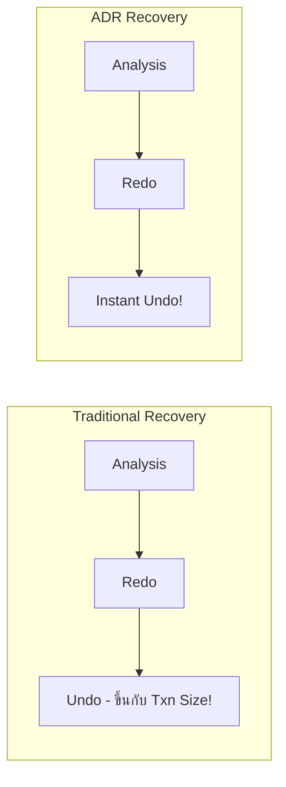

[⬅ Module 5_](../../README.md) | Section 3/3

## Modern Concurrency Features

### 4.1 Row Versioning-Based Isolation Levels

SQL Server รองรับ 2 รูปแบบของ Row Versioning:

#### RCSI vs Snapshot Isolation

| Feature | READ_COMMITTED_SNAPSHOT (RCSI) | SNAPSHOT Isolation |
|:--------|:------------------------------|:-------------------|
| **เปิดใช้งาน** | Database option | Database option + Session level |
| **Scope** | Statement-level consistency | Transaction-level consistency |
| **ข้อมูลที่อ่าน** | Committed ณ ตอนเริ่ม Statement | Committed ณ ตอนเริ่ม Transaction |
| **Update Conflicts** | ไม่มี (ใช้ Lock ปกติ) | ⚠️ มี! (Error 3960 หากแก้ไขข้อมูลที่ถูกเปลี่ยนระหว่าง Transaction) |
| **Use Case** | ✅ OLTP ทั่วไป, Azure SQL Default | 📊 Report ที่ต้องการ Consistent View |

```sql
-- เปิดใช้ RCSI (แนะนำสำหรับ OLTP)
ALTER DATABASE [YourDB] SET READ_COMMITTED_SNAPSHOT ON;

-- เปิดใช้ Snapshot Isolation
ALTER DATABASE [YourDB] SET ALLOW_SNAPSHOT_ISOLATION ON;

-- ใช้งาน Snapshot ใน Session
SET TRANSACTION ISOLATION LEVEL SNAPSHOT;
```

> [!TIP]
> **Azure SQL Database** เปิด RCSI เป็น **Default** ตั้งแต่แรก!

### 4.2 Version Store Location

| Configuration | Version Store Location | Notes |
|:--------------|:----------------------|:------|
| **RCSI/Snapshot (No ADR)** | TempDB | ⚠️ ต้องดูแล TempDB size |
| **ADR Enabled** | User Database (PVS) | ✅ Persistent Version Store |

> [!WARNING]
> **TempDB Full = Version Store Problems!**
> - Read operations อาจ fail (ไม่พบ version)
> - Monitor `tempdb` space และ `version_store_reserved_page_count`

---

---

## Accelerated Database Recovery (ADR)

(Feature ตั้งแต่ SQL Server 2019 เป็นต้นไป)

### 5.1 Traditional vs ADR Recovery



| Aspect | Traditional | ADR |
|:-------|:------------|:----|
| **Undo Time** | ขึ้นกับขนาด/จำนวน Uncommitted Txns | ✅ **Constant time** (~วินาที) |
| **Log Truncation** | ต้องรอ Oldest Active Txn | ✅ ไม่ต้องรอ (สามารถ Truncate ได้เร็ว) |
| **Version Store** | TempDB | ✅ **PVS in User Database** |

### 5.2 เปิดใช้งาน ADR

```sql
-- เปิด ADR
ALTER DATABASE [YourDB] SET ACCELERATED_DATABASE_RECOVERY = ON;

-- ตรวจสอบสถานะ
SELECT name, is_accelerated_database_recovery_on
FROM sys.databases
WHERE name = 'YourDB';

-- ดู PVS size
SELECT 
    DB_NAME(database_id) AS [Database],
    persistent_version_store_size_kb / 1024 AS [PVS Size (MB)]
FROM sys.dm_tran_persistent_version_store_stats;
```

> [!NOTE]
> **ADR เป็น Prerequisite สำหรับ Optimized Locking (SQL 2022)**

---

---

[⬅ ก่อนหน้า](../../README.md) | [Module 5_ README](../../README.md) | [🧪 Labs](../../Labs/README.md)
