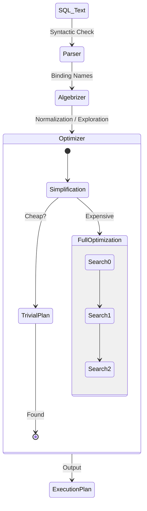

[⬅ Module 7_](../../README.md) | Section 1/4 | ➡ ถัดไป: [Execution Plan Formats](../02_Execution_Plan_Formats/README.md)

## Query Optimizer Internals (Lesson 1)

### 2.1 Logical vs Physical Processing

**Query Optimizer** คือ Component ที่รับผิดชอบในการเลือก **Execution Plan** ที่มี Cost ต่ำที่สุด จาก Plan ที่เป็นไปได้หลายพันแบบ

> **ทำไมสำคัญ?** Query เดียวกันอาจมีหลาย Plan (Index Seek vs Scan, Nested Loop vs Hash Join) ถ้า Optimizer เลือกผิด → Query ช้า 100x-1000x

**กระบวนการ Query Processing:**

```
SQL Text → Parsing → Binding (Algebrizer) → Optimization → Execution
              ↓            ↓                      ↓
         Syntax Check   Name Resolution    Find Best Plan
```

| Phase | หน้าที่ | Output |
|-------|--------|--------|
| **Parsing** | ตรวจสอบ Syntax ของ SQL | Parse Tree |
| **Binding** | เชื่อม Object Names กับ Metadata | Query Tree |
| **Optimization** | คำนวณ Cost, เลือก Plan ดีที่สุด | Execution Plan |
| **Execution** | ดำเนินการตาม Plan | Result Set |

### 2.2 Optimization Phases
Optimizer มีเป้าหมายในการหา "Good Enough Plan" อย่างรวดเร็ว โดยแบ่งขั้นตอนดังนี้:
1.  **Simplification**: การลดรูป Query (เช่น เปลี่ยน Subquery เป็น Join, ตัด Join ที่ไม่จำเป็น)
2.  **Trivial Plan**: สำหรับ Query พื้นฐานที่มีทางเลือกเดียว (เช่น `SELECT * FROM Table` โดยไม่มี Where clause ซับซ้อน)
3.  **Full Optimization**:
    *   *Search 0 (Transaction Processing)*: ค้นหา Plan พื้นฐานสำหรับ Simple OLTP (Cost ต่ำ)
    *   *Search 1 (Quick Plan)*: ประยุกต์ใช้กฎการ Transformation ทั่วไป
    *   *Search 2 (Full Optimization)*: การค้นหาเชิงลึก รวมถึงการพิจารณา Parallelism และ Indexed Views (ใช้ทรัพยากรและเวลามากที่สุด)

### 2.3 Optimization Pipeline (Visualized)


---

---

[⬅ ก่อนหน้า](../../README.md) | [Module 7_ README](../../README.md) | ➡ ถัดไป: [Execution Plan Formats](../02_Execution_Plan_Formats/README.md) | [🧪 Labs](../../Labs/README.md)
