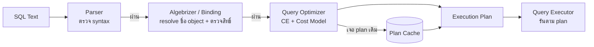

[⬅ Module 07](../../README.md) | Section 1/4 | ➡ ถัดไป: [02 Execution Plan Formats](../02_Execution_Plan_Formats/README.md)

# 7.1 Query Optimizer — สมองที่เลือก "ทางเดิน" ของทุกคิวรีก่อนอ่านข้อมูลแม้แต่แถวเดียว

> *"SQL เป็นภาษา declarative — คุณบอกว่า 'ต้องการอะไร' ไม่ได้บอกว่า 'ทำอย่างไร' ผู้ตัดสินว่าจะทำอย่างไรคือ Query Optimizer และมันตัดสินใจจากการเดาที่เรียกว่า Cost"*

> **ต้องรู้มาก่อน**: [Cardinality Estimation (CE)](../../../Glossary.md), [Execution Plan](../../../Glossary.md), [Statistics](../../../Glossary.md), [Plan Cache](../../../Glossary.md) — ถ้ายังไม่เคยอ่านโครง engine ให้ย้อนไป [Module 1 Section 1.1](../../Module_01_Architecture_Scheduling_Waits/Sections/01_Engine_Architecture_SQLOS/README.md) (แผนภาพ "Optimizer ดู Statistics แล้วสร้าง Plan") และ [Module 6 Section 6.1](../../Module_06_Statistics_Index_Internals/Sections/01_Statistics_Cardinality_Estimation/README.md) คือวัตถุดิบที่ Optimizer ใช้กิน
> **สภาพแวดล้อมทดสอบ**: SQL Server 2025 RTM-GDR (17.0.1135.8), ฐานข้อมูล `AdventureWorks` (compat 170, เปิด Query Store) — ถ้า VM ของคุณชื่อ `AdventureWorks2025` ให้แก้ `USE` — ตัวเลข Expected ทั้งหมดรันจริงเมื่อ 2026-10-02

---

## เปิดเรื่อง: คิวรีหนึ่งคำถาม มีคำตอบได้หลายพันทาง

คิวรีที่ join 5 ตาราง + filter + group by อาจถูกประกอบเป็น execution plan ได้ **นับล้านรูปแบบ** — เข้า `SalesOrderDetail` ก่อนหรือ `SalesOrderHeader` ก่อน? Nested Loops หรือ Hash? ใช้ index ไหน? ทำงานขนานหรือไม่? Optimizer ไม่มีทางลอง "ทำจริง" ทุกแบบ มันจึงเป็น **cost-based optimizer**: ประเมิน cost (โดยประมาณ) ของแผนผู้สมัครด้วย **cost model** แล้วหยุดที่ plan แรกที่ "ดีพอ" — ไม่ใช่ plan ที่ดีที่สุดในจักรวาล

เส้นทางของ Section:

1. **Query Processing Pipeline** — คิวรีเดินผ่านอะไรมาบ้างก่อนถึงมือ Optimizer
2. **Trivial Plan vs Full Optimization** — เส้นแบ่ง "คิวรีง่าย" กับ "คิวรีที่ต้องคิด" และ Search 0/1/2
3. **Cost Model และหลักฐานจากระบบจริง** — อ่านตัวเลข cost ของเครื่องตัวเองจาก DMV
4. **Time Out และ Early Abort** — เมื่อ Optimizer "ยอมแพ้" อย่างมีศักดิ์ศรี
5. **CE กระทบ Plan อย่างไร** — ทดลองจริง: เดาผิด 2.5 เท่า เพราะแค่ใช้ตัวแปรแทนค่าตรง

> **หมายเหตุสภาพแวดล้อม:** ทุกบล็อก SQL ใน section นี้รันผ่านและถูกบันทึกผลจริงบน VM หลักสูตร — DMV บางตัว (เช่น `sys.dm_exec_query_optimizer_info`, `sys.query_store_plan`) อ่านได้ด้วยสิทธิ์ `VIEW SERVER STATE` / `VIEW DATABASE STATE` ตามลำดับ และไม่แก้ configuration ใด ๆ

---

## 1. Query Processing Pipeline — จากข้อความ SQL สู่ Execution Plan

**นิยามก่อนใช้:** **Pipeline** คือลำดับขั้นที่คิวรีทุกตัวต้องเดินผ่านก่อนได้ผลลัพธ์ — แต่ละขั้นมีหน้าที่ต่างกันชัดเจน และ **ประเภทของ error ที่คุณเจอ** บอกได้ทันทีว่าคิวรี "ตาย" ที่ขั้นไหน



| ขั้น | หน้าที่ | ผลลัพธ์ | Error ที่เจอถ้าพัง |
|:-----|:--------|:--------|:-------------------|
| **Parsing** | ตรวจ syntax ของข้อความ SQL | Parse Tree | `Msg 102: Incorrect syntax near ...` |
| **Binding (Algebrizer)** | resolve ชื่อ table/column กับ metadata, ตรวจสิทธิ์ | Query Tree (Bound Tree) | `Msg 207: Invalid column name ...` |
| **Optimization** | ประเมิน CE → สร้าง/เทียบ plan ผู้สมัครด้วย cost model | Execution Plan | (ไม่ error แต่ได้ plan แย่ = ปัญหาของ module นี้) |
| **Execution** | รันตาม plan ทีละ operator | Result Set | Runtime error เช่น conversion ล้มเหลว |

ทดลองจริง — สังเกตว่าบรรทัดที่ 1-2 ถูกคอมเมนต์ไว้ (ปลดคอมเมนต์เพื่อเห็น error ของแต่ละขั้น) และบรรทัดที่ 3 คือคิวรีที่ผ่านทั้ง parse และ bind:

```sql
-- (1) ขั้น Parsing: syntax พังก่อนจะแตะ metadata เลย
-- SELECT FRM Sales.SalesOrderHeader;                 -- Msg 102: Incorrect syntax near 'FRM'
-- (2) ขั้น Binding: syntax ถูก แต่ชื่อคอลัมน์ไม่มีจริง
-- SELECT NoSuchColumn FROM Sales.SalesOrderHeader;   -- Msg 207: Invalid column name 'NoSuchColumn'
-- (3) ผ่าน Parse + Bind → Query Tree ถูกส่งต่อให้ Optimizer
SELECT TOP (3) SalesOrderID, OrderDate
FROM Sales.SalesOrderHeader
ORDER BY SalesOrderID DESC;
```

**Expected:** ได้ 3 แถว (SalesOrderID 75123–75121, OrderDate 2025-06-29 — ข้อมูล sample จบที่ 2025-06-29) ปลดคอมเมนต์บรรทัด (1) จะ error ที่ Msg 102 ทันทีโดยไม่มีการอ่าน metadata; บรรทัด (2) error Msg 207 — เพราะ parse ผ่านแล้วจึงเข้าถึง schema เพื่อเช็กชื่อคอลัมน์

### Plan Cache — ผลลัพธ์ของ Optimization ถูกเก็บกลับมาใช้

**นิยามก่อนใช้:** **Plan Cache** คือพื้นที่ใน Buffer Pool ที่เก็บ compiled plan เพื่อ reuse กับคิวรีที่เหมือนกัน ไม่ต้อง optimize ซ้ำ (ประหยัด CPU) — แบ่งเป็น store ย่อย ๆ ตามชนิดของ batch:

| Store | รหัส | เก็บอะไร |
|:------|:-----|:---------|
| Object Plans | `OBJCP` | plan ของ persisted object: stored procedure, function, trigger |
| SQL Plans | `SQLCP` | plan ของ ad-hoc / dynamic / prepared / autoparameterized query |
| Bound Trees | `PHDR` | algebrizer tree ของ view/constraint/default (ไม่ใช่ plan) |

จุดเชื่อมกับ Module 8 (Query Store): Query Store คือ "plan cache ที่ยาวอายุกว่า" — เก็บ plan + runtime stats ลง disk ต่อฐานข้อมูล ทำให้วิเคราะห์ย้อนหลังและ force plan ได้ ส่วน plan cache เป็น memory เท่านั้น รีสตาร์ตแล้วหาย

> [!IMPORTANT]
> คิวรี ad-hoc ที่ไม่ผ่าน parameterization เช่น `WHERE CustomerID = 29825` เขียนค่าตรง ๆ ใน text จะได้ plan แยกกันทุกค่า — นี่คือรากของปัญหา plan cache bloat และเหตุผลของ `sp_executesql` (มีต่อ Section 7.4)

### 1.1 Parameterization — ทำไม "plan reuse" จึงเป็นทั้งของขวัญและบทลงโทษ

**นิยามก่อนใช้:** **Parameterization** คือกระบวนการเปลี่ยนค่าคงที่ในคิวรี (`= 29825`) ให้เป็น parameter (`= @1`) เพื่อให้ plan ตัวเดียวรองรับค่าต่าง ๆ ได้ — SQL Server ทำเองในขอบเขตจำกัด เรียกว่า **Simple Parameterization** (เช่น predicate บนคอลัมน์ตัวเลขง่าย ๆ) ส่วนค่า string หรือคิวรีซับซ้อนจะถูกปล่อยเป็น ad-hoc ต่อ

ผลของมันมองเห็นได้จาก cache จริง — `sys.dm_exec_cached_plans` จัดกลุ่ม plan ตาม `objtype` (`Adhoc` = plan ที่สั่งรันแบบเขียนค่าตรง, `Prepared` = plan ที่ถูก parameterize/prepare, `Proc` = proc):

```sql
SELECT cp.objtype, COUNT(*) AS plan_count,
       SUM(CAST(cp.size_in_bytes AS BIGINT)) / 1024 AS total_kb
FROM sys.dm_exec_cached_plans AS cp
GROUP BY cp.objtype
ORDER BY plan_count DESC;
```

**Expected (รันจริง, 2026-10-02 — ตัวเลขตาม workload บนเครื่องนั้น):**

| objtype | plan_count | total_kb |
|:--------|-----------:|---------:|
| Adhoc | **1,000** | 179,416 |
| View | 321 | 56,504 |
| Prepared | 75 | 7,800 |
| Proc | 13 | 1,784 |

อ่านผลแบบมืออาชีพ: plan ชนิด `Adhoc` มากกว่า `Prepared` กว่า 10 เท่าและกิน memory มหาศาล — นี่คือ **plan cache bloat** แบบคลาสสิกของ workload ที่ app ส่ง SQL แบบเขียนค่าตรง (เช่น ORM ที่ไม่ parameterize) — แต่ละค่าที่ต่างกัน = plan ใหม่ = optimize ใหม่ทุกครั้ง ทั้งที่รูปร่างคิวรีเหมือนกัน ทางแก้เชิงระบบคือทำให้ app/สคริปต์ส่ง parameter (proc, `sp_executesql`, prepared statement) ซึ่งเป็นพื้นฐานที่ทำให้ IQP ฝั่ง cache (Section 7.4) ทำงานได้ครบ

> [!TIP]
> เชื่อมกับขั้น Binding: plan เป็นของ "บริบทการ compile" ด้วย — คิวรีเดียวกัน compile ใน database คนละตัว (หรือ SET option ต่างกัน เช่น `ANSI_NULLS`) จะได้ cache entry แยกกัน จึงอย่าประหลาดใจเมื่อเห็น plan "ซ้ำ" ใน cache

---

## 2. Trivial Plan vs Full Optimization — Optimizer ตัดสินใจเร็วเมื่อไม่มีทางเลือก

**นิยามก่อนใช้:** **Trivial Plan** คือ plan ที่เกิดจากคิวรีที่มีทางเลือก "เดียว" ทาง implementation — Optimizer ไม่ต้องเรียก cost model ก็ตอบได้ว่าต้องทำอะไร (เช่น `SELECT * FROM ตารางเดียว` — ไม่มี index ไหนจะช่วย filter ได้เพราะไม่มี predicate) จึงเร็วมากและแทบไม่มีทาง "ผิด"

ลำดับการทำงานของ Optimizer เมื่อได้รับ Query Tree:

1. **Simplification** — ลดรูปคิวรีก่อน: push predicate, ตัด join ที่ไม่มีใครอ้างคอลัมน์, fold constant, รวม subquery
2. **เช็ก Trivial Plan** — ถ้าคิวรีง่ายจนมีทางเดียว → จบทันที (`StatementOptmLevel = TRIVIAL`)
3. **Full Optimization** — ถ้ามีทางเลือกหลายทาง → เดิน Search stages ตามลำดับและหยุดเมื่อเจอ "plan ดีพอ":

| Stage | ชื่อเล่น | ลักษณะงาน | หยุดเมื่อ |
|:------|:---------|:----------|:---------|
| **Search 0** | Transaction Processing | แผนตรงไปตรงมา, ส่วนใหญ่ seek ตาม index, cost ต่ำ | cost ของ plan ดีพอสำหรับ OLTP |
| **Search 1** | Quick Plan | ใช้ transformation rules ทั่วไป (join reordering ระดับหนึ่ง) | เจอ plan ที่ cost ต่ำกว่า threshold |
| **Search 2** | Full Optimization | ค้นเชิงลึก รวม parallelism, indexed views, ทุกตระกูล rule | หมดเวลา/หมดขอบเขต → คืน plan ที่ถูกสุดที่เจอ |

ทดลองจริง — เทียบคิวรี "ทางเดียว" กับคิวรี "ต้องคิด":

```sql
-- (A) Trivial plan: ตารางเดียว ไม่มี predicate — ไม่มีทางเลือกให้ต้องคิด
SELECT TOP (5) * FROM Person.Person;
GO
-- (B) Full optimization: join 2 ตาราง + range predicate + aggregate
--     → ต้องเลือก access path, join order, join algorithm, อาจขนาน
SELECT soh.CustomerID,
       COUNT_BIG(DISTINCT soh.SalesOrderID) AS orders,
       SUM(sod.LineTotal) AS total_due
FROM Sales.SalesOrderHeader AS soh
JOIN Sales.SalesOrderDetail AS sod ON sod.SalesOrderID = soh.SalesOrderID
WHERE soh.OrderDate >= '2024-07-01'
GROUP BY soh.CustomerID;
GO
```

**Expected (รันจริง, 2026-10-02):** (A) คืน 5 แถวแรกทันที plan เป็น clustered index scan + Top; (B) คืน ~7,000 กลุ่มลูกค้า ใช้เวลาระดับวินาที — เปิด Ctrl+M แล้วคลิก operator นอกสุด จะเห็น `StatementOptmLevel` ที่ panel Properties: (A) = `TRIVIAL`, (B) = `FULL`

### หลักฐานจาก Query Store ทั้งฐาน — ระดับ optimization ของ plan ทั้งหมด

บล็อกนี้ใช้ `WITH XMLNAMESPACES` (ประกาศ namespace ของ Showplan XML เพื่อให้ XQuery มองเห็น node) และ XQuery attribute path `/ShowPlanXML/BatchSequence/Batch/Statements/StmtSimple/@StatementOptmLevel` — เหตุผลที่ใช้ path เต็มจากรากแทน `//` สั้น ๆ: กันความคลาดเคลื่อนเรื่อง child-vs-descendant (ดูเคสเตือนใน [Labs Exercise 1](../../Labs/README.md#exercise-1-implicit-conversion-non-sargable)) — อ่านเพิ่มที่ [Glossary](../../../Glossary.md)

```sql
WITH XMLNAMESPACES (DEFAULT 'http://schemas.microsoft.com/sqlserver/2004/07/showplan'),
PlanProps AS (
    SELECT CAST(p.query_plan AS XML).value(
               '(/ShowPlanXML/BatchSequence/Batch/Statements/StmtSimple/@StatementOptmLevel)[1]', 'NVARCHAR(40)') AS opt_level,
           CAST(p.query_plan AS XML).value(
               '(/ShowPlanXML/BatchSequence/Batch/Statements/StmtSimple/@StatementOptmEarlyAbortReason)[1]', 'NVARCHAR(40)') AS early_abort
    FROM sys.query_store_plan AS p
)
SELECT opt_level, early_abort, COUNT(*) AS plan_count
FROM PlanProps
GROUP BY opt_level, early_abort
ORDER BY plan_count DESC;
```

**Expected (รันจริง 2026-10-02, Query Store ของ AdventureWorks บน VM ใช้ร่วม — ตัวเลขจะต่างเล็กน้อยตาม workload):**

| opt_level | early_abort | plan_count |
|:----------|:------------|-----------:|
| FULL | GoodEnoughPlanFound | 966 |
| TRIVIAL | NULL | 221 |
| FULL | NULL | 198 |
| FULL | **TimeOut** | 64 |
| NULL | NULL | 32 |

อ่านผลแบบมืออาชีพ:

1. `FULL + GoodEnoughPlanFound` มากที่สุด — นี่คือ **เป้าหมายของ optimizer ที่ทำงานถูกต้อง**: หยุดทันทีที่ได้ plan ดีพอ ไม่เสียเวลาหา "ดีที่สุด"
2. `TRIVIAL` 221 plan — คิวรีง่ายจำนวนมาก (ส่วนใหญ่เป็น metadata query ของ SSMS และคิวรีตารางเดียว)
3. `FULL + TimeOut` **64 plan** — optimizer หมดเวลาคิดแล้วคืน plan ที่ดีที่สุดที่คิดได้ ณ เวลานั้น (ต่อในหัวข้อ 4)

---

## 3. Cost Model — ภาษาที่ Optimizer ใช้ตัดสิน

**นิยามก่อนใช้:** **Cost Model** คือสูตรประมาณ "ต้นทุน" ของแต่ละ operator จาก (1) จำนวนแถวที่ CE เดา (2) ขนาดแถว (3) ชนิด operator (sequential read แพงกว่า random read เท่าไร ฯลฯ) — cost ที่คุณเห็นใน plan (`Estimated Subtree Cost`) **ไม่ใช่หน่วยวินาที** เป็นหน่วยสัมพัทธ์ภายในที่เทียบ plan กับ plan เท่านั้น

กติกาที่ต้องจำ:

- Cost รวมของ plan ประกอบจาก subtree cost ของทุก operator — operator ที่ subtree cost กินสัดส่วนมากที่สุด = **จุดที่ควรโฟกัสก่อน**
- Cost model "มองไม่เห็น" ของจริงบางอย่าง: สถานะ memory ปัจจุบัน, การแย่ง lock จริง, ความเร็ว storage ที่แปรผัน — จึงมักถูกวิจารณ์ว่า cost "ผิดจากความจริง" แต่มันต้องแค่ **เทียบผิดน้อยกว่า plan อื่น** ก็ใช้ได้
- ตัวเลข cost มีผลต่อการตัดสินใจเชิงระบบด้วย เช่น **Cost Threshold for Parallelism** (ค่า default 5 — แนะนำปรับบน server จริง แต่เกินขอบเขตแล็บนี้ อ่านต่อ Module 8)

ตัวเลข cost model "จากปาก optimizer เอง" — `sys.dm_exec_query_optimizer_info` คือ DMV ที่รวมสถิติการ optimize ทั้ง instance (ค่าสะสมตั้งแต่ restart, อ่านอย่างเดียว ไม่กระทบอะไร):

```sql
SELECT counter, occurrence, value
FROM sys.dm_exec_query_optimizer_info
WHERE counter IN ('optimizations', 'trivial plan', 'search 0', 'search 1', 'search 2',
                  'timeout', 'final cost', 'maximum DOP', 'elapsed time')
ORDER BY counter;
```

**Expected (รันจริง 2026-10-02):**

| counter | occurrence | value |
|:--------|-----------:|------:|
| elapsed time | 2,330 | 0.0155 (avg วินาที/การ optimize) |
| final cost | 2,330 | 872.66 (avg cost ของ plan ที่เลือก) |
| maximum DOP | 2,330 | 3.97 |
| optimizations | 2,330 | 1 |
| search 0 | 376 | 1 |
| search 1 | 1,473 | 1 |
| search 2 | 0 (tasks 95) | NULL |
| timeout | 34 | 1 |
| trivial plan | 481 | 1 |

อ่านผลแบบมืออาชีพ:

1. 2,330 การ optimize ตั้งแต่ restart — เฉลี่ย 15.5 ms ต่อครั้ง ถูกมาก แต่ **ทบต้นกับ workload แรง ๆ แล้วไม่ถูก** (compile storm ดูต่อ Section 7.4)
2. `search 1` (1,473) โดนใช้บ่อยที่สุด, `search 2` เกือบไม่ถูกใช้เป็น stage จบ — ตามดีไซน์ "หยุดเร็วเมื่อพอ"
3. `trivial plan` 481 ครั้ง ≈ 20% ของการ optimize ทั้งหมดเป็นคิวรีง่ายที่ตัดตอนเสร็จ
4. `timeout` 34 ครั้ง — มีจริงบน server นี้ด้วย

> [!NOTE]
> ค่าทั้งหมดเป็นค่าสะสมตั้งแต่ restart จึงเทียบ trend ได้เฉพาะในหน้าต่างเวลาเดียวกัน — หลัก "อ่านแบบ delta" เดียวกับ wait stats (Module 1 Section 1.4)

### 3.1 Cost บอกอะไร และ "ไม่" บอกอะไร — ใช้ผิดที่คือเสียเวลา

ค่า `Estimated SubTreeCost` ที่คุณเห็นใน SSMS ถูกสร้างขึ้นเพื่อ **การตัดสินใจเดียว**: เทียบ plan ผู้สมัครแล้วเลือกที่ต่ำสุด ขอบเขตของมันคือ:

| Cost "บอกได้" | Cost "ไม่ได้" บอก |
|:--------------|:-------------------|
| plan A น่าจะแพงกว่า plan B บน **การเดาของ CE ณ เวลา compile** | เวลาจริงเป็นวินาที (ไม่ใช่หน่วยเวลา) |
| operator ไหนกิน "สัดส่วน" มากที่สุดของ plan | จำนวนแถวจริง (ใช้ actual plan เท่านั้น) |
| ทิศทางการแก้ (ลด subtree cost ของก้อนใหญ่ = ลดงานที่ engine ต้องทำ) | การแย่ง resource ตอนรันจริง (blocking, memory pressure, storage latency) |

กับดักสองข้อที่พบบ่อยในที่ทำงาน:

1. **"Cost = 0.02 น้อยแต่ช้า"** — cost น้อยเพราะ CE เดาแถวน้อย (เช่น estimate 50 แต่ actual 500,000) — ตัวเลข cost ของ plan แย่จึง "ดูสวย" — สัญญาณนี้ตรวจด้วย Estimated vs Actual บน actual plan ไม่ใช่ด้วยตัวเลข cost
2. **"เทียบ cost ข้ามคิวรี"** — cost ของคิวรี A = 12 กับคิวรี B = 400 ไม่สามารถสรุปได้ว่า A รันเร็วกว่า — มันคลาดขอบเขตการใช้งานที่ตั้งใจไว้

เรื่องเดียวที่ตัวเลข cost กระทบระดับระบบโดยตรงคือ **การตัดสินขนาน**: ถ้า estimated cost ของ statement ≥ **Cost Threshold for Parallelism** (default 5 — จูนระดับ instance ไม่ใช่หน้าที่ของ section นี้) และเงื่อนไขอื่นพร้อม (จำนวน worker, MAXDOP) optimizer จะพิจารณา parallel plan — ดังนั้นคิวรีที่ "cost สวยเพราะเดาน้อย" อาจ **ไม่ได้ขนาน** ทั้งที่ของจริงหนักกว่าเดิมสิบเท่า ซึ่งเป็นอีกหนึ่งผลพวงของ CE ที่ผิด (หัวข้อ 5)

---

## 4. Time Out — เมื่อ Optimizer ยอมแพ้อย่างมีศักดิ์ศรี

**นิยามก่อนใช้:** **Time Out** คือสถานการณ์ที่ Optimization ใช้เวลา/ทรัพยากรเกินขอบเขตภายใน (internal budget — ไม่ใช่วินาทีที่ตั้งได้ตรง ๆ) ทำให้ engine **หยุดค้นและคืน plan ที่ดีที่สุดที่เจอมาแล้ว** ซึ่งอาจไม่ใช่ plan ที่ดีที่สุด แต่ยังรันได้

เห็นได้จาก 2 ที่:

1. Plan XML — attribute `StatementOptmEarlyAbortReason="TimeOut"` บน `StmtSimple` (บล็อกในหัวข้อ 2 นับให้แล้ว: 64 plan ใน Query Store ของเครื่องนี้)
2. `sys.dm_exec_query_optimizer_info` — counter `timeout`

ตรวจเฉพาะคิวรีที่ timeout จริง พร้อม runtime cost:

```sql
WITH XMLNAMESPACES (DEFAULT 'http://schemas.microsoft.com/sqlserver/2004/07/showplan'),
Timeouts AS (
    SELECT q.query_id, p.plan_id,
           CAST(p.query_plan AS XML).value(
               '(/ShowPlanXML/BatchSequence/Batch/Statements/StmtSimple/@StatementOptmEarlyAbortReason)[1]', 'NVARCHAR(40)') AS early_abort,
           CAST(p.query_plan AS XML).value(
               '(/ShowPlanXML/BatchSequence/Batch/Statements/StmtSimple/@StatementSubTreeCost)[1]', 'FLOAT') AS est_cost
    FROM sys.query_store_plan AS p
    JOIN sys.query_store_query AS q ON q.query_id = p.query_id
)
SELECT TOP (10) t.query_id, t.early_abort, t.est_cost,
       rs.avg_cpu_time, rs.avg_duration, rs.count_executions
FROM Timeouts AS t
JOIN sys.query_store_runtime_stats AS rs ON rs.plan_id = t.plan_id
WHERE t.early_abort = 'TimeOut'
ORDER BY t.est_cost DESC;
```

**Expected:** ได้รายการคิวรีที่ถูก optimize ด้วยเวลาไม่พอ — ข้อสังเกตเชิงวิเคราะห์: **timeout ไม่ใช่ "ผิด" เสมอไป** — บางคิวรีมี join เยอะจน search space ใหญ่ และ plan ที่ "คิดไม่จบ" ก็อาจรันได้ดีอยู่แล้ว จุดที่ควรสงสัยคือคิวรีที่ timeout **และ** runtime แย่ **และ** รันซ้ำเยอะ — สามเงื่อนไขพร้อมกัน จึงคุ้มที่จะเขียน rewrite หรือติด `OPTION (RECOMPILE)`/guide hints

> [!IMPORTANT]
> คิวรีที่ timeout จะไม่มีแนวโน้ม "คิดใหม่ให้ดีขึ้น" จนกว่า plan จะถูก evict หรือ compile ใหม่ด้วยเหตุ (สถิติใหม่, schema เปลี่ยน, hint) — เจอ timeout + runtime แย่ซ้ำ ๆ ให้จัดการที่ต้นเหตุ: ลดความซับซ้อนคิวรี, แตก view ซ้อน, หรือใช้ Query Store hints (Module 8)

---

## 5. CE กระทบ Plan อย่างไร — ทดลอง: แค่เปลี่ยน "ค่าตรง" เป็น "ตัวแปร" เดาผิด 2.5 เท่า

หัวใจที่ต่อจาก [Module 6 Section 6.1](../../Module_06_Statistics_Index_Internals/Sections/01_Statistics_Cardinality_Estimation/README.md): CE ต้องอาศัย **histogram** เพื่อเดา selectivity ของ predicate แต่ histogram มีข้อจำกัด — **มันอ่านได้เฉพาะเมื่อค่าที่เทียบเป็นค่าคงที่ ณ เวลา compile** เมื่อคุณใส่ค่าในตัวแปร local (`@d`) ค่านั้นไม่อยู่ใน histogram → new CE จะกลับไปใช้ **สมมติฐานทางเดียว: 30% ของตาราง** สำหรับ inequality predicate (`>=`, `>`, `<`, `<=`)

ทดลองจริง — คิวรีสองตัว ต่างกันแค่ "ค่าตรง" กับ "ตัวแปร" (จงใจไม่ใช้ `SELECT COUNT` เพราะ aggregate ทำให้ StatementEstRows ท้าย statement กลายเป็น 1 แถว มองไม่เห็นผล CE):

```sql
DECLARE @d DATE = '2024-07-01';
SELECT SalesOrderID FROM Sales.SalesOrderHeader WHERE OrderDate >= @d;          -- (1) ผ่านตัวแปร
GO
SELECT SalesOrderID FROM Sales.SalesOrderHeader WHERE OrderDate >= '2024-07-01'; -- (2) ค่าตรง
GO
-- ดึง EstimateRows ของทั้งสองจาก Query Store (est_rows อยู่บน StmtSimple ท้าย statement)
WITH XMLNAMESPACES (DEFAULT 'http://schemas.microsoft.com/sqlserver/2004/07/showplan')
SELECT TOP (4) q.query_id,
       LEFT(qt.query_sql_text, 78) AS query_text,
       CAST(p.query_plan AS XML).value(
           '(/ShowPlanXML/BatchSequence/Batch/Statements/StmtSimple/@StatementEstRows)[1]', 'FLOAT') AS est_rows,
       rs.count_executions
FROM sys.query_store_query AS q
JOIN sys.query_store_query_text AS qt ON qt.query_text_id = q.query_text_id
JOIN sys.query_store_plan AS p ON p.query_id = q.query_id
JOIN sys.query_store_runtime_stats AS rs ON rs.plan_id = p.plan_id
WHERE (qt.query_sql_text LIKE '%WHERE OrderDate >= @d%'
       OR qt.query_sql_text LIKE '%WHERE OrderDate >= ''2024-07-01''%')
  AND qt.query_sql_text NOT LIKE '%query_store_query%'   -- ตัดคำถามวินิจฉัยตัวเองออก (มีคำ query_store_query ใน text)
ORDER BY rs.last_execution_time DESC;
```

**Expected (รันจริง 2026-10-02):**

| query_text | est_rows | อ่านว่าอะไร |
|:-----------|---------:|:------------|
| `... WHERE OrderDate >= '2024-07-01'` | **23,159** | ค่าตรง → ใช้ histogram step ของ OrderDate ได้ เดา **ตรง actual เป๊ะ** (actual = 23,159) |
| `... WHERE OrderDate >= @d` | **9,439.5** | ตัวแปร → histogram ใช้ไม่ได้ กลับไปใช้สมมติฐาน 30%: 31,465 × 0.3 = **9,439.5** = เดาน้อยกว่าจริง 2.5 เท่า |
| `SELECT COUNT(*) ... @d` | 1 | (แถวอธิบายเพิ่มเติม) final estimate ของ scalar aggregate = 1 เสมอ จึงห้ามใช้วัด CE |

สิ่งที่ CE ผิดทำตามมา (แม้ plan รูปร่างนี้ยังรอด): ถ้าเป็น join/sort แทน SELECT ตรง ๆ estimate น้อยกว่าจริง 2.5 เท่าพอทำให้ optimizer เลือก Nested Loops แทน Hash, memory grant ต่ำกว่าที่ต้อง (→ spill), หรือ serial แทน parallel — นี่คือสะพานไปหาอาการจริงใน Section 7.3

วิธีแก้ที่ถูกต้องตามหลัก (เรียงจากดีสุด):

1. **ฝังค่าเป็น parameter ของ proc / `sp_executesql`** — ไม่ใช่ตัวแปร local ที่คำนวณใน batch (parameter ถูก sniff ตอน compile — ดู parameter sniffing ใน Section 7.4)
2. `OPTION (RECOMPILE)` — ทำให้ค่าตัวแปรถูก embed ตอน compile (แลก CPU)
3. ใช้ temp table กลาง (มี statistics) แทนการพกค่าในตัวแปร — เทียบข้อดีข้อเสียใน Labs Exercise 3

---

## สรุป Section 7.1

1. Pipeline คือ Parser → Algebrizer → Optimizer → Executor — ชนิด error บอกขั้นที่พังเสมอ; ผลลัพธ์ของ optimizer ถูกเก็บใน plan cache (OBJCP/SQLCP) เพื่อ reuse
2. Optimizer ถูกออกแบบให้หยุดเร็ว: Trivial Plan สำหรับคิวรีทางเดียว, Search 0/1/2 สำหรับคิวรีซับซ้อน — หลักฐานจริง: FULL+GoodEnoughPlanFound 966 plan เทียบกับ FULL+TimeOut 64 plan
3. Cost เป็นหน่วยสัมพัทธ์ไม่ใช่วินาที — ใช้เทียบ plan ผู้สมัคร ไม่ใช่พยากรณ์เวลาจริง
4. Time Out = ยอมแพ้อย่างมีศักดิ์ศรี ต้องคู่กับ runtime แย่ + รันซ้ำจึงคุ้มแก้
5. CE คือ "วัตถุดิบชั้นแรก" ของ plan ดี — ค่าตรงใช้ histogram (เดาตรงเป๊ะ 23,159), ตัวแปร local กลับไปใช้ 30% guess (9,439.5 = ผิด 2.5 เท่า)

### ตรวจความเข้าใจ

1. คิวรี error `Msg 207: Invalid column name` — มันผ่าน Parser มาแล้วหรือยัง เพราะอะไรจึงรู้ว่าคอลัมน์ไม่มี?
2. ทำไม `SELECT * FROM Person.Person` ไม่จำเป็นต้องใช้ cost model ให้เหนื่อย และ `StatementOptmLevel` ของมันคืออะไร?
3. `StatementOptmEarlyAbortReason = 'TimeOut'` ทำให้คิวรีล้มเหลวหรือไม่ และควร "แก้" เมื่อไร?
4. จากทดลองหัวข้อ 5: ทำไม estimate ของ `OrderDate >= '2024-07-01'` ตรงเป๊ะ แต่ `OrderDate >= @d` ได้ 9,439.5 พอดี — ตัวเลขนี้มาจากสูตรอะไร?
5. cost `Estimated Subtree Cost = 12.7` แปลว่าคิวรีจะใช้เวลา 12.7 วินาทีหรือไม่ — แล้วใช้ตัวเลขนี้ทำอะไรได้?

**➡ ถัดไป:** [Section 7.2 — Execution Plan Formats](../02_Execution_Plan_Formats/README.md)

---

[⬅ Module 07](../../README.md) | [🧪 Labs](../../Labs/README.md) | ➡ [02 Execution Plan Formats](../02_Execution_Plan_Formats/README.md)
