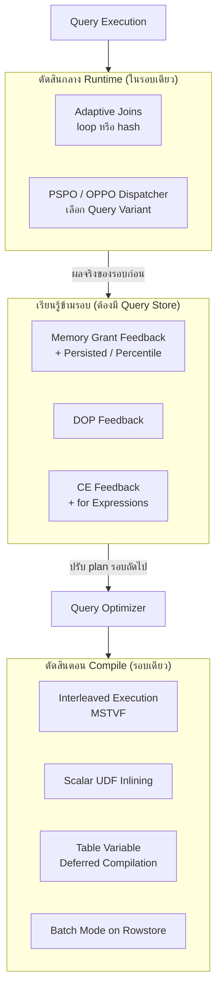

[⬅ Module 07](../../README.md) | [3. Analyzing Query Plans](../03_Analyzing_Query_Plans/README.md) | Section 4/4

# 7.4 Intelligent Query Processing — กลไกที่ให้ engine แก้ปัญหา plan เองโดยไม่ต้องแก้ code (2017 → 2025)

> *"IQP ไม่ใช่เวทมนตร์ — มันคือการเก็บ 'บทเรียนจากรอบที่แล้ว' (แถวจริงเท่าไร, spill ไหม, DOP เกินไหม) แล้วนำมาแก้สมมติฐานรอบถัดไป แทนที่จะปล่อยให้ optimizer เดาใหม่จากศูนย์ทุกครั้ง"*

> **ต้องรู้มาก่อน**: [IQP](../../../Glossary.md), [Parameter Sniffing](../../../Glossary.md), [Query Store](../../../Glossary.md), [Memory Grant / Spill](../../../Glossary.md), [Compatibility Level](../../../Glossary.md) — รวมถึง Section 7.1 (optimizer/CE), 7.3 (spill, temp table vs table variable) และ [Module 8](../../Module_08_QueryStore_AutomaticTuning/README.md) ที่ใช้ Query Store เป็นเครื่องมือจัดการ plan ต่อจาก section นี้
> **สภาพแวดล้อมทดสอบ**: SQL Server 2025 RTM-GDR (17.0.1135.8), ฐานข้อมูล `AdventureWorks` (compat **170** — IQP ทุกรุ่นเปิดตาม default) — ตัวเลข Expected รันจริงเมื่อ 2026-10-02; **ไม่มีบล็อกใดแก้ configuration** (สร้าง function/proc ชั่วคราวทั้งหมดและ `DROP` กลับคืนท้ายบล็อก)

---

## เปิดเรื่อง: จาก "แก้เองทุกจุด" สู่ "engine แก้เองตามรอบเรียนรู้"

ปัญหาที่เราแก้มือมาทั้ง Section 7.3 (CE เดาผิด → spill, parameter sniffing → plan เดียวไม่พอ, UDF ที่กัน parallelism) เดิมต้องแก้ด้วย rewrite code, hint, หรือ `OPTION (RECOMPILE)` — IQP ย้ายความรับผิดชอบบางส่วนเข้าไปใน engine: **ตรวจจับ pattern → เก็บผลจริง → ปรับ plan รอบถัดไปโดยอัตโนมัติ** แต่ละรุ่นของ SQL Server เพิ่มกลไกใหม่ตามตารางนี้ (ตรวจของจริงท้ายหัวข้อ 1):

| Feature | รุ่นที่เริ่ม | ต้อง Query Store | แก้ปัญหาอะไร |
|:--------|:-------------|:----------------:|:-------------|
| Adaptive Joins (batch mode) | 2017 (compat 140) | ไม่ | เลือก loop/hash กลาง runtime |
| Batch Mode Memory Grant Feedback | 2017 | ไม่ | grant เกิน/ขาด ของ batch mode |
| Interleaved Execution (MSTVF) | 2017 | ไม่ | CE ของ multi-statement TVF ตายตัว 1 |
| Scalar UDF Inlining | 2019 | ไม่ | UDF แบบ row-by-row |
| Batch Mode on Rowstore | 2019 | ไม่ | วิเคราะห์บน B-tree/heap เร็วขึ้น |
| Table Variable Deferred Compilation | 2019 | ไม่ | CE ตายตัว 1 แถวของ table variable |
| Row Mode Memory Grant Feedback | 2019 | ไม่ | grant ของ row mode (ทั่วไป) |
| Memory Grant Feedback: persisted + percentile | 2022 (compat 160) | **ใช่** | จำ grant ข้าม restart/evict |
| Parameter Sensitive Plan (PSPO) | 2022 (compat 160) | **ใช่** | data skew — หลาย plan ต่อ statement |
| DOP Feedback | 2022 → default 2025 | **ใช่** | parallelism เกินจำเป็น |
| CE Feedback | 2022 (compat 160) | **ใช่** | สมมติฐาน CE model ไม่เหมาะกับข้อมูล |
| **OPPO (Optional Parameter Plan Optimization)** | **2025 (compat 170)** | **ใช่** | `(@p IS NULL OR col = @p)` ได้ plan แยกตามเคส |
| **CE Feedback for Expressions** | **2025** (ใช้ได้ตั้งแต่ compat 160 บน 2025) | **ใช่** | expression ซ้ำข้าม query เรียนรู้ CE ร่วมกัน |
| **Optimized sp_executesql** | **2025** | ไม่ (scoped config แยก, default OFF) | compile storm ของ sp_executesql |

ตรวจ inventory ของฐานข้อมูลคุณเอง (อ่านอย่างเดียว — เป็น checklist ว่าฟีเจอร์ไหน "พร้อมทำงาน"):

ก่อนอ่านลงลึก — จัดกลุ่มฟีเจอร์ IQP ตาม "จังหวะเวลาที่มันตัดสินใจ" จะจำทั้งตระกูลได้ง่ายขึ้น:



ตรวจ inventory ของฐานข้อมูลคุณเอง (อ่านอย่างเดียว — เป็น checklist ว่าฟีเจอร์ไหน "พร้อมทำงาน"):

```sql
SELECT name, value
FROM sys.database_scoped_configurations
WHERE name IN ('BATCH_MODE_ADAPTIVE_JOINS', 'BATCH_MODE_MEMORY_GRANT_FEEDBACK',
               'BATCH_MODE_ON_ROWSTORE', 'CE_FEEDBACK', 'CE_FEEDBACK_FOR_EXPRESSIONS',
               'DEFERRED_COMPILATION_TV', 'DOP_FEEDBACK', 'INTERLEAVED_EXECUTION_TVF',
               'MEMORY_GRANT_FEEDBACK_PERCENTILE_GRANT', 'MEMORY_GRANT_FEEDBACK_PERSISTENCE',
               'OPTIMIZED_PLAN_FORCING', 'OPTIMIZED_SP_EXECUTESQL', 'OPTIONAL_PARAMETER_OPTIMIZATION',
               'PARAMETER_SENSITIVE_PLAN_OPTIMIZATION', 'ROW_MODE_MEMORY_GRANT_FEEDBACK',
               'TSQL_SCALAR_UDF_INLINING', 'LEGACY_CARDINALITY_ESTIMATION')
ORDER BY name;
```

**Expected (VM หลักสูตร, 2026-10-02):** ทุกแถวเป็น `1` ยกเว้นสองแถว — `LEGACY_CARDINALITY_ESTIMATION = 0` (ใช้ CE ใหม่ — ถูกต้อง) และ `OPTIMIZED_SP_EXECUTESQL = 0` (default OFF ของรุ่น 2025 — เปิดเมื่อมี compile storm จริง อ่านต่อหัวข้อ 6)

อ่าน inventory แบบมืออาชีพ: ตารางนี้ตอบคำถาม "เครื่องนี้ IQP ทำงานให้ฉันอยู่แล้วหรือยัง" ใน 3 วินาที — ค่า `0` ที่ควรเป็น `1` (เช่น ใครไปตั้ง `LEGACY_CARDINALITY_ESTIMATION = 1` หรือปิด `PARAMETER_SENSITIVE_PLAN_OPTIMIZATION`) คือ **สัญญาณเตือนการตั้งค่าที่ถูกแก้ทิ้ง** ซึ่งพบบ่อยกว่าที่คิดบน production ที่คนหมุน config ตาม forum ใจร้อน ๆ — และค่าที่ OFF โดยดีไซน์ (`OPTIMIZED_SP_EXECUTESQL`) ห้ามสรุปว่า "พัง" — ให้เทียบกับตารางในหัวข้อ 6 ก่อนเสมอ

---

## 1. AQP ปี 2017 — Adaptive Joins, Memory Grant Feedback, Interleaved Execution

### 1.1 Adaptive Joins — ตัดสิน loop หรือ hash กลาง runtime

**นิยามก่อนใช้:** **Adaptive Join** คือ join operator ที่สร้าง "ทางเลือกไว้ใน plan เดียว" — ถ้าแถวของ build input ที่อ่านมาก่อน **เลย threshold ที่กำหนดไว้** จะวิ่งเส้น Hash Join, ถ้าน้อยกว่าจะวิ่งเส้น Nested Loops (ผ่าน adaptive threshold table ที่ฝังอยู่ใน plan)

ทำไมจำเป็น: ตอน compile optimizer เดาจำนวนแถวฝั่งหนึ่งด้วย CE — เดาน้อยจะเลือก Loop แล้วจมเมื่อแถวจริงเยอะ เดาเยอะจะเลือก Hash แล้วเปลือง grant ตอนแถวจริงน้อย — Adaptive Join เลื่อนการตัดสิน "จากตอน compile ไปเป็นตอนรัน หลังนับแถวจริงแล้ว" ข้อจำกัด: ใช้ batch mode (ผูกกับ columnstore จนกระทั่ง Batch Mode on Rowstore ปี 2019) และ index ของ inner ต้องเหมาะกับ seek ในเส้น loop

โครงของ adaptive join ใน plan มองเป็น "ทางแยก" ได้:

```
Clustered Index Scan (build input)
        │  นับแถวจริงที่ไหลผ่าน
        ▼
[Adaptive Join] ── แถวจริง < AdaptiveThresholdRows ──> Nested Loops (seek ทีละแถว)
        │
        └── แถวจริง ≥ threshold ──────────────────────> Hash Match (ใช้ grant ตาม plan)
```

สังเกตบน actual plan: property `AdaptiveThresholdRows` บน join operator และ `Actual Join Type` ที่บอกว่ารอบนั้นวิ่งเส้นไหน — ถ้าเห็น plan ที่ "ตัดสินถูก" รอบแรกแล้วผิดรอบหลังเมื่อข้อมูลเปลี่ยน จุดที่ควรมองต่อคือ feedback ข้ามรอบ (MGF/DOP/CE) ในกลุ่มที่สามของแผนภาพด้านบน

### 1.2 Memory Grant Feedback — เรียนรู้ขนาด grant จากรอบที่แล้ว

**นิยามก่อนใช้:** **MGF** คือกลไกที่หลังรันจบ จะเทียบ "grant ที่จอง" กับ "ที่ใช้จริง" แล้วปรับ plan เดิมสำหรับการรันครั้งถัดไป:

| อาการรอบก่อน | การปรับรอบถัดไป |
|:-------------|:-----------------|
| grant ขาด → **spill** | เพิ่ม grant (สูงสุด 2× ขนาดที่ขาด) |
| grant เกิน (ใช้ < 50%) | ลด grant ลง (จนต่ำสุด 50% ของที่จอง) |
| สลับไปมา (oscillating) | ใช้ **percentile** ของประวัติ (2022) แทนค่าล่าสุด |

พัฒนาการสำคัญ: ปี 2019 ขยายมาที่ **row mode** (งานทั่วไปไม่ต้องมี columnstore); ปี 2022 ทำให้ **persisted** — เก็บค่า grant ลง Query Store ทำให้จำได้แม้ plan ถูก evict หรือ restart (นี่คือเหตุผลที่ตระกูลนี้ "ต้องมี Query Store")

วิธี "จับสัญญาณ" ว่าคิวรีนี้เป็นลูกค้าของ MGF (ก่อนจะเชื่อว่า engine จะช่วยให้):

- `total_grant_kb` กับ `total_used_grant_kb` ต่างกันมากทุกรอบ = จองไม่ตรง → มีที่ให้ MGF ปรับ
- `total_ideal_grant_kb` > grant จริงและ `total_spills > 0` = ขาดของจริง → MGF จะเพิ่มให้ (จนถึงเพดาน 2×)
- ค่า grant แกว่งขึ้นลงตามข้อมูลแบบสุ่ม (oscillating) = จุดที่ **percentile grant** (2022) แก้ — ใช้มุมมองเปอร์เซ็นไทล์ของประวัติแทนค่ารอบล่าสุด

ตรวจติดตามในระบบ: ค่า grant/ใช้จริง/ideal/spill จาก `sys.dm_exec_query_stats` ใน [Section 7.3 หัวข้อ 3](../03_Analyzing_Query_Plans/README.md#3-memory-grant-และ-spills--เมื่อ-sorthash-ไม่มีที่วางข้อมูล) รวมถึง `sys.query_store_runtime_stats` (`avg_query_max_used_memory`) — หมายเหตุสำคัญ: บน SQL Server 2025 **คอลัมน์ `is_memory_grant_feedback_adjusted` ถูกถอดออกจาก `sys.query_store_plan`** (ตรวจจริงแล้ว error `Invalid column name`) จึงตรวจ "ถูกปรับไหม" ด้วยการเทียบ grant ระหว่างรอบแทน

### 1.3 Interleaved Execution (MSTVF) — หยุด optimize ให้รู้ card จริงก่อน

**นิยามก่อนใช้:** multi-statement table-valued function (MSTVF) เดิมถูกประเมินเป็น **1 แถว** เสมอ (เพราะตอน optimize ยังไม่รันฟังก์ชันก็ไม่รู้ว่าจะได้กี่แถว) — Interleaved Execution ให้ optimizer "พัก" การ optimize, รันส่วนฟังก์ชันจนรู้ cardinality จริง แล้วกลับมา optimize ส่วนที่เหลือต่อด้วยข้อมูลจริง

---

## 2. IQP ปี 2019 — Batch Mode on Rowstore, Scalar UDF Inlining, Table Variable Deferred Compilation

### 2.1 Batch Mode on Rowstore

**นิยามก่อนใช้:** **Batch Mode** คือโหมดที่ operator ประมวลผลทีละ ~900 แถวในหน่วยความจำต่อเนื่อง (vectorized) แทนทีละแถว — CPU ใช้ cache และ instruction คุ้มขึ้นมาก — เดิมต้องมี columnstore index ถึงจะได้โหมดนี้, 2019 ขยายให้ใช้ได้กับ B-tree/heap ปกติ (ลองใน [Module 6 Section 6.3](../../Module_06_Statistics_Index_Internals/Sections/03_Columnstore_Indexes/README.md) กับ workload วิเคราะห์)

### 2.2 Scalar UDF Inlining — แปลง UDF ทีละแถวให้เป็น relational expression

**นิยามก่อนใช้:** **Scalar UDF Inlining** คือการที่ optimizer "คลี่" UDF สเกลาร์ออกเป็น subquery/relational expression ในคิวรีหลัก ทำให้ทำงาน set-based ใช้ plan ปกติ (seek/parallelism ได้) แทนการเรียกตีความทีละแถว

ข้อจำกัดเชิงกฎ (สั้น): ต้องเป็น inlineable — ข้ามหลาย assignment ซับซ้อน, ไม่อ้าง time-dependent function (เช่น `GETDATE()`), ไม่เรียกตารางข้าม DB ฯลฯ — **ตรวจได้ด้วยคอลัมน์ `is_inlineable`** ใน `sys.sql_modules` ทดลองจริง — สร้าง UDF คู่ให้เปรียบเทียบแล้วลบทิ้งท้ายบล็อก:

```sql
CREATE OR ALTER FUNCTION dbo.ufn_OrderCount (@CustomerId INT) RETURNS INT
AS
BEGIN
    RETURN (SELECT COUNT(*) FROM Sales.SalesOrderHeader WHERE CustomerID = @CustomerId);
END;
GO
CREATE OR ALTER FUNCTION dbo.ufn_TimeOfOrderCount (@CustomerId INT) RETURNS DATETIME
AS
BEGIN
    RETURN (SELECT MAX(GETDATE()) FROM Sales.SalesOrderHeader WHERE CustomerID = @CustomerId);
END;
GO
-- ตรวจความ inlineable: ตัวแรก = 1, ตัวที่อ้าง GETDATE() = 0 (time-dependent)
SELECT o.name, m.is_inlineable
FROM sys.sql_modules AS m
JOIN sys.objects AS o ON o.object_id = m.object_id
WHERE o.name IN ('ufn_OrderCount', 'ufn_TimeOfOrderCount');
GO
-- ใช้งานจริง: ตัว inlineable จะถูกคลี่เป็น expression (ดู plan ด้วย Ctrl+M)
SELECT TOP (5) c.CustomerID, p.LastName, dbo.ufn_OrderCount(c.CustomerID) AS orders
FROM Sales.Customer AS c
JOIN Person.Person AS p ON p.BusinessEntityID = c.CustomerID
ORDER BY c.CustomerID;
GO
DROP FUNCTION dbo.ufn_OrderCount, dbo.ufn_TimeOfOrderCount;
GO
```

**Expected (รันจริง, 2026-10-02):**

| name | is_inlineable |
|:-----|--------------:|
| ufn_OrderCount | **1** |
| ufn_TimeOfOrderCount | **0** |

query ตัวอย่างคืน 5 แถวแรก (ลูกค้า id 1–5 ยังไม่มีคำสั่งซื้อ จึง `orders = 0`) — จุดโฟกัสคือ `is_inlineable` และตอนเปิด plan (Ctrl+M) ของ query ที่ใช้ UDF ตัว inlineable คุณจะไม่เห็น "Compute Scalar เรียก UDF" แต่เห็นคิวรีถูกคลี่ออกมา ตรวจผลกระทบจริงได้จาก counter `EXEC_QUERY_STATS_FOR_SCALAR_FUNCTIONS` (เปิดอยู่ใน inventory ด้านบน) ที่รวม CPU การรัน UDF ไว้ใน `sys.dm_exec_function_stats`

### 2.3 Table Variable Deferred Compilation — แก้ "เดา 1 แถว" โดยไปนับจริงก่อน compile

**นิยามก่อนใช้:** **Deferred Compilation** = compile statement ที่อ้าง table variable ไม่ทันที แต่รอจน **เริ่มรัน** (หลัง populate ข้อมูล) เพื่อใช้ **จำนวนแถวจริงครั้งแรก** เป็น CE แทนค่าตายตัว 1 — หมายเหตุสำคัญ: มันให้ "จำนวนแถว" แต่ **ยังไม่สร้าง statistics** (ต่างจาก temp table) จึงช่วยได้แค่ระดับ cardinality ไม่ช่วยเรื่อง distribution

เคสจริงจาก [Labs Exercise 3](../../Labs/README.md): table variable ที่มี ~2,130 แถว — deferred compilation ทำให้ estimate ดีขึ้นจาก 1 เป็น ~1,917 แต่เพราะไม่มี statistics และไม่รู้ distribution optimizer ยังเลือก Nested Loops + Seek 2,130 ครั้ง = **4,591 logical reads** ขณะที่ temp table (มี stats) เลือก Hash Match = **186 reads** — สรุป: deferred compilation "ช่วยตัวเลข ไม่ช่วยรูปแบบ plan" เกณฑ์เลือกยังตามหัวข้อ 4 ของ 7.3

ทดลองสั้น ๆ (ใช้บล็อกนี้กับ Ctrl+M ดู estimate ของ table variable):

```sql
DECLARE @orders TABLE (SalesOrderID INT PRIMARY KEY, TotalDue MONEY);
INSERT INTO @orders (SalesOrderID, TotalDue)
SELECT TOP (2000) SalesOrderID, TotalDue
FROM Sales.SalesOrderHeader
ORDER BY NEWID();
SELECT COUNT_BIG(*) AS matched
FROM @orders AS o
JOIN Sales.SalesOrderDetail AS sod ON sod.SalesOrderID = o.SalesOrderID;
```

**Expected (รันจริง):** matched = **7,801** (2,000 ใบสั่ง × จำนวน line item เฉลี่ย) — เปิด Ctrl+M แล้วคลิก operator ของ table variable จะเห็น Estimated Rows ≈ 2,000 (จาก deferred compilation) ไม่ใช่ 1 เหมือนเดิม — บน SQL Server 2016 และเก่า ค่านี้จะเป็น 1 และ plan แย่ลงทันที

---

## 3. IQP ปี 2022 — ตระกูล Query Store: PSPO, DOP Feedback, CE Feedback

### 3.1 Parameter Sensitive Plan Optimization (PSPO) — หลาย plan ต่อ statement ด้วย Dispatcher

**นิยามก่อนใช้:** **Parameter Sniffing** = ตอน compile proc/sp_executesql, ค่า parameter แรกถูก "ดม" เพื่อสร้าง plan ที่เหมาะกับค่านั้น — เมื่อข้อมูลเบ้ (ค่าหนึ่ง match 3 แถว อีกค่า match 300,000 แถว) plan ใบเดียวที่ถูก reuse จะพังครึ่งหนึ่งของ workload

**นิยามก่อนใช้:** **PSPO** แก้ด้วยโครงสร้าง **multiplan**: คิวรีเดิมจะมี
1. **Dispatcher Plan** — plan "สลับ" ที่มี dispatcher expression (เช่น `(@p < 500)`) ไว้จัดหมวดค่า parameter ณ runtime และไม่รันข้อมูลเอง
2. **Query Variants** — plan ย่อยที่ optimize เฉพาะ "ช่วง" cardinality แต่ละช่วง (แต่ละ variant ถูกเก็บใน Query Store เป็น query_id แยก โดยข้อความมีเครื่องหมาย `PLAN PER VALUE(...)`) ต้องมี Query Store READ_WRITE

โครงหน้าตาของ multiplan ใน plan cache:

```
Query Store / Plan Cache
├─ Dispatcher Plan  (@param)          <- "จุดสลับ" ไม่รันข้อมูล (runtime stats = NULL)
│    ├─ variant แถวน้อย  (Index Seek + Nested Loops)   <- runtime stats ของตัวเอง
│    └─ variant แถวเยอะ  (Clustered Index Scan)         <- runtime stats ของตัวเอง
```

และ OPPO ปี 2025 (หัวข้อ 4) ใช้โครง multiplan เดียวกันนี้ต่อยอดกับ pattern optional parameters — เข้าใจ PSPO คือเข้าใจ OPPO ทันที

### 3.2 DOP Feedback — ลด parallelism ที่เกินจำเป็นลงแบบค่อยเป็นค่อยไป

**นิยามก่อนใช้:** **DOP Feedback** ตรวจคิวรีขนานซ้ำ ๆ ที่มี wait เชิงขนาน (เช่น CXPACKET) แล้ว **ลด DOP ทีละขั้น** ในการรันถัด ๆ ไป พร้อมเทียบเวลา — ถ้าเร็วขึ้นหรือเท่าเดิมก็ลดต่อ ถ้าแย่ลงจะ revert — หยุดที่จุดสมดุล (ไม่ลดต่ำกว่า DOP 2) เปิด default บน SQL Server 2025 (config `DOP_FEEDBACK = 1` — เห็นแล้วใน inventory) ต้องมี Query Store

### 3.3 CE Feedback — แก้ "สมมติฐาน model" ด้วยผลจริงข้ามรอบ

**นิยามก่อนใช้:** CE model ตั้งสมมติฐานไว้ เช่น คอลัมน์ต่างตารางอิสระต่อกัน, join containment แบบใด — ถ้าผลจริงซ้ำ ๆ สวนกับสมมติฐาน CE Feedback จะ **ทดลองใช้สมมติฐานทางเลือกผ่าน Query Store Hints** (เช่น `ASSUME_MIN_SELECTIVITY_FOR_FILTER_ESTIMATES`) กับ query นั้นโดยอัตโนมัติ และเลิกใช้ถ้าผลแย่ลง — แตกต่างจาก hint ที่เราแปะเพราะมันจัดการ lifecycle (apply/monitor/revert) เอง

---

## 4. IQP ปี 2025 — OPPO, CE Feedback for Expressions, Optimized sp_executesql

### 4.1 OPPO (Optional Parameter Plan Optimization) — แก้ pattern `(@p IS NULL OR col = @p)`

**นิยามก่อนใช้:** สไตล์เขียน search proc ที่นิยมที่สุดในโลกคือ optional parameters — แต่มันทำให้ optimizer ต้องหา plan ที่ "ถูกทุกเคส" จึงเลือกแบบปลอดภัย (scan ทั้งตาราง) แม้คนส่วนใหญ่กรอกค่าแล้ว match ไม่กี่แถว **OPPO** (compat 170, config `OPTIONAL_PARAMETER_OPTIMIZATION`, ต้องมี Query Store) ตรวจจับ pattern `@p IS NULL OR col = @p` แล้วสร้าง Dispatcher + Query Variants แยกเคส "มีค่า" กับ "ไม่มีค่า" อัตโนมัติ

ทดลองจริง — proc optional parameters 2 ตัว (สร้างชั่วคราว และ drop ท้ายบล็อก; ข้อมูล `Sales.SalesOrderHeader` 31,465 แถว, CustomerID 29825 มีไม่กี่แถว, SalesPersonID 277 มี 473 แถว):

```sql
CREATE OR ALTER PROCEDURE dbo.usp_SearchOrdersTwo @CustomerID INT = NULL, @SalesPersonID INT = NULL
AS
SELECT SalesOrderID, CustomerID, SalesPersonID, OrderDate, TotalDue
FROM Sales.SalesOrderHeader
WHERE (@CustomerID IS NULL OR CustomerID = @CustomerID)
  AND (@SalesPersonID IS NULL OR SalesPersonID = @SalesPersonID);
GO
EXEC dbo.usp_SearchOrdersTwo @CustomerID = 29825;      -- เคสกรองค่า → ควรได้ seek
EXEC dbo.usp_SearchOrdersTwo;                          -- เคสไม่กรอง → ทั้งตาราง
EXEC dbo.usp_SearchOrdersTwo @SalesPersonID = 277;     -- อีกค่า
EXEC dbo.usp_SearchOrdersTwo @CustomerID = 29825, @SalesPersonID = 277;
GO
-- ตรวจโครง multiplan ใน Query Store: แถว dispatcher (มี runtime NULL) + variants
SELECT q.query_id, p.plan_id, p.plan_type_desc, p.has_compile_replay_script,
       rs.avg_duration, rs.avg_cpu_time, rs.count_executions
FROM sys.query_store_query AS q
JOIN sys.query_store_plan AS p ON q.query_id = p.query_id
LEFT JOIN sys.query_store_runtime_stats AS rs ON rs.plan_id = p.plan_id
WHERE q.object_id = OBJECT_ID('dbo.usp_SearchOrdersTwo')
ORDER BY q.query_id, p.plan_id;
GO
DROP PROCEDURE dbo.usp_SearchOrdersTwo;
GO
```

**Expected (รันจริง, 2026-10-02):** ได้ **Dispatcher Plan** 1 แถว (avg_duration เป็น NULL — ถูกออกแบบให้เป็นจุดสลับ ไม่ใช่ตัวรัน) และ **Query Variant Plan** อย่างน้อย 2 แถวเก็บเป็น query_id แยก ตรวจคู่เทียบได้ด้วยบล็อกนี้ (รันหลังบล็อกก่อน; หมายเหตุ: เพิ่ม `-- m7diag` ไว้กรอง "คำถามวินิจฉัยตัวเอง" ที่ถูก capture ข้ามรอบเพราะข้อความมีคำว่า PLAN PER VALUE):

```sql
-- m7diag: ดึง variants ล่าสุดของ proc OPPO พร้อม runtime เทียบกัน
SELECT q.query_id, p.plan_id, p.plan_type_desc, rs.avg_duration, rs.count_executions,
       LEFT(qt.query_sql_text, 90) AS text_head
FROM sys.query_store_query AS q
JOIN sys.query_store_plan AS p ON q.query_id = p.query_id
JOIN sys.query_store_query_text AS qt ON qt.query_text_id = q.query_text_id
LEFT JOIN sys.query_store_runtime_stats AS rs ON rs.plan_id = p.plan_id
WHERE qt.query_sql_text LIKE '%PLAN PER VALUE%'
  AND qt.query_sql_text NOT LIKE '%m7diag%'   -- ตัดคำถามวินิจฉัยตัวเองออก
  AND rs.last_execution_time > DATEADD(HOUR, -1, SYSDATETIME())
ORDER BY q.query_id;
```

**Expected (รันจริง):** variant ฝั่ง "มีค่า" = **Index Seek + Nested Loops** เร็วระดับไมโครวินาที (ของเรา: **avg 212 µs**, 2 รอบ) ส่วน variant ฝั่ง "NULL = ทั้งตาราง" = **Clustered Index Scan** ส่ง 31,465 แถวกลับ client (ของเรา: **avg 86,177.5 µs**, 2 รอบ) — เทียบกับผลแล็บของ [Labs Exercise 4](../../Labs/README.md) ที่ได้ 237.8 µs vs 303,169 µs (~1,270 เท่า) — โดยไม่แก้ code สักตัวอักษร และ variant XML มีเครื่องหมาย `PLAN PER VALUE(ObjectID = ..., QueryVariantID = ..., optional_predicate(...))`

> [!IMPORTANT]
> ข้อจำกัดที่ตรวจพบจริงบน build นี้: proc optional parameter **ตัวเดียว** (`WHERE (@p IS NULL OR col = @p)`) ยังได้ **plan เดียว (Compiled Plan)** หลังรัน 3 เคส — OPPO จับ pattern ชัดเจนเมื่อมี optional predicate มากกว่าหนึ่ง ตามตัวอย่างของ Microsoft ที่ใช้ `@p IS NULL AND @p1 IS NOT NULL` / `@p IS NULL OR @p1 IS NOT NULL` — บทเรียนคือ **อย่าสรุปว่า "compat 170 แล้วทุก optional proc ได้ multiplan" ให้ตรวจ `plan_type_desc` เสมอ** (ตรวจได้จาก query_id 2039 ที่ยังเป็น Compiled Plan ในการทดลองของเรา)

### 4.2 CE Feedback for Expressions — เรียนรู้ CE ระดับ expression ข้าม query

**นิยามก่อนใช้:** CE Feedback ปี 2022 ปรับสมมติฐาน "ทั้ง query" — **CE Feedback for Expressions** (2025, ใช้ได้ตั้งแต่ compat 160 บน SQL 2025) เจาะลึกถึง **expression ย่อย** ที่ซ้ำกันข้าม query (เช่น join คู่เดิม, predicate รูปแบบเดิมที่เขียนไม่เหมือนกัน) — engine เรียนรู้จากประวัติว่า expression pattern นี้เดาต่ำไป/สูงไปแค่ไหน แล้วปรับ model ให้เฉพาะ expression นั้นใน query อื่นที่มี pattern เดียวกัน โดย query เดียวกันใช้ model คนละแบบได้ในคนละส่วน — เหมาะกับ workload ad-hoc ที่ query ไม่ซ้ำเป๊ะแต่ pattern ซ้ำ (config `CE_FEEDBACK_FOR_EXPRESSIONS = 1` — เห็นใน inventory)

### 4.3 Optimized sp_executesql — ปิดปาก compile storm

**นิยามก่อนใช้:** **Compile Storm** = สถานการณ์ที่คิวรีเดียวกัน (ผ่าน `sp_executesql`) ถูกเรียกพร้อมกันมาก ๆ และทุก session compile "ขนานกัน" โดยไม่รอกัน ทำให้ CPU/lock เปลืองซ้ำ ๆ — **Optimized sp_executesql** (2025, config `OPTIMIZED_SP_EXECUTESQL` **default OFF**) ทำให้ sp_executesql มีพฤติกรรม compile แบบ proc: รอบแรก compile แล้วอื่นรอ compile lock แล้ว **reuse plan เดียวกัน** ทันทีที่พร้อม

บทบาทบน VM นี้: config = 0 (OFF) — เปิดใช้เมื่อเจอ compile storm จริง และถ้าจะเปิด ให้พิจารณาเปิดคู่ `ASYNC_STATS_UPDATE_WAIT_AT_LOW_PRIORITY = ON` กัน blocking จาก auto-update statistics ระหว่าง compile (ตามเอกสาร Microsoft) — ฝึกบน VM ทดลองของตัวเองเท่านั้น

เช็กลิสต์ "ควรเปิด OPTIMIZED_SP_EXECUTESQL เมื่อไร" — ตอบใช่ครบสองข้อจึงคุ้ม:

1. **workload ส่ง SQL เดิมซ้ำผ่าน `sp_executesql` จำนวนมากพร้อมกัน** (จำแนกจาก: CPU เกิดที่ compile — ดู `SQL Compilations/sec` สูงคู่กับ `sys.dm_exec_query_optimizer_info` และเจอ wait แบบ compile lock / PAGELATCH_EX บน cache store) — ถ้า workload เป็น proc อยู่แล้ว ฟีเจอร์นี้ไม่มีผล
2. **มีสิทธิ์และหน้าต่างทดสอบที่ปลอดภัย** — เปิดทีละฐานข้อมูลบน VM ทดลอง วัด compile time/เวลาคิวรีก่อน-หลัง และรู้วิธีปิดกลับ (`SET ... = OFF`) — ต่างจาก hint ที่แปะรายคิวรี ฟีเจอร์นี้เปลี่ยนพฤติกรรม compile ของทุก sp_executesql ในฐานข้อมูล

---

## 5. เมื่อไร IQP "พอ" และเมื่อไรต้องแก้ที่ต้นเหตุ

IQP แก้ "ค่าใช้จ่ายของการเดาผิด" ได้จำนวนมาก แต่มัน **ไม่แก้ข้อมูล/โครงสร้างที่ทำให้ต้องเดา** — ตารางตัดสินใจก่อนโทษ engine:

| อาการ | IQP ที่ช่วย | ถ้ายังไม่พอ — แก้ที่ต้นเหตุ |
|:------|:------------|:-----------------------------|
| CE เดาน้อย → spill | MGF (เพิ่ม grant รอบถัดไป) | UPDATE STATISTICS (M6), แก้ predicate ให้ SARGable (7.3) |
| Data skew + proc | PSPO/OPPO (หลาย plan) | แยก proc ตามเคส, histogram statistics บน computed column |
| Table variable แถวเยอะ | Deferred compilation (ช่วยจำนวน) | เปลี่ยนเป็น temp table (7.3 หัวข้อ 4) |
| Parallelism เกิน | DOP Feedback (ลด DOP) | จูน MAXDOP/CTFP ระดับ instance (M1/M8) |
| MSTVF/UDF ช้า | Interleaved / Inlining | เขียนเป็น inline TVF / set-based rewrite |
| Compile storm | Optimized sp_executesql | ลด ad-hoc, ใช้ proc/parameterization ให้ถูกแบบ |

และเสมอ: ตรวจผล IQP ด้วย **Query Store** (plan_type_desc, runtime stats ต่อ variant, has_compile_replay_script สำหรับ Optimized Plan Forcing) — รายละเอียดเครื่องมือและกระบวนการบังคับ plan อยู่ใน [Module 8](../../Module_08_QueryStore_AutomaticTuning/README.md)

ประโยคปิดของโมดูลนี้ ยืมมาจากแนวคิดของทั้ง 4 sections: **plan คือผลของการเดาที่มีหลักฐาน** — Section 7.1 อธิบายว่ามันเดาอย่างไร (pipeline + cost + CE), 7.2 บอกว่าอ่านคำตอบของมันได้จากไหน (formats + properties), 7.3 ฝึกตั้งคำถามจนจับต้นเหตุได้ (operators, SARGable, spill), และ 7.4 คือเส้นทางที่ engine เรียนรู้จากการเดาผิดของตัวเอง — ทักษะที่จะพาคุณไปต่อใน Module 8 คือการบังคับและจัดการ plan ด้วย Query Store อย่างเป็นระบบ

---

## สรุป Section 7.4

1. IQP = การให้ engine "เรียนรู้จากรอบที่แล้ว" — 2017 แก้ที่การเลือก join/grant, 2019 แก้ที่ UDF/table variable/batch mode, 2022 แก้ที่ skew/parallelism/สมมติฐาน CE (ผ่าน Query Store), 2025 แก้ optional parameters และ expression ข้าม query
2. ตรวจ "ของพร้อมใช้" ด้วย `sys.database_scoped_configurations` — บน VM นี้ทุกฟีเจอร์เปิดหมด ยกเว้น `OPTIMIZED_SP_EXECUTESQL` (default OFF ตามดีไซน์)
3. ตระกูล Dispatcher/Query Variant (PSPO และ OPPO) คือโครงเดียวกัน — dispatcher ไม่รันข้อมูล (runtime NULL), variants คือ plan จริงที่เร็ว/ช้าตามเคส: ของเรา 212 µs (seek) vs 86,177.5 µs (scan 31,465 แถว) โดยไม่แก้ code
4. Deferred compilation ให้ "จำนวนแถว" ไม่ใช่ "statistics" — จึงยังแพ้ temp table ในเคสแถวเยอะ (7.3: 4,591 vs 186 reads)
5. `is_memory_grant_feedback_adjusted` ถูกถอดจาก 2025 — ตรวจ MGF ด้วยการเทียบ grant ระหว่างรอบแทน

### ตรวจความเข้าใจ

1. Adaptive Join ต่างจาก CE Feedback ตรง "จุดเวลาที่ตัดสิน" อย่างไร (ตั้งแต่ compile จนถึงรอบถัดไป)?
2. Dispatcher Plan มี runtime stats เป็น NULL — เพราะถูกออกแบบให้ทำอะไร และถ้า query Query Store ด้วย `JOIN` ตรง ๆ จะเกิดอะไรกับแถว dispatcher (เทียบกับ `LEFT JOIN` ใน Labs)?
3. ตามการทดลองหัวข้อ 4.1: ทำไม proc optional parameter ตัวเดียวจึงยังได้ Compiled Plan เดียว และควรทำอย่างไรเพื่อ "ยืนยัน" ว่า OPPO engage จริง?
4. Deferred compilation ทำให้ table variable มี estimate 2,000 แต่ยังเลือก plan แพ้ temp table (4,591 vs 186 reads) — อะไรที่ temp table มีแล้ว table variable ไม่มี?
5. เซิร์ฟเวอร์เจอ CPU พุ่งเป็นระลอกจากการ compile คิวรี ad-hoc เดิม ๆ ผ่าน sp_executesql พร้อมกันมาก — ฟีเจอร์ IQP ตัวใดตอบโจทย์ ต้องเปิดอย่างไร และควรเปิดคู่กับ config ใด?
6. คุณอยากปรับ CE ของคิวรีหนึ่งเพราะ "เดาต่ำไปซ้ำ ๆ" — จะใช้ CE Feedback หรือเขียน hint เอง อะไรดีกว่าในมุม lifecycle? แล้ว CE Feedback for Expressions ต่างจาก CE Feedback ปี 2022 ตรงไหน?

---

[⬅ Module 07](../../README.md) | [🧪 Labs](../../Labs/README.md) | [Section 7.1 Query Optimizer](../01_Query_Optimizer/README.md) · [7.2 Plan Formats](../02_Execution_Plan_Formats/README.md) · [7.3 Analyzing Plans](../03_Analyzing_Query_Plans/README.md)
