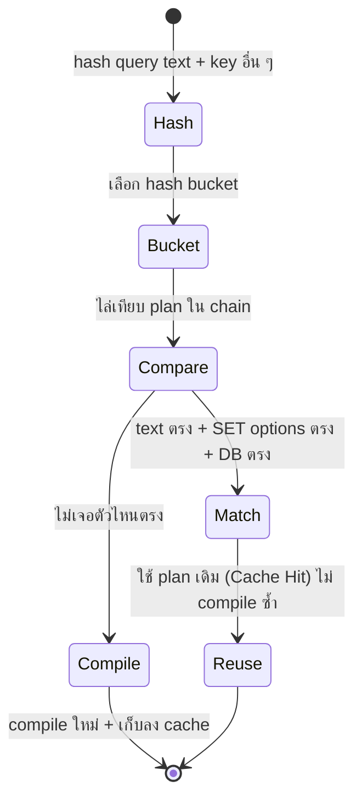

[⬅ Module 08](../../README.md) | Section 1/3 | ➡ ถัดไป: [02 Plan Cache Troubleshooting](../02_Plan_Cache_Troubleshooting/README.md)

# 8.1 Plan Cache Internals — วงจรชีวิตของ Plan: จาก Compile ถึง Reuse

> *"Compile หนึ่งครั้งใช้ CPU หลายร้อยมิลลิวินาที — แต่ค้นหา plan ใน cache ใช้ไม่กี่ไมโครวินาที การจูน workload ที่ดีที่สุดอย่างหนึ่งคือทำให้ SQL Server ไม่ต้องคิดซ้ำ"*

> **ต้องรู้มาก่อน:** Execution Plan และ pipeline ของ Query Processor (Module 7 — Parser/Optimizer/Executor) · Buffer Pool และ Memory Clerks (Module 1, 4)
> ศัพท์ที่ใช้ใน section นี้: [Glossary](../../../Glossary.md) — Plan Cache, Parameter Sniffing, Execution Plan, Memory Clerk

---

## ทำไม Section นี้จึงสำคัญ

Query หนึ่งคำถามมี "แผนการรัน" (Execution Plan) ได้หลายแบบ การหาแผนที่ดีที่สุด = **compilation** เป็นงาน CPU หนัก (parse → bind → optimize → codegen) บาง query compile ใช้เวลา 10–100 เท่าของเวลาที่รันจริง SQL Server จึงเก็บ plan ที่ compile แล้วไว้ใน memory ส่วนที่เรียกว่า **Plan Cache** (อยู่ใน Buffer Pool เช่นเดียวกับ Data Cache — กลับไปดูแผนที่ใน [Module 1.1](../../Module_01_Architecture_Scheduling_Waits/Sections/01_Engine_Architecture_SQLOS/README.md))

แต่การ cache ก็มีต้นทุนคู่แฝง:

| ถ้า cache **น้อยเกิน** | ถ้า cache **มากเกิน** |
|:---|:---|
| Compile ซ้ำทุกครั้ง → CPU สูง (`SQL Compilations/sec` พุ่ง) | Plan ไร้ค่ากองทับกัน → Memory Pressure |
| โดนเรียก "churning" — เกิดกับ workload ที่ส่ง SQL แบบ literal ทุกครั้ง | Plan เก่าที่เคยดี ถูกใช้ต่อทั้งที่ข้อมูลเปลี่ยน → Parameter Sniffing |

Section นี้พาเข้าไปดู **กลไกด้านใน** — compile ผ่านขั้นไหน, ค้นหา plan ด้วยอะไร, เก็บที่ไหน, ไล่ออกเมื่อไร — เพราะ Section 2 (Troubleshooting) ทั้งหมดยืนอยู่บนกลไกเหล่านี้

---

## 1. Compilation Pipeline — ขั้นตอนก่อน plan จะลง cache

```
Batch เข้ามา (T-SQL)
      │
      ▼
┌─────────────┐   syntax ผิด → error ทันที (ไม่เสียเวลา optimize)
│   Parser    │   ตรวจ syntax, แตกเป็น token stream
└──────┬──────┘
       ▼
┌─────────────┐   object ไม่มี → error binding (ไม่เสียเวลา optimize)
│ Algebrizer  │   resolve ชื่อ table/column, bind ชนิดข้อมูล
└──────┬──────┘   ผลลัพธ์: Query Processor Tree (algebra tree)
       ▼
┌─────────────┐
│  Optimizer  │   Trivial Plan? ──ใช่──→ ใช้เลย (แทบไม่มีทางเลือกอื่น)
│ (cost-based)│        │ ไม่ใช่
│             │        ▼
│             │   Full optimization แบบขั้นบันได (search stages):
│             │   Transaction 0 → Phase 1 (Quick) → Phase 2 (Serial) → Parallel
│             │   ได้ plan ที่ "ดีพอ" ก่อนหยุด ไม่ใช่ "ดีที่สุดในเอกภพ"
└──────┬──────┘
       ▼
┌─────────────┐
│  Codegen    │   แปลง plan tree → คำสั่งที่ Executor ทำงานได้
└──────┬──────┘
       ▼
  Plan ลง Plan Cache ──→ รอใช้ซ้ำ (Reuse)
```

**ประเด็นที่ต้องจับให้ได้:**

1. **Trivial Plan** — query ง่ายจนไม่มีทางเลือกอื่น (เช่น `SELECT ... WHERE key = @p` บน clustered PK) optimizer ข้ามการประเมิน cost ทั้งหมด ประหยัด CPU — นี่คือเหตุผลที่ query เล็ก ๆ compile เร็วมาก
2. **Full Optimization** — เมื่อมีทางเลือก (join หลายตาราง, มีหลาย index, ต้อง sort/hash) optimizer จะประเมิน cost ด้วย **Statistics** (Module 6) — จุดเชื่อมของ "ค่า parameter แรก" กับ "plan ที่ได้" คือตรงนี้ (หัวข้อ 6)
3. Plan ที่ compile เสร็จ **ไม่ได้แนบกับ session ใด** — มันเป็นของกลาง แชร์ข้าม user ได้ (ภายใต้เงื่อนไข หัวข้อ 3)

---

## 2. Cache Lookup — ตอบคำถาม "มี Plan อยู่หรือไม่?" ด้วย Hash

ทุก batch/query ที่เข้ามา จะถูกคำนวณเป็น **hash key** แล้วค้นหาใน hash bucket ของ cache store:



เงื่อนไขการ match ไม่ได้มีแค่ "ข้อความเหมือน" — ต้องตรงกันหมดทั้งชุด:

| เงื่อนไข | ตัวอย่างที่ทำให้ match ไม่ได้ |
|:---|:---|
| **ข้อความ query** (byte-for-byte) | เว้นวรรค/ตัวพิมพ์/comment ต่างกันนิดเดียว = plan ใหม่ |
| **SET options ของ session** | `ANSI_NULLS`, `QUOTED_IDENTIFIER`, `ARITHABORT` ฯลฯ ต่างกัน = plan ใหม่ |
| **ฐานข้อมูลที่ execute** | DB เดียวกันถึงจะแชร์ |
| **สิทธิ์/user context** | กรณี RLS หรือ schema ผูกกับ user |

> [!TIP]
> ปัญหา "app เดียวกันแต่ได้ plan หลายตัว" ที่เจอบ่อยที่สุดในหน้างานคือ **SET options ต่างกันระหว่าง client library** — เช่น ADO.NET vs SSMS ตั้ง `ARITHABORT` ไม่เหมือนกัน ทำให้ debug ใน SSMS เร็ว แต่ app จริงช้า (plan คนละตัว!) ตรวจได้ด้วย `sys.dm_exec_plan_attributes` (หัวข้อ 7)

---

## 3. Plan Stages — Compiled Plan กับ Executable Plan

Plan ใน cache มีหลาย "ระยะ" (คอลัมน์ `cacheobjtype` ใน `sys.dm_exec_cached_plans`):

| ระยะ | คืออะไร | แชร์ข้าม execution ได้? |
|:---|:---|:---|
| **Compiled Plan** | โครงสร้าง plan ต้นแบบที่ optimizer สร้าง — ระยะหลักที่กิน memory ใหญ่ที่สุด | ได้ (ของกลาง) |
| **Executable Plan** (execution context) | สำเนา runtime ของ compiled plan ที่ผูกกับการรันครั้งหนึ่ง ๆ — เก็บตำแหน่ง cursor, ค่า parameter ขณะรัน | แต่ละการรันได้ context ของตัวเอง (สร้าง/คืนตอนรันจบ) |
| **Parse Tree** | โครงสร้างกลางหลัง algebrizer — เช่น ของ views/constraints (`CACHESTORE_PHDR`) | ได้ |

> [!NOTE]
> **สังเกตบน build ทดสอบ (SQL Server 2025, 17.0.1135.8):** `sys.dm_exec_cached_plans` แสดง `cacheobjtype` เป็น `Compiled Plan` / `Parse Tree` / `Extended Proc` เท่านั้น — Executable Plan เป็น execution context ชั่วคราวที่สร้างตอนเริ่มรันและคืนตอนจบรัน จึงไม่ปรากฏถาวรใน DMV นี้ (อย่างในรุ่นเก่า) — แต่แนวคิดยังใช้อธิบายได้เหมือนเดิม

**ทดลอง: proc หนึ่งตัว รันสามครั้ง — plan เดียวถูกใช้ซ้ำหรือไม่?**

```sql
USE AdventureWorks;
GO
CREATE OR ALTER PROC dbo.PC1_DemoProc
AS
BEGIN
    SELECT COUNT_BIG(*) AS cnt FROM Person.Person;
END;
GO
EXEC dbo.PC1_DemoProc;
EXEC dbo.PC1_DemoProc;
EXEC dbo.PC1_DemoProc;
GO
-- proc plan เดียวถูกใช้ซ้ำทั้ง 3 ครั้ง (usecounts)
SELECT cp.objtype, cp.cacheobjtype, cp.usecounts,
       cp.size_in_bytes / 1024 AS size_kb
FROM sys.dm_exec_cached_plans AS cp
CROSS APPLY sys.dm_exec_sql_text(cp.plan_handle) AS st
WHERE st.text LIKE '%PC1_DemoProc%'
  AND st.text NOT LIKE '%dm_exec_cached_plans%';
-- มุมมองสถิติระดับ procedure (นับ executions รวม)
SELECT ps.execution_count, ps.cached_time
FROM sys.dm_exec_procedure_stats AS ps
WHERE ps.object_id = OBJECT_ID('dbo.PC1_DemoProc');
GO
DROP PROC dbo.PC1_DemoProc;
```

**Expected:** DMV แรกได้ 1 แถว `Proc | Compiled Plan | usecounts = 3` — compile ครั้งเดียว รันซ้ำอีก 2 ครั้งโดยไม่ compile ใหม่; DMV ที่สอง `execution_count = 3` พร้อม `cached_time` = เวลาที่ plan ถูกเก็บครั้งแรก
> อ้างอิงรันจริง SQL Server 2025 RTM-GDR (17.0.1135.8), AdventureWorks, 2026-10-02: `Proc | Compiled Plan | 3 | 56 KB` และ `execution_count = 3`

ข้อสังเกตจากผลลัพธ์:

- **objtype = Proc** — plan ของ object (proc/function/trigger) เก็บใน store แยกชื่อ *Object Plans*
- **usecounts = 3** — ตัวเลขที่เรา "เก็บเกี่ยว" จากการ cache ได้ 3 ครั้ง; ถ้าเห็น usecounts = 1 ตลอดใน workload จริง นั่นคือสัญญาณว่าระบบไม่ได้ใช้ประโยชน์จาก cache เลย (Section 2)
- proc จบแล้ว plan **ไม่หายไปไหน** — รออยู่ใน cache เพื่อรอบหน้า ต่างจาก Executable Plan ที่เกิด-ตายในแต่ละการรัน

---

## 4. Cache Stores — ตู้เก็บของแยกตามประเภท

Plan Cache ภายในไม่ใช่กองเดียว แต่แบ่งเป็น **cache stores** ตามประเภทของข้อมูล แต่ละ store มีงบประมาณ memory ของตัวเองและถูกบริหารโดย Memory Clerk:

| Cache Store | type ใน DMV | เก็บอะไร | แนวโน้มใน workload จริง |
|:---|:---|:---|:---|
| **Object Plans** | `CACHESTORE_OBJCP` | Plan ของ stored procedures, functions, triggers | น่าจะถูก reuse สูง — โตช้า |
| **SQL Plans** | `CACHESTORE_SQLCP` | Plan ของ ad-hoc batches, prepared statements (`sp_executesql`) | กระจายกว้าง — แหล่ง "Plan Cache Pollution" ที่พบบ่อยสุด |
| **Bound Trees** | `CACHESTORE_PHDR` | Algebra tree ของ views, constraints, defaults | เล็ก เกี่ยวกับ metadata |
| **Extended Stored Procedures** | `CACHESTORE_XPROC` | Plan ของ extended procs (เช่น `xp_*`) | น้อยมากในระบบปัจจุบัน |

**ดูขนาดจริงบน server ตัวเองได้สองมุม:**

```sql
-- มุมที่ 1: memory cache counters (ราย store)
SELECT name AS cache_store, type, entries_count, pages_kb / 1024.0 AS size_mb
FROM sys.dm_os_memory_cache_counters
WHERE type IN ('CACHESTORE_OBJCP','CACHESTORE_SQLCP','CACHESTORE_PHDR','CACHESTORE_XPROC')
ORDER BY size_mb DESC;

-- มุมที่ 2: ผ่าน memory clerks (มุมเดียวกับที่ดู memory รวมทั้ง server ใน Module 4)
SELECT type, name, SUM(pages_kb) / 1024.0 AS size_mb
FROM sys.dm_os_memory_clerks
WHERE type IN ('CACHESTORE_OBJCP','CACHESTORE_SQLCP','CACHESTORE_PHDR','CACHESTORE_XPROC')
GROUP BY type, name ORDER BY size_mb DESC;
```

**Expected (แนวคิด):** `SQL Plans` มักโตที่สุดใน workload ที่ส่ง SQL จาก application เยอะ และถ้าสัดส่วนของมันผิดปกติ (หลายร้อย MB ทั้งที่ app ใช้ query น้อย) นั่นคือหลักฐานแรกของ ad-hoc pollution
> อ้างอิงรันจริงบน VM ทดสอบ (17.0.1135.8): `SQL Plans 76 MB / 460 entries`, `Bound Trees 43 MB`, `Object Plans 7 MB`, `XPROC ~0.02 MB` — ทั้งสองมุมให้เลขตรงกัน

> [!IMPORTANT]
> **จำสัดส่วนนี้ไว้เป็นเครื่องวัด:** ระบบที่ design ดี (app ส่ง parameterized call / proc) — `Object Plans` + `SQL Plans` ที่เป็น prepared จะครองสัดส่วน reuse สูง ถ้า `SQL Plans` บวมโดยมี entry เป็นหมื่นแต่ reuse ต่ำ คือปัญหาแนวที่จะจับต่อใน **Section 2**

---

## 5. Parameterization — ทางเดียวที่ plan จะถูก reuse ได้สำหรับ SQL ที่ส่งจาก app

พิจารณา app ที่ยิง query แบบ literal ทุกครั้ง:

```
ครั้งที่ 1: SELECT ... WHERE SalesOrderID = 43669;
ครั้งที่ 2: SELECT ... WHERE SalesOrderID = 43670;   ← ข้อความต่างกัน = hash ต่างกัน!
```

ถ้า SQL Server ทำอะไรไม่เลย ทุกค่า = compile ใหม่หมด มันจึงมีกลไก **Simple Parameterization** (auto-parameterization): พยายาม "หลุด" literal ออกมาเป็น parameter — แล้วเก็บ plan ร่วมหลายค่าไว้ใน cache

```sql
USE AdventureWorks;
GO
-- รันครั้งที่ 1 (literal ค่าหนึ่ง)
SELECT SalesOrderID, OrderDate, TotalDue
FROM Sales.SalesOrderHeader
WHERE SalesOrderID = 43669;
GO
-- รันครั้งที่ 2 (literal อีกค่า — batch text ต่างกัน)
SELECT SalesOrderID, OrderDate, TotalDue
FROM Sales.SalesOrderHeader
WHERE SalesOrderID = 43670;
GO
-- ดูใน Plan Cache: shell plan (Adhoc) + compiled plan (Prepared) ที่แชร์ร่วมกัน
SELECT LEFT(st.text, 60) AS cached_text,
       cp.objtype, cp.cacheobjtype, cp.usecounts,
       cp.size_in_bytes / 1024 AS size_kb
FROM sys.dm_exec_cached_plans AS cp
CROSS APPLY sys.dm_exec_sql_text(cp.plan_handle) AS st
WHERE st.text LIKE '(@1 int)SELECT%' AND st.text LIKE '%TotalDue%'
   OR st.text LIKE '%WHERE SalesOrderID = 43669%'
   OR st.text LIKE '%WHERE SalesOrderID = 43670%'
ORDER BY cp.objtype DESC, cp.usecounts DESC;
```

**Expected:** ได้ 3 แถวหลัก —
1. `objtype = Prepared` พร้อม text `(@1 int)SELECT [SalesOrderID],...WHERE [SalesOrderID]=@1` (usecounts รวมทุกค่าที่เคยรัน — แชร์กัน)
2-3. `objtype = Adhoc`, size ~16 KB, usecounts = 1 อีกสองแถว = **shell plans** ที่ถือข้อความ literal ต้นฉบับ แล้วชี้ไปหา Prepared plan
> อ้างอิงรันจริง (17.0.1135.8): `Prepared | Compiled Plan | usecounts 10 | 64 KB` + shell plans `Adhoc | 1 | 16 KB` — ยิ่งรัน literal ค่าใหม่อีก usecounts ของ Prepared ยิ่งโต (ค่าที่ใช้เทียบ: 10 รอบรวมทุกค่าจากการทดลองซ้ำ)

**อ่านผลนี้ให้เข้าใจสามอย่าง:**

1. **ครั้งที่ 2 ไม่ compile ใหม่** — เจอ Prepared plan ผ่าน parameterized form แม้ข้อความ batch ต่างกัน
2. **shell plan ก็เปลือง memory** — ถ้า workload ยิง literal หลายแสนรูปแบบ มันจะสร้าง shell ทุกค่า (usecounts=1 ตลอด) = ต้นตอ Plan Cache Pollution — ทางแก้ระดับ server คือ *Optimize for Ad-hoc Workloads* (Section 2)
3. **Simple Parameterization มีข้อจำกัด** — optimizer "กล้า" หลุดเฉพาะเมื่อไม่กระทบ plan (เช่น `WHERE key = literal`, `INSERT ... VALUES`) — query ที่ literal อยู่ในเงื่อนไขที่เปลี่ยน plan ได้ (ตัวอย่างเช่น `TOP (5)`, `IN (...)` ซับซ้อน, `DATEDIFF(day, col, literal)`) จะ **ไม่** ถูก parameterize — ยังต้องอาศัย app ส่งพารามิเตอร์เอง หรือใช้ Forced Parameterization (Section 2)

> **เทียบให้ชัด:** ทางที่ดีที่สุดคือ app ส่ง `sp_executesql` หรือ proc ด้วยพารามิเตอร์ตั้งแต่ต้น — ได้ **plan เดียว** ไม่ต้องรอ engine หลุดให้ และไม่มี shell plan ทิ้ง

---

## 6. Parameter Sniffing — เมื่อ plan ถูก "หล่อหลอม" ด้วยค่าแรกที่เจอ

รวบสามหัวข้อก่อนหน้าเข้าด้วยกัน จะได้ปรากฏการณ์ที่เป็นปัญหาอันดับต้น ๆ ของ performance tuning:

> Plan หนึ่งตัวแชร์กับทุกการรัน + optimizer ต้องประมาณจำนวนแถวด้วยค่าที่มีตอน compile + ตอน compile มีข้อมูลให้ดูคือ **ค่า parameter ของการรันแรก** → plan ที่ได้จึงเหมาะกับ "ค่าแรก" แต่ไม่จำเป็นต้องเหมาะกับค่าอื่น

เรียกการอ่านค่าแรกนี้ว่า **Parameter Sniffing** — โดยตัวมันเองไม่ใช่บั๊ก แต่เป็น trade-off ที่ตั้งใจออกแบบ (ถ้า compile ต่อทุกค่า CPU จะแพงกว่า) — มันกลายเป็น "ปัญหา" เมื่อ:

- ข้อมูล **เบ้ (skewed)** — ค่าหนึ่งมี 1 แถว อีกค่ามี 10,000 แถว
- plan ที่ได้คือ **แบบ sensitive** — เช่น Seek+Key Lookup (ดีกับแถวน้อย) ที่ถ้าถูกใช้กับแถวเยอะจะ lookup ทีละรอบ

**ทดลอง: สร้างข้อมูลเบ้ + proc แล้วดูกลไกจริง**

```sql
USE AdventureWorks;
GO
DROP TABLE IF EXISTS dbo.PC1_Sniff;
CREATE TABLE dbo.PC1_Sniff (
    ID INT IDENTITY PRIMARY KEY,
    CountryCode CHAR(2) NOT NULL,
    Payload CHAR(50) NOT NULL DEFAULT 'x'
);
INSERT INTO dbo.PC1_Sniff (CountryCode) VALUES ('TH');          -- 1 แถว
INSERT INTO dbo.PC1_Sniff (CountryCode)
SELECT TOP (10000) 'US' FROM sys.all_objects AS a CROSS JOIN sys.all_objects AS b;  -- 10,000 แถว
CREATE INDEX IX_PC1_Sniff_Country ON dbo.PC1_Sniff (CountryCode);
GO
CREATE OR ALTER PROC dbo.PC1_GetByCountry @CountryCode CHAR(2)
AS
BEGIN
    SELECT * FROM dbo.PC1_Sniff WHERE CountryCode = @CountryCode;
END;
GO
-- 1) รันครั้งแรกด้วยค่า "เบา" -> compile: 1 แถว -> Index Seek + Key Lookup
SET STATISTICS IO ON;
EXEC dbo.PC1_GetByCountry 'TH';
-- 2) รันครั้งต่อมาด้วยค่า "หนัก" -> ใช้ plan เดิม (10,001 lookups)
EXEC dbo.PC1_GetByCountry 'US';
SET STATISTICS IO OFF;
GO
-- 3) ยืนยัน: proc เดียว มี plan เดียวใน cache (usecounts = 2)
SELECT cp.objtype, cp.cacheobjtype, cp.usecounts
FROM sys.dm_exec_cached_plans AS cp
CROSS APPLY sys.dm_exec_sql_text(cp.plan_handle) AS st
WHERE st.text LIKE '%PC1_GetByCountry%'
  AND cp.objtype = 'Proc'
  AND st.text NOT LIKE '%dm_exec_cached_plans%';
```

**Expected:** การรัน `'TH'` ได้ 1 แถว — `Table 'PC1_Sniff'. Scan count 1, logical reads 4`; การรัน `'US'` ได้ 10,000 แถว — `logical reads 20017` (~5,000 เท่าของที่จำเป็น! เพราะต้อง Key Lookup ทีละแถว 10,001 ครั้ง) และข้อ 3 ยืนยันว่า **มี plan เดียว usecounts = 2** — การรัน `'US'` ไม่ได้ compile ใหม่ แต่ถูกบังคับใช้ plan ที่หล่อหลอมจาก `'TH'`
> อ้างอิงรันจริง (17.0.1135.8): TH = 4 logical reads, US (reuse) = 20,017 logical reads, `Proc | Compiled Plan | usecounts 2`

**ดู "ค่าที่ถูก sniff" ได้จาก plan XML** — คอลัมน์ `StatementEstRows` คือประมาณการที่ optimizer คิดตอน compile:

```sql
USE AdventureWorks;
GO
-- 4) ทางแก้เชิงสาธิต: บังคับ compile ใหม่เฉพาะครั้งนี้ -> ได้ plan ใหม่ที่รู้ว่า 10,000 แถว
SET STATISTICS IO ON;
EXEC dbo.PC1_GetByCountry 'US' WITH RECOMPILE;
SET STATISTICS IO OFF;
GO
-- 5) ดู EstimateRows ที่ "sniff" ไว้ (plan ที่ cache ไว้ compile จาก 'TH' = 1 แถว)
SELECT qs.execution_count, qs.total_logical_reads, qs.total_logical_reads / qs.execution_count AS avg_logical_reads,
       qp.query_plan.value('declare namespace p="http://schemas.microsoft.com/sqlserver/2004/07/showplan";
           (/p:ShowPlanXML/p:BatchSequence/p:Batch/p:Statements/p:StmtSimple/@StatementEstRows)[1]', 'float') AS est_rows
FROM sys.dm_exec_query_stats AS qs
CROSS APPLY sys.dm_exec_sql_text(qs.sql_handle) AS st
CROSS APPLY sys.dm_exec_query_plan(qs.plan_handle) AS qp
WHERE st.objectid = OBJECT_ID('dbo.PC1_GetByCountry');
GO
DROP PROC dbo.PC1_GetByCountry;
DROP TABLE IF EXISTS dbo.PC1_Sniff;
GO
```

**Expected:** บล็อก 4 — `'US' WITH RECOMPILE` ได้ plan ใหม่แบบ Clustered Index Scan `logical reads 101` (อ่านครบตารางรอบเดียว ~แถวละครึ่งหน้า — ดีกว่า 20,017 อย่างก่ายกอง); บล็อก 5 — `est_rows = 1` คือหลักฐานกลไกว่า plan ที่ cache ไว้ compile ด้วยค่า `'TH'` (actual ของ `'US'` = 10,000 แถว — estimate คลาดจากจริง 4 ตัวเลข!); `total_logical_reads = 20021` = รอบ TH (4) + รอบ US reuse (20,017); สังเกตว่าการรัน `WITH RECOMPILE` ไม่ถูกนับใน `dm_exec_query_stats` เพราะ plan ครั้งนั้นไม่ถูก cache
> อ้างอิงรันจริง (17.0.1135.8): WITH RECOMPILE = 101 logical reads · est_rows = 1 · execution_count = 2 · total_logical_reads = 20021

---

## 7. Fingerprint ของ Query: query_hash กับ query_plan_hash

สองคอลัมน์ใน `sys.dm_exec_query_stats` ช่วยตอบคำถามโครงสร้างได้โดยไม่ต้องแกะ XML:

| คอลัมน์ | เทียบกับอะไร | ใช้ตอบคำถาม |
|:---|:---|:---|
| `query_hash` | hash ของ **ข้อความ statement** (ไม่รวมค่า literal) | "มี query รูปแบบเดียวกันถูกรันเป็นหลาย plan หรือเปล่า?" |
| `query_plan_hash` | hash ของ **รูปร่าง plan** | "query เดียวกันได้ plan เหมือนกันหรือไม่?" — ต่างกัน = มีหลาย plan วิ่งอยู่ (อาการ Parameter Sniffing / plan เปลี่ยนตาม stats) |

**ทดลอง: statement เหมือนกันเป๊ะ คนละ proc — compile ด้วยคนละค่า → plan คนละแบบ**

```sql
USE AdventureWorks;
GO
DROP TABLE IF EXISTS dbo.PC1_Sniff;
CREATE TABLE dbo.PC1_Sniff (
    ID INT IDENTITY PRIMARY KEY,
    CountryCode CHAR(2) NOT NULL,
    Payload CHAR(50) NOT NULL DEFAULT 'x'
);
INSERT INTO dbo.PC1_Sniff (CountryCode) VALUES ('TH');
INSERT INTO dbo.PC1_Sniff (CountryCode)
SELECT TOP (10000) 'US' FROM sys.all_objects AS a CROSS JOIN sys.all_objects AS b;
CREATE INDEX IX_PC1_Sniff_Country ON dbo.PC1_Sniff (CountryCode);
GO
CREATE OR ALTER PROC dbo.PC1_GetByCountry_A @CountryCode CHAR(2)
AS
BEGIN
    SELECT * FROM dbo.PC1_Sniff WHERE CountryCode = @CountryCode;
END;
GO
CREATE OR ALTER PROC dbo.PC1_GetByCountry_B @CountryCode CHAR(2)
AS
BEGIN
    SELECT * FROM dbo.PC1_Sniff WHERE CountryCode = @CountryCode;
END;
GO
-- สอง proc ที่ "ข้อความ statement เหมือนกันเป๊ะ" แต่ compile จากคนละ parameter
EXEC dbo.PC1_GetByCountry_A 'TH';  -- compile: 1 แถว -> Seek + Lookup
EXEC dbo.PC1_GetByCountry_B 'US';  -- compile: 10,000 แถว -> Clustered Index Scan
GO
-- query_hash เดียวกัน (statement เดียวกัน) แต่ query_plan_hash ต่างกัน (plan คนละแบบ)
SELECT qs.query_hash, qs.query_plan_hash, qs.execution_count
FROM sys.dm_exec_query_stats AS qs
CROSS APPLY sys.dm_exec_sql_text(qs.sql_handle) AS st
WHERE st.objectid IN (OBJECT_ID('dbo.PC1_GetByCountry_A'), OBJECT_ID('dbo.PC1_GetByCountry_B'))
ORDER BY qs.query_plan_hash;
GO
DROP PROC dbo.PC1_GetByCountry_A, dbo.PC1_GetByCountry_B;
DROP TABLE IF EXISTS dbo.PC1_Sniff;
GO
```

**Expected:** 2 แถว `query_hash` **เท่ากัน** (statement เดียวกัน) แต่ `query_plan_hash` **ต่างกัน** (Seek+Lookup vs Scan) — นี่คือรูปแบบ query ที่ Query Store (Section 3) จะเรียกว่า "query เดียว หลาย plan" และเป็นสัญญาณที่เราจะเฝ้าจับในระบบจริง
> อ้างอิงรันจริง (17.0.1135.8): query_hash `0x93888DDD88F58A11` ปรากฏ 2 แถวพร้อม query_plan_hash `0x6B40341B1BE1BA63` และ `0xF425E0C526AAC2FB`

> [!TIP]
> **สูตรจับสัญญาณในงานจริง:** จับกลุ่ม `sys.dm_exec_query_stats` ด้วย `query_hash` แล้วนับ `COUNT(DISTINCT query_plan_hash)` ต่อ hash — ถ้า > 1 แสดงว่า query นั้นได้หลาย plan (โอกาส sniffing/plan change สูง) — จะใช้ Query Store ที่เก็บย้อนหลังได้ (Section 3)

---

## 8. เงื่อนไขการ Reuse ที่คนมองข้าม: SET options

plan จะถูก reuse ได้ต้อง compile ภายใต้ "สภาพแวดล้อม" เดียวกัน ค่าทั้งหมดถูกเก็บเป็น attribute ของ plan:

```sql
USE AdventureWorks;
GO
CREATE OR ALTER PROC dbo.PC1_DemoProc
AS
BEGIN
    SELECT COUNT_BIG(*) AS cnt FROM Person.Person;
END;
GO
EXEC dbo.PC1_DemoProc;
GO
-- ดู attribute ที่ plan จำไว้ (set_options = bitmask ของ SET options ตอน compile)
SELECT pa.attribute, pa.value
FROM sys.dm_exec_cached_plans AS cp
CROSS APPLY sys.dm_exec_plan_attributes(cp.plan_handle) AS pa
CROSS APPLY sys.dm_exec_sql_text(cp.plan_handle) AS st
WHERE st.objectid = OBJECT_ID('dbo.PC1_DemoProc')
  AND pa.attribute IN ('set_options','user_id','dbid');
GO
DROP PROC dbo.PC1_DemoProc;
GO
```

**Expected:** แถว `set_options` (เช่น `4347` — bitmask ของ `ANSI_NULLS`/`QUOTED_IDENTIFIER`/`ARITHABORT` ฯลฯ), `dbid`, `user_id` — ถ้า session ใหม่เข้ามาด้วย SET options ต่างจาก bitmask นี้ จะไม่ match → compile plan ที่สองขึ้นมาเลย (แม้ proc เดิม!)
> อ้างอิงรันจริง (17.0.1135.8): `set_options = 4347`, `dbid = 5`, `user_id = 1`

**เชื่อมกับหน้างาน:** สาเหตุ "proc มี plan หลายตัวใน cache ทั้งที่ไม่มี sniffing" อันดับแรก ๆ คือ client สองเจนเนเรชันส่ง `SET ARITHABORT ON/OFF` ไม่ตรงกัน — วินิจฉัยด้วยการจับกลุ่ม `sys.dm_exec_plan_attributes(..., 'set_options')` ต่อ plan_handle

---

## 9. Eviction — plan หายไปจาก cache ได้เมื่อไร

Memory ไม่มีที่ไหนไม่จำกัด SQL Server ไล่ plan ออกด้วยกลไก **cost-based**:

```
plan ถูกสร้าง → cost = ขึ้นกับแหล่งที่มา (ad-hoc เริ่ม 0 / proc เริ่มจาก compile cost)
     │
     ├─ ถูก reuse → cost ถูกปรับขึ้น (จำได้ว่า "เป็นที่ต้องการ")
     │
     └─ Lazy writer / cache sweep รอบสุดท้าย ไล่ลด cost ของ plan ที่ไม่ได้ใช้
              └─ cost = 0 → ถูก evict (หลุดจาก cache)
```

แรงกดดัน 2 ระดับ: **local store pressure** (store ไหนโตเกินสัดส่วน ถูกลดที่นั่นก่อน) และ **global memory pressure** (buffer pool ต้องการ memory — หวนมาเก็บจาก plan cache รวมถึง data cache)

**ทางที่ plan หลุดด้วยเหตุอื่น (Invalidate = หมดอายุแล้วถูก evict):**

| เหตุการณ์ | ตัวอย่าง |
|:---|:---|
| Schema เปลี่ยน | `ALTER TABLE`, `DROP/CREATE INDEX` ที่ plan อ้างถึง |
| Statistics อัปเดต | `UPDATE STATISTICS` / auto-update ครบเกณฑ์ (Module 6) |
| Option ของ proc เปลี่ยน | `CREATE OR ALTER PROC ... WITH RECOMPILE` |
| Memory pressure จัดการ | ข้าม store ไปเก็บเกี่ยว plan ที่ cost ต่ำ |
| **Manual** | `DBCC FREEPROCCACHE` / `ALTER DATABASE SCOPED CONFIGURATION CLEAR PROCEDURE_CACHE` |

> [!WARNING]
> **`DBCC FREEPROCCACHE` (ไม่มี argument) = ล้าง plan cache ทั้ง instance** — ทุก query จะ compile ใหม่พร้อมกัน → CPU spike + compilation storm อย่างทำเนียบ ใช้เฉพาะเมื่อทราบผล บนระบบ production และหลังแก้ระดับ DB ให้ใช้รูปแบบเฉพาะตัว: `DBCC FREEPROCCACHE (plan_handle)` ลบได้ทีละ plan, `DBCC FREEPROCCACHE('SQL Pool Name')` — รายละเอียดการใช้ในการ troubleshoot อยู่ที่ **Section 2**

---

## 10. รวมภาพ: ใครทำอะไรในวงจรชีวิตของ plan

| ขั้น | ตัวละคร | เครื่องมือวัดของเรา |
|:---|:---|:---|
| Compile | Parser → Algebrizer → Optimizer | `SQL Compilations/sec`, `sys.dm_exec_query_stats.creation_time` |
| เก็บ | Cache store (OBJCP/SQLCP/PHDR) | `sys.dm_os_memory_cache_counters`, `sys.dm_exec_cached_plans` |
| ค้นหา | Hash bucket + match text/SET/DB | `usecounts`, `sys.dm_exec_plan_attributes` |
| Reuse | Executor ใช้ compiled plan + สร้าง execution context | `usecounts`, `sys.dm_exec_procedure_stats.execution_count` |
| ประมาณการผิดจากค่า sniffed | Optimizer ตอน compile ครั้งแรก | `StatementEstRows` ใน plan XML, query_hash vs plan_hash |
| Evict | Lazy writer / cache sweep / manual | `sys.dm_os_memory_cache_counters` (entries หด), `DBCC MEMORYSTATUS` |

---

## สรุป Section 1

1. Compile แพง → SQL Server เก็บ plan ไว้ใน **Plan Cache** — ค้นหาด้วย hash แล้ว match ทั้งข้อความ, SET options, และ DB
2. Plan มีหลายระยะ: **Compiled Plan** (แชร์กลาง) และ **Executable Plan** (context รายการรัน — บน 17.x ไม่ปรากฏถาวรใน `sys.dm_exec_cached_plans`)
3. Plan จัดเก็บแบ่งตาม **cache store** (`CACHESTORE_OBJCP` = proc, `CACHESTORE_SQLCP` = ad-hoc/prepared) — สัดส่วนของ SQL Plans คือเข็มทิศหา pollution
4. **Simple Parameterization** ช่วย reuse ได้เฉพาะ query ง่าย และแลกมาด้วย shell plan; ทางที่ดีที่สุดคือ app ส่งพารามิเตอร์เอง
5. **Parameter Sniffing** คือผลรวมของ "plan เดียวแชร์ทุกค่า + estimate จากค่าแรก" — พิสูจน์ด้วย `usecounts`, `logical reads`, และ `est_rows` ใน plan XML
6. plan หลุดจาก cache ได้ทั้งจาก eviction (cost/pressure) และ invalidation (schema/stats เปลี่ยน) — อย่าล้างทั้ง instance ด้วยมือโดยไม่จำเป็น

### ตรวจความเข้าใจ

1. ทำไม query เดียวกันจึงถูก compile ซ้ำได้ แม้ข้อความตรงกันทุกตัวอักษร? ยกตัวอย่างความต่างนอกจาก "ข้อความ"
2. shell plan (Adhoc) ที่ได้จาก simple parameterization มีประโยชน์อะไร และกลายเป็นภาระเมื่อไร?
3. จากทดลองหัวข้อ 6: ทำไมการรัน `'US'` ถึงใช้ 20,017 logical reads ทั้งที่ plan ใหม่ (WITH RECOMPILE) ใช้เพียง 101 — เกิดอะไรขึ้นกับ Estimate ของ plan เดิม?
4. `query_hash` ตรงกันแต่ `query_plan_hash` ไม่ตรงกัน บอกอะไรเรา และต่างจาก "query หลายแบบที่ได้ plan แบบเดียวกัน" อย่างไร?
5. เจอ `CACHESTORE_SQLCP` โต 800 MB ทั้งที่ app ใช้ query ไม่กี่ร้อยรูปแบบ — สิ่งแรกที่ควรดูใน `sys.dm_exec_cached_plans` คือคอลัมน์ไหน อ่านค่ายังไง?
6. เพื่อนร่วมงานเสนอ "ล้าง cache ทุกคืนเพื่อความสดใหม่" — เสี่ยงอะไร และมีวิธีเฉพาะตัวที่ปลอดภัยกว่าอย่างไร?

---

[⬅ Module 08](../../README.md) | [🧪 Labs](../../Labs/README.md) | ➡ [02 Plan Cache Troubleshooting](../02_Plan_Cache_Troubleshooting/README.md)
