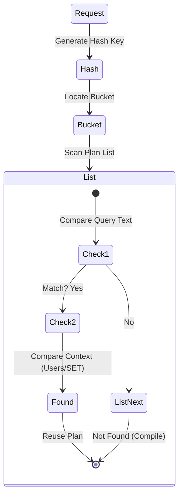

[⬅ Module 8_](../../README.md) | Section 1/3 | ➡ ถัดไป: [Plan Cache Troubleshooting](../02_Plan_Cache_Troubleshooting/README.md)

## Plan Cache Internals (Lesson 1)

### 2.1 How it works

**Plan Cache** คือพื้นที่ใน Memory ที่ SQL Server ใช้เก็บ **Execution Plans** ที่ถูก Compile แล้ว เพื่อใช้ซ้ำเมื่อมี Query เดียวกันเข้ามาอีก ลดการใช้ CPU ในการ Compile ซ้ำ

> การ Compile Query ใช้ CPU สูง ดังนั้น "ยิ่งใช้ Plan ซ้ำได้มากเท่าไร ยิ่งประหยัด CPU"

**สถาปัตยกรรม Plan Cache:**

```
Query เข้ามา → Hash Query Text → ค้นหาใน Cache Bucket
                                      ↓
                        [พบ Plan?] ─Yes→ ใช้ซ้ำ (Cache Hit)
                                      ↓ No
                        Optimize & Compile → เก็บลง Cache → Execute
```

**ประเภทของ Plan:**
*   **Compiled Plan**: แผนการทำงานต้นแบบ (Generic Structure) สามารถแชร์ข้าม Users ได้
*   **Executable Plan (Context)**: Instance ของ Plan ที่ผูกกับ User/Parameter เฉพาะ พร้อมใช้งานทันที

### 2.2 Plan Lookup Flow (Visualized)


### 2.2 Cache Stores
Cache Store คือพื้นที่หน่วยความจำที่แบ่งแยกตามประเภทของ Plan:
1.  **Object Plans (CACHESTORE_OBJCP)**: สำหรับ Stored Procedures, Functions, และ Triggers (มีความน่าจะเป็นในการใช้ซ้ำสูง)
2.  **SQL Plans (CACHESTORE_SQLCP)**: สำหรับ Ad-hoc Queries และ Prepared Statements
3.  **Bound Trees (CACHESTORE_PHDR)**: โครงสร้าง Algebra trees ของ Views และ Constraints
4.  **Extended Stored Procedures (CACHESTORE_XPROC)**: สำหรับ Extended Stored Procedures

### 2.3 Management & Eviction
เนื่องจาก Memory มีจำกัด SQL Server จึงมีกลไก Loop Eviction เพื่อลบ Plan ที่ไม่จำเป็นออก:
*   **Memory Pressure**: แรงกดดันด้านหน่วยความจำ (ทั้ง Local Store pressure และ Global Server pressure)
*   **Cost-based Eviction**: อัลกอริทึม Clock Hand จะตรวจสอบ "Cost" ของ Plan หาก Plan ใดไม่มีการใช้งานเป็นเวลานาน Cost จะลดลงจนเป็น 0 และถูกลบออกจาก Cache
*   **Manual**: คำสั่ง `DBCC FREEPROCCACHE` (ควรใช้ด้วยความระมัดระวังสูงสุดใน Production Enviromnment)

### 2.4 Minimizing Plan Bloat
*   **Auto-parameterization**: SQL Server พยายามแปลง Literal Value เป็น Parameter อัตโนมัติ (เฉพาะ Simple Query)
*   **Optimize for Ad-hoc Workloads**: ตัวเลือก configuration ระดับ Server
    *   *Mechanism*: ในการรันครั้งแรกจะเก็บเพียง "Compiled Plan Stub" (ขนาดเล็ก)
    *   *Second Run*: หากมีการเรียกใช้ซ้ำ จึงจะทำการเก็บ Full Plan
    *   *Benefit*: ลดการใช้ Memory จาก Single-use Ad-hoc queries ลงได้อย่างมหาศาล

### 2.5 Deep Dive: Plan Caching Architecture (Microsoft Guide)

1.  **Compilation Process (Lifecycle)**:
    *   **Parser**: ตรวจสอบ Validate Syntax (ถ้าผิด จะไม่เกิด Plan)
    *   **Algebrizer**: Resolve Names (ผูกชื่อ Table/Column) -> Output เป็น *Query Processor Tree*
    *   **Optimizer**: **Trivial Plan** (ง่ายๆ ไม่ต้องคิดเยอะ) vs **Full Optimization** (คำนวณ Cost ละเอียด)
    *   **Execution**: นำ Plan ไปรันจริง

2.  **Plan Cache Internals**:
    *   **Query Hash**: Fingerprint ของ Code (ไม่สนค่า Parameter) ใช้จัดกลุ่ม Query ที่หน้าตาเหมือนกัน
    *   **Query Plan Hash**: Fingerprint ของ Execution Plan ใช้ดูว่า Code เดียวกันได้ Plan เหมือนกันไหม (ถ้าต่าง = Parameter Sniffing)

3.  **Simple vs Forced Parameterization**:
    *   **Simple (Safe)**: SQL ทำเองเฉพาะ Query ง่ายๆ (เช่น `WHERE ID = 1`)
    *   **Forced (Aggressive)**: บังคับเปลี่ยนทุก Literal เป็น Parameter (ผ่าน Database Setting) -> ลด Compilation ได้ดีมาก แต่อาจทำให้เกิด Parameter Sniffing รุนแรงได้

---

---

[⬅ ก่อนหน้า](../../README.md) | [Module 8_ README](../../README.md) | ➡ ถัดไป: [Plan Cache Troubleshooting](../02_Plan_Cache_Troubleshooting/README.md) | [🧪 Labs](../../Labs/README.md)
