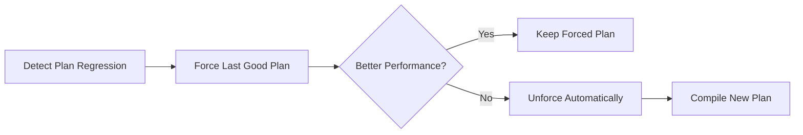

[⬅ Module 8_](../../README.md) | Section 3/3

## Query Store (Lesson 3)

**Query Store** คือระบบบันทึกประวัติ **Query Plans** และ **Runtime Statistics** ลงใน Database โดยอัตโนมัติ ช่วยให้สามารถวิเคราะห์ Performance ย้อนหลังและตรวจจับ Plan Regression ได้

> เปรียบเสมือน "Black Box" หรือ **Flight Data Recorder** ของ Database ที่บันทึกทุก Query ที่เกิดขึ้น

> [!IMPORTANT]
> **Query Store เป็น Foundation** สำหรับ Automatic Tuning และ Intelligent Query Processing ควรเปิดใช้งานก่อนเสมอ

### 4.1 Query Store Architecture

```
┌─────────────────────────────────────────────────────┐
│                    Query Store                       │
│  ┌──────────────┐  ┌──────────────┐  ┌───────────┐  │
│  │ Query Text   │  │ Query Plans  │  │ Runtime   │  │
│  │ (sys.query_  │  │ (sys.query_  │  │ Stats     │  │
│  │ store_query) │  │ store_plan)  │  │ (interval)│  │
│  └──────────────┘  └──────────────┘  └───────────┘  │
│                         ↓                            │
│  ┌──────────────────────────────────────────────┐   │
│  │ Wait Stats (SQL 2017+)                        │   │
│  │ Query Store Hints (SQL 2022+)                 │   │
│  └──────────────────────────────────────────────┘   │
└─────────────────────────────────────────────────────┘
```

### 4.2 Key Use Cases

| Use Case | วิธีใช้ | ประโยชน์ |
|----------|-------|---------|
| **Regression Detection** | เปรียบเทียบ Plan ก่อน/หลัง | หา Query ที่ช้าลงหลัง Upgrade |
| **Plan Forcing** | บังคับใช้ Plan ที่ดี | แก้ปัญหา Parameter Sniffing |
| **Top Resource Consumers** | Sort by CPU/Duration/Reads | หา Query ที่กิน Resource มากสุด |
| **Query Wait Analysis** | ดู Wait Stats ต่อ Query | หาว่า Query ติด Wait อะไร |

### 4.3 Configuration Best Practices

```sql
-- เปิดใช้งาน Query Store
ALTER DATABASE [YourDB] SET QUERY_STORE = ON;

-- ตั้งค่าที่แนะนำ
ALTER DATABASE [YourDB] SET QUERY_STORE (
    OPERATION_MODE = READ_WRITE,
    CLEANUP_POLICY = (STALE_QUERY_THRESHOLD_DAYS = 30),
    DATA_FLUSH_INTERVAL_SECONDS = 900,
    INTERVAL_LENGTH_MINUTES = 60,
    MAX_STORAGE_SIZE_MB = 1000,
    QUERY_CAPTURE_MODE = AUTO,
    SIZE_BASED_CLEANUP_MODE = AUTO
);
```

### 4.4 Plan Forcing (แก้ไขปัญหาเร่งด่วน)

```sql
-- บังคับใช้ Plan ที่ดี
EXEC sp_query_store_force_plan @query_id = 123, @plan_id = 456;

-- ยกเลิกการบังคับ
EXEC sp_query_store_unforce_plan @query_id = 123, @plan_id = 456;
```

> [!WARNING]
> Plan Forcing เป็นการแก้ปัญหาชั่วคราว ควรหาสาเหตุที่แท้จริง (เช่น Statistics, Index) และแก้ไขที่ต้นเหตุ

---

---

## Automatic Tuning Evolution (2017 - 2025) (Lesson 4)

**Automatic Tuning** คือกระบวนการ **Continuous Monitoring** ที่เรียนรู้ Workload อย่างต่อเนื่อง และปรับปรุง Performance โดยอัตโนมัติ

> [!NOTE]
> **Prerequisite**: ต้องเปิด Query Store ก่อนใช้งาน Automatic Tuning

### 5.1 Phase 1: Force Last Good Plan (SQL 2017+)

มุ่งเน้นการแก้ไขปัญหา **Plan Regression** (ประสิทธิภาพลดลงหลังจากการเปลี่ยน Plan)

**เงื่อนไขการ Force Plan อัตโนมัติ:**

| Condition | Threshold |
|-----------|-----------|
| CPU Gain | > **10 seconds** |
| Error Count | Plan ใหม่ > Plan เก่า |

```sql
-- เปิดใช้งาน Automatic Plan Correction
ALTER DATABASE [YourDB] SET AUTOMATIC_TUNING (FORCE_LAST_GOOD_PLAN = ON);

-- ตรวจสอบ Recommendations
SELECT * FROM sys.dm_db_tuning_recommendations;
```

**กระบวนการ Verification:**



> [!IMPORTANT]
> **Best Use Case**: เปิดใช้หลังทำ **Database Compatibility Level Upgrade** เพื่อลดความเสี่ยง Regression

### 5.2 Phase 2: Index Management (Azure SQL Database Only)

ความสามารถบน Cloud Platform (PaaS) ในการจัดการ Index โดยใช้ Machine Learning:

| Action | รายละเอียด | Validation |
|--------|-----------|------------|
| **Create Index** | สร้าง Index เมื่อพบ Query ที่ขาด Index | ตรวจสอบหลังสร้าง |
| **Drop Index** | ลบ Index ที่ไม่ใช้ (Unused/Duplicate) | ตรวจสอบก่อนลบ |

*   หากสร้าง Index แล้วประสิทธิภาพลดลง → **Revert อัตโนมัติ**

### 5.3 Phase 3: Intelligent Feedback Loop (SQL 2022 - 2025)

การทำงานร่วมกันระหว่าง **Query Store** และ **Next-Gen Query Processor** เพื่อบันทึกข้อมูลการจูนลง Disk (Persisted Feedback)

| Feedback Type | ปัญหาที่แก้ | Persist เมื่อไร |
|--------------|------------|----------------|
| **DOP Feedback** | Query ใช้ Parallelism มากเกินไป | SQL 2022+ |
| **CE Feedback** | Cardinality Estimation ผิด | SQL 2022+ |
| **Memory Grant Feedback** | Spill หรือ Wasted Memory | SQL 2019+ (Persisted 2022+) |
| **Optimized Plan Forcing** | Compilation Overhead สูง | SQL 2022+ |

---

---

[⬅ ก่อนหน้า](../../README.md) | [Module 8_ README](../../README.md) | [🧪 Labs](../../Labs/README.md)
