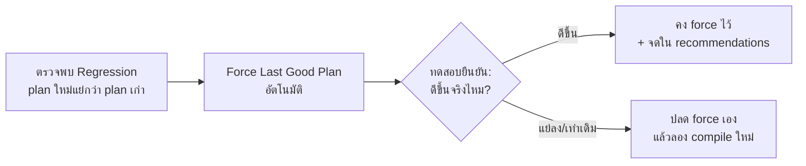

[⬅ Module 08](../../README.md) | [8.2 Plan Cache Troubleshooting](../02_Plan_Cache_Troubleshooting/README.md) | Section 3/3

# 8.3 Query Store & Automatic Tuning — กล่องดำที่บันทึกทุกการบิน

> *"Plan Cache ให้คุณดู 'ปัจจุบัน' — Query Store ให้คุณย้อนดู 'อดีต' ว่า plan ไหนเคยเร็ว แล้วทำไมวันนี้ช้า และบังคับให้กลับไปใช้ plan เดิมได้ในคลิกเดียว"*

> **ต้องรู้มาก่อน:** Plan Cache และ Parameter Sniffing จาก [8.1](../01_Plan_Cache_Internals/README.md) · กล่องเครื่องมือแก้ sniffing จาก [8.2](../02_Plan_Cache_Troubleshooting/README.md) · ความเข้าใจเรื่อง `sp_executesql` (ทำให้ Query Store มองทุกการรันเป็น query เดียวกัน)
> ศัพท์ที่ใช้ใน section นี้: [Glossary](../../../Glossary.md) — Query Store, Parameter Sniffing, Execution Plan

---

## ทำไมต้องมี Query Store เมื่อมี Plan Cache แล้ว

Plan Cache (8.1) มีจุดบอดสองจุด:

1. **ไม่มีความจำ** — plan ถูก evict เมื่อ memory pressure หรือ invalidate ทันทีที่ schema/stats เปลี่ยน — พอเกิดปัญหาแล้วค่อยมาดู หลักฐาน "ยุคที่ดี" หายไปแล้ว
2. **ไม่มีประวัติประสิทธิภาพ** — `sys.dm_exec_query_stats` ให้ค่าเฉลี่ยสะสม "ตั้งแต่ plan ถูก compile" แต่ไม่บอกว่า "ช่วง 9:00–10:00 น. วันก่อน query นี้รันด้วย plan ไหน กี่มิลลิวินาที"

**Query Store (QS)** คือระบบ *flight data recorder* ระดับฐานข้อมูล: เก็บข้อความ query, ทุก plan ที่เคยใช้, สถิติ runtime **แยกตามช่วงเวลา (interval)** — ทำให้ตอบคำถาม "เกิดอะไรขึ้นเมื่อวานตอนบ่ายสาม" ได้ และเป็นฐานของ Automatic Tuning ทั้งหมด

> [!IMPORTANT]
> การเปิด QS มี overhead เล็กน้อย (เขียนลงตารางระบบของ DB แบบ async) — แต่ประโยชน์ในการวินิจฉัยย้อนหลังคุ้มมาก Microsoft ถือเป็น best practice ที่ควรเปิด — ใน **SQL Server 2025 ฐานข้อมูลใหม่ที่ compatibility level 170 จะเปิด Query Store ให้อัตโนมัติตั้งแต่สร้าง DB**

---

## 1. สถาปัตยกรรม — ข้อมูลไหลเป็นรอบอย่างไร

```
Query รันเสร็จ
   │  (สถิติรวมใน memory ต่อเนื่อง)
   ▼
┌─────────────────────────────── In-memory aggregation ───────────────────────────────┐
│  รอบ flush ทุก DATA_FLUSH_INTERVAL_SECONDS (ค่าเริ่มต้น 900 วิ = 15 นาที)             │
└───────────────────────────────────────┬──────────────────────────────────────────────┘
                                        ▼  เขียนลง "ตารางระบบภายใน DB" (อ่านผ่าน catalog views)
┌─────────────────────────────────────────────────────────────────────────────────────┐
│ sys.query_store_query_text   — ข้อความ query (แชร์กันหลาย query_id)                   │
│ sys.query_store_query        — query หนึ่งหน่วย (ผูก text + เก็บ context_hints ฯลฯ)   │
│ sys.query_store_plan         — ทุก plan ที่เคย compile ให้ query นี้ (is_forced_plan)  │
│ sys.query_store_runtime_stats         — สถิติต่อ plan ต่อ interval                   │
│ sys.query_store_runtime_stats_interval — ขอบเขตเวลาแต่ละ interval                    │
│ sys.query_store_wait_stats   — wait ต่อ query (2017+)                                │
│ sys.query_store_query_hints  — hints ที่ตั้งผ่าน QS (2022+)                           │
└─────────────────────────────────────────────────────────────────────────────────────┘
```

ประเด็นกลไกที่ต้องรู้ก่อนอ่านข้อมูล:

- **avg_duration หน่วยเป็น MICROSECONDS** — query ที่ "ช้า 1.4 วินาที" คือ 1400000 — ผู้เรียนมักอ่านเลขผิดสเกลครั้งแรก
- **สถิติถูกเก็บต่อ interval** — query เดิมรันใน 3 interval = 3 แถว runtime stats ต่อ plan; สรุปรวมต้อง aggregate ข้าม interval (จะเห็นใน query วิเคราะห์ด้านล่าง)
- **ข้อมูลอยู่ใน DB นั้นเอง** — backup ติดไปกับ DB; restore แล้วประวัติยังอยู่
- **flush เป็นรอบ** — อยากวิเคราะห์ "สด ๆ" หลังรันทดลองให้เรียก `EXEC sp_query_store_flush_db;` บังคับ flush ก่อน

---

## 2. การตั้งค่าและ Capture Policy

อ่านสถานะปัจจุบันของฐานข้อมูล (บวก compat level ที่กำหนดว่าได้ฟีเจอร์ IQP/OPPO ชุดไหน):

```sql
USE AdventureWorks;
GO
-- สถานะ Query Store + compatibility level ของฐานข้อมูลนี้
SELECT o.actual_state_desc, o.query_capture_mode_desc, o.interval_length_minutes,
       o.max_storage_size_mb, o.current_storage_size_mb, o.size_based_cleanup_mode_desc
FROM sys.database_query_store_options AS o;

SELECT d.compatibility_level
FROM sys.databases AS d
WHERE d.name = DB_NAME();
GO
```

**Expected:** `READ_WRITE | ALL | 30 | 100 | 7 | AUTO` (DB ฝึกของหลักสูตรถูกตั้งไว้แล้ว) และ `compatibility_level = 170` (SQL Server 2025 — ระดับที่ QS ถูกเปิด default สำหรับ DB ใหม่)
> อ้างอิงรันจริง SQL Server 2025 RTM-GDR (17.0.1135.8), AdventureWorks, 2026-10-03: ได้ค่าตามนี้พอดี

**ค่าตั้งที่ต้องแยกแยะให้คล่อง:**

| ตัวเลือก | ค่า | ความหมายเชิงปฏิบัติ |
|:---|:---|:---|
| `OPERATION_MODE` | `READ_WRITE` / `READ_ONLY` | READ_ONLY = เก็บต่อแต่รับ query ใหม่ไม่ได้ (เกิดเมื่อ storage เต็มแล้ว cleanup ไม่ทัน) |
| `QUERY_CAPTURE_MODE` | `ALL` / `AUTO` / `CUSTOM` / `NONE` | ดูตารางด้านล่าง |
| `INTERVAL_LENGTH_MINUTES` | (เช่น 30) | ความละเอียดของกราฟย้อนเวลา — ละเอียด = พื้นที่เยอะ |
| `MAX_STORAGE_SIZE_MB` | (เช่น 100) | เพดานพื้นที่; โดนแล้วเข้า READ_ONLY (ถ้า cleanup mode OFF) |
| `SIZE_BASED_CLEANUP_MODE` | `AUTO` | โตเกิน 80% ของเพดาน = ลบข้อมูลเก่าทิ้งเอง |
| `STALE_QUERY_THRESHOLD_DAYS` | (เช่น 30) | อายุข้อมูล |

**Capture Mode — อ่านง่ายแต่เจ็บตัวบ่อย:**

| Mode | เก็บอะไร | ภาระ |
|:---|:---|:---|
| `ALL` | ทุก query | พื้นที่/overhead สูงสุด — เหมาะกับ DB ทดสอบ (แล็บนี้ใช้ ALL เพื่อให้ query ทดลองเบา ๆ ถูกเก็บด้วย) |
| `AUTO` | เฉพาะ query ที่ "หนักพอ" (เกณฑ์ default: ≥ 30 executions และ exec CPU รวม ≥ 100 ms ใน 24 ชม.) | ต่ำ — แนะนำสำหรับ production แต่ **query ทดสอบเบา ๆ อาจไม่ถูกเก็บ** (แล็บเคยโดนเคสนี้ — ดู Expected ของ Exercise 1 ใน [Labs/README.md](../../Labs/README.md)) |
| `CUSTOM` | กำหนดเกณฑ์เอง (executions, CPU, duration ฯลฯ) | ยืดหยุ่นที่สุด — ใช้จูนสมดุล overhead vs ความครบ |

```text
-- รูปแบบคำสั่งตั้งค่า (ระดับฐานข้อมูล — ตั้งบน DB ของตัวเองตามความเหมาะสม):
ALTER DATABASE [MyDB] SET QUERY_STORE = ON;
ALTER DATABASE [MyDB] SET QUERY_STORE (
    OPERATION_MODE = READ_WRITE,
    QUERY_CAPTURE_MODE = CUSTOM,
    QUERY_CAPTURE_POLICY = (
        STALE_CAPTURE_POLICY_THRESHOLD = 1 DAY,
        EXECUTION_COUNT = 10,
        TOTAL_COMPILE_CPU_TIME_MS = 100,
        TOTAL_EXECUTION_CPU_TIME_MS = 100
    ),
    INTERVAL_LENGTH_MINUTES = 30,
    MAX_STORAGE_SIZE_MB = 1024,
    SIZE_BASED_CLEANUP_MODE = AUTO
);
```

> [!NOTE]
> **รุ่น/ฟีเจอร์ 2025:** (1) QS เปิด default ใน DB ใหม่ที่ compat 170 — ประหยัดขั้นตอน setup; (2) **Query Store สำหรับ readable secondary** ของ Always On AG ถูกเปิด default ใน 2025 — เก็บและวิเคราะห์ workload ที่วิ่งบน replica ฝั่งอ่านได้ (ปัญหาเดิมคือ secondary "ไม่มี QS" เลย); (3) ถ้า DB ใช้ AG ให้สังเกต `sys.database_query_store_options` มีมุมมองสถานะต่อ replica

---

## 3. แผนที่คำถาม → Query

| คำถามวินิจฉัย | ทางเดินข้อมูล |
|:---|:---|
| Query ไหนกิน resource มากสุดช่วงนี้? | join 4 ตาราง + `ORDER BY avg_cpu_time/avg_duration DESC` (หัวข้อ 4) |
| Query นี้เคยได้ plan กี่แบบ? | `sys.query_store_plan` ต่อ query_id — มากกว่า 1 = plan เปลี่ยน (สัญญาณเดียวกับ query_plan_hash ใน 8.1 หัวข้อ 7) |
| Plan ไหน "เคยดี" แล้วเพราะอะไรแย่ลง? | เทียบ runtime stats ของแต่ละ plan ตาม interval (หัวข้อ 5) |
| บังคับใช้ plan เก่าได้ไหม? | `sp_query_store_force_plan` (หัวข้อ 6) |
| แก้ปัญหาโดยไม่แก้โค้ดได้ไหม? | QS Hints (หัวข้อ 7) |
| ให้ระบบแก้ regression เองได้ไหม? | Automatic Tuning (หัวข้อ 8) |

**Query "หน้าแรก" — Top Resource Consumers (รันได้กับ DB จริงทันที):**

```sql
USE AdventureWorks;
GO
-- Top 3 query ที่ช้าที่สุดเฉลี่ย (จากข้อมูลที่ flush แล้วทั้งหมด)
EXEC sp_query_store_flush_db;  -- บังคับ flush ให้เห็นข้อมูลล่าสุด

SELECT TOP (3) q.query_id, qt.query_sql_text, rs.count_executions, rs.avg_duration
FROM sys.query_store_runtime_stats AS rs
JOIN sys.query_store_plan AS p ON p.plan_id = rs.plan_id
JOIN sys.query_store_query AS q ON q.query_id = p.query_id
JOIN sys.query_store_query_text AS qt ON qt.query_text_id = q.query_text_id
ORDER BY rs.avg_duration DESC;
GO
```

**Expected:** 3 แถว query ที่ช้าที่สุดในประวัติ DB นี้ — สังเกตว่า `query_sql_text` มักอยู่ในรูป parameterized (`(@1 int)SELECT ...`) เพราะ QS เก็บ text หลัง parameterization; `rs.avg_duration` เป็น microseconds — ค่าระดับ 1e7 = ~10 วินาที
> อ้างอิงรันจริง (17.0.1135.8): top query บน VM มี avg_duration ~4.99e7 (≈ 50 วินาที) เป็น query ตรวจระบบของแล็บก่อนหน้า — โจทย์สอนดี: QS เก็บ "ทุกอย่าง" รวมถึง query ของเครื่องมือวินิจฉัยเอง

---

## 4. เวทีทดลอง: จำลอง Plan Regression แบบควบคุมได้

เราจะสร้างเรื่องราวแบบเดียวกับ [Lab 8](../../Labs/README.md) (ซึ่งผูกค่าจริงไว้แล้ว — regression 63 → 165 µs บน `Sales.SalesOrderHeader`) แต่ใช้ตารางของเราเองเพื่อไม่พึ่งข้อมูลใน DB:

- ข้อมูลเบ้: ลูกค้า 100 = 1 แถว, ลูกค้า 101 = 5,000 แถว
- "ยุคทอง" มี index ที่เหมาะ → Seek
- ใครบางคน DROP index → ยุคแย่ → Scan
- QS จะจัดเก็บเป็น **query_id เดียวที่มี 2 plans** — นั่นคือพยานหลักฐานที่เราจะใช้ต่อ

```sql
USE AdventureWorks;
GO
-- [Setup] ข้อมูลเบ้: ลูกค้า 100 = 1 แถว, ลูกค้า 101 = 5,000 แถว
DROP TABLE IF EXISTS dbo.QS3_Orders;
CREATE TABLE dbo.QS3_Orders (
    OrderID INT IDENTITY PRIMARY KEY,
    CustomerID INT NOT NULL,
    Amount DECIMAL(10, 2) NOT NULL,
    Payload CHAR(50) NOT NULL DEFAULT 'x'
);
INSERT INTO dbo.QS3_Orders (CustomerID, Amount) VALUES (100, 500.00);
INSERT INTO dbo.QS3_Orders (CustomerID, Amount)
SELECT TOP (5000) 101, 100.00 FROM sys.all_objects AS a CROSS JOIN sys.all_objects AS b;
CREATE INDEX IX_QS3_Customer ON dbo.QS3_Orders (CustomerID);
GO
-- [ยุคทอง] มี index ที่ดี -> Index Seek (10 รอบ)
EXEC sp_executesql N'SELECT OrderID, Amount FROM dbo.QS3_Orders WHERE CustomerID = @c;',
     N'@c int', @c = 100;
GO 10
-- ใครบางคน DROP index ทิ้ง -> บังคับให้เกิด plan แย่
DROP INDEX IX_QS3_Customer ON dbo.QS3_Orders;
GO
-- [ยุคแย่] compile ใหม่โดยไม่มี index -> Clustered Index Scan (10 รอบ)
EXEC sp_executesql N'SELECT OrderID, Amount FROM dbo.QS3_Orders WHERE CustomerID = @c;',
     N'@c int', @c = 100;
GO 10
-- สร้าง index กลับ
CREATE INDEX IX_QS3_Customer ON dbo.QS3_Orders (CustomerID);
GO
```

**Expected:** ทุกรอบได้ผลลัพธ์ 1 แถว (`OrderID = 1, Amount 500.00`); ยุคทองเร็วมาก (seek 1 แถว) ยุคแย่ช้าลงชัดเจน (scan 5,001 แถว) — ใช้ `sp_executesql` เพื่อให้ text เหมือนกันทุกตัวอักษร → QS มองเป็น query เดียว (ถ้าใช้ literal ตรง ๆ จะได้ query_id ต่างกันตามที่แล็บเคยพิสูจน์)
> อ้างอิงรันจริง (17.0.1135.8): ยุคทอง ~4 logical reads/รอบ, ยุคแย่ ~59 reads/รอบ

> [!WARNING]
> **กับดักที่โค้ดวิเคราะห์ QS มักพลาด:** ถ้า filter ข้อความด้วย `LIKE '%...%'` ระวัง (1) ตัววิเคราะห์ query จะจับ **ตัวมันเอง** เพราะ pattern ที่พิมพ์อยู่ใน text ของมันเอง — ใส่ `AND qt.query_sql_text NOT LIKE '%query_store%'` กันเสมอ; (2) วงเล็บเหลี่ยม `[...]` ใน pattern ถูกตีความเป็น character class — อย่าใส่ชื่อคอลัมน์แบบมีวงเล็บใน pattern

---

## 5. วิเคราะห์: "query เดียว 2 plans" จากข้อมูลจริง

```sql
USE AdventureWorks;
GO
-- ข้อมูล Query Store ถูก flush ลงตารางระบบเป็นรอบ — บังคับ flush ก่อนวิเคราะห์ทันที
EXEC sp_query_store_flush_db;
GO
DECLARE @qid BIGINT;
SELECT TOP (1) @qid = q.query_id
FROM sys.query_store_query AS q
JOIN sys.query_store_query_text AS qt ON q.query_text_id = qt.query_text_id
WHERE qt.query_sql_text LIKE '%QS3_Orders WHERE CustomerID = @c%'
  AND qt.query_sql_text NOT LIKE '%query_store%';

SELECT q.query_id, p.plan_id, p.is_forced_plan,
       SUM(rs.count_executions) AS execs,
       CAST(SUM(rs.avg_duration * rs.count_executions) / SUM(rs.count_executions) AS DECIMAL(12, 1)) AS avg_duration_us,
       SUM(rs.avg_logical_io_reads * rs.count_executions) / SUM(rs.count_executions) AS avg_reads
FROM sys.query_store_query AS q
JOIN sys.query_store_plan AS p ON q.query_id = p.query_id
JOIN sys.query_store_runtime_stats AS rs ON p.plan_id = rs.plan_id
WHERE q.query_id = @qid
GROUP BY q.query_id, p.plan_id, p.is_forced_plan
ORDER BY p.plan_id;
GO
```

**Expected:** 2 แถว (2 plans ของ query_id เดียว) — plan_id น้อย (ยุคทอง): avg_duration หลักร้อย µs, avg_reads 4; plan_id มาก (ยุคแย่): avg_duration ~9 เท่าของยุคทอง, avg_reads 59 — นี่คือหน้าตาของ **plan regression** ในข้อมูล (เทียบกับแล็บ: 63 → 165.4 µs บนตารางจริง — รูปแบบเดียวกัน)
> อ้างอิงรันจริง (17.0.1135.8): query_id 1296 — plan 1066 = 10 execs, 155.6 µs, 4 reads · plan 1067 = 10 execs, 1428.5 µs, 59 reads

อ่านเพิ่มเติมจากผล: `is_forced_plan = 0` ทั้งคู่ (ยังไม่มีใคร force), `SUM(rs.count_executions)` รวมทุก interval แล้ว 10 ต่อ plan — โครงสร้างนี้คือหัวใจของรายงาน **Regressed Queries** ใน SSMS (Object Explorer → DB → Query Store → Regressed Queries) ซึ่ง GUI คำนวณเทียบ plan ให้แบบเดียวกับที่เรา query เอง

---

## 6. Plan Forcing — บังคับใช้ plan ที่ดีคืนมาทันที

```sql
USE AdventureWorks;
GO
-- หา query_id และ plan ที่ดีที่สุด (avg_duration ต่ำสุด) แล้ว force
DECLARE @qid BIGINT, @good_plan BIGINT;
SELECT TOP (1) @qid = q.query_id
FROM sys.query_store_query AS q
JOIN sys.query_store_query_text AS qt ON q.query_text_id = qt.query_text_id
WHERE qt.query_sql_text LIKE '%QS3_Orders WHERE CustomerID = @c%'
  AND qt.query_sql_text NOT LIKE '%query_store%';

SELECT TOP (1) @good_plan = p.plan_id
FROM sys.query_store_plan AS p
JOIN sys.query_store_runtime_stats AS rs ON p.plan_id = rs.plan_id
WHERE p.query_id = @qid
GROUP BY p.plan_id
ORDER BY AVG(rs.avg_duration) ASC;

EXEC sp_query_store_force_plan @query_id = @qid, @plan_id = @good_plan;

-- ยืนยันสถานะ: plan ที่ถูก force ต้อง is_forced_plan = 1 และไม่มีความล้มเหลว
SELECT p.plan_id, p.is_forced_plan, p.force_failure_count, p.last_force_failure_reason_desc
FROM sys.query_store_plan AS p
WHERE p.query_id = @qid;
GO
-- รัน query เดิมซ้ำ 3 ครั้ง — executions ต้องเพิ่มที่ plan ที่ถูก force เท่านั้น
EXEC sp_executesql N'SELECT OrderID, Amount FROM dbo.QS3_Orders WHERE CustomerID = @c;',
     N'@c int', @c = 100;
GO 3
DECLARE @qid BIGINT;
SELECT TOP (1) @qid = q.query_id
FROM sys.query_store_query AS q
JOIN sys.query_store_query_text AS qt ON q.query_text_id = qt.query_text_id
WHERE qt.query_sql_text LIKE '%QS3_Orders WHERE CustomerID = @c%'
  AND qt.query_sql_text NOT LIKE '%query_store%';
SELECT p.plan_id, p.is_forced_plan, SUM(rs.count_executions) AS execs
FROM sys.query_store_plan AS p
JOIN sys.query_store_runtime_stats AS rs ON p.plan_id = rs.plan_id
WHERE p.query_id = @qid
GROUP BY p.plan_id, p.is_forced_plan
ORDER BY p.plan_id;
GO
-- ปลด force ตอนจบการทดลอง (ยาฉุกเฉินต้องมีวันหมดอายุ — และจะใช้ QS Hints ต่อในหัวข้อ 7)
DECLARE @qid BIGINT, @forced_plan BIGINT;
SELECT TOP (1) @qid = q.query_id
FROM sys.query_store_query AS q
JOIN sys.query_store_query_text AS qt ON q.query_text_id = qt.query_text_id
WHERE qt.query_sql_text LIKE '%QS3_Orders WHERE CustomerID = @c%'
  AND qt.query_sql_text NOT LIKE '%query_store%';
SELECT TOP (1) @forced_plan = p.plan_id
FROM sys.query_store_plan AS p
WHERE p.query_id = @qid AND p.is_forced_plan = 1;
EXEC sp_query_store_unforce_plan @query_id = @qid, @plan_id = @forced_plan;
GO
```

**Expected:** บล็อกแรก — plan ยุคทอง `is_forced_plan = 1`, `force_failure_count = 0`, `last_force_failure_reason_desc = NONE`; บล็อกสองหลังรันซ้ำ — executions ของ plan ที่ถูก force เพิ่มจาก 10 เป็น 13 ส่วน plan แย่ค้างที่ 10
> อ้างอิงรันจริง (17.0.1135.8): plan 1066 ถูก force, 10 → 13 execs, plan 1067 ค้าง 10 — ตรงกับผลแล็บ (query_id 981, plan 735: 10 → 13)

**กลไกใต้ฮู้:** การ force สร้าง **plan guide** ภายในให้ query นั้น — ทุก compile ครั้งถัดไปจะพยายาม "ฟื้น" plan ที่ถูก force แทนการ optimize ใหม่ ถ้าฟื้นไม่ได้ (เช่น index ที่ plan อ้างถูกลบ, schema เปลี่ยน) SQL Server compile ปกติแล้วจด failure ไว้ให้ดู:

| คอลัมน์ | ความหมาย |
|:---|:---|
| `is_forced_plan` | 1 = อยู่ระหว่างถูกบังคับ |
| `force_failure_count` | จำนวนครั้งที่พยายาม force แต่ฟื้น plan เดิมไม่สำเร็จ |
| `last_force_failure_reason_desc` | เหตุผลความล้มเหลวล่าสุด (`NONE`, `NO_PLAN`, `QUERY_NOT_FOUND`, `MISSING_INDEXES` ฯลฯ) |
| `plan_forcing_type_desc` | `NONE` / `FORCED` (QS force ปกติ) / `OPPO` — **Optimized Plan Forcing** ให้ plan เก็บข้อมูล metadata สำหรับฟื้นตัวเร็วขึ้น (compat ≥ 160) |

> [!WARNING]
> Plan Forcing คือ **ยาฉุกเฉิน** ไม่ใช่การรักษา — มันล็อก plan เก่าไว้ให้ระบบกลับมาใช้งานได้ก่อน แล้วค่อยหาต้นตอ (stats เน่า, index ถูกลบ, sniffing, ข้อมูลโต) — อย่าลืมตามมาด้วยการแก้ที่ต้นเหตุและ `sp_query_store_unforce_plan`

---

## 7. Query Store Hints — สั่ง hint ให้ query โดยไม่แก้โค้ด (2022+) และบล็อก query (2025)

ปัญหาของ plan forcing คือล็อกทั้ง plan — บางครั้งเราต้องการแค่ "ชี้ทิศ" เช่น `MAXDOP 1`, `RECOMPILE`, `USE HINT` — **QS Hints** ใส่ `OPTION()` ให้ query ที่ app ส่งมาโดยที่ app ไม่ต้องแก้สักตัวอักษร และมีสิทธิ์ **สูงกว่า** hint ในโค้ด

```sql
USE AdventureWorks;
GO
-- ตั้ง QS Hint: บังคับ MAXDOP 1 โดยไม่แก้โค้ด
DECLARE @qid BIGINT;
SELECT TOP (1) @qid = q.query_id
FROM sys.query_store_query AS q
JOIN sys.query_store_query_text AS qt ON q.query_text_id = qt.query_text_id
WHERE qt.query_sql_text LIKE '%QS3_Orders WHERE CustomerID = @c%'
  AND qt.query_sql_text NOT LIKE '%query_store%';
EXEC sp_query_store_set_hints @query_id = @qid, @query_hints = N'OPTION (MAXDOP 1)';
GO
-- ดู hints ที่ตั้งไว้
DECLARE @qid BIGINT;
SELECT TOP (1) @qid = q.query_id
FROM sys.query_store_query AS q
JOIN sys.query_store_query_text AS qt ON q.query_text_id = qt.query_text_id
WHERE qt.query_sql_text LIKE '%QS3_Orders WHERE CustomerID = @c%'
  AND qt.query_sql_text NOT LIKE '%query_store%';
SELECT query_id, query_hint_text, query_hint_failure_count, source_desc
FROM sys.query_store_query_hints
WHERE query_id = @qid;
GO
-- เคลียร์ hints ก่อนลอง ABORT
DECLARE @qid BIGINT;
SELECT TOP (1) @qid = q.query_id
FROM sys.query_store_query AS q
JOIN sys.query_store_query_text AS qt ON q.query_text_id = qt.query_text_id
WHERE qt.query_sql_text LIKE '%QS3_Orders WHERE CustomerID = @c%'
  AND qt.query_sql_text NOT LIKE '%query_store%';
EXEC sp_query_store_clear_hints @query_id = @qid;
GO
-- ABORT_QUERY_EXECUTION (2025): บล็อก query ไม่ให้รันเลย
DECLARE @qid BIGINT;
SELECT TOP (1) @qid = q.query_id
FROM sys.query_store_query AS q
JOIN sys.query_store_query_text AS qt ON q.query_text_id = qt.query_text_id
WHERE qt.query_sql_text LIKE '%QS3_Orders WHERE CustomerID = @c%'
  AND qt.query_sql_text NOT LIKE '%query_store%';
EXEC sp_query_store_set_hints @query_id = @qid,
     @query_hints = N'OPTION (USE HINT (''ABORT_QUERY_EXECUTION''))';
GO
-- รัน query ที่ถูก ABORT -> ต้องได้ Msg 8778 ทันที โดยไม่มีการทำงานเกิดขึ้น
EXEC sp_executesql N'SELECT OrderID, Amount FROM dbo.QS3_Orders WHERE CustomerID = @c;',
     N'@c int', @c = 100;
GO
-- [Cleanup ของทั้งหมด] ปลด hints -> ลบ query ออกจาก QS -> ถอนวัตถุทดสอบ
-- (ลำดับสำคัญ: ถ้ายังมี hint ค้าง remove_query จะ error 12456)
DECLARE @qid BIGINT;
SELECT TOP (1) @qid = q.query_id
FROM sys.query_store_query AS q
JOIN sys.query_store_query_text AS qt ON q.query_text_id = qt.query_text_id
WHERE qt.query_sql_text LIKE '%QS3_Orders WHERE CustomerID = @c%'
  AND qt.query_sql_text NOT LIKE '%query_store%';
EXEC sp_query_store_clear_hints @query_id = @qid;
EXEC sp_query_store_remove_query @query_id = @qid;
GO
DROP INDEX IF EXISTS IX_QS3_Customer ON dbo.QS3_Orders;
DROP TABLE IF EXISTS dbo.QS3_Orders;
GO
```

**Expected:** บล็อก 2 — แถวใน `sys.query_store_query_hints` มี `query_hint_text = OPTION (MAXDOP 1)`, `source_desc = User`, `query_hint_failure_count = 0`; บล็อกสุดท้าย — การรัน query ที่ถูก ABORT ได้ **Msg 8778**: *"Query execution has been aborted because the ABORT_QUERY_EXECUTION hint was specified."* ทันที โดยไม่เปลือง resource
> อ้างอิงรันจริง (17.0.1135.8): ได้ทั้งหมดตามนี้

> [!WARNING]
> **ลำดับความเข้ากันได้ (พิสูจน์จาก Msg จริงในแล็บ):** ถ้า query ยังมี **forced plan** ค้างอยู่ การตั้ง hints จะได้ **Msg 12457** ("...has forced plan. No hints can be applied to it while it has forced plan.") — ต้อง `sp_query_store_unforce_plan` ก่อน และตอนล้างงานให้ `sp_query_store_clear_hints` **ก่อน** `sp_query_store_remove_query` ไม่งั้นเจอ **Msg 12456**

**ใช้ ABORT เมื่อไร:** ad-hoc query หนักที่ app ยิงมาเป็นระยะแต่แก้โค้ดไม่ได้ทัน (เช่น รอ vendor) — บล็อกชั่วคราวเพื่อรักษา server ทั้งตัว พร้อมแจ้งเจ้าของระบบให้ชัดเจน

---

## 8. Automatic Tuning — ให้ระบบจับ Regression และแก้เอง

**Automatic Plan Correction** ทำงานบน Query Store โดยตรวจต่อเนื่องว่า query ใดเปลี่ยน plan แล้ว "แย่ลง" ตามเกณฑ์ (เช่น ใช้ CPU มากขึ้น, error เพิ่ม) แล้วบังคับ plan เก่า (ที่ดีกว่า) ให้เอง:



```sql
USE AdventureWorks;
GO
-- สถานะ Automatic Tuning ปัจจุบัน
SELECT * FROM sys.database_automatic_tuning_options;
GO
-- คำแนะนำที่ระบบวิเคราะห์แล้ว (อ่านเฉพาะ path ที่ถูกต้องบน 2025 — คอลัมน์ "script" ถูกถอดไปแล้ว!)
SELECT reason, score,
       JSON_VALUE(details, '$.planForceDetails.queryId') AS query_id,
       JSON_VALUE(details, '$.planForceDetails.regressedPlanId') AS regressed_plan,
       JSON_VALUE(details, '$.planForceDetails.recommendedPlanId') AS recommended_plan
FROM sys.dm_db_tuning_recommendations;
GO
```

**Expected:** `sys.database_automatic_tuning_options` บน DB ฝึกแสดง `FORCE_LAST_GOOD_PLAN | OFF` (เปิดด้วยคำสั่งรูปแบบด้านล่าง — บน VM ใช้ร่วมจึงเป็นสาธิต); `dm_db_tuning_recommendations` แสดงคำแนะนำที่ระบบเคยวิเคราะห์จาก activity เก่า (score สูง = ควรพิจารณาก่อน) — ถ้าว่าง แปลว่ายังไม่มี regression ที่ตรงเกณฑ์
> อ้างอิงรันจริง (17.0.1135.8): ได้ 4 recommendations จาก activity บน VM (เช่น "Average query CPU time changed from 5.05ms to 8.15ms" score 37) พร้อม queryId/regressedPlanId/recommendedPlanId จาก JSON

```text
-- รูปแบบคำสั่งเปิด Automatic Plan Correction (ระดับฐานข้อมูล — แนะนำเปิดหลัง upgrade compat level):
ALTER DATABASE [MyDB] SET AUTOMATIC_TUNING (FORCE_LAST_GOOD_PLAN = ON);
```

> [!IMPORTANT]
> **Best Use Case:** เปิด `FORCE_LAST_GOOD_PLAN` หลัง **database compatibility level upgrade** (เช่น 150 → 170) — โดยแต่ละรุ่น optimizer มีการเปลี่ยนแปลง CE/plan selection — ระบบจะ "รั้ง" plan เดิมที่ดีให้อัตโนมัติระหว่างช่วงสังเกตการณ์

**เปลี่ยนแปลงบน 17.x ที่ต้องจำ:** คอลัมน์ `script` ของ `sys.dm_db_tuning_recommendations` ถูกถอดออก — คำสั่งสั่ง force เองต้องเขียนจากค่าใน JSON (query_id + recommendedPlanId → `sp_query_store_force_plan`) และคอลัมน์ `is_memory_grant_feedback_adjusted` บน `sys.query_store_plan` ก็ถูกถอดเช่นกัน — อย่าเอาสคริปต์รุ่นเก่ามารันบน 2025

---

## 9. Feedback Loops 2022–2025 — ภาพรวมว่า "อัตโนมัติ" กินอะไรบ้าง

Automatic Tuning ไม่ได้มีแค่ force plan — ตัว Query Processor ยุคใหม่เรียนรู้จาก QS แล้วปรับ plan ต่อรอบ:

| Feedback | ปัญหาที่แก้ | เริ่มมี | บันทึกถาวร (Persist) |
|:---|:---|:---|:---|
| **Memory Grant Feedback** | grant มากเกิน (wasted memory) / น้อยเกิน (spill) | 2017 (AQP) / v2 2019 | 2022+ (ผ่าน QS) |
| **DOP Feedback** | parallelism มากเกินจนกีดกันงานอื่น | 2022 | 2022+ — และเปิด default ใน 2025 (compat 170) |
| **CE Feedback** | estimate คลาดต่อเนื่อง (แก้ระดับ expression/variables) | 2022 | 2022+ — 2025 เพิ่ม CE feedback for expressions |
| **Optimized Plan Forcing (OPPO)** | ต้นทุนการ "ฟื้น" forced plan ตอน compile | 2022 | ใน QS (`plan_forcing_type_desc = OPPO`) |
| **Automatic Plan Correction** | plan regression | 2017 | ใน QS |

> อ่านลึกต่อหัวข้อ IQP ได้ที่ [Module 7 — Intelligent Query Processing](../../../Module_07_Query_Execution/Sections/04_Intelligent_Query_Processing/README.md) — ในบทนี้เราโฟกัสบทบาทของ Query Store เป็น "หูหนวก" ของ feedback ทั้งหมด

---

## 10. Best Practices และกับดักที่ทีมงานจริงเจอ

1. **เปิด QS ทุก DB ที่สำคัญ** — ต้นทุนต่ำ ข้อมูลย้อนหลังมีค่าสูงมากเมื่อเกิดเหตุ
2. **Capture mode production ใช้ AUTO/CUSTOM** — ALL บน DB ใหญ่เปลืองพื้นที่; แต่ระวังเกณฑ์ AUTO เข้ม (30 exec + 100 ms CPU) — query สำคัญที่รันถี่น้อยอาจไม่ถูกเก็บ
3. **ตั้ง `MAX_STORAGE_SIZE_MB` + `SIZE_BASED_CLEANUP_MODE = AUTO`** — ไม่งั้น QS เต็มแล้วกระโดดไป READ_ONLY พอดีช่วงที่ต้องใช้
4. **อย่า force plan ลอย ๆ** — force แล้วจดลง runbook พร้อมวันหมดอายุ; ทบทวน `force_failure_count` เป็นระยะ
5. **เช็ก `actual_state_desc` ใน baseline** — QS ที่เงียบไปเพราะ READ_ONLY คือประสบการณ์ที่น่าผิดหวังที่สุดตอนเกิดเหตุ
6. **`sp_query_store_flush_db` ก่อนวิเคราะห์ทดลอง** — รอบ flush 15 นาทีทำให้ผลทดลอง "ยังไม่มา" ทั้งที่รันแล้ว
7. **หลัง upgrade compat level** → เปิด FORCE_LAST_GOOD_PLAN + ทบทวน regressed queries ทุกสัปดาห์ในช่วงแรก

---

## สรุป Section 3

1. **Query Store** = flight recorder ต่อ database — เก็บ text/plan/runtime stats แยก interval — เติมช่องว่าง "ไม่มีประวัติ" ของ Plan Cache
2. อ่านข้อมูลผ่าน catalog views (`query_store_query → query_text → plan → runtime_stats → runtime_stats_interval`) — ระวัง self-match กับ `LIKE`, หน่วย µs, รอบ flush
3. **Regression จริงวัดได้:** query เดียว 2 plans ต่างกัน ~9 เท่า (155.6 vs 1428.5 µs) — รูปแบบเดียวกับแล็บ (63 → 165 µs)
4. **Plan Forcing** กู้คืนทันทีด้วย plan guide ภายใน — เฝ้า `is_forced_plan`, `force_failure_count`, `last_force_failure_reason_desc`; OPPO ทำให้ฟื้น plan ถูกกว่า
5. **QS Hints** (2022+) ใส่ hint โดยไม่แก้โค้ด — สูงกว่า hint ในโค้ด, ขัดกับ forced plan (Msg 12457); **ABORT_QUERY_EXECUTION** (2025) บล็อก query ด้วย Msg 8778
6. **Automatic Plan Correction** จับและแก้ regression เอง — เปิดช่วงหลัง upgrade; `dm_db_tuning_recommendations` บน 2025 ใช้ JSON path `$.planForceDetails.*` (คอลัมน์ script ถูกถอด)

### ตรวจความเข้าใจ

1. Plan Cache กับ Query Store ต่างกันที่ "ความจำ" อย่างไร — ถ้าเกิดเหตุช้า 09:00–09:15 น. วันนี้ ข้อมูลไหนยังตอบคำถามได้ในวันพรุ่งนี้?
2. จากการทดลองหัวข้อ 5: ทำไมต้องใช้ `sp_executesql` แทนการพิมพ์ literal ตรง ๆ ให้ Query Store เห็นเป็น query เดียวกัน?
3. `is_forced_plan = 1` แต่ query ยังช้าอยู่ และ `last_force_failure_reason_desc = MISSING_INDEXES` — เกิดอะไรขึ้น และขั้นถัดไปคืออะไร?
4. QS Hints กับการแก้โค้ดใส่ `OPTION()` ตรง ๆ — อะไรมีสิทธิ์ชนะ และสถานการณ์ไหนที่ QS Hints เป็นทางออกเดียวที่ทำได้จริง?
5. เพราะอะไรทีมจึงนิยมเปิด `FORCE_LAST_GOOD_PLAN` หลัง upgrade compatibility level แล้วค่อยปิด/ทบทวนภายหลัง?
6. ผลวิเคราะห์ทดลอง "ยังไม่มีข้อมูล" ทั้งที่รันแล้ว 10 รอบ — อธิบายด้วยกลไก flush อะไร และแก้ทันทีด้วยคำสั่งใด?

---

[⬅ Module 08](../../README.md) | [🧪 Labs](../../Labs/README.md) | [➡ Module 09: Extended Events](../../Module_09_Extended_Events/README.md)
