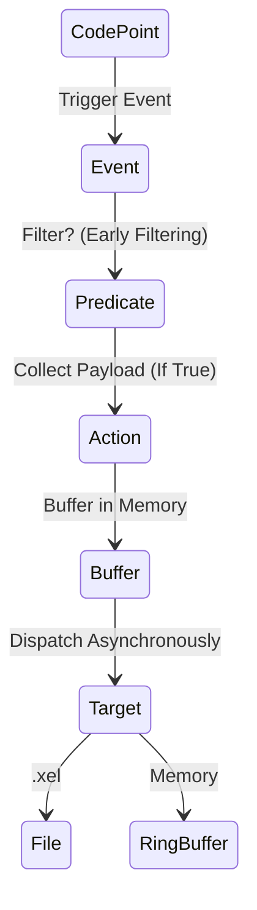

[⬅ Module 9_](../../README.md) | Section 1/2 | ➡ ถัดไป: [Working With Extended Events](../02_Working_With_Extended_Events/README.md)

## Extended Events Core Concepts (Lesson 1)

### 2.1 The Legacy vs Modern

**Extended Events (XEvents)** คือ Framework สำหรับ Tracing และ Debugging ใน SQL Server ที่ออกแบบมาให้มี Overhead ต่ำกว่า SQL Trace/Profiler แบบเดิม

> **ทำไมต้องเปลี่ยนจาก Profiler?** Profiler เป็น Synchronous และมี Overhead สูง (อาจถึง 30%) ในขณะที่ XEvents เป็น Asynchronous และมี Overhead ต่ำมาก (<1%)

**เปรียบเทียบสถาปัตยกรรม:**

| Feature | SQL Trace/Profiler | Extended Events |
|---------|-------------------|-----------------|
| Overhead | สูง (Synchronous) | ต่ำ (Asynchronous) |
| Filtering | หลังเก็บข้อมูล | **ก่อนเก็บ** (Early Filtering) |
| Target Types | Trace File เท่านั้น | หลากหลาย (Ring Buffer, File, Histogram) |
| Status | **Deprecated** | Recommended |

### 2.2 Architecture
XE Engine ประกอบด้วยองค์ประกอบหลักดังนี้:
1.  **Packages**: คอนเทนเนอร์สำหรับเก็บ Metadata ของ Events (เช่น `package0` สำหรับ System Objects, `sqlserver` สำหรับ Database Engine)
2.  **Events**: จุดตรวจสอบ (Instrumentation Points) ที่น่าสนใจภายใน Code ของ SQL Server (เช่น `lock_acquired`, `sql_statement_completed`)
3.  **Predicates**: เงื่อนไขการกรอง (Filters) ที่ทำงานในระดับ Engine *ก่อน* การเก็บข้อมูล (Early Filtering) -> ช่วยลด Overhead ได้อย่างมหาศาล
4.  **Actions**: ข้อมูลเสริม (Global Fields) ที่ต้องการเก็บเพิ่มเติม (เช่น `sql_text`, `plan_handle`) *Note: มี Cost ในการประมวลผลเพิ่ม*
5.  **Targets**: ปลายทางสำหรับการจัดเก็บข้อมูล (Consumers)
6.  **Sessions**: การกำหนดค่า (Configuration) เพื่อเชื่อมโยง Events, Predicates, และ Targets เข้าด้วยกัน

#### XEvent Packages (รายละเอียด)

| Package | Description | Common Events |
|---------|-------------|---------------|
| `package0` | Core system objects | Types, Maps, Actions |
| `sqlserver` | Database Engine events | `sql_statement_completed`, `rpc_completed`, `error_reported` |
| `sqlos` | SQL OS / Scheduling | `wait_info`, `scheduler_monitor_*` |
| `sqlclr` | CLR Integration | CLR-related events |
| `SecAudit` | Security Audit | Audit events |
| `XtpCompile` | In-Memory OLTP | Hekaton compilation events |
| `QueryExecution` | Query Processing | Plan-related events |

#### Useful Events for Performance Tuning

| Event | Purpose | Use Case |
|-------|---------|----------|
| `sql_statement_completed` | Query execution finished | Query performance analysis |
| `rpc_completed` | Stored procedure call finished | SP performance analysis |
| `lock_acquired` / `lock_deadlock` | Locking events | Blocking/Deadlock analysis |
| `sql_statement_recompile` | Plan recompilation | Recompile troubleshooting |
| `wait_info` | Wait statistics | Real-time wait analysis |
| `error_reported` | Error occurred | Error monitoring |
| `query_post_execution_showplan` | Actual execution plan | Plan capture (High overhead!) |

> [!WARNING]
> **High-Overhead Events:**
> - `query_post_execution_showplan` - ดึง Actual Plan ทุก Query (ใช้กับ Production อย่างระวัง!)
> - ใช้ `query_plan_profile` (SQL 2019+) ที่มี Lightweight Query Profiling แทน

### 2.3 Types and Maps
*   **Types**: ประเภทข้อมูลของ Field (เช่น int32, unicode_string)
*   **Maps**: การแปลงค่ารหัสตัวเลขภายใน (Internal ID) ให้เป็นข้อความที่มนุษย์อ่านเข้าใจ (Description) เช่น แปลง `WaitType=120` เป็นชื่อ Wait Type

### 2.4 Deep Dive: XEvent Engine Internals (Microsoft Architecture)

1.  **The Dispatcher**:
    *   หัวใจสำคัญของความ Lightweight คือ **Dispatcher**
    *   *Mechanism*: เมื่อ Event เกิดขึ้น Thread ที่รัน Query จะแค่ "เขียนข้อมูลลง Memory Buffer" (เร็วมาก) แล้วกลับไปทำงานต่อทันที
    *   *Background Thread*: จะมี Dispatcher Thread ภายใน Engine คอยตื่นมาดึงข้อมูลจาก Buffer ไปเขียนลง Target (File/Ring Buffer) ในภายหลัง
    *   *Result*: User Transaction ไม่ต้องรอ I/O (Asynchronous)

2.  **Event Loss Policy**:
    *   เนื่องจาก XEvent ทำงานแบบ Async จึงมีโอกาสที่ Buffer เต็มแล้วเขียนไม่ทัน เราต้องเลือก Policy:
        *   **Single Event Loss**: Buffer เต็มให้ทิ้ง Event (Default, ปลอดภัยสุด)
        *   **Multiple Event Loss**: ทิ้งทั้ง Buffer
        *   **No Event Loss**: บังคับให้ User Thread รอ (Blocking) จนกว่า Buffer จะว่าง -> **อันตราย!** อาจทำให้ระบบช้าลงเหมือน SQL Trace

3.  **Global State Data**:
    *   Actions (เช่น `sql_text`, `username`) เป็นการดึงข้อมูล Global State ซึ่งอาจมี Cost สูงกว่าการเก็บ Payload ปกติ ควรเลือกใช้เท่าที่จำเป็น

### 2.5 XEvent Architecture Diagram (Visualized)

---

---

---

[⬅ ก่อนหน้า](../../README.md) | [Module 9_ README](../../README.md) | ➡ ถัดไป: [Working With Extended Events](../02_Working_With_Extended_Events/README.md) | [🧪 Labs](../../Labs/README.md)
