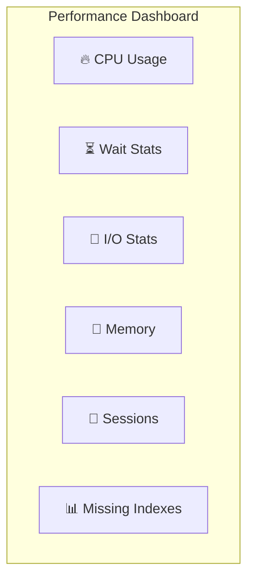

[⬅ Module 0_](../../README.md) | Section 1/2 | ➡ ถัดไป: [Baselining Benchmarking](../02_Baselining_Benchmarking/README.md)

## Monitoring and Tracing (Lesson 1)

### 2.1 Dynamic Management Objects (DMOs)

**DMOs** คือชุดของ System Views และ Functions ที่ให้ข้อมูลสถานะ Real-time ของ SQL Server ช่วยให้เราเห็นว่า "ตอนนี้เกิดอะไรขึ้นภายใน Engine"

> **หลักการ:** DMOs แบ่งเป็น 2 ประเภท - **Snapshot DMVs** (สถานะปัจจุบัน) และ **Cumulative DMVs** (สถิติสะสมตั้งแต่ Restart)

**DMOs ที่ใช้บ่อยที่สุด:**

| DMO | หน้าที่ | Reset เมื่อไร |
|-----|-------|--------------|
| `sys.dm_exec_requests` | Query กำลังทำงาน + Wait Status | Snapshot |
| `sys.dm_os_wait_stats` | Wait Stats สะสม | SQL Restart / DBCC SQLPERF |
| `sys.dm_io_virtual_file_stats` | I/O Latency ต่อไฟล์ | SQL Restart |
| `sys.dm_db_index_physical_stats` | Index Fragmentation | On-demand |

| `sys.dm_db_index_physical_stats` | Index Fragmentation | On-demand |

### 2.2 Deep Dive: Monitoring Architecture (Internal Mechanics)

1.  **DMV Implementation (User Mode vs Kernel Mode)**:
    *   **SQLOS DMV**: (เช่น `sys.dm_os_schedulers`) ดึงข้อมูลโดยตรงจาก Memory Structure ของ SQL Server เอง (เร็วมาก User Mode)
    *   **Kernel DMV**: (เช่น `sys.dm_io_virtual_file_stats`) ต้องร้องขอข้อมูลจาก Windows OS (Context Switch to Kernel Mode) -> อาจมี Overhead เล็กน้อยถ้าเรียกถี่เกินไป

2.  **PerfMon Architecture (Shared Memory)**:
    *   Performance Counter ไม่ได้ดึงข้อมูลจาก SQL โดยตรง แต่ SQL Server จะเขียนค่าลง **Shared Memory** ของ Windows เป็นระยะ
    *   *Result*: เมื่อเราเปิด PerfMon ยิงไปที่ SQL เรากำลังอ่านจาก Shared Memory นั้น ไม่ได้ไปกวน Database Engine โดยตรง (Low Overhead)

3.  **Ring Buffers**:
    *   SQL Server มี "Black Box" บันทึกเหตุการณ์สำคัญ (Error, Memory Broker, Scheduler Monitor) ลงใน Memory แบบวนทับ (Ring Buffer)
    *   *Use Case*: ใช้ดูปัญหาย้อนหลังได้แม้ไม่ได้เปิด Trace แต่ข้อมูลอาจหายเร็วถ้า Event เยอะ

### 2.3 Windows Performance Monitor (PerfMon)
เครื่องมือระดับ OS สำหรับตรวจสอบการใช้ทรัพยากร (Resource Usage):
*   **CPU**: `Processor(_Total)\% Processor Time` (ควรต่ำกว่า 80% โดยเฉลี่ย)
*   **Memory**: `Available MBytes` (หน่วยความจำเหลือใช้) และ `Page Life Expectancy` (ประสิทธิภาพ Buffer Pool)
*   **Disk**: `Avg. Disk sec/Read` (ค่า Latency, ควรต่ำกว่า 10-15ms)

### 2.3 Other Monitoring Tools
*   **Activity Monitor**: Dashboard พื้นฐานใน SSMS สำหรับดูภาพรวม (Process, Waits, I/O)
*   **Extended Events (XEvents)**: เครื่องมือ Tracing สมัยใหม่ที่เข้ามาทดแทน SQL Profiler (Low Overhead, High Flexibility)
*   **SQL Profiler / Trace**: เครื่องมือรุ่นเก่า (Legacy) ซึ่งอยู่ในสถานะ Deprecated (ไม่แนะนำให้ใช้ใน Production เนื่องจาก Overhead สูง)
*   **The Default Trace**: Trace พื้นฐานที่ทำงานอยู่เบื้องหลัง (ตรวจสอบ Schema Changes, Errors, Auto-grow Events)

### 2.4 Analysis Tools
หลังจากเก็บข้อมูลได้แล้ว ต้องมีเครื่องมือวิเคราะห์:
*   **Database Engine Tuning Advisor (DTA)**: แนะนำ Index จาก Workload (Trace/Plan Cache)
*   **Distributed Replay**: จำลอง Workload จากหลาย Client พร้อมกัน (ใช้ Test ก่อน Upgrade)

### 2.5 Performance Dashboard (SSMS Built-in)

**Performance Dashboard** คือ Report ใน SSMS ที่แสดงภาพรวมสถานะ SQL Server แบบ Real-time ประกอบด้วยข้อมูลสำคัญหลายส่วน

> **วิธีเปิด:** SSMS → คลิกขวาที่ Server → Reports → Standard Reports → **Performance Dashboard**

**ข้อมูลที่แสดง:**

| Section | แสดงอะไร |
|---------|---------|
| **CPU** | CPU Usage %, Top CPU Queries |
| **Waits** | Current Wait Stats (Top Wait Types) |
| **I/O** | I/O Statistics per Database |
| **Memory** | Buffer Pool Usage, Memory Grants |
| **User Sessions** | Active Sessions, Blocking Chains |
| **Missing Indexes** | Index Recommendations |

> [!TIP]
> Performance Dashboard เหมาะสำหรับการตรวจสอบสถานะเบื้องต้น ก่อนลงลึกด้วย DMVs หรือ XEvents

---

---

[⬅ ก่อนหน้า](../../README.md) | [Module 0_ README](../../README.md) | ➡ ถัดไป: [Baselining Benchmarking](../02_Baselining_Benchmarking/README.md) | [🧪 Labs](../../Labs/README.md)
