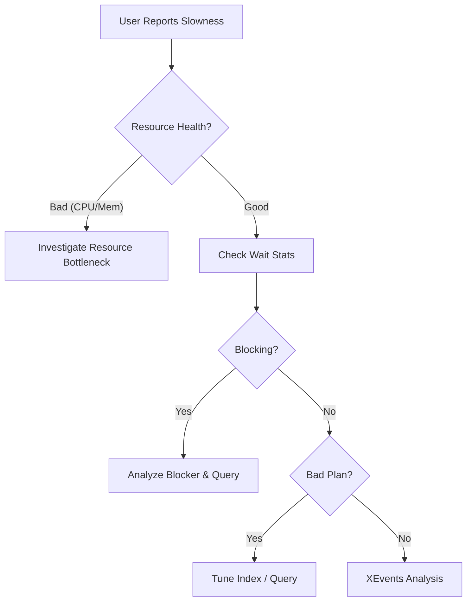

[⬅ Module 1_](../../README.md) | Section 1/2 | ➡ ถัดไป: [Scenarios and Resolution](../02_Scenarios_and_Resolution/README.md)

## The Troubleshooting Workflow

**Performance Troubleshooting** คือกระบวนการหาสาเหตุที่ SQL Server ทำงานช้า โดยใช้ข้อมูลจาก DMOs, Wait Stats และ Execution Plans มาวิเคราะห์

> **หลักการสำคัญ:** ปัญหา Performance มักเกิดจากหนึ่งใน 3 สาเหตุหลัก: **Resource Bottleneck** (CPU/Memory/Disk), **Concurrency** (Blocking/Locking), หรือ **Query Design** (Missing Index/Bad Plan)

### Step 1: Define the Problem (Problem Definition)
ระบุขอบเขตและลักษณะของปัญหาให้ชัดเจน:
*   **Scope**: ปัญหาเกิดขึ้นกับผู้ใช้งานทั้งหมด หรือเฉพาะกลุ่ม?
*   **Timeline**: ปัญหาเกิดขึ้นตลอดเวลา (Consistent) หรือเป็นช่วงเวลา (Intermittent)?
*   **Locality**: ปัญหาเกิดขึ้นที่ Module ใด หรือ Report ตัวใด?

### Step 2: Validate the Server Health (Resource Health Check)
ตรวจสอบสถานะทรัพยากรพื้นฐานของระบบ:
*   **CPU**: มีการใช้งานสูงผิดปกติ (High Utilization) หรือไม่?
*   **Memory**: มีสัญญาณของ Memory Pressure หรือ OS Paging หรือไม่?
*   **Disk**: I/O Latency อยู่ในเกณฑ์ยอมรับได้หรือไม่?

### Step 3: Check SQL Server Internals (Wait Statistics Analysis)
หาก Server Resource ปกติ แต่ SQL Server ตอบสนองช้า จำเป็นต้องวิเคราะห์ **Wait Statistics**:
*   *Overview*: ใช้ Script วิเคราะห์ Wait Stats สะสมเพื่อดูภาพรวม (`Module_01/Sections/04_Wait_Statistics/Scripts/08_Wait_Stats_Analysis.sql`)
*   *Real-time*: ตรวจสอบ Request ที่กำลังทำงานและการ Blocking ปัจจุบัน (โค้ดอยู่ใน Module 01 — Lab Exercise 3)

### Step 4: Identify the Root Cause
จำแนกประเภทของปัญหา:
1.  **Index/Query Design**: การขาด Index ที่เหมาะสม, Query ที่เขียนไม่ดี (Poorly Written Code), หรือ Parameter Sniffing
2.  **Concurrency**: ปัญหา Blocking Chains หรือ Deadlocks
3.  **Resource Bottleneck**: ข้อจำกัดด้าน Hardware (CPU/Memory/Disk Saturation)

### 2.5 Deep Dive: The Hierarchy of Bottlenecks (Chain of Pain)

ปัญหาประสิทธิภาพมักมีการส่งต่อผลกระทบเป็นลูกโซ่ (Domino Effect) การเข้าใจลำดับชั้นช่วยให้แก้ที่ **ต้นเหตุ** ไม่ใช่ปลายเหตุ:

1.  **Hardware Level (Root)**:
    *   Disk ช้า -> IOPS เต็ม -> Response Time สูง
2.  **Memory Level (Propagation)**:
    *   Disk ช้า -> Page อ่านเข้า Memory ช้า -> Thread ต้องรอ (PAGEIOLATCH) -> ถือ Latch นานขึ้น
3.  **Concurrency Level (Symptom)**:
    *   Latch นาน -> ขวาง Thread อื่นที่ต้องการ Page เดียวกัน -> Blocking Chain ยาว -> User รอนาน (Time out)

> [!TIP]
> **Don't shoot the messenger**: เจอ Blocking อย่าเพิ่งโทษ Locking เสมอไป ให้เช็คว่าเป็นผลพวงจาก Disk/CPU หรือไม่

### 2.6 Troubleshooting Flowchart (Visualized)

---

---

[⬅ ก่อนหน้า](../../README.md) | [Module 1_ README](../../README.md) | ➡ ถัดไป: [Scenarios and Resolution](../02_Scenarios_and_Resolution/README.md) | [🧪 Labs](../../Labs/README.md)
