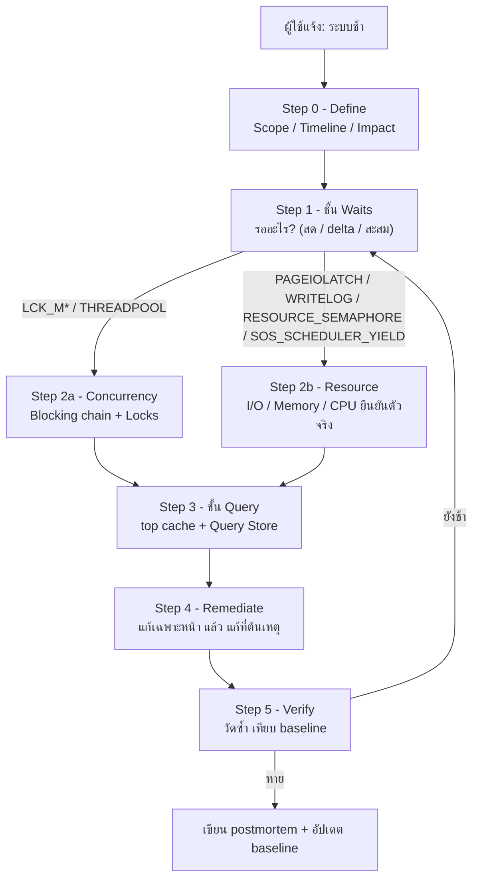

[⬅ Module 11](../../README.md) | Section 1/2 | ➡ ถัดไป: [02 Scenarios and Resolution](../02_Scenarios_and_Resolution/README.md)

# 11.1 Troubleshooting Workflow — คิดแบบ Top-down ก่อนลงมือแก้

> *"DBA ที่เก่งไม่ใช่คนที่รู้วิธีแก้เยอะที่สุด แต่คือคนที่เดาน้อยที่สุด — เพราะใช้ข้อมูลตัดทางเลือกจนเหลือทางเดียว"*

> **ต้องรู้มาก่อน**: Section นี้คือ **capstone** — สมมติว่าคุณผ่าน Module 1–10 มาแล้ว (waits, I/O, memory, concurrency, plans, XEvents, baseline) เราจะประกอบทุกชิ้นเข้าเป็น **กรอบวินิจฉัยแบบ Top-down 5 ชั้น** ที่ใช้ได้กับ "server ช้า" ทุกแบบ
> ศัพท์เทคนิคที่ไม่คุ้นเปิดดูได้จาก [Glossary](../../../Glossary.md)

---

## ทำไม Section นี้จึงเป็น Capstone ของทั้งหลักสูตร

ตลอด 10 โมดูลที่ผ่านมา คุณเก็บเครื่องมือทีละชิ้น — ตอนนี้คือช่วง "ประกอบเครื่อง" ปัญหาจริงใน production ไม่เคยมาแบบ "CPU สูง" เฉย ๆ แต่มาแบบ **"ระบบช้า ช่วงเช้า บางทีก็ปกติ"** ที่ต้องแยกว่าเป็น CPU, lock, memory, disk หรือ plan และที่เลวร้ายกว่านั้นคือมันเป็น **หลายอย่างพร้อมกัน**

กรอบที่หลักสูตรทั้งเล่มสอนมา ถูกออกแบบให้เชื่อมกันดังตารางนี้:

| ความรู้จากโมดูลก่อน | เครื่องมือหลัก | คำถามที่ตอบได้ในเวิร์กโฟลว์นี้ |
|:--------------------|:----------------|:-------------------------------|
| M1 Waits & Scheduling | `sys.dm_os_wait_stats`, `sys.dm_os_schedulers` | "Server กำลังรออะไร?" |
| M2 I/O | `sys.dm_io_virtual_file_stats` | "Disk ตอบช้าจริงหรือเปล่า?" |
| M4 Memory | PLE, Memory Grants, Clerks | "Buffer Pool / memory grant ขาดมือ?" |
| M5 Concurrency | `sys.dm_exec_requests`, `sys.dm_tran_locks` | "ใคร block ใคร ลูกโซ่ยาวแค่ไหน?" |
| M7/M8 Plans & Plan Cache | `sys.dm_exec_query_stats`, Query Store | "Query ตัวไหน Plan ไหนโทษ?" |
| M9 Extended Events | `system_health`, custom sessions | "จับเหตุการณ์เสี้ยววินาทีที่ DMV มองไม่เห็น" |
| M10 Monitoring & Baseline | Baseline snapshots | "'ปกติ' ของ server นี้คืออะไร — วันนี้เบี่ยงไปเท่าไร?" |

> **หลักการของทั้งโมดูล:** อย่าลงมือแก้ก่อนรู้ว่าคอขวดอยู่ชั้นไหน — การเพิ่ม CPU ให้ server ที่แคบเพราะ lock, หรือสร้าง index ให้ query ที่ช้าเพราะ memory grant ไม่พอ คือการเผาเวลาและเงินไปกับ **ปลายเหตุ**

---

## ภาพรวม: กรอบ Top-down 5 ชั้น



อ่านแผนภาพจากบนลงล่าง: **Waits เป็นเข็มทิศ** — บอกเราว่าจะเดินไปชั้นไหนต่อ (Concurrency หรือ Resource) แล้วค่อยซูมเข้าไปที่ Query สุดท้ายคือการแก้และพิสูจน์ว่าแก้แล้วดีขึ้นจริง

---

## Step 0: Define the Problem — ตั้งขอบเขตก่อนเปิด DMV

ก่อนพิมพ์ query แรก ตอบให้ได้ 3 คำถาม (จากคนแจ้ง หรือจาก monitoring ที่เก็บไว้):

| คำถาม | ทำไมสำคัญ | ตัวอย่างคำตอบ |
|:------|:-----------|:---------------|
| **Scope** — ใคร/ส่วนไหนช้า? | ทั้ง server ช้า ≠ app ตัวเดียวช้า (อาจเป็น app-side หรือ network) | "ทุก screen ของระบบขาย" vs "รายงานตัวเดียว" |
| **Timeline** — ช้าเมื่อไร ช่วงไหน? | ช้าตลอด = โครงสร้าง (index/plan) · ช้าเป็นช่วง = workload/งานเวลา/แข่ง resource | "ทุกวัน 9:00–9:30" |
| **Impact** — ช้าแค่ไหน เสียอะไร? | กำหนดความเร่งด่วนของการ mitigate (แก้หน้างานทันที หรือ ticket ปกติ) | "checkout timeout ทุก 3 นาที" |

> [!TIP]
> คำตอบของ Step 0 ตัดทางเลือกได้มากกว่าที่คิด: ช้า "เฉพาะบางเวลา" หมายถึงคุณ**ต้องเก็บข้อมูลตอนที่อาการเกิด** (delta waits, XEvents, Query Store window) — ไม่ใช่เก็บตอนบ่ายว่าง ๆ แล้วสรุปว่าไม่มีปัญหา รายละเอียดเคสนี้อยู่ Section 11.2 Scenario 1

---

## Step 1: ชั้น Waits — "Server กำลังรออะไร"

จาก Module 1: Response Time = Service Time (CPU) + Wait Time และ DMV เก็บการรอไว้ 3 มุมมองที่ต้องใช้ร่วมกัน:

1. **สด (live)** — ตอนนี้มี request ไหนกำลังรออะไร
2. **Delta (หน้าต่างเวลา)** — ช่วงที่อาการเกิด รออะไรมากขึ้น
3. **สะสม** — ธรรมชาติของ workload ตั้งแต่ restart

### 1.1 มอง "ตอนนี้" — request ที่กำลังรัน/รอ

> **ต้องรู้ก่อน** (ใช้ syntax เกิน SELECT/JOIN): บล็อกนี้ใช้ **OUTER APPLY** (เรียก TVF `sys.dm_exec_sql_text` ต่อท้ายทีละแถวเพื่อดึงข้อความ SQL ของ request) — อ่านเพิ่มที่ [Glossary](../../../Glossary.md)

```sql
-- มองเห็น "ตอนนี้" ภายใน 1 วินาที: ใครกำลังทำอะไร รออะไรอยู่
SELECT r.session_id, r.blocking_session_id, r.status, r.wait_type,
       r.wait_time, r.cpu_time, r.logical_reads,
       LEFT(t.text, 80) AS running_sql
FROM sys.dm_exec_requests AS r
JOIN sys.dm_exec_sessions AS s
    ON s.session_id = r.session_id
OUTER APPLY sys.dm_exec_sql_text(r.sql_handle) AS t
WHERE r.session_id <> @@SPID
  AND s.is_user_process = 1
ORDER BY r.total_elapsed_time DESC;
```

> ⚠️ สังเกต `s.is_user_process` — คอลัมน์นี้**ถูกถอดออกจาก `sys.dm_exec_requests` ใน SQL Server 2025** ต้อง JOIN `sys.dm_exec_sessions` มาเช็คแทน (ทดสอบจริงบน 17.0.1135.8: ใช้ `r.is_user_process` ตรง ๆ ได้ error `Invalid column name`) — เวลา copy สคริปต์เก่ามาใช้ ให้ระวังจุดนี้ทุกครั้ง

### 1.2 มอง "หน้าต่างเวลา" — delta waits ตอนที่อาการเกิด

ค่าใน `sys.dm_os_wait_stats` เป็นค่าสะสมตั้งแต่ restart — บน server ที่รันมานาน สะสมเก่าจะกลบเหตุการณ์ใหม่ เทคนิคจริงคือ **snapshot 2 จุด แล้วลบกัน**:

```sql
-- Delta wait stats: 15 วินาทีที่ผ่านมา server รออะไร (ไม่ใช่ค่าสะสมตั้งแต่ restart)
SELECT wait_type, waiting_tasks_count, wait_time_ms, signal_wait_time_ms
INTO #waits_t0
FROM sys.dm_os_wait_stats;

WAITFOR DELAY '00:00:15';   -- เปิด "หน้าต่าง" วินิจฉัย 15 วินาที

SELECT w.wait_type,
       w.waiting_tasks_count - t0.waiting_tasks_count AS delta_waits,
       CAST((w.wait_time_ms - t0.wait_time_ms) / 1000.0 AS DECIMAL(10,1)) AS delta_wait_s,
       CAST((w.signal_wait_time_ms - t0.signal_wait_time_ms) / 1000.0 AS DECIMAL(10,1)) AS delta_signal_s,
       CAST(100.0 * (w.wait_time_ms - t0.wait_time_ms)
            / NULLIF(SUM(w.wait_time_ms - t0.wait_time_ms) OVER (), 0) AS DECIMAL(5,1)) AS pct_of_window
FROM #waits_t0 AS t0
JOIN sys.dm_os_wait_stats AS w
    ON w.wait_type = t0.wait_type
WHERE w.wait_time_ms - t0.wait_time_ms > 0
  AND w.wait_type NOT IN (N'CHECKPOINT_QUEUE', N'DIRTY_PAGE_POLL', N'LAZYWRITER_SLEEP',
        N'LOGMGR_QUEUE', N'REQUEST_FOR_DEADLOCK_SEARCH', N'BROKER_TO_FLUSH',
        N'MEMORY_ALLOCATION_EXT', N'SLEEP_TASK', N'SLEEP_SYSTEMTASK', N'SLEEP_BPOOL_FLUSH',
        N'XE_TIMER_EVENT', N'WAITFOR', N'BROKER_TASK_STOP', N'BROKER_EVENTHANDLER',
        N'HADR_FILESTREAM_IOMGR_IOCOMPLETION', N'HADR_WORK_QUEUE', N'HADR_TIMER_TASK',
        N'SQLTRACE_INCREMENTAL_FLUSH_SLEEP', N'SOS_WORK_DISPATCHER', N'PREEMPTIVE_OS_CRYPTOPS',
        N'PREEMPTIVE_OS_REPORTEVENT', N'PREEMPTIVE_OS_WRITEFILE', N'PREEMPTIVE_OS_AUTHORIZATIONOPS',
        N'PREEMPTIVE_OS_CRYPTACQUIRECONTEXT', N'PREEMPTIVE_XE_GETTARGETSTATE',
        N'SP_SERVER_DIAGNOSTICS_SLEEP', N'DISPATCHER_QUEUE_SEMAPHORE',
        N'QDS_PERSIST_TASK_MAIN_LOOP_SLEEP', N'QDS_ASYNC_QUEUE', N'KSOURCE_WAKEUP')
  AND w.wait_type NOT LIKE N'PREEMPTIVE_%'
  AND w.wait_type <> N'XE_DISPATCHER_WAIT'
ORDER BY delta_wait_s DESC;

DROP TABLE #waits_t0;
```

อ้างอิงรันจริงบน server หลักสูตร (idle): บล็อกนี้ให้ผลใกล้เคียงศูนย์ มีเพียง `PAGEIOLATCH_SH`/`WRITELOG` เสี้ยววินาทีจาก background — **นี่คือ baseline ที่ดี** เมื่อคุณรันบล็อกนี้*ตอนที่ระบบช้า* แล้วเห็น `LCK_M_X` หรือ `SOS_SCHEDULER_YIELD` โดดขึ้นมาเป็นอันดับหนึ่ง นั่นคือสัญญาณจริง

### 1.3 มอง "สะสม" — ธรรมชาติของ workload

```sql
-- ภาพสะสม: top waits หลังกรอง benign + สัดส่วน signal wait (CPU pressure)
WITH Waits AS
(
    SELECT wait_type, wait_time_ms / 1000.0 AS wait_s,
           (wait_time_ms - signal_wait_time_ms) / 1000.0 AS resource_s,
           signal_wait_time_ms / 1000.0 AS signal_s, waiting_tasks_count
    FROM sys.dm_os_wait_stats
    WHERE wait_type NOT IN (N'SLEEP_TASK', N'SLEEP_SYSTEMTASK', N'SLEEP_BPOOL_FLUSH', N'BROKER_TO_FLUSH',
                            N'QDS_ASYNC_QUEUE', N'SQLTRACE_INCREMENTAL_FLUSH_SLEEP',
                            N'HADR_FILESTREAM_IOMGR_IOCOMPLETION', N'XE_FILE_TARGET_TVF',
                            N'WAITFOR', N'XE_TIMER_EVENT', N'BROKER_TASK_STOP',
                            N'CHECKPOINT_QUEUE', N'LAZYWRITER_SLEEP', N'LOGMGR_QUEUE',
                            N'DIRTY_PAGE_POLL', N'REQUEST_FOR_DEADLOCK_SEARCH',
                            N'SP_SERVER_DIAGNOSTICS_SLEEP', N'DISPATCHER_QUEUE_SEMAPHORE',
                            N'QDS_PERSIST_TASK_MAIN_LOOP_SLEEP', N'SOS_WORK_DISPATCHER',
                            N'XE_DISPATCHER_WAIT', N'MEMORY_ALLOCATION_EXT')
      AND wait_type NOT LIKE N'PREEMPTIVE_%'
      AND waiting_tasks_count > 0
)
SELECT TOP (10) wait_type,
       CAST(wait_s AS DECIMAL(10,1)) AS wait_s,
       CAST(100.0 * wait_s / SUM(wait_s) OVER () AS DECIMAL(5,1)) AS pct_total,
       CAST(signal_s AS DECIMAL(10,1)) AS signal_s
FROM Waits ORDER BY wait_s DESC;

SELECT CAST(100.0 * SUM(signal_wait_time_ms) / NULLIF(SUM(wait_time_ms), 0) AS DECIMAL(5,2)) AS signal_wait_pct
FROM sys.dm_os_wait_stats
WHERE wait_time_ms > 0;
```

อ้างอิงรันจริงบน server หลักสูตร: หลังกรอง benign แล้ว top waits คือ `CXCONSUMER`, `CXSYNC_PORT`, `LCK_M_X`, `CXPACKET`, `ASYNC_NETWORK_IO` — ภาพสะท้อนการทดลอง blocking/parallelism ที่เราทำมาทั้งหลักสูตร และ `signal_wait_pct` อยู่ที่ ~4% (สุขภาพ CPU ดี เกณฑ์เตือน > 10–15% ต่อเนื่อง)

### 1.4 แปล wait → ทิศทาง

| Wait ที่โดดขึ้น | แปลว่ากำลังรอ | ไป Step ไหนต่อ |
|:-----------------|:---------------|:----------------|
| `LCK_M_S/X/U` | Lock ขัดกัน (blocking) | Step 2a — Concurrency |
| `THREADPOOL` | Worker หมด (มักตามหลัง blocking หรือ MAXDOP สูง) | Step 2a + เช็ค concurrent requests |
| `PAGEIOLATCH_SH/EX` | อ่าน data page จาก disk | Step 2b — I/O + Memory (PLE) |
| `WRITELOG` | Harden transaction log | Step 2b — I/O (log file latency) |
| `RESOURCE_SEMAPHORE` | รอ memory grant | Step 2b — Memory |
| `SOS_SCHEDULER_YIELD` + signal wait สูง | CPU แน่น | Step 2b — CPU |
| `CXPACKET`/`CXCONSUMER` โดดเด่น | Parallelism (อาจเป็นสาเหตุ อาจเป็นอาการ) | Step 3 — ดู plan ก่อนตัดสิน |
| `ASYNC_NETWORK_IO` | Client รับข้อมูลไม่ทัน | ออกไปนอก SQL Server — แต่ตรวจ result set ขนาดยักษ์ใน Step 3 ก่อน |

---

## Step 2a: ชั้น Concurrency — ลูกโซ่ Blocking

(รายละเอียดเต็ม + เดโมจริงอยู่ Step 4 และ Section 11.2 Scenario 3 — ที่นี่คือชุดตรวจเร็ว)

```sql
-- ลูกโซ่ blocking ตอนนี้: ใครรอใคร รออะไรนานเท่าไร
SELECT r.session_id, r.blocking_session_id, r.status,
       r.wait_type, r.wait_time / 1000.0 AS wait_s,
       r.open_transaction_count, LEFT(t.text, 60) AS running_sql
FROM sys.dm_exec_requests AS r
JOIN sys.dm_exec_sessions AS s
    ON s.session_id = r.session_id
OUTER APPLY sys.dm_exec_sql_text(r.sql_handle) AS t
WHERE r.blocking_session_id <> 0
   OR r.open_transaction_count > 0
ORDER BY r.blocking_session_id, r.wait_time DESC;
```

อ่านผลแบบมืออาชีพ:

- แถวที่ `blocking_session_id = 0` แต่ `open_transaction_count > 0` และ `wait_type = WAITFOR` — **ผู้ต้องสงสัยอันดับหนึ่ง (head blocker)**: เปิด transaction แล้วหยุดรออะไรบางอย่างที่ไม่ใช่ lock (แอปลืม COMMIT, user เปิด tran ใน SSMS แล้วลืม)
- แถวที่ `blocking_session_id` ชี้ไปที่ session เดียวกันหลายแถว — ลูกโซ่ตรง
- บน database ที่เปิด **RCSI** (อย่าง AdventureWorks ของหลักสูตร): SELECT ธรรมดา**ไม่**ถูก writer block — ถ้ายังเจอ blocking แปลว่าเป็น writer-vs-writer หรือ schema lock ซึ่งรุนแรงกว่าที่คิด

---

## Step 2b: ชั้น Resource — ยืนยันคอขวดตัวจริง

### I/O — latency ต่อไฟล์ (จาก Module 2)

```sql
-- ชั้น Resource: I/O latency ต่อไฟล์ (ค่าสะสม) — เกณฑ์อ้างอิง: read < 20 ms, log write < 5 ms
SELECT DB_NAME(vfs.database_id) AS database_name,
       mf.name AS logical_name, mf.type_desc,
       vfs.num_of_reads, vfs.num_of_writes,
       CAST(vfs.io_stall_read_ms  / NULLIF(vfs.num_of_reads, 0)  AS DECIMAL(10,1)) AS avg_read_ms,
       CAST(vfs.io_stall_write_ms / NULLIF(vfs.num_of_writes, 0) AS DECIMAL(10,1)) AS avg_write_ms
FROM sys.dm_io_virtual_file_stats(NULL, NULL) AS vfs
JOIN sys.master_files AS mf
    ON mf.database_id = vfs.database_id AND mf.file_id = vfs.file_id
ORDER BY avg_read_ms DESC;
```

### Memory — grants + PLE + clerks (จาก Module 4)

```sql
-- ชั้น Resource: Memory — memory grants + PLE + memory clerks
SELECT counter_name, cntr_value
FROM sys.dm_os_performance_counters
WHERE object_name LIKE N'%Memory Manager%'
  AND counter_name IN (N'Memory Grants Pending', N'Memory Grants Outstanding');

SELECT counter_name, cntr_value
FROM sys.dm_os_performance_counters
WHERE object_name LIKE N'%Buffer Node%'
  AND counter_name = N'Page life expectancy';

SELECT TOP (5) type,
       CAST(SUM(pages_kb) / 1024.0 AS DECIMAL(10,1)) AS size_mb
FROM sys.dm_os_memory_clerks
GROUP BY type
ORDER BY SUM(pages_kb) DESC;

SELECT session_id, requested_memory_kb, granted_memory_kb, used_memory_kb, wait_time_ms
FROM sys.dm_exec_query_memory_grants;
```

อ่านผล: `Memory Grants Pending > 0` = มี query ต่อคิวรอ grant (เห็น RESOURCE_SEMAPHORE ใน waits คู่กันเสมอ) · PLE ตกลงเร็ว/ต่ำ = buffer pool ถูกกวาด · `dm_exec_query_memory_grants` โชว์ grant ที่ถืออยู่ตอนนี้ — เทียบ `requested` กับ `used` เพื่อหา over-grant

### CPU — คิว runnable ต่อ scheduler (จาก Module 1)

```sql
-- ชั้น Resource: CPU — คิว runnable ต่อ scheduler (ควร = 0 แทบตลอดเวลา)
SELECT scheduler_id, status, current_tasks_count,
       runnable_tasks_count, work_queue_count, pending_disk_io_count
FROM sys.dm_os_schedulers
WHERE scheduler_id < 1048576 AND status = N'VISIBLE ONLINE'
ORDER BY runnable_tasks_count DESC;
```

> [!IMPORTANT]
> ค่า `runnable_tasks_count > 0` ต้องดู **คู่กับ signal wait ratio** เสมอ — เจอครั้งเดียวไม่ใช่คอขวด ต้องเจอซ้ำ ๆ ในหน้าต่างเวลาที่อาการเกิด นี่คือเหตุผลที่ baseline (Module 10) จำเป็น

---

## Step 3: ชั้น Query — ตัวร้ายคือ query อะไร

เมื่อรู้แล้วว่าคอขวดอยู่มิติไหน เราย้ายจาก "ระดับ server" ลง "ระดับ statement":

```sql
-- ชั้น Query: top plan cache ตาม CPU + logical reads
SELECT TOP (10)
       qs.total_worker_time / 1000 AS cpu_ms,
       qs.total_logical_reads AS logical_reads,
       qs.execution_count,
       LEFT(st.text, 80) AS query_text
FROM sys.dm_exec_query_stats AS qs
CROSS APPLY sys.dm_exec_sql_text(qs.sql_handle) AS st
ORDER BY qs.total_worker_time DESC;
```

ลำดับการสอบสวนที่มักได้ผล:

1. **CPU โทษ** → เอา top worker-time query ไปดู plan (Module 7): scan ทั้งตาราง? implicit conversion? ขาด index? (Module 6)
2. **logical reads ยักษ์** → เทียบกับผลลัพธ์ที่ business ต้องการจริง — reads สูง + result set เล็ก = แนวทาง index; reads สูง + result set ยักษ์ = แก้ฝั่ง app (และมักมี `ASYNC_NETWORK_IO` คู่กัน)
3. **เคส "เคยเร็ว ตอนนี้ช้า"** → ข้ามไป Query Store ทันที (Section 11.2 Scenario 1/5) เพราะมี plan เก่าให้เทียบ
4. **เหตุการณ์สั้น ๆ ที่ DMV พลาด** → XEvents (Module 9): `sp_server_diagnostics`, `blocked_process_report`, deadlock graph ใน `system_health`

---

## Step 4: Remediate — แก้เฉพาะหน้า → แก้ต้นเหตุ → วัดซ้ำ

### ก่อนลงมือ: แยกให้ชัด 2 ระดับ

| ระดับ | ทำอะไร | ตัวอย่าง | อายุของทางแก้ |
|:------|:--------|:----------|:---------------|
| **Mitigate** (แก้หน้างาน) | ทำให้ระบบกลับมาใช้ได้**เดี๋ยวนี้** | KILL head blocker, ยกเลิก query ยักษ์, restart ตัว app ที่ leak connection | นาที–ชั่วโมง (อาจกลับมาอีก) |
| **Root fix** (แก้ต้นเหตุ) | ตัดสาเหตุที่มันเกิดได้ | แก้ app ให้ COMMIT สั้น, สร้าง index, force plan ใน Query Store, ปรับ MAXDOP | ถาวร จนกว่า workload เปลี่ยน |

### เดโมจริง: blocking ตีน้ำแข็ง + การ KILL อย่างมีวินัย (≤ 60 วินาที)

เปิด **2 หน้าต่าง** (SSMS หรือ sqlcmd) — หน้าต่าง A จำลอง head blocker, หน้าต่าง B จำลอง victim:

```sql
-- หน้าต่าง A: head blocker — เปิด tran ค้าง 45 วินาที แล้ว ROLLBACK
USE AdventureWorks;
BEGIN TRAN;   -- M11DEMO_BLOCKER

UPDATE Production.ProductInventory
SET Quantity = Quantity       -- อัปเดต "ค่าเดิม" เพื่อสาธิต — ไม่เปลี่ยนข้อมูลจริง
WHERE ProductID = 1;

WAITFOR DELAY '00:00:45';     -- transaction ค้าง 45 วินาที (จำลอง app ลืม COMMIT)
ROLLBACK;
```

```sql
-- หน้าต่าง B: victim — ขอ X lock แถวเดียวกัน จะติดรอทันที
USE AdventureWorks;
UPDATE Production.ProductInventory
SET Quantity = Quantity
WHERE ProductID = 1;
SELECT 'VICTIM_DONE' AS marker;
```

ระหว่างที่รอ ให้รัน "ลูกโซ่ blocking" (Step 2a) — อ้างอิงรันจริงบน SQL Server 2025 (17.0.1135.8): หน้าต่าง A โชว์ `status = suspended / wait_type = WAITFOR / open_transaction_count = 1` และหน้าต่าง B `LCK_M_X` กำลังรอเพิ่มขึ้นทีละวินาที (ที่เราวัดได้ ~6 วินาที) — นี่คือภาพ "ตีน้ำแข็ง" ที่ผู้ใช้เรียกว่า ระบบ hang

ตอน mitigate: **KILL ได้เฉพาะ session ที่คุณยืนยันตัวตนได้** — บล็อกด้านล่างระบุ session จาก **marker comment** ในตัว query + เงื่อนไข "มี open transaction" แล้วจึงยิง (จำเป็นต้องใช้ `EXEC` เพราะ `KILL @spid` ใช้ตัวแปรไม่ได้):

```sql
-- KILL เฉพาะ session ของเดโมเรา: ระบุจาก marker comment + มี open transaction
DECLARE @spid INT =
(
    SELECT r.session_id
    FROM sys.dm_exec_requests AS r
    CROSS APPLY sys.dm_exec_sql_text(r.sql_handle) AS t
    WHERE t.text LIKE '%M11DEMO_BLOCKER%'
      AND r.open_transaction_count > 0
      AND r.session_id <> @@SPID
);

SELECT @spid AS will_kill_session;          -- ตรวจก่อนยิง: ต้องเป็น session เดโมเท่านั้น
IF @spid IS NOT NULL
    EXEC(N'KILL ' + @spid);

SELECT (SELECT COUNT(*) FROM sys.dm_exec_requests
        WHERE blocking_session_id <> 0) AS still_blocked;
```

**Expected (อ้างอิงรันจริง):** `will_kill_session` = SPID ของหน้าต่าง A → ยิงแล้ว `still_blocked = 0` ทันที หน้าต่าง B รันจนเสร็จ (`VICTIM_DONE`) ภายในไม่กี่ ms — และเพราะ transaction ของ A ถูก rollback อัตโนมัติ ข้อมูลใน `ProductInventory` ไม่เปลี่ยนแปลงเลย (เราตรวจย้ำ: ค่า Quantity ก่อน/หลังเดโมเท่ากันทุกแถว)

> [!CAUTION]
> กฎวินัยของการ KILL ใน production: (1) ดูข้อความ SQL ของ session นั้นก่อนทุกครั้ง — ไม่ kill ด้วย SPID เปล่า ๆ (2) ระวัง session ที่กำลังเขียนข้อมูลจำนวนมาก — KILL จะ trigger **rollback ยาว** (3) log การกระทำของคุณเองลง incident note ทุกครั้ง

### วัดซ้ำ — ปิดลูปของกรอบวินิจฉัย

หลังแก้ ให้รันซ้ำ: (1) ลูกโซ่ blocking → ต้องว่าง (2) delta waits 15 วินาที → wait ประเภทเดิมต้องไม่โดดอีก (3) query ที่ช้า → จับ duration หลังแก้มาเทียบก่อนแก้ ถ้ายังช้า กลับขึ้น Step 1 — **อย่าแก้หลายอย่างพร้อมกัน** ไม่งั้นคุณจะไม่รู้ว่าอะไรทำให้ดีขึ้น

---

## เทียบ Baseline: รู้ไว้ว่า "ปกติ" คืออะไร (Module 10)

ทุก query ใน section นี้ตอบได้ว่า "ตอนนี้เป็นอย่างไร" — แต่คำถามตรงชี้ขาดคือ **"ต่างจากปกติเท่าไร"** หลักสูตรเก็บ baseline ไว้ใน Lab 10 (`DBA_Baseline` — ตาราง `dbo.WaitSnapshot` / `dbo.FileIOSnapshot` + `EXEC dbo.CaptureBaselineSnapshot`) วิธีใช้ตอนเกิดเหตุ:

1. **จับ snapshot "ตอนเกิดเหตุ"** ด้วย procedure เดิม
2. **เทียบ delta ต่อ wait type และต่อไฟล์** ระหว่าง snapshot ปกติกับตอนเกิดเหตุ — wait ที่โตขึ้นกลาย ๆ คือตัวปัญหา ไม่ใช่ wait ที่มีค่าสะสมสูงสุด
3. **ถ้ายังไม่มี baseline**: บล็อก delta waits (Step 1.2) คือรูปแบบย่อที่ทำงานได้ทันที — snapshot ตัวเอง 2 จุดในหน้าต่างเวลาเดียว

> [!TIP]
> ตัวเลขที่ไม่มีจุดเทียบ = ตัวเลขที่ตีความไม่ได้ PLE 500 ต่ำหรือเปล่า? — ขึ้นกับ RAM และ workload ของ server คุณ คำตอบเดียวที่ชัวร์คือ "ต่ำกว่า baseline ปกติของ server นี้เท่าไร"

---

## Decision Tree ย่อพกพา

```
ระบบช้า
├── Step 0: Scope/Timeline/Impact ชัดหรือยัง? ──── ยัง → ถามก่อน (อย่าเดา)
└── Delta waits ตอนเกิดเหตุ (15 วินาที)
    ├── LCK_M_* / THREADPOOL โดด
    │   ├── มี open tran ค้าง (WAITFOR/idle) → head blocker → KILL (mitigate) → ตาม root fix ฝั่ง app
    │   └── ไม่มี tran ค้าง → เช็ค lock escalation / Sch-M จาก DDL / index สลัก
    ├── PAGEIOLATCH_* โดด
    │   ├── PLE ต่ำกว่า baseline + grants pending → memory pressure (M4)
    │   └── avg file latency > 20 ms ทุก query → storage (M2) / ลด reads ด้วย index (M6)
    ├── RESOURCE_SEMAPHORE โดด → sort/hash บวม → เช็ค grant + statistics + index (M6/M7)
    ├── SOS_SCHEDULER_YIELD + signal > 10-15% → CPU pressure → top CPU query (M7) + MAXDOP/CTFP (M8)
    └── ASYNC_NETWORK_IO โดด → result set ยักษ์ / app รับไม่ทัน → แก้ฝั่ง app (แบ่งหน้า/เลือกคอลัมน์)
```

### Chain of Pain — อย่าลืมว่าอาการอาจเป็น "ผลพวง"

ปัญหาส่งต่อกันเป็นลูกโซ่: **Storage ช้า → page เข้า buffer ช้า → thread ถือ LATCH นาน → thread อื่นรอ PAGELATCH → ดูเหมือน blocking → ผู้ใช้เรียกว่า "ระบบ hang"** เจอ blocking อย่าเพิ่งโทษ Lock Manager — ไล่กลับไปดู I/O latency ก่อนเสมอ (Don't shoot the messenger)

---

## สรุป Section 11.1

1. กรอบ Top-down: **Define → Waits → Resource/Concurrency → Query → Remediate → Verify** — waits คือเข็มทิศ ไม่ใช่จุดสิ้นสุด
2. อ่าน waits 3 มุมมอง: สด (`dm_exec_requests`), delta (snapshot 2 จุด), สะสม (กรอง benign + signal wait ratio)
3. Mitigate กับ Root fix คนละเรื่อง — KILL ช่วยหน้างานได้ แต่ต้องมีวินัย (ยืนยันตัวตน session ก่อนเสมอ) และตามด้วยแก้ต้นเหตุ
4. ตัวเลขทุกตัวต้องมี baseline เป็นจุดเทียบ — delta คือภาษาของ troubleshooting ไม่ใช่ค่า absolute

**ตรวจความเข้าใจ:**

1. ค่าสะสมใน `sys.dm_os_wait_stats` มาจากตั้งแต่ restart — ถ้าคุณรัน query ตอนบ่ายว่าง ๆ แล้วเจอ `LCK_M_X` สะสมสูง จะสรุปว่า "ตอนนี้มีปัญหา blocking" ได้หรือไม่ เพราะอะไร?
2. `signal_wait_time_ms` และ `runnable_tasks_count` ชี้ไปที่คอขวดตัวเดียวกันหรือไม่ — ตัวไหน?
3. เหตุใดเดโม blocking จึงใช้ `SET Quantity = Quantity` (อัปเดตค่าเดิม) แทนการเปลี่ยนค่าจริง?
4. เจอ head blocker ที่ `wait_type = WAITFOR` และ `open_transaction_count = 1` — ขั้นตอนก่อนกด KILL มีอะไรบ้าง?
5. ผู้ใช้แจ้งว่า "ระบบช้า" — ให้เรียง 3 คำถามของ Step 0 พร้อมตัวอย่างคำตอบที่ตัดทางเลือกได้จริง
6. ทำไมบน database ที่เปิด RCSI การเจอ blocking จึงน่าตกใจกว่าปกติ?

**➡ ถัดไป:** [Section 11.2 — Scenarios and Resolution](../02_Scenarios_and_Resolution/README.md) — 6 สถานการณ์จริงจากหน้างาน พร้อม query วินิจฉัยที่รันได้

---

[⬅ Module 11](../../README.md) | [🧪 Labs](../../Labs/README.md) | ➡ [02 Scenarios and Resolution](../02_Scenarios_and_Resolution/README.md)
